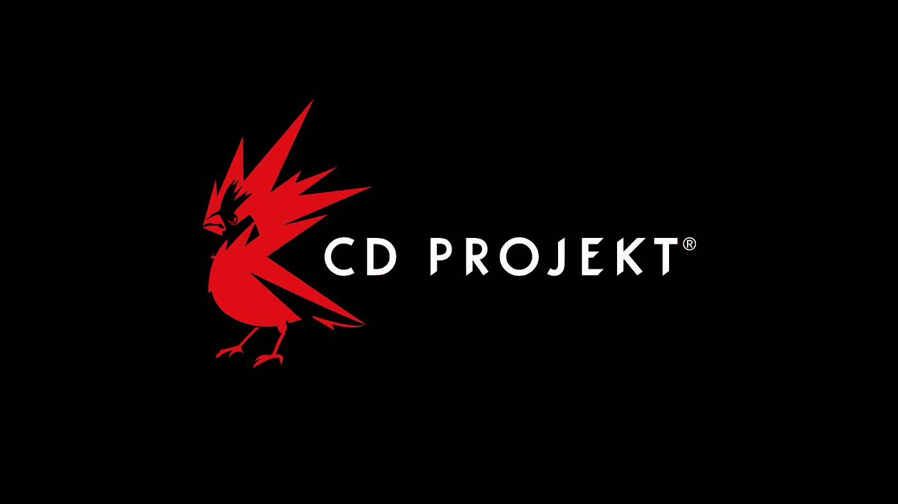

# 赛博朋克 2077 三周的延迟令人震惊

> 原文：<https://medium.datadriveninvestor.com/cyberpunk-2077s-three-week-delay-is-alarming-7203469131fe?source=collection_archive---------14----------------------->

Source: CD Projekt Red

## 醒醒吧，开发者。我们有个游戏要玩。

来自*赛博朋克*的臭名昭著的黄色背景已经成为一个迷因，产生了几十条关于异常延迟的推文。游戏本身已经被延迟了足够多的时间，足以让另一个游戏不足为奇，但今天来自游戏官方账户的推文仍然让许多人感到震惊。《赛博朋克 2077》又推迟了 21 天，现在将于 12 月 10 日上映。

显然，游戏可能会被推迟，即使是在“金牌”之后。*赛博朋克 2077* 于 10 月 5 日被官方推特账户证实已经夺金，但这条推特[似乎没有太大价值，因为期待已久的标题今天再次被推迟。](https://twitter.com/cyberpunkgame/status/1313067011455569921?lang=en)

 [## 语音没有死亡——人工智能如何改变呼叫技术游戏|数据驱动的投资者

### 语音死了吗？这是一个公平的问题。关于流程数字化、新应用和增强型移动银行的讨论…

www.datadriveninvestor.com](https://www.datadriveninvestor.com/2020/10/08/voice-isnt-dead-how-ai-is-changing-the-call-tech-game/) 

术语“走向黄金”指的是游戏在开发中的完成。在业内是用来形容一款游戏准备出货销售的。尽管如此，赛博朋克 2077 似乎并不完全是金色的。

> “你们中的一些人可能也想知道这些话是什么意思，因为我们说我们在一段时间前达到了 gold master。”CD Projekt Red 的开发商和出版商巴多斯基和伊斯基写道。“通过认证，或者说‘去金’，意味着游戏已经准备好了，可以完成了，所有内容都在里面了。但这并不意味着我们停止努力，提高质量。”

对许多人来说，这与普遍接受的游戏“夺金”的定义非常矛盾，但延迟的游戏比被窃听的游戏好得多。看看游戏发布时令人沮丧的错误，如*辐射 76，*让这个决定更容易接受。毕竟，CD Projekt Red 旨在提供一种体验，就像他们的上一款 RPG 游戏*《巫师 3》和*一样具有行业定义，后者赢得了年度游戏和许多其他令人钦佩的奖项。

不考虑预期和炒作，这种延迟也带来了对*赛博朋克 2077* 开发者的担忧。去年九月，彭博[的杰森·施莱尔报道了《T4》【赛博朋克 2077】11 月上映前的](https://www.bloomberg.com/news/articles/2020-09-29/cyberpunk-2077-publisher-orders-6-day-weeks-ahead-of-game-debut)强制紧缩。Crunch 是一个描述视频游戏行业开发人员令人发指的过度劳累的术语，经常发生在游戏发布之前。

赛博朋克 2077 的开发增加了三周，这意味着 CD 项目的开发者有更多的时间来研究这个游戏。很多时候，延长的开发周期是游戏整体动荡的开发过程的结果。虽然到目前为止，我们还没有听说这款游戏会出现这种情况，但这肯定是有可能的。

Source: CD Projekt Red

嘎吱声是视频游戏行业的一个日益严重的问题，不幸的是，这个问题似乎没有尽头。行业的声音，如前面提到的 Jason Schreier，对这种做法提出了批评，希望将其赶出行业。视频游戏开发公司如 Rockstar、CD Projekt Red、Epic Games 和 Treyarch 都曾被报道在其开发周期中使用 crunch。

这些持续的延迟在过去发生在其他游戏中，如 Rockstar 的*Grand Theft Auto V .*rock star 报道的危机无疑影响了 Grand Theft Auto V 的开发——看起来*赛博朋克 2077* 正在走上类似的道路。

显然，这些公司内部管理不善，经常出现危机。在我看来，这是赛博朋克 2077 拖延的主要原因。那些决定游戏何时发布的人和那些真正开发游戏的人之间存在明显的脱节。投资者需要一个游戏上市的日期，热切的粉丝正在等待游戏的发布，这导致赛博朋克 2077 的“新”发布日期不断下降。

这样，开发者有了一个新的期限来完成他们的游戏，被迫在这种压力下挣扎。当离游戏完成的最后期限太近时，发布日期被推后，开发者回到在办公室过夜，每周工作 100 小时，只是为了满足饥饿的粉丝、投资者和公司领导。

视频游戏开发公司对人力资本的管理不善导致了紧张的工作环境和开发人员热情的全面丧失。更糟糕的是，这些公司和他们的游戏的粉丝们讨论的不是 crunch 的道德性，而是这个行业是否需要它。

不是的。 **我们不需要嘎吱声。游戏可以在规定时间内完成——这只是一个更好的管理和对视频游戏开发的挑战进行诚实、开放的交流的问题。**行业内出现的这种压力是不可持续的，会让人们远离这个行业，包括我自己。最初，我打算攻读计算机科学学位，希望能为视频游戏编程，但这个行业的不公平待遇让我望而却步。相反，我选择写游戏！

人们对游戏行业的变化寄予厚望。只有时间会告诉我们，但它肯定感觉我们正在接近一个行业的分水岭时刻，开发者团结起来带来重大调整。在此之前，我们所能做的就是继续保持耐心，并在游戏于 12 月上市时支持这些开发者。

## 访问专家视图— [订阅 DDI 英特尔](https://datadriveninvestor.com/ddi-intel)