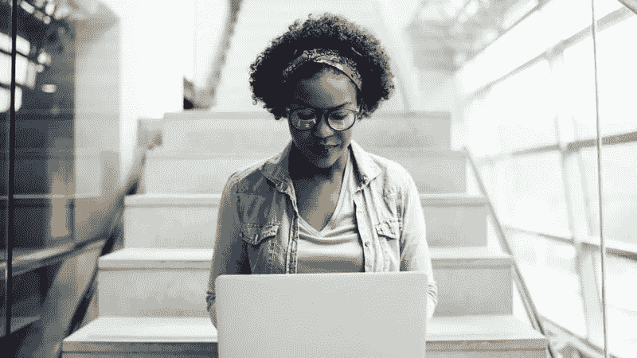
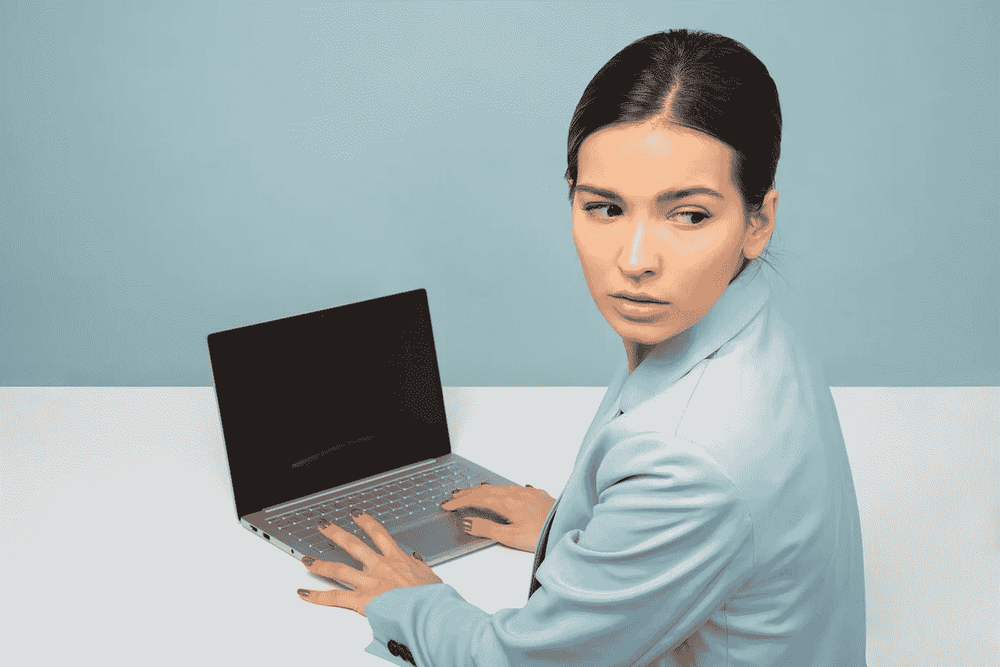

# 网络安全威胁比恐怖更可怕

> 原文：<https://medium.datadriveninvestor.com/cybersecurity-threats-scarier-than-scary-60fcc2f704c2?source=collection_archive---------2----------------------->

## 惊人的违规数据比看起来更糟糕

***“你是个靶子。”***

如果这些数字令人吃惊，至少有一位著名的网络安全专家称其过于乐观:

*   每 39 秒就有一次黑客攻击。
*   平均每天有 3 万个新网站遭到黑客攻击。
*   网络犯罪比全球非法毒品交易更有利可图。
*   66%受到攻击的企业对自己能否恢复没有信心。

约瑟夫·斯坦伯格确信威胁甚至更大。作为网络安全领域的思想领袖，他是网络安全、隐私和人工智能公司的新兴技术顾问。这位专栏作家兼作家曾为福布斯公司撰稿。

“网络安全是一个如此重要的话题，”斯坦伯格说。"为了我们的个人和职业，我们都需要温习并认真对待它。"

在她的#MillennialTalk Twitter 聊天中，他与千禧一代专家、顾问和 LinkedIn 讲师 Chelsea Krost 讨论了似乎只会变得更糟的普遍技术问题。

 [## 人们对隐私的不理解是什么？

### 你知道那种感觉。无论是访问应用程序、订阅还是你最喜欢的运动鞋。你按下…

www.datadriveninvestor.com](https://www.datadriveninvestor.com/2019/04/11/privacy-and-convenience/) 

每个人都应该采取一些措施来保持网络安全。

斯坦伯格说:“理解并内化你是一个目标。“你有数据和账户，黑客真的想窃取和滥用这些数据和账户，为他们自己谋利，并以你为代价。

“相信罪犯想要侵入他们的电脑、电话和账户的人在很多方面的行为与不了解这一现实的人不同，”他说。“这些行为差异——其中许多甚至可能没有意识到——导致了更好的网络安全。”

斯坦伯格提供了保护社交媒体账户不被黑客接管的最佳方法。

“首先，打开多因素身份认证，”他说。“所有主要社交媒体平台都支持它。如果你使用多因素-即使他们获得你的密码-黑客不太可能获得访问你的帐户。

“第二:实践适当的网络卫生，”斯坦伯格说。如果您从感染了恶意软件的设备访问社交媒体，您的帐户可能会被接管

# **廉价保护**

他补充了 13 条简单的建议，告诉你如何在不花费大量金钱的情况下实现更好的网络安全。

“保护自己的第三个方法是提防社交媒体骗局，”斯坦伯格说。"其中一些是由试图安装恶意软件侵入你的设备的罪犯运行的."

他总结了八种方法来防止社交媒体上的诈骗。

斯坦伯格说:“关于社交媒体和安全的话题，如果你在度假，你的房子是空的，那么考虑在回家后才公开分享你的照片。”

事实上，他建议在与朋友共进晚餐或参加婚礼等活动后等几天再上传照片。

斯坦伯格说:“如果照片是与全世界分享的，而不仅仅是与朋友分享，那就更是如此。”“如果你不发‘嗨，大家好。“我家现在没人在家，”你不应该分享实际上表达同样意思的照片。

“不要分享你指尖的高分辨率图像，”他说。"黑客有时会从照片上提取指纹，并滥用这些指纹。"

面部识别也让他不安。

“我对使用生物识别技术——面部识别、指纹等——解锁手机有多种担忧，”斯坦伯格说。"我更喜欢强密码。"

尽管拉响了警报，专家们关于使用公共 Wi-Fi 的警告却被置若罔闻。

“理想情况下，如果你的智能手机上有无限的数据计划，使用你的手机连接，不要用公共 Wi-Fi，”斯坦伯格说。“您可以将手机用作移动热点，通过笔记本电脑上网。

他说:“当这不可能的时候，考虑一下存在什么类型的‘公共 Wi-Fi ’,以及你打算做什么任务。”“在客户网站上，在受密码保护的访客网络上查找维基百科的文章可能没问题。”

# **敏感数据高风险**

这与复杂的金融交易截然不同。

斯坦伯格说:“在连接到不受保护的机场公共网络时登录和使用网上银行不是一个好主意。”“当然，两者之间有许多灰色层次。

“永远不要使用公共 Wi-Fi 的建议是不实际的，但要明智地使用它，”他指着自己的文章《[》T5 说，“如何安全地使用公共 Wi-Fi。”](https://josephsteinberg.com/how-to-safely-use-public-wi-fi)

令人惊讶的是，斯坦伯格并不喜欢繁琐的密码。

“我讨厌又长又复杂的密码，”他说。“在许多情况下，创建这种密码的要求实际上可能会降低安全性——人们会记下这种密码，重复使用它们，等等。”

他推荐了他的文章， [*“如何创建易于记忆的强密码。”*](https://josephsteinberg.com/create-strong-passwords-can-easily-remember)

“记住，不是每个网站都需要强密码，”Steinberg 说。“如果你只能为了网站所有者的利益而登录一个网站，但你没有向该网站提供任何个人数据，也不在乎该网站跟踪你，你可以用一个简单的密码逃脱。

“因为如果你的账户被黑了也没关系，你可以创建一个新的密码，”他说。

Photo by Icons8 Team on Unsplash

他的强密码文章是为重要网站设计的。

斯坦伯格说:“你也可以考虑使用三个不相关的单词——至少其中一个不在词典中——并用数字将它们连接起来。”"然后大写第 n 个字母."

他举了这些例子:会话 5 恐怖 4 约瑟夫和巧克力 5 山羊 4 计算机

斯坦伯格说:“这些强密码看起来很复杂，但一旦你选择了一组数字和大写格式，实际上很容易记住。”

“对于许多密码，你也可以使用密码管理器，但它们也不是完美的，”他说。"所以，记住你最重要的密码——电子邮件密码、网上银行密码."

# **方便的密码位置**

写下密码并把它们保存在安全的地方是一个解决方案——如果不是完美的话。

"许多人把他们重要密码的备份存在保险箱里，"斯坦伯格说。“然而，写下密码并把它们保存在一个安全的地方，只能作为一种备份。当您在路上或工作时，您无法访问它们。

“此外，经常更改密码通常比将密码更改为弱密码好得多，这样你就可以记住经常更改的密码，”他说。

如果超大型公司和政府无法阻止黑客，普通人将面临一项艰巨的任务。

斯坦伯格说:“政府和大公司必须向外界开放他们的系统和网络。”。“例如，他们让你通过应用程序或网络浏览器访问他们的各种系统。你不必像这样打开你的设备。在某些方面，你实际上比政府和大公司更有优势。

“对大多数个人来说，最大的威胁是机会主义攻击者，理解这一点很重要，”他说。“他们不是专门针对*你*。他们只想从某人那里偷钱或数据，或者从尽可能多的人那里偷。”

大玩家面临他们自己的特殊挑战。

斯坦伯格说:“政府和大公司经常面临来自民族国家和其他老练的攻击者的有针对性的攻击。"这些攻击更难抵挡。"

他列出了保护笔记本电脑的三大要素:

*   *经常备份*如果出现问题，如果需要从备份中恢复，您不会担心数据丢失。一般规则:如果你不确定你是否经常备份，你可能没有。
*   以*加密*的格式存储所有敏感数据。Windows、MacOS、Android 和 iOS 的各种版本都有加密功能。一定要用。
*   *运行安全软件*，其中包括反病毒、防火墙、反垃圾邮件和其他有益的技术。这种工具相对便宜。谈到信息安全，一盎司的预防往往胜过许多吨的治疗。

# **勒索软件漏洞**

这些措施也适用于勒索软件防御。

斯坦伯格说:“勒索软件是一个很好的例子，说明了为什么在信息安全方面，频繁、安全的备份等预防措施的价值是他们努力的许多倍。”

智能手机也不能免受黑客攻击。斯坦伯格指出了保护设备的最佳方法:

*   保护对您手机的访问。我更喜欢强密码，但生物解锁也可以使用。无论如何，锁好你的设备——不要把它们放在可能被偷的地方。
*   启用远程查找和远程擦除。如果您的设备丢失，您希望能够根据具体情况找到它或擦除它。
*   运行安全软件。请记住，智能手机是真正成熟的电脑，其中一个应用程序是手机应用程序。它们是电脑，是可以被黑客攻击的。它们是“智能手机”，就像法拉利是“快速的无马马车”。
*   不要从可靠的应用商店之外的任何地方安装应用。对大多数人来说，这意味着只能从苹果，谷歌，亚马逊，你的设备制造商和你的手机供应商那里安装。
*   不要让黑客窃取你的电话号码。请确保您的移动提供商为您设置了强密码，没有该密码，提供商将不会允许任何人更改您的帐户。

“罪犯窃取电话号码是一个大问题，”斯坦伯格说。"许多密码重置系统——以及认证机制——都是通过短信发送到手机的."

斯坦伯格的文章 [*对此有更详细的解释，“不要让犯罪分子用这个骗局窃取你的手机号码。”*](https://josephsteinberg.com/not-let-criminals-steal-cellphone-number-scam/)

Krost 补充了这些智能手机安全措施:

*   调整 iOS 设置以获得最大的安全性。
*   设置更强、更长的密码。
*   启用双因素身份验证。
*   禁用位置跟踪。
*   禁用照片共享。
*   安装广告拦截和恶意软件防护软件。

# **一天一个苹果没有保证**

最大的网络安全神话之一是苹果产品不会被篡改。

斯坦伯格说:“没有。"我希望有一种神奇的简单方法来保持网络安全，但是没有."

尽管有这些优势，他指出苹果产品面临几个挑战:

*   大量攻击的目标是苹果设备及其用户。
*   许多人成为要求他们在网上提交信息的骗局的牺牲品。

“无论你使用什么设备，你都需要考虑保持安全，”斯坦伯格说。“你需要记住*你是一个目标*。”

目标延伸到电子邮件和文本。

“电子邮件是不安全的，”斯坦伯格说。“它的设计也不安全。您可以使用加密和数字签名附件来使其更加安全。但是即使有了这些改进，它仍然远非完美。

“相对于基本的电子邮件，短信可能有一些改进，但它不如 WhatsApp 等更现代的短信方式安全，”他说。

然而，这也不是解决办法。

“WhatsApp 提供端到端加密，”斯坦伯格说。“信息可以加密，从理论上讲，可以确保只有特定信息的发送者和接收者才能阅读。

“但仍有问题，”他说。例如，创建元数据。WhatsApp 和其他人可能知道你与谁通话，何时通话，通话多长时间等等。也不能保证 WhatsApp 的安全性没有缺陷。”

# **选举报道**

在更广泛的国内和国际范围内，有人担心俄罗斯可以黑掉选举，斯坦伯格觉得这个词有点令人困惑。

“大多数选举干预都涉及传播错误信息，任何人——包括候选人自己——都可能这么做，”他说。

斯坦伯格承认，有时外国政府利用技术让它看起来像是美国人——而不是外国政府——在传播信息。

“有一种危险是，有人可能会侵入选民登记数据库，从而允许人们不止一次投票，并阻止其他人投票，”他说。

“然而，这样做并不容易，只会在竞争激烈的州产生影响，而且被抓住的风险很高，”斯坦伯格说。"此外，自 2016 年以来，这些系统一般都得到了加强."

在他看来，错误的信息可以传播，但不太可能产生足够多的欺诈性投票来改变选举结果。

“请记住，到现在为止，选民们都知道错误的信息在网上传播，”斯坦伯格说，并补充了最后一句话:

“虽然政客们喜欢谈论俄罗斯，但现实是中国对美国构成的网络威胁比俄罗斯大得多。”

**关于作者**

吉姆·卡扎曼是拉戈金融服务公司的经理，曾在空军和联邦政府的公共事务部门工作。你可以在[推特](https://twitter.com/JKatzaman)、[脸书](https://www.facebook.com/jim.katzaman)和 [LinkedIn](https://www.linkedin.com/in/jim-katzaman-33641b21/) 上和他联系。