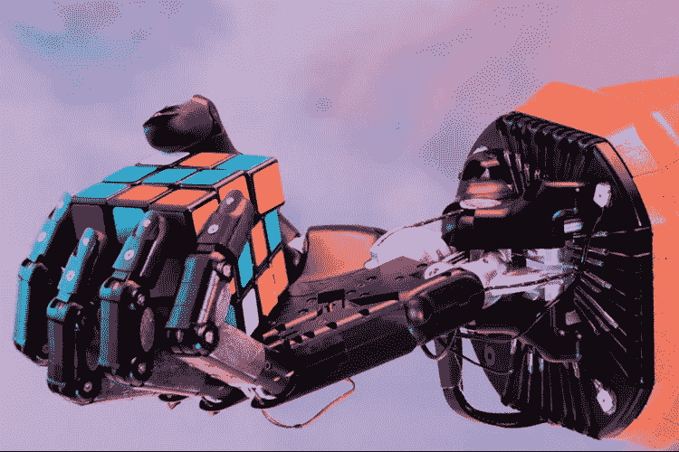
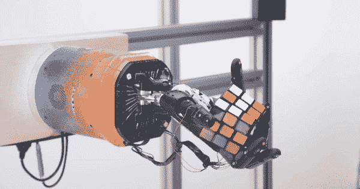
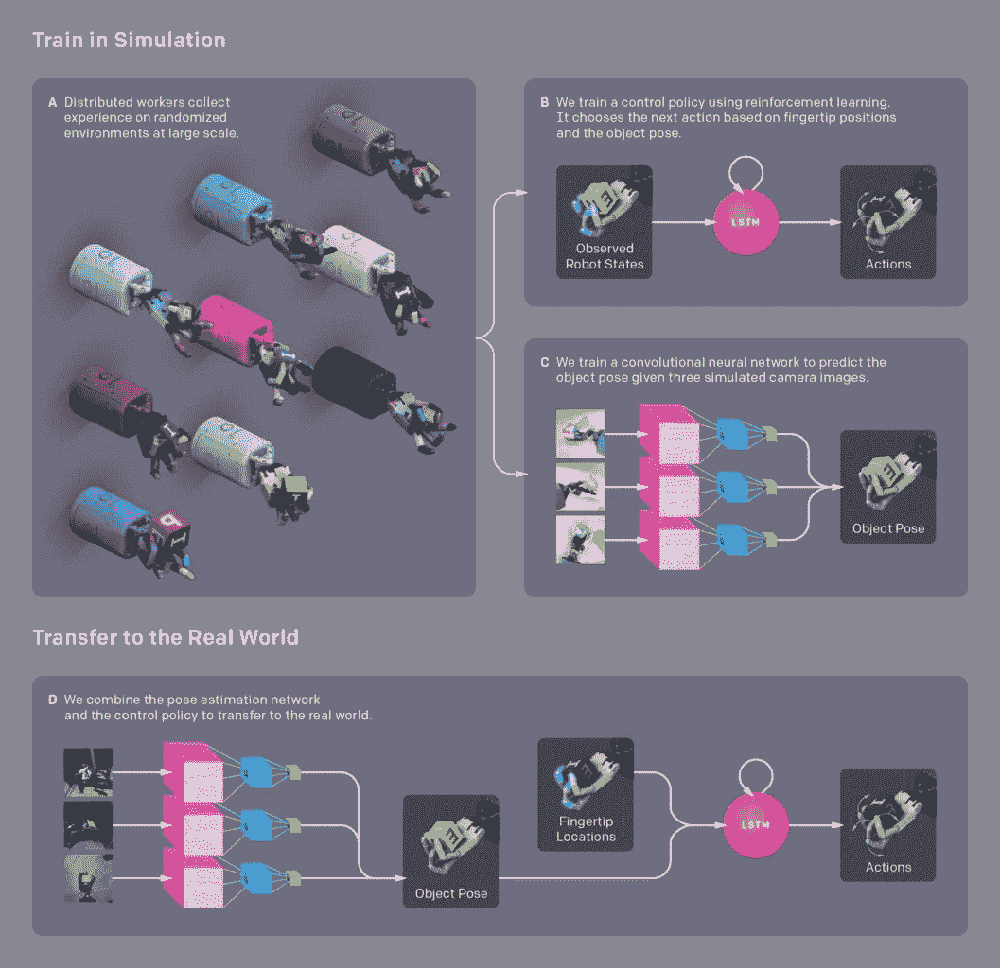
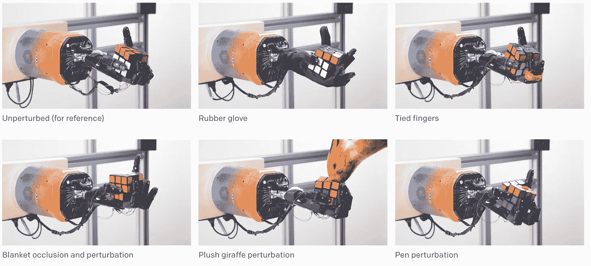
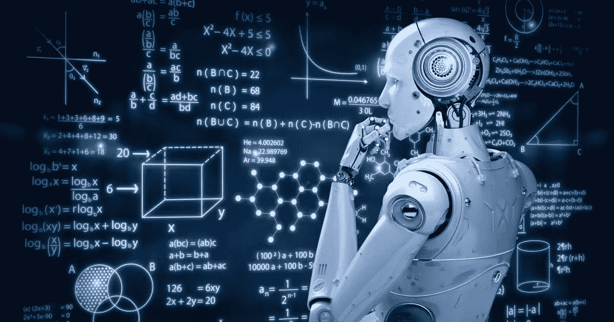

# 机器人 Dactyl:迈向人工智能的一步

> 原文：<https://medium.datadriveninvestor.com/dactyl-the-robot-a-step-towards-artificial-general-intelligence-e2a57eacf9c?source=collection_archive---------6----------------------->

OpenAI 在自学习机器人领域达到了一个新的里程碑。 **Dactyl** ，人形机器人手*(是的手有名字)*学会了单手解魔方。该公司将这一成就视为发展其软件功能的一个进步，*但是是什么让 Dactyl 如此特别呢？*

## 虚拟学习

对大多数人来说，拿起一个物体并对其进行分析是一项简单的任务，但不要告诉机器这一点！事实上，教计算机探测物体、捡起它们并检查它们比你想象的要复杂得多。人类可能需要几天才能搞清楚的事情，机器可能需要几周的学习时间。因此，如果人类能够比机器更快地学会如何解魔方，并且比手指更快地完成拼图，是什么让手指如此特别呢？Dactyl 可以利用虚拟模拟来学习新的任务，然后再面临真实的物理挑战。这意味着，随着 OpenAI 开发这种特定的软件，机器人将能够执行各种现实世界的任务，而不必在现实世界中训练几个月到几年的时间，也不需要显式编程。

## **人工智能 Vs 人工通用智能**

Open A.I .的软件不仅仅是针对常规人工智能，而是一种叫做**人工通用智能**的东西。本质上，常规人工智能训练模型以尽可能高的性能执行一项特定任务，但如果模型被要求执行另一项单独的任务，它将无法以高性能标准执行它(因为它不是为该任务而训练的)。相比之下，人工通用智能关注更广泛的方面，目标是让模型能够像人类一样思考和运作，这意味着人工智能将拥有自己针对不同场景的决策能力(不管它是否接受过这项任务的训练)。

## 通用机器人

许多机器人能够比人更快地解开魔方，因为它们被专门编程来执行分类任务。虽然，OpenAI 并不是要打造一个专门的机器人，而是一个通用的机器人。类似于人类如何能够完成许多任务，而不仅仅是一件特定的事情，Open AI 正在开发与人类范围类似的软件，就能力而言。

Open AI 没有选择为 Dactyl 编写单独的动作来执行，因为它的目标是让手自己学习动作。相反，Dactyl 的软件被赋予了一个解决混淆的魔方的目标，并使用强化学习来帮助 Dactyl 找出如何自己解决魔方。

## 强化学习是如何工作的？

强化学习允许模型通过在特定环境中发生的动作的结果进行学习。这种类型的学习是一种行为模型，这意味着算法提供数据分析反馈，代理将使用这些反馈来改善其结果。与其他形式的监督学习相比，强化学习是不同的，因为数据集不训练机器。相反，机器**通过试错**进行学习，这意味着一系列正确的决策本质上强化了模型，以更好地解决未来的目标。

类似地，当我们还是孩子的时候，人类会经历一种强化学习。例如，当年幼的孩子第一次学习如何走路时，他们会摔倒，但他们有父母在那里将他们扶起并教他们。他们练习得越多，走路就越容易，这种类比对应于机器如何经历强化学习。

本质上，当机器经历强化学习时，它会经历基于经验的教学，即机器必须处理出错的地方并寻找正确的方法。关于如何解决游戏，我们不会给模型任何提示或建议。由模型来决定如何执行任务，从而优化奖励。这个过程将从随机测试和复杂的策略开始。

A diagram on OpenAI’s approach to developing Dactyl.

## Dactyl 入路

Dactyl 的神经网络有三个主要组成部分:强化学习、Kociemba 算法和域随机化。如前所述，强化学习有助于训练模型通过反复试验来学习，以增强模型的决策能力。Kociemba 算法是一种解决魔方的特定算法，域随机化允许创建各种模拟环境，用于模型训练。使用领域随机化，模型最终将被训练得足够好以面对现实世界环境。

## 环境挑战

环境模拟并不完美，挑战在于创建足够真实的环境来捕捉真实世界的物理和组件。弹性、摩擦和物理动力学等测量通常难以对魔方或机械手等对象进行测量和建模。随着测试的进行，OpenAI 的机器人团队发现简单的域随机化本身是不够的。

## 自动域随机化

*open ai 是如何克服这一挑战的？*他们开发了一种新的解决方案，称为**自动域随机化(ADR)** ，这是一种在模拟过程中逐渐生成更困难环境的算法。有了 ADR，就有可能对现实世界进行精确的模拟，并使在模拟中学习到的神经网络能够应用到现实世界中。

那么 ADR 是如何工作的呢？好吧，ADR 从一个非随机化的环境开始，关于神经网络如何学习解魔方。随着网络在任务上的改进和达到性能阈值，ADR 自动增加。因此，任务变得更加困难，因为神经网络具有学习如何推广到更大范围的随机环境的额外任务。然后，网络将继续学习，直到它超过性能标准，然后更多的随机化开始，并重复该过程。

[Click here for the full video.](https://youtu.be/QyJGXc9WeNo)

## 稳健性

为了测试 Dactyl 的能力，OpenAI 在求解立方体时尝试了各种扰动。扰动的目的是测试控制网络和视觉网络的鲁棒性。由于用 ADR 训练该系统，发现 Dactyl 对扰动具有惊人的鲁棒性，甚至那些从未在训练中使用过的扰动。该机器人能够在测试扰动下成功完成大多数翻转和面部旋转，尽管不是在其最佳性能。

## 迈向人工通用智能

乍一看，Dactyl 似乎没有什么特别的，但事实上，Open AI 的这个项目可能只是创造通用人工智能的第一步。看到机器人高效地完成任务是很常见的，但 Dactyl 的不同之处在于，它没有被编程来执行任何一项特定的任务。事实上，把任何物体放在 Dactyl 手里，它会自己学习改变方向。Dactyl 表明，机器人可以适应人类相关的行为，但需要更多的实践，研究和进步才能完善这一点，并使其适用于现实生活的模拟。Dactyl 可能处于发展的早期阶段，但它是机器人，正在为人工通用智能的发展奠定基础。

## 关键要点🔑

*   由 Open A.I .开发的人形机器人手 Dactyl 已经学会了解魔方
*   Dactyl 可以利用虚拟模拟来学习新的任务，然后再面对真实的物理挑战
*   开放人工智能的目标是人工通用智能，这种人工智能可以学习和完成任何事情，而不仅仅是一件特定的事情
*   Open AI 没有选择为手指设计单独的动作，因为它的目标是让手自己学习动作
*   Dactyl 的软件被赋予了一个解决混淆的魔方的目标，并使用强化学习来帮助 Dactyl 找出如何自己解决魔方
*   Dactyl 的神经网络有三个主要组成部分:强化学习、Kociemba 算法和域随机化
*   自动域随机化(ADR)是一种算法，在模拟过程中逐渐产生更困难的环境
*   为了测试 Dactyl 的能力，OpenAI 在求解立方体时尝试了各种扰动
*   Dactyl 可能只是创造通用人工智能的第一步
*   看到机器人高效地完成任务是很常见的，但 Dactyl 是不同的，它没有被编程来执行任何一个特定的任务

# 如有任何疑问，请联系我🚀

大家好，我是 Ashley，一个 16 岁的编程呆子和人工智能爱好者！

我希望你喜欢阅读我的文章，如果你喜欢，请随时查看我在 Medium 上的其他作品:)

如果你读了这篇文章，你会喜欢的:

💫[我如何让人工智能使用 CNN 检测腐烂的农产品](https://ashleyy-czumak.medium.com/how-i-made-a-i-to-detect-rotten-produce-using-a-cnn-f2f16a316914)

💫[在 TensorFlow 中使用 CNN 检测肺炎](https://medium.com/ai-in-plain-english/detecting-pneumonia-using-cnns-in-tensorflow-e70d8a84ebb)

💫[py torch 中的 MNIST 数字分类](https://ashleyy-czumak.medium.com/mnist-digit-classification-in-pytorch-302476b34e4f)

如果您有任何问题，想了解更多关于我的信息，或者想要任何人工智能或编程相关的资源，您可以通过以下方式联系我:

💫电子邮件:ashleycinquires@gmail.com

💫 [Github](https://github.com/ashthedash2k)