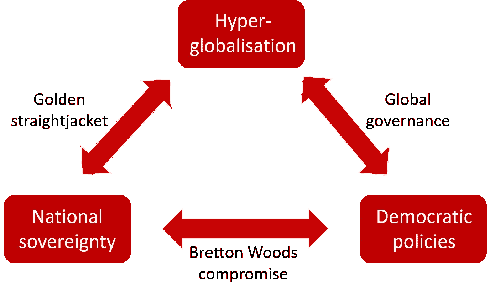

# 丹尼·罗德里克的政治和金融三难困境 300 字

> 原文：<https://medium.datadriveninvestor.com/dani-rodriks-political-and-financial-trilemma-in-300-words-37d946c12a58?source=collection_archive---------2----------------------->

Photo by [Vlad Busuioc](https://unsplash.com/@juvx?utm_source=medium&utm_medium=referral) on [Unsplash](https://unsplash.com?utm_source=medium&utm_medium=referral)

国际经济的政治三难困境是 Dani Rodrik 的产物，是对全球经济一体化的不同国家做法的回应。

罗德里克的三元悖论由三部分组成:国际经济一体化(全球金融网络)、民族国家(主权)和大众政治(民主进程)。

## 组件的操作

一般的运作规则是，一个拥有独立经济实力的国家可以专注于这三个组成部分中的两个。

如果一个国家选择专注于其经济全球一体化，它将不得不限制其主权特征或减少国内民主进程的实施。

同样，如果国家想要优先考虑民主，它将不得不在经济全球化或主权之间做出选择。

此外，如果民族国家是主要关注点，政府将不得不在全球经济或民主方式之间做出选择。

## 可能的组合

这些操作方式已由特定术语定义。

国家根据全球一体化选择其主权的情况被定义为“黄金紧身衣”，从而破坏了民主。

Image of Rodrik’s Theory

另一方面，当国家优先考虑民主进程和全球化时，这种忽视国家主权的政策被定义为“全球联邦制”。

此外,“布雷顿森林妥协”解释了为了更加关注民主和主权而进行全球扩张的局限性。

在当今世界，英国退出欧盟是实现“布雷顿森林妥协”和更大国家独立性的一种方式，欧盟国家附属于“全球联邦制”，削弱了它们的主权，而中国等国家则更接近于“黄金紧身衣”，无视全球化的民主进程。

然而，总而言之，全球一体化存在问题，如果公民没有意识到利害关系并能够找到正确的平衡，这种三难困境就不可能实现。

## 文献学

罗迪克博士(1999 年)。国际经济一体化会走多远？经济展望杂志 14，177–86，

Stein，A. (2016)。三难困境:全球化、民主和主权是相容的吗？*国际理论，* *8* (2)，297–340 页。