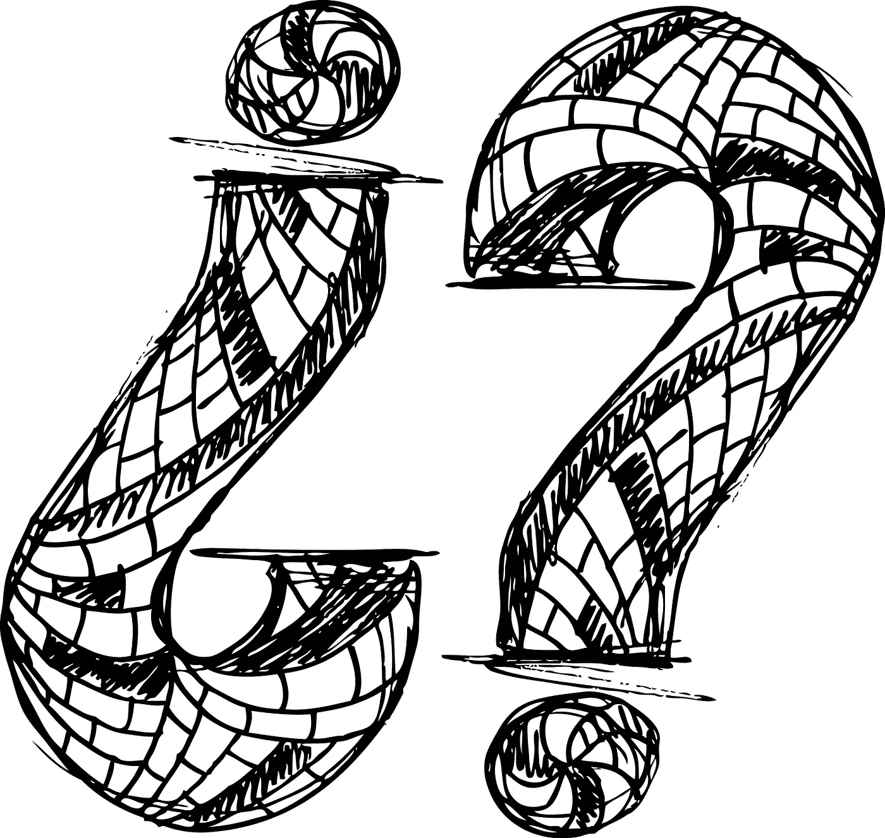

# 敢于了解你自己，不管这个自己可能会变得多么可怕或奇怪

> 原文：<https://medium.datadriveninvestor.com/dare-to-know-yourself-however-frightening-or-strange-that-self-may-prove-to-be-f1146558d16a?source=collection_archive---------11----------------------->

根据一个传说,“认识你自己”被刻在希腊特尔斐阿波罗神庙入口处的石头上，尽管这块石头很久以前就消失了，但这两个词却留在我们的脑海里几千年了。

哲学家苏格拉底有一句名言:未经审视的生活不值得过，他将所有哲学戒律总结为:“了解你自己。”“了解你自己”在我们的文化中也有非凡的价值，不知何故这是我们生活的意义。

西格蒙德·弗洛伊德说:“文明不断被创造出来，每个出生的人都必须努力成为文明人。”。因此，实现自我认知的项目是我们人类每一个新成员的项目。没有人一出生就有这方面的知识。

有可能部分或全部了解自己吗？

了解自己绝对是一件多方面的事情……其中一个方面就是承认自己的局限性。我怀疑，一个了解自己的人，知道如何发现她扭曲正面或负面信息的特有方式，并能从这种反应中退一步，而不是把它们作为最终的决定。

这也可以追溯到同理心和理解如何从另一个人的角度看问题。如果我能设身处地为你着想，那么我也有机会通过你的眼睛看到自己，这可能会帮助我认识到以第一人称视角难以看到的事情。

在我看来，任何智慧的开始，包括对我们自己的认识，都是对我们信念的脆弱和知识的贫乏的承认。米切尔·s·格林

***缺乏自知之明会带来哪些危险？我们需要了解自己什么？我们如何学习这些东西？为什么自知难以实现？***

想象一下，你一生都和一个陌生人生活在一起，这个陌生人非常努力地想要被你接受，但是从来没有花时间去敞开心扉。一切似乎都是假的，你唯一的愿望就是逃跑…听起来很奇怪，但我们中的许多人都过着这样的生活，我们不是敞开心扉，而是用虚假的行为而不是我们自己的目标来吓唬自己。嗯，这就是生活，我们只是想做正常人。但是时间在流逝，你可能永远也不会知道自己有多了不起…

了解你自己是一个漫长而不可预测的旅程，你不仅要学会寻找你最喜欢的乐队、电影类型或颜色，还要找到你内心最深处的恐惧、自我怀疑、不安全感和弱点。踏上这段旅程可能意味着允许自己不去了解你是谁的更深层次的真相…也可能意味着冒险去倾听更深层次的召唤，跟随你的心。

这对我们任何人来说都不容易，但宇宙会有回报的。

“知人者智；了解自己才是真正的智慧。掌握别人就是实力；“老子掌握自己才是真正的力量

**所以，了解自己至少意味着五件事:**

1)如果你了解自己，那么你就知道是什么让你与我们星球上的其他 75 亿人不同或相同。

2)你能够客观地看待自己。

3)了解自己，就相信自己。

你明白你不欠任何人任何东西，也没有人欠你任何东西，你的生活由你自己决定。

5)你可以自由给予和接受。

此外，如果你在寻找你真正想要的东西时感到不确定性的折磨，你可能会对你的目标有一个更清晰的想法。

自我意识是每个人都可以不断提高的。它是情商、洞察力和批判性思维。当然，这意味着知道你的弱点，但也意味着知道你的优势和你的动力。

完全可以不去理会这个世界，这样你就可以开始展现你从一开始就应该成为的那个人。

-彻底了解自己的个性是关键。是什么让你在特定的生活情境中做出特定的反应。简单地问自己“我为什么要这么做？”并且老老实实回答。面对挑战或巨大的回报，你是谁？你对周围的世界有什么反应？

-你的主要原则和核心价值观是什么？是诚实、灵活、正直、建立长期关系的愿望，还是自由？是智慧和学识，经济上的舒适，还是乐趣？当然，核心价值观并不总是积极的。你可能会被私利或贪婪所驱使，而这些也是核心价值观…

-你不喜欢的和你真正喜欢的一样重要。如果你继续做那些让你沮丧的事情，忽略那些带给你快乐的事情，你肯定会走上定义自己的错误道路。

-花时间真正了解自己的身体。人类的身体，连同它所有的力量和耐力，是一个非常复杂的机器。但是不像机器，它有快乐、痛苦和敏感的能力。“你的身体很珍贵。它是我们觉醒的载体。小心对待。”~佛

-你的梦想很重要，值得追求。梦想把我们和我们自己联系在一起，没有梦想，我们会失去能动性……让梦想成为你日常追求的一部分，并认真对待它们。

也许这已经是显而易见的了，但是这里有**更多的理由**为什么你会决定开始一段复杂的了解自己的旅程:

-当你的行为符合你的核心价值观和感受时，你会少一些内心冲突。

-了解自己有助于你一路做出更好的选择。

了解自己有助于你更好地控制自己，从而养成好习惯，抵制坏习惯。

-只有当你确定那是你想要的，意识到不要给自己增加不必要的负担时，你才会说“是”。

——你对别人的同理心会增长，因为你充分意识到自己的挣扎。

-你会更快乐，因为表明你的愿望可能会帮助你得到你想要的。

——做自己让你感觉更有活力，过着更丰富、更广阔、更精彩的生活。

自我发现的经历无疑是具有挑战性的。大多数知识都是逐渐形成的，没有直接的影响，但一些真正实现的时刻可以从多年的自我怀疑、内疚、迷失或不被需要的感觉中提供令人惊讶的释放。

真正了解自己是你能做的最重要的事情。它让你绕过因走错方向而导致的无数挫折。

花点时间了解你自己，剩下的事情会自己摆正位置。

视频: