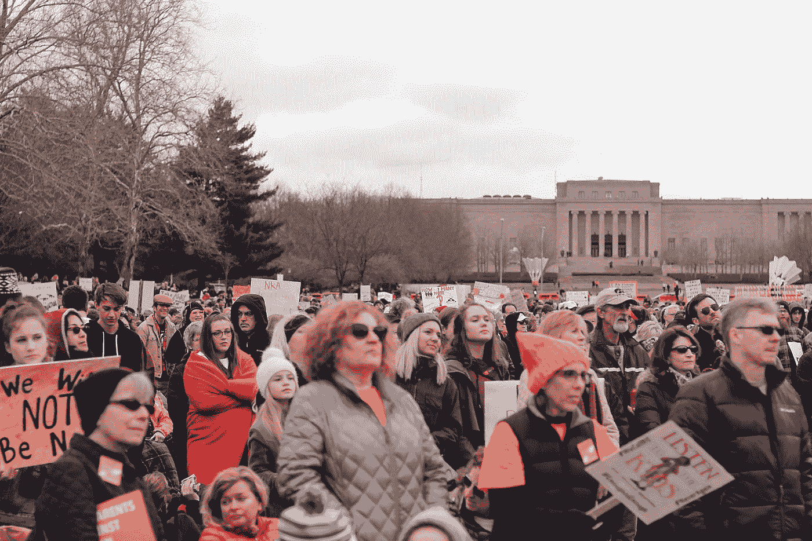

# 黑暗之网

> 原文：<https://medium.datadriveninvestor.com/dark-web-6df2439efd81?source=collection_archive---------2----------------------->

## 互联网最可怕的噩梦

“暗网”是万维网中神秘而危险的部分之一。很多关于它的争议、神话、可怕的事实和故事。“黑暗网络”是互联网的一部分，需要特殊的软件才能访问。在“黑暗网络”中有许多网站和不同的服务，可以通过一个特殊的浏览器访问，就像普通网络一样。“黑暗网络”是许多秘密事件发生的匿名来源；甚至不同的政府组织也参与了对“黑暗网络”的资助。由于保密性和匿名性，所有好的和坏的东西都被互联网的阴暗面所吸收。举个小例子，有一些特殊的市场也在暗网中运作，叫做“暗网市场”，它们出售非法的东西，比如不同类型的毒品、枪支、色情制品等等，主要用加密货币比特币支付，因为它非常安全，所有的交易都受到区块链的保护，没有人能跟踪它。有暗杀市场、被禁止的组织和被禁止的团体。甚至恐怖组织也通过它招募人员，并通过暗网根部的私人信息系统策划恐怖袭击。问题是，“暗网”，真的是一件坏事吗？而且为什么还是美国政府资助的？”虽然人们需要一个邪恶的东西来给数百万人的生活带来正义，所以平常的生活可以得到更多的保护和保障。

Photo by [ev](https://unsplash.com/@ev?utm_source=medium&utm_medium=referral) on [Unsplash](https://unsplash.com?utm_source=medium&utm_medium=referral)

黑市占整个深度网络的 40%,是用户之间最受欢迎的网站之一。在“黑暗网络”中，有许多黑市，出售各种各样的非法物品，如毒品、枪支、不同类型的色情制品，甚至提供暗杀等等。其中一个著名的黑市“丝绸之路”现已关闭，该市场出售大量合法和非法商品。联邦调查局的调查人员说有超过 1000000 笔交易；这是唯一的，联邦调查局能够通过贝宝和西联汇款的交易记录追踪到的。对这些在线非法市场的使用继续增加，一项对超过 100，000 名互联网用户的全球调查发现，近 10%的人在“暗网”上购买麻醉品，只有 5%的受访者实际上表示他们在网上购买毒品之前没有购买或使用毒品(全球毒品调查，2016 年)。埃里克·贾丁指出，“在某些情况下，人们隐藏不合法、不道德或完全违法的行为。”这清楚地表明，人们越来越熟悉“黑暗网络”的便利，并利用它来做不好的事情，并为法律掩盖自己。

Photo by [Grzegorz Walczak](https://unsplash.com/@grzegorzwalczak?utm_source=medium&utm_medium=referral) on [Unsplash](https://unsplash.com?utm_source=medium&utm_medium=referral)

在另一种情况下,“黑暗网络”普通人可以使用匿名授权技术，如“Tor 浏览器”,以保护他们的隐私免受广告、政府机构、政治对手、网络流氓和网络提供商的侵害。Eric Jardine 指出，“在高度压制的政权下，人们也可以求助于 Tor 浏览器等允许匿名的黑暗网络技术，以规避审查，行使自由表达的权利，并在面对滥用权力的政权(甚至非政府义务警员、巨魔或恶霸)时维护自己的隐私。”这显然意味着人们不希望在未经允许的情况下被人跟踪或储存，也不希望在他们的屏幕上看到弹出广告。即使政府不能关闭“暗网”,因为从政策角度来看，这一行动将产生“暗网困境”,在这种情况下，对技术没有良好的政策反应。一方面，关闭网络的努力会伤害那些真正依靠网络保护的专制政权的人民，而另一方面，保持网络会伤害那些直接或间接受到隐蔽的在线犯罪行为影响的人。黑市仍然是“深度网络”上的畅销书之一，隐私水平很高，要求更高，但这并不重要，它清楚地表明，对人们来说，隐私比消除黑市更重要。

Photo by [Markus Spiske](https://unsplash.com/@markusspiske?utm_source=medium&utm_medium=referral) on [Unsplash](https://unsplash.com?utm_source=medium&utm_medium=referral)

Eric Jardine 指出,“虽然结果在统计上不显著，但网络自由和反对暗网技术之间的关系模式形成了一个倒 u 型。这一结果与其他关于政治权利和 Tor 网络实际使用之间关系的实证研究结果大体一致”,因为它清楚地表明，没有针对 Tor 网络的实际行动。

 [## 2019 年最值得学习的编码语言|数据驱动的投资者

### 在我读大学的那几年，我跳过了很多次夜游去学习 Java，希望有一天它能帮助我在…

www.datadriveninvestor.com](https://www.datadriveninvestor.com/2019/02/21/best-coding-languages-to-learn-in-2019/) 

“暗网”来自政府官员，甚至人们并不排斥它，因为“暗网”是这两种观点的工具。

Photo by [annie bolin](https://unsplash.com/@anniebolin?utm_source=medium&utm_medium=referral) on [Unsplash](https://unsplash.com?utm_source=medium&utm_medium=referral)

互联网对现代社会的好处是巨大的，网络空间也可能被世界各地的恐怖组织、犯罪分子、恋童癖者和黑手党所利用。“黑暗网络”是这些组织美化各种恐怖主义行为、招募人员、广播非法和暴力内容、传播被禁止的海报、音频和视频、促进恐怖分子和恐怖主义团体之间的交流以及培训潜在成员的绝佳场所。这就像在现实生活中，只是更容易，匿名和便宜得多。“黑暗网”也为那些想说出来的人提供了保密性，并激励其他人说出真相，向世界展示人们生活的现实。

Photo by [Vlad Tchompalov](https://unsplash.com/@tchompalov?utm_source=medium&utm_medium=referral) on [Unsplash](https://unsplash.com?utm_source=medium&utm_medium=referral)

“深度网络”充满了安全的网站，这些网站由被禁止的组织构建和控制，如“ISIS”、“基地组织”、“意大利黑手党”、“俄罗斯黑手党”，甚至职业杀手组织。网络恐怖主义通过“暗网”传播，并实施非法攻击和威胁攻击计算机、网络和其中存储的信息，以恐吓或胁迫政府或其人民实现政治或社会目标。“暗网”成为这些组织的主要事物之一；他们利用黑市交易弹药、毒品，甚至人口。他们在招募黑客；实施这种恐怖行为的技术特征是无限的。他们有机会直接监视、控制和披露这些活动。虚拟空间中时间和空间的无限可能性，远距离操作的可能性，目标的众多选择，没有地理限制，精确的时间选择，预先测试计划行动的可能性，这将最终失败的风险降低到最低限度；肇事者的匿名。恐怖分子黑客可以侵入政府官员的电脑，以说服政治变革，解除安全系统并挑起暴力。彼得罗维奇说，“中国有句古话，杀一儆百。考虑到这一点，网络恐怖主义也被定义为虚拟空间中旨在恐吓一国政府或其公民以实现某些政治目标的犯罪行为。”这通常意味着网络罪犯的主要目标是实现混乱、罪恶，并将互联网转化为网络战。

另一方面，“深层网络”为那些不愿意保持沉默的人提供了匿名，他们不担心自己的生命，但他们确实在乎曾经爱过的人，所以他们在私下保持自己的身份。他们使用地下互联网的工具来保守秘密。例如，记者和报纸公司使用“黑暗网络”作为来源来查找和接收匿名举报者的敏感信息——例如,《纽约时报》在“黑暗网络”上有一个安全锁箱，人们可以通过它发送文件。对于需要安全共享信息的人来说，这里就像天堂一样。对于互联网受到限制的国家，禁止使用互联网；人们可以通过匿名工具和代理访问，并安全地将信息传输到外部世界，例如:朝鲜。

Eric Jardine 强调,“全球之声”( Global Voices)是各种基于互联网的媒体的策划人和出版商，他建议那些希望匿名写博客的人应该使用 tor。此外，以类似的方式，“记者无国界”建议记者在报道世界各地的侵权行为时使用 Tor 来保护自己。它解释说，记者也可以保护自己和家人免受欺凌。

匿名、审查和隐私是“黑暗网络”的主要目标，它可以用于好的或坏的原因，这取决于用户。尽管如此，这项技术仍在发展，它将彻底改变我们对互联网的认识。

Photo by [Pietro Jeng](https://unsplash.com/@pietrozj?utm_source=medium&utm_medium=referral) on [Unsplash](https://unsplash.com?utm_source=medium&utm_medium=referral)

在“深层网络”中，人们使用加密货币进行买卖和交易，而隐私是“深层网络”的主要关键。购买应该是匿名和私人的。基思·柯克帕特里克(Keith Kirkpatrick)提到，“事实上，比特币、Monera、影子货币和其他加密货币使用加密技术来监管货币单位的产生和验证资金转移，所有这些都是在独立于中央银行的情况下运行的。所有交易都在一个被称为区块链的共享、可见和分布式账本上捕获，但用于保存资金的密钥和数字钱包与现实世界的身份无关，只要采取预防措施，与传统的西方数字支付方法相比，它可以提供高度的匿名性。”这意味着加密货币使用区块链加密，所以所有的交易和账户都是隐藏的。政府无法追踪这些资金，也无法控制它们，这使得加密货币更加安全。比特币是其他加密货币中最受欢迎的。是什么让比特币如此特别？每个用户都有一个私钥，它提供对个人钱包的访问，当与公钥配对时，允许交易通过。Pete Rizzo 解释说:“事实上，一项交易需要一对“互锁的加密密钥”作为对等签名(如下图所示。)使用数字加密签名来认证交易确保了支付消息的认证性、不可否认性和完整性。”这使得比特币成为“黑暗网络”中的主要支付来源。

另一个重要的是互联网底层的融资。美国、俄罗斯、中国、印度、以色列以及更多的国家都在资助“黑暗网络”。使用空间是有价值的，在这里一切都是非常秘密和匿名的。此外，政府也从中受益。最大的投资者是美国政府，他们发明了“黑暗网络”。他们向世界推出了高度加密的浏览器 Tor。据《卫报》报道，“美国海军投资了 Tor 项目，该公司在 2015 年获得了约 120 万美元(可获得的最近记录。)低于两年前的 180 万美元。法庭报告显示，与此同时，国防部正在资助寻找软件漏洞的努力。最初，美国政府创造了一种手段，让情报机构在不被察觉的情况下查看不同国家的网站，分析它们的网络流量。此外，它还被用来与这些国家的消息来源进行沟通。然而，海军只是“黑暗之网”中的一员，他们需要带来其他人。结果，“暗网”出现了。正如 Garret Reid 解释的那样，“所以现在活动分子和自由主义者、民主倡导者……那些不喜欢被敌对政府监视的人使用它，因此，通过与这些不同的团体混合，它为情报机构掩盖。”现在，Tor 在言论自由成问题的国家是一项有价值且可靠的服务。菲尔·拉韦尔对比说，“一些估计指出，大约 60%的暗网构成是为了你可能称之为好的用途。”

“黑暗网络”是整个互联网上最安全的地方，但由于犯罪活动、黑市和被禁组织的招募，它也是最可怕的地方。对于技术和创新并存的现代社会，安全发挥着巨大的作用，人们需要一些东西，在那里他们可以私下保持自己的身份并分享意见而不充满仇恨，这里出现了具有不同特征的“暗网”，它也可以用于良好的事业，可以带来真相和正义。

释文

埃里克·贾丁。隐私、审查、数据泄露和互联网自由:支持和反对黑暗网络技术的驱动因素。2017 年 10 月

[帕特森·丹。暗网:商务人士的小抄，2018 年 10 月 26 日](https://www.techrepublic.com/article/dark-web-the-smart-persons-guide/)

[柯克帕特里克·凯斯。资助黑暗网络，2017 年 3 月](http://web.a.ebscohost.com.proxy-sru.klnpa.org/ehost/detail/detail?vid=0&sid=c3ee6322-3c4c-4d15-a125543b52f8da7c%40sessionmgr4008&bdata=JnNpdGU9ZWhvc3QtbGl2ZQ%3d%3d#db=bth&AN=121487469)

[维达·m·维利奇，《黑暗网络、网络恐怖主义和网络战:网络空间的黑暗面》。2017 年 12 月。](http://web.a.ebscohost.com.proxy-sru.klnpa.org/ehost/detail/detail?vid=0&sid=626250f6-2a20-42c3-8d8754650caab893%40sessionmgr4007&bdata=JnNpdGU9ZWhvc3QtbGl2ZQ%3d%3d#db=a9h&AN=127927428)

[菲亚梅塔广场。黑暗网络中的比特币:银行保密的阴影和呼吁全球响应。2017 年 5 月。](http://web.a.ebscohost.com.proxysru.klnpa.org/ehost/detail/detail?vid=0&sid=57d057e72a2e437db25689287e113a1a%40sdcvsessmgr06&bdata=JnNpdGU9ZWhvc3QtbGl2ZQ%3d%3d#AN=123824519&dbh)

查看我的其他故事:

 [## 远程访问木马|它如何影响大型企业

### 即将到来的 2020 年新年是鼠年。在中国，他们带着喜悦和幸福庆祝农历新年，但是…

medium.com](https://medium.com/@diorjuraev/r-a-t-remote-access-trojan-how-it-affects-to-major-enterprises-822ef3c15a35)  [## 网络威胁情报

### 什么是…？

medium.com](https://medium.com/@diorjuraev/cyber-threat-intelligence-b6ceb6d9e6f5)  [## 冠状病毒导致新一波网络钓鱼和恶意软件

### 随着世界对全球健康问题因为新冠肺炎或更好地称为冠状病毒的传播，与…

medium.com](https://medium.com/@diorjuraev/coronavirus-leads-to-a-new-wave-of-phishing-and-malware-799060938f41)