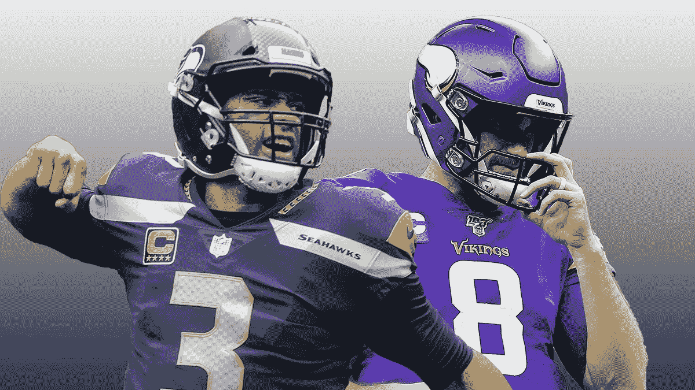
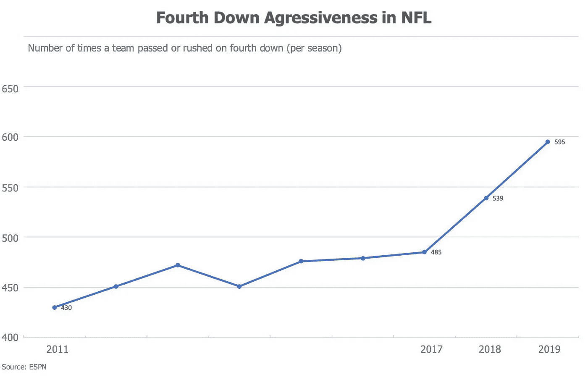
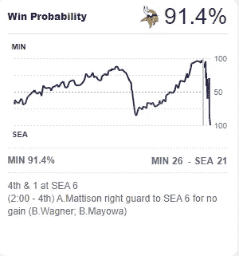
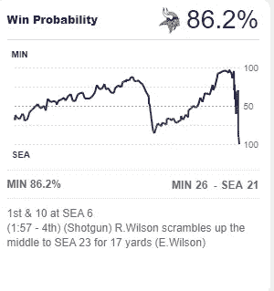
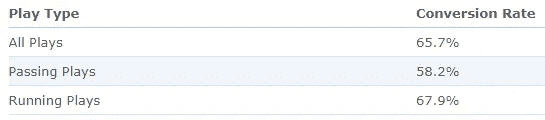
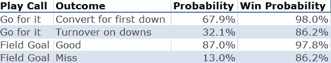

# 足球数据分析:为什么维京人输给了海鹰

> 原文：<https://medium.datadriveninvestor.com/data-analytics-for-football-why-the-vikings-lost-to-the-seahawks-657cb19bc6c4?source=collection_archive---------13----------------------->

足球是一项非常复杂的运动。这类似于两支军队在战场上列队上下移动。教练们经常阅读《孙子兵法》来磨练他们的技能。数据分析可以帮助教练获得对对手的优势；足球不仅仅是一种天赋的游戏，更是一种像象棋一样的策略游戏。

足球是一场 11 对 11 的比赛，有许多球员对球员互动的组合，这将影响比赛的进行。11 对 11 的比赛可能很难建模或预测，但是，许多可能的相互作用很少发生，例如:防守的一角很少与进攻团队的中心相互作用。这种情况时有发生，但可能非常罕见。

## NFL 数据分析

与其他体育联盟相比，NFL 最近开始使用分析，变化已经可以看到。例如，球队在第四轮比赛中更积极地选择“去争取”，而不是踢射门或踢平底船。

其他统计团队正在研究的是传球与抢断，预测特定比赛将产生的码数，进行 2 分转换或触地后踢额外的一分。其中一些是理解为什么维京人输给了海鹰的关键。

# 周日足球之夜:海鹰队的维京人

这场特殊的比赛对两个队来说都是过山车，这就是为什么它从概率和统计的角度来分析是一个有趣的例子。我要从比赛结束开始分析发生了什么。

在游戏中还有很多其他地方，叫牌可能会改变结果，但这部分是最有争议的。

还有许多其他因素需要考虑，这些因素可能会影响比赛，如:主场(由于新冠肺炎，没有人)，天气，周日晚上对下午的比赛，伤病等。

## 第四街和 1，2 点钟方向

大多数看过这场比赛的人会说这是关键时刻。海盗队在西雅图的 6 码线上拿到球，还有 1 码。根据 [ESPN 的获胜概率计算器](https://www.espn.com/blog/minnesota-vikings/post/_/id/30412/vikings-fourth-down-decision-proves-costly-in-one-point-loss-to-seahawks)，维京人有 98%的概率通过进攻获胜，有 97.8%的概率通过射门得分。

尝试它看起来是正确的选择，因为成功的转换将有效地密封游戏。然而，首发跑锋达尔文·库克因伤缺阵。有些人会说，如果亚历山大·马丁森稍微向右跑一点，他就会转换为第一次击倒对手。不管怎样，维京人没有改变信仰，他们为此付出了代价。

Prior to the play, the Vikings had a 91.4% chance of winning

教练迈克·齐默可能一直在思考概率，然而，在足球比赛中，事件并不是完全独立的。后面的戏不是独立于前面的戏。前一局影响下一局，游戏中有哪些玩家，还剩多少码，时间等等。

 [## 将数据隐私转化为你的优势，重建消费者的信任:下一个投资前沿

### 疫情期间，抖音的使用量激增，全球约有 8 亿用户使用该平台…

www.datadriveninvestor.com](https://www.datadriveninvestor.com/2020/09/18/turn-data-privacy-to-your-advantage-and-rebuild-consumers-trust-the-next-investment-frontier/) 

根据 ESPN 的获胜计算器，如果维京人踢了罚球并转换，他们的概率将从 91.4%上升到 97.8%。不转换第 4 下下降概率下降到 86.2%。

After the play, the Vikings had a 5% drop in win probability

对于期望值和结果来说，这也是一个有趣的情况，也需要贝叶斯统计来进行更深入的分析。

## 射门得分与奋力一搏

根据职业足球参考，丹·贝利，维京人队的踢球者，在职业生涯的 276 个进球中有 240 个进球。这大约是 87%,是所有尝试的原因，无论距离和天气条件如何。我们可以假设他在更近的距离(6 码线)射门的概率更大。

根据耶鲁大学本科生体育分析小组[的数据，1998-2015 赛季所有比赛中第 4 场和第 1 场比赛的转换率为 65.7%。](https://sports.sites.yale.edu/success-short-yardage-play-types-fourth-down#:~:text=We%20looked%20at%20all%204th,this%20time%20frame%20was%2065.7%25.)正如我上面提到的，随着越来越多的教练开始使用数据分析，这些数据可能会发生变化。

4th and 1 conversion rate between 1998–2015

错过投篮机会也会给海鹰队一个更好的首发位置，这也会改变获胜的概率。我可以进一步调查更准确的数字，但出于本文的目的，我认为使用这些数字是可以接受的。下表显示了这些组合:

Vikings possible plays and outcomes 4th and 1

我用了 67.9%来转换 4 号和 1 号，因为维京人选择了逃跑。

请记住，这些都是基本的数字和粗略的估计，我认为它仍然给了我们一个足够好的画面，告诉我们为什么它实际上没有意义的第四次下跌。

## 投篮命中率:87% —最坏情况:加时赛，获胜概率:97.8%

成功射门会让维京人有 97.8%的胜算。他们有 87%的机会出现这种结果，如果他们选择踢。这意味着在比赛还剩不到 2 分钟的时候，维京人队以 29 比 21 领先，领先 8 分。

如果西雅图要赢得这场比赛，他们必须从开球结束的地方开车到球场，触地得分，并转换 2 分转换，只有平局。

他们仍然不得不打加时赛，这将有自己的分析来检查。

## 投篮命中率:13%—最差情况:失败，获胜概率:86.2%

错过投篮机会的概率是 13%。对于这种结果，获胜概率将下降到 86.2%。维京人队会以 26 比 21 领先，西雅图队会得到一个较短的场地，在两分钟内得分触地得分。

我们不知道西雅图的比赛结果会如何，但让我们假设他们触地得分，因为他们在实际比赛中确实触地得分了。这仍然只有 13%的可能性发生。

## 第 4 次和第 1 次转换:67.9% —最坏情况:耗尽时间，获胜概率:98.0%

这是维京人想要的场景。分析告诉他们，成功转换将带来最高的成功概率。如果不是时间对他们有利，维京人会以 26 比 21 领先。他们可能会耗尽时间，或者可能在留给西雅图的时间明显减少的情况下再次得分。

维京人没有考虑的是，第一次向下转换的概率是 67.9%。投篮和努力投篮的成功率相差 19%。

## 第四次和第一次失误:32.1% —最差情况:失败，获胜概率:86.2%

这是游戏的实际结果，有很多精彩的电影和评论。西雅图策划了一场令人难以置信的比赛，最终以 27 比 26 赢得了比赛。

有 32.1%的可能性会是这样的结果。我们可以说维京人的防守可以打得更好，但像这样的时刻对比赛的结果至关重要，不能掉以轻心。教练因为在这些情况下做出正确的决定而获得薪水。

# 为什么维京人输了

维京人最终失败了，因为他们拿 67.9%的机会去争取 98%的胜利概率，而不是拿 87%的机会去争取 97.8%的胜利概率。维京人愿意冒险降低 19%的成功几率，以增加 0.2%的获胜概率，这是一个严重的误判，让维京人输掉了这场比赛。

## 访问专家视图— [订阅 DDI 英特尔](https://datadriveninvestor.com/ddi-intel)