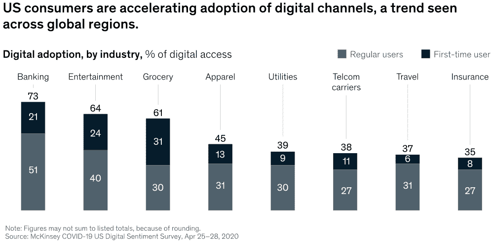
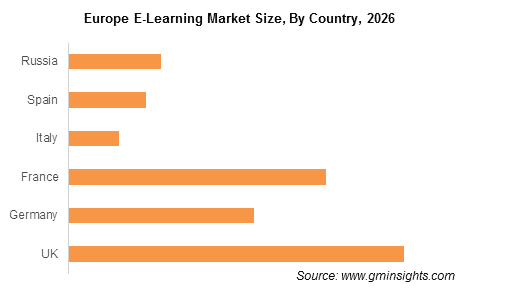
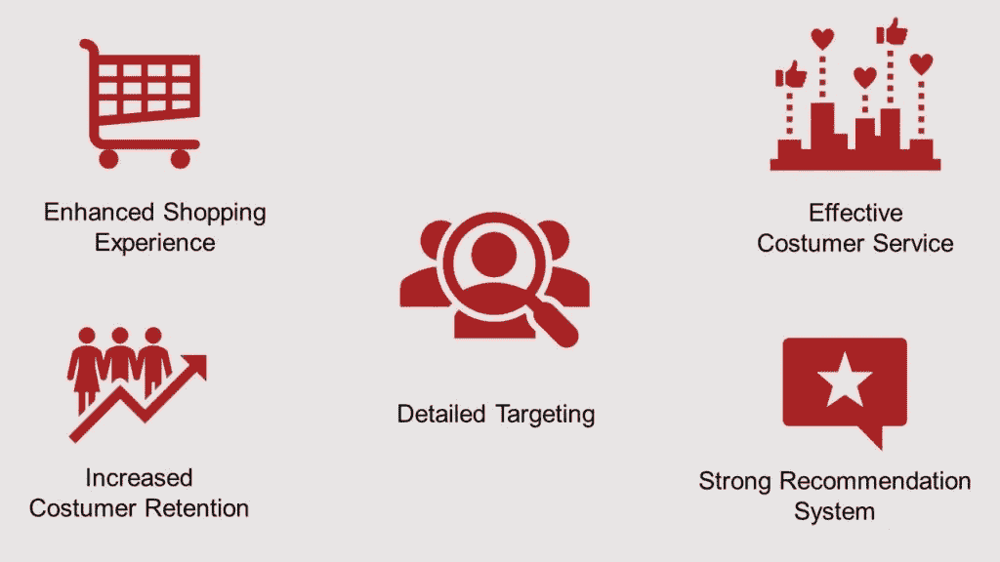

# 数据分析——全球疫情期间在线业务的救星

> 原文：<https://medium.datadriveninvestor.com/data-analytics-the-savior-of-online-businesses-during-global-pandemic-6e75eae433a3?source=collection_archive---------3----------------------->

全球化的疫情给整个世界带来了恐慌。企业被关闭，许多公司遭受损失，挣扎着如何生存？这里的问题不是为了赚取利润，而是在这种情况下保本生存。即使在这种全球性的疫情局势中，我们也有一样东西可以依赖，那就是数据。数据分析让我们能够在任何灾难性的情况下做出明智的决策。

我们不能否认数据从不说谎的事实。它可以把你从灾难中拯救出来，也可以指引你走向未来的成长。有大量的数据可供企业使用，并支持他们的决策。尽管世界正在应对经济危机，但仍有方法可以利用数据分析来促进在线业务增长并维持业务。不仅在危机期间，而且在大流行后，也可以使用数据分析做出决策，以发展您的在线业务。

在新冠肺炎全球疫情中，电子商务行业的同比销售额出现了一些显著增长。全球亚马逊销售额[在 Q1](https://press.aboutamazon.com/news-releases/news-release-details/amazoncom-announces-first-quarter-results) 增长了 26%，北美连锁店的网上销售额[增长了 80%](https://www.bluecore.com/from-window-shopping-to-longterm-customers-how-covid-19-has-transformed-consumer-behavior) ，网上购买、店内提货订单[在 4 月](https://www.adobe.com/content/dam/www/us/en/experience-cloud/digital-insights/pdfs/adobe_analytics-digital-economy-index-2020.pdf)激增了 208%。虽然 B2B 电子商务销售额有所增长，但奢侈品和文化用品客户却在下降。

本文的主要思想是通过使用数据分析来解决在线业务的挑战和机遇。

 [## 远程医疗中的大数据分析重塑医疗保健行业|数据驱动的投资者

### 最近，在冠状病毒疫情的推动下，远程医疗的使用出现了大爆炸。越来越…

www.datadriveninvestor.com](https://www.datadriveninvestor.com/2020/05/15/big-data-analytics-in-telemedicine-reshaping-the-healthcare-industry/) 

# 数据分析如何帮助企业应对全球疫情？

当我们谈到小型企业时，与中型和大型企业相比，它们的资源和资金有限。建立一个完全不同的数据分析团队似乎成本很高。这并不意味着他们应该暂停数据分析，但他们可以明智地外包。这就是为什么[小型企业应该考虑外包数据分析](https://www.countants.com/blogs/why-data-analysis-for-small-e-commerce-businesses-is-best-outsourced/?utm_medium=social&utm_source=medium&utm_campaign=traffic)的原因，这不仅会节省他们的时间和金钱，还会给他们带来发展业务的竞争优势。

数据分析在支持企业加速增长和预测下一步行动方面发挥着重要作用。它帮助企业规划他们的长期计划和管理资源。与线下企业相比，在线企业需要不同的方法来维持和发展业务。如果不分析和了解你的客户行为，在线创收几乎是不可能的。数据分析使您的企业能够进行用户行为分析，从而调整您的战略以提高投资回报率。

数据分析拥有无数机会来加速您的业务收入。让我们来看看几个最重要的，可以给网上企业支持，以实现他们的目标。

1.  数据驱动的业务分析帮助您定义现实的目标。它处理历史数据，并预测未来的业务增长机会。了解企业的优势和劣势也很重要，这也可以通过数据分析来确定。
2.  任何有数据支持的决策在大多数时候对企业来说都是正确的。数据分析揭示了丰富的数据，帮助您做出明智的业务决策，并将资源投入到正确的方向。
3.  了解潜在受众的热点可以为你的业务加分。深刻的见解和数据分析使您能够识别目标受众的人口统计数据，并消除所有猜测。了解更多关于[为什么消费者行为分析对在线业务如此重要。](https://www.countants.com/blogs/why-consumer-behavior-analysis-is-so-relevant-to-the-ecommerce-business/?utm_medium=social&utm_source=medium&utm_campaign=traffic)
4.  细分和个性化让你离留住用户和增加销售额更近了一步。有了正确的数据，你可以创建不同的用户群，并根据他们的行为为他们提供个性化的体验。

# 数据分析如何促进商业价值和增长？

如果你不能衡量它，你永远无法管理它。没有数据在手，你永远无法有效地管理业务流程。你会在什么基础上做决定？你会以什么理由投入资源？有没有想过？数据掌握着运营您的企业并保持其增长的力量。数据分析有助于您确定流程中哪些工作有效，哪些需要改进。通过在 it 的每个阶段实施分析，您的业务运营可以变得前所未有的强大。让我们看看，即使在疫情期间，数据分析如何帮助在线业务不仅保持运行，而且增长。

采用数据分析促进在线业务增长的好处显而易见。数据分析工具可以与在线业务运营和分析相集成，以从网站中提取深入、清晰和可操作的见解。

# 电子学习产业

这个全球性的疫情以数字方式连接了世界。从数字教育到工作，虚拟聚会现在已经成为我们的一种新常态。随着技术的发展，与任何典型的实体教室相比，电子学习正成为观众越来越舒适的选择。无论是常规认证还是更高学位的课程，都可以在网上轻松找到。

哈佛大学最近开始了一系列免费的在线课程，不仅如此，许多电子学习平台也增加了课程设置，这使得观众可以更方便地从任何地方轻松学习。

数据分析通过允许他们跟踪学习者的表现并增强他们的体验，帮助电子学习行业的发展。数据分析与在线业务的集成为用户引入高效的学习管理框架和个性化学习模块提供了机会。它跟踪用户的行为和个性，这可以帮助您创建一个更好的推荐系统，并提高保留率。

如果我们看到营销报告，在未来 5 年内，分析市场预计将增长 50%以上。由于在线学习行业正在迅速扩张，可预见的未来足够光明，足以吸引知名企业的注意。据报道，许多大公司准备投资电子学习产业。

电子学习行业在不久的将来可能会增长。2019 年突破 2000 亿美元，预计 2020 年至 2026 年间复合年增长率将超过 8%。推动电子学习行业增长的关键技术是云计算、数据分析、机器学习和人工智能。

# 电子商务行业

在新冠肺炎封锁期间，购物行为突然减少。整个世界已经改变了它的优先顺序，这导致了网上食品杂货和日用品的销售增加。与去年相比，今年杂货和日常用品的销售额增长了 50%。你的电子商务商店只有在你了解你的客户并为他们提供他们想要的服务的情况下才能成功。

当与电子商务网站集成时，数据分析可以让您将洞察力转化为行动。它给出了用户在网站上的行为数据，他们的地理位置，帮助你了解他们的个性和兴趣。这些数据有助于为用户创造个性化体验，这对于确定消费者的终身价值至关重要。电子商务分析和报告完全可以作为一个详细的讨论，同时，你可以检查这些 [4 个电子商务业务增长的关键电子商务报告参数](https://www.countants.com/blogs/4-critical-ecommerce-reporting-parameters-for-business-growth/?utm_medium=social&utm_source=medium&utm_campaign=traffic)

当你知道了这些矩阵，你就可以很容易地做出决定，比如在哪里投资，投资多少。此外，你将对你的用户有一个清晰的了解，这将有助于你与他们保持良好的关系，并给你一个向上销售的机会。电子商务的数据分析有无数的机会，让我们来看看其中一些重要的机会。

预计到 2021 年，全球电子商务销售额可能会从 3.1 万亿美元激增到 4.9 万亿美元，增长率为 265%[。它清楚地表明，在不久的将来，电子商务的使用将会增加。这种在电子商务中使用的增加将带来越来越多的无法手动管理的数据。这是在您的电子商务业务中集成数据分析的最佳时机，这样您就可以识别并抓住即将到来的机会来发展您的业务。](https://www.statista.com/statistics/379046/worldwide-retail-e-commerce-sales/)

# 银行业

古往今来，数据一直是银行业的重要组成部分。它是银行和金融业的支柱。数据分析在银行和金融业的发展中扮演着重要角色。随着技术的发展，银行和金融业发展非常迅速。交互式数据使决策过程变得简单，为了做到这一点，[集成面向金融和银行业的 Power BI 仪表盘](https://www.countants.com/blogs/integrating-power-bi-dashboards-for-finance-and-accounting/?utm_medium=social&utm_source=medium&utm_campaign=traffic)将是完美的敲门砖。

认识到数据是企业成功的关键这一事实是建立企业基础的第一步。数据分析有助于金融和银行业识别和获得新客户。听起来可能很简单，但大多数银行和金融公司还没有完全认识到数据分析是其业务的基础和强大的战略支柱。

通过在流程中利用数据分析，中小型银行和金融公司可以扩展到不同的业务领域，如零售银行业务、企业银行业务、投资银行业务、贸易融资、住房贷款、个人贷款等子业务。

当谈到计算银行业数据分析的好处时，从提高生产率到加速增长，它涵盖了所有方面。分析辅助技术可以帮助银行降低风险成本，如先进的早期检测系统、下一代测试、数字信用评估和信用收集分析。

根据调查、研究和分析，全球网上银行平台和服务行业预计将以 10.19%的复合年增长率增长约 69 亿美元。到 2025 年。因此，建议为网上银行业务的增长整合数据分析，并明智地管理大量数据。

# 电信行业

越多越好，但如何管理越多才是真正的问题。电信行业依靠用户数据运行，并且这些用户数据每秒钟都在不断增加和发展。激烈的市场竞争使得这个行业要求很高，但同时也具有挑战性。对于任何电信公司来说，仅根据数据做出决策都是非常重要的。这个行业没有猜测的余地，这使得数据分析成为电信行业发展的完美工具。

电信行业日益激烈的竞争使得留住客户成为重中之重。在过去的几年里，电信业发生了很大的变化。现在它不仅仅是打电话，它的意义远不止于此。通过正确的电信数据分析，这些公司可以发现交叉销售和客户维系的机会。分析客户行为以预测用户流失也可以通过集成数据分析来实现。

电信行业的顺畅服务决定了用户的一生。网络优化是该行业的另一个关键指标，需要使用正确的数据来完成。正确的电信分析有助于监控流量和促进容量规划决策。

全球化的疫情带来了电信行业的迅猛发展，也为未来的发展提供了机遇。到 2020 年，全球固定电话用户将超过 11 亿，并且仍有增长空间。到 2022 年，全球互联网流量预计将每月增长约 400。如此多的数据可以为电信行业带来更多的未来发展机会，并通过智能地分析数据来获取利润。

# 博客行业

在封锁期间，数字内容创作行业有机会增加流量和用户群。对数字内容的需求已经开始增加，并且仍在增长。数字内容不仅需要用于娱乐目的，而且被大多数企业用于营销他们的服务或产品。由于大多数企业正在将业务转移到网上，这就对数字内容创作公司提出了更高的要求。

每秒钟都需要对高性能数字内容进行分析，以对其进行优化并从中获利，这一点非常重要。选择数字内容的主要本质是，你可以实时跟踪和分析它，同时改进它。这需要数据分析工具。

正如我上面提到的，越来越多的数据如果转化为行动，可以为企业带来增长的机会。[数字内容创作市场的数据分析](https://www.countants.com/blogs/5-digital-marketing-tech-trends-for-2020/?utm_medium=social&utm_source=medium&utm_campaign=traffic)是必要的，因为它有助于跟踪与创作内容的最微小的交互。数据分析有助于跟踪正在消费的内容数量、正在消费的内容类型以及所有位置是内容消费的热点。有了所有这些参数，数字内容创作公司可以建立竞争优势，并成倍增加他们的收入。预计全球数字内容创作市场将在不久的将来显著增长。

# 数据分析的未来是什么？

看到上面的变化趋势，我们可以感觉到并明确地说，数据分析的未来是光明的。它能够为同样快速发展的在线商业社区提供切实可行的见解。人们每天产生大约 2.5 万亿字节的数字数据，其中大部分都没有被注意到。它蕴含着巨大的价值，可以帮助您在数字世界中提高销售额、保持率和可持续性。就决策而言，数据分析是任何业务不可分割的一部分。从降低跳出率，分析用户行为，预测用户的下一步行动，以帮助关键决策，数据分析已经涵盖了一切。数据分析为所有在线业务开启了一个新的范式，它似乎有一个光明的未来。分析数据，从结果中学习，并利用数据尽量减少损失，同时最大限度地提高利润(如果使用得当)。

这是相当可观的，在没有太多 it 知识的情况下立即实施数据分析对任何企业来说都是一场斗争。这就是为什么我们建议外包，这不仅给你专家的帮助，也节省你的时间和金钱。显而易见，对于如何开始数据分析并使用它来增加销售额，人们心中有太多的问题。最终，一切都回到增加销售额、投资回报率和促进收入增长上来。好吧，那就写下你的问题，安排一次免费咨询。我们可以帮助您澄清所有疑问，并帮助您发现更多的业务增长机会。

**进入专家视角—** [**订阅 DDI 英特尔**](https://datadriveninvestor.com/ddi-intel)