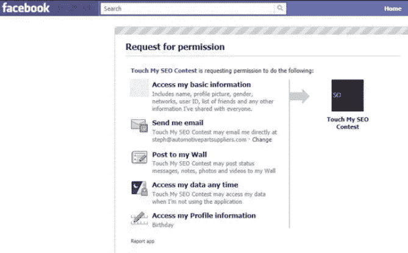

# 数据和选举。请规范我们。

> 原文：<https://medium.datadriveninvestor.com/data-and-elections-please-regulate-us-9e288c6b20f9?source=collection_archive---------3----------------------->

Photo by [Luke Chesser](https://unsplash.com/@lukechesser?utm_source=medium&utm_medium=referral) on [Unsplash](https://unsplash.com?utm_source=medium&utm_medium=referral)

那是两年前的事了。我与我的叔叔和我的一些堂兄弟进行了一次关于数据和人工智能的对话。

我的叔叔亨利先生拥有 Exodus R&D 私人有限公司，该公司提供企业培训和管理培训。我的堂兄弟在那里，他们大多数人都是电脑程序员。对话从我叔叔和我谈论全球经济政策开始，然后转移到唐纳德·特朗普和英国退出欧盟，最后，我们谈论了数据科学。

我不知道是什么占据了我，但我突然对我叔叔说，“嗯，你现在做的工作对吗？你在训练人们成为更好的决策者。我不认为这是必要的，因为我们将实现自动化”。

房间里突然沉默了。我叔叔说了这样的话，“你怎么敢跟我说这些？”以有趣的方式。我明白了。告诉某人他们的工作将会消失，人们将没有必要从事他几乎花了一生时间研究的事情，很难理解我说的话。我仍然不知道我哪里来的勇气告诉他，我可能很兴奋。

但是从那一系列谈话中得出的重要结论是，坐在那里的人缺乏数据素养。相信我，那个房间里的人对时事非常非常了解。甚至我的一些恰好是计算机科学毕业生的表兄弟也感到惊讶。但是，当我解释数据的重要性以及它如何改变我们的社会结构时，他们表达的那种震惊让我反思了一些事情。

 [## 将定义 2020 年就业前景的五大数据科学和机器学习趋势|数据驱动…

### 数据科学和 ML 是 2019 年最受关注的趋势之一，毫无疑问，它们将继续发展…

www.datadriveninvestor.com](https://www.datadriveninvestor.com/2020/02/19/five-data-science-and-machine-learning-trends-that-will-define-job-prospects-in-2020/) 

这让我想知道，人们意识到他们的个人数据是如何改变我们生活的方方面面的吗？

几乎你在互联网上与人和应用程序的每一次互动都在许多方面受到数据的影响。你观看的每一个 YouTube 视频，你喜欢的每一个脸书帖子，你在网上分享的每一个个人数据，你在 Tinder 上的每一次左右滑动，你的个人历史不仅存储在大规模数据库中，还被挖掘和提取模式(在某些情况下是自动的)，以个性化你在这些平台上的体验。

想想看，你打开 YouTube，你会看到为你量身定制的推荐。你打开 Instagram，在页面顶部你会看到来自你更倾向于与之互动的个人资料的帖子。这同样适用于脸书。打开网飞，你会立即看到最符合你兴趣和偏好的推荐。

几乎你今天使用的每一个数字平台都会收集你的个人信息，以自动化的方式处理你的数据，并为你提供个性化的体验。听起来很棒，对吧？如果你不需要搜索电影来看，网飞会为你做的，这不是很好吗？

嗯，在某些方面是的。但是就像计算机科学家开发的其他东西一样，这种大规模的数据处理已经导致了灾难性的结果，这就是本文所要讨论的。

我想重点谈谈 2016 年两件非常重要的事情。英国退出欧盟与美国总统川普的当选。

英国退出欧盟和唐纳德·特朗普的当选是 2016 年最大的政治冷门。这些事件被认为是世界各地激进民族主义右翼运动兴起的高峰期。没人预测川普会赢，也没人预测英国退出欧盟会赢。人们普遍认为，希拉里·克林顿将以两位数的优势击败特朗普，人们将压倒性地投票支持英国留在欧盟。

而且说实话，直到 2015 年，看起来确实是这样的。但是什么改变了呢？

这两个事件的共同点是数据科学和一家营销和竞选宣传公司剑桥分析公司。

要理解 2016，我们需要理解 2008。

2008 年是巴拉克·奥巴马创造历史的一年，他成为美国第一位非洲裔总统。他也是发达国家的第一位黑人总统。对于数字营销人员和数据科学家来说，2008 年美国总统大选是一个有趣的案例。

在美国，有两大政党:民主党和共和党。发达国家的选举与印度等国家的选举有很大不同。在那些西方国家，投票率一般在 50%左右，也就是说，大约 50%的合格选民在选举中投票。这似乎是西方世界发达国家的普遍趋势。

另一个共同趋势是，右翼政党的登记选民往往比左翼政党的登记选民更一贯地参加选举。因此，一般来说，这些国家的选举最终取决于哪个政党能够吸引更多的独立选民。这同样适用于美国。

巴拉克·奥巴马是民主党(左翼进步派)提名人，而约翰·麦凯恩是共和党(右翼保守派)提名人。约翰·麦凯恩在美国参议院工作了几十年，而巴拉克·奥巴马相对来说是美国政坛的新人。所以最初，约翰·麦凯恩似乎会赢得选举，原因有二；首先，共和党是右翼政党，其选民通常倾向于大量投票，他更有经验。巴拉克·奥巴马缺乏经验，国民认可度较低，是左翼政党的提名人，该政党的选民一般不太可能大规模参加选举。

现在，如果奥巴马想赢，他必须争取独立中间派选民的支持。然而，根据最初的民意调查，独立选民似乎在约翰·麦凯恩和巴拉克·奥巴马之间分成了两半。再一次，看起来约翰·麦凯恩更受欢迎。

这就是奥巴马的竞选团队做得非常出色的地方。在发达国家，年轻选民一般不会在选举中投票。投票的人一般是中年人和老年人。如果奥巴马必须获胜，他的竞选活动必须激励年轻人和首次投票的选民，并把他们争取到自己这边来。

那是 2007 年。像脸书这样的社交媒体平台在年轻人中传播开来。奥巴马的竞选团队聘请克里斯·休斯，脸书的早期雇员之一，来领导他的数字媒体团队。克里斯·休斯知道脸书的底细。他利用社交媒体吸引年轻人关注政治和奥巴马。他们使用广泛的社交媒体广告，在这些社交媒体平台、当地团体等上创建本地化的资金页面。这是第一次年轻选民成为政治运动的特定目标。年轻选民觉得他们的声音被听到了，终于得到了关注。

奥巴马在社交媒体上的出现爆炸了。绝大多数年轻人都在讨论奥巴马和他的竞选。克里斯·休斯的团队不断用奥巴马竞选团队的声明和广告轰炸这些年轻人。另一方面，麦凯恩的竞选活动非常老派。

然后是 2008 年 11 月。奥巴马带来了几十年来最高的投票率。新选民和年轻人压倒性地投票给奥巴马。一个在政治领域经验少得多的候选人能够通过利用社交媒体的力量来建立一个基层竞选活动，以年轻选民为目标，将他们带入圈子，并击败一个非常受欢迎和有经验的候选人。人们倾向于将奥巴马的胜利归因于他的个性和远见。虽然这在 80 或 90 年代是真的，但在 21 世纪，如果没有社交媒体的参与，奥巴马就不会赢得选举。

共和党注意到了这一点。他们无法接受这样一个事实，即像奥巴马这样的业余选手能够利用社交媒体平台来锁定目标人群，并建立如此大的草根运动来赢得总统选举。

世界各地的右翼政党也注意到了这一点。2008 年后，世界各地的右翼政党开始大量投资数字工具，以帮助他们开展选举活动。是的，是保守派首先为社交媒体活动投入巨资，而不是改革派。

这就是剑桥分析公司介入的原因。但是，在进入剑桥分析公司的工作之前，让我们理解社交媒体如何帮助公司收集关于人的数据，这可以帮助公司锁定人并影响选举结果。

脸书允许像我这样的开发者在脸书上开发应用。拥有脸书账户的任何人都可以使用这些应用。当我们开发这样的应用程序时，我们有办法获取使用该应用程序的用户的某些信息。因此，我们要求用户允许我们从该帐户访问这些信息。你可能见过类似下图的东西。

有时，应用程序可能需要访问一些个人信息才能运行。例如，脸书上的糖果粉碎游戏要求你允许他们访问你的朋友列表，这样你就可以向你的朋友发送恼人的糖果粉碎请求。像 Medium 这样的应用程序需要我允许它在我的墙上发布，这样我就可以直接将我的 Medium 博客分享给脸书，而不必手动将链接分享给其他人。

2007 年至 2015 年间，脸书允许这些应用程序访问更多的个人数据，比如你与其他人的聊天记录、你的私人帖子、你朋友的好友列表等等。这就是奇怪想法的开始。

大约在 2014 年，剑桥大学的一位名叫亚历山大·科岗的学者开发了一款名为“这是你的数字生活”的脸书应用程序，该应用程序询问一份问卷，最终预测你的性格。但它并不仅仅如此。当人们使用该应用程序时，他们不仅会将自己对问卷的回答发送给亚历山大·科岗，还会发送他们的时间表信息、新闻提要、帖子和来自该应用程序用户账户的消息。由于脸书当时的政策，亚历山大·科岗的应用程序还可以直接访问和下载使用该应用程序的人的朋友的时间线信息和帖子。

假设我用了亚历山大·科岗的应用程序。当我点击“请求许可”对话框中的“允许访问”时，科岗的应用程序立即可以访问我上面提到的所有内容。它还可以访问我的脸书朋友的新闻和帖子。

现在，你可以问一个问题。“普拉文，你给了应用程序的访问权限，那你还抱怨什么？”。这个应用被设计成一个性格测试。没有提到该应用程序收集我的个人信息供未来使用。这简直是不道德的，对不对？如果我想让科岗从他的数据库里删除我所有的信息呢？我不能这样做，因为脸书的政策没有这样的规定。

因此，科岗通过他的应用程序收集了 5000 万脸书用户的个人和公共信息以及问卷答案，并将其交给剑桥分析公司。记住，有 5000 万用户使用这个应用程序，然而，这个应用程序也可以访问他们脸书朋友的各种信息。大多数使用这款应用的用户来自美国和英国。

通过对这些用户数据进行一些高级分析，Cambridge Analytica 能够收集每个用户的大约 5000 个数据点。把一个数据点看作一个人的特征或者一个人的性格特征。剑桥分析有每个人的 5000 个特征。这有时比你的父母或配偶对你的了解还要多。

剑桥分析公司能够获得如此多的人的性格特征。投票给同一个候选人或有相同意识形态的人也有共同的特征或性格特征。通过在这些人中绘制模式，我们可以确定政治家可以说服哪一组人并让他们投票给他/她，以及哪一组人无论如何都不会改变他们的信仰。

最初，剑桥分析公司就是这样做的。通过这样做，Cambridge Analytica 能够围绕各种选举边界绘制地图，并精确预测每个边界内人们的政治联盟，并了解哪些人群可以被说服为各种群体投票。

这是他们加入特朗普竞选的时候。他们之前曾与另一位总统候选人的竞选团队，来自得克萨斯州的共和党参议员特德·克鲁兹合作。当唐纳德·特朗普似乎喜欢共和党的提名人时，他们转移到他的竞选活动，直接开始为他的总统选举工作。

现在让我们进入特朗普的选举。

唐纳德·特朗普获得的选票少于希拉里·克林顿，但仍赢得了选举。这是因为每个州都有一套选举人团票，候选人获得 270 张选举人票才能赢得选举。例如，密歇根州、宾夕法尼亚州和佛罗里达州的选举人票加起来比加利福尼亚州多，但这三个州的人口加起来仍少于加利福尼亚州。因此，如果特朗普在这三个州获胜，在加利福尼亚州失败，他将在选举团中赢得更多席位，但实际票数较少。是的，我同意，这个系统很奇怪。

这就是剑桥分析的由来。他们提出，特朗普将无法赢得大多数选票，但通过适当地瞄准正确的州，特朗普可以赢得选举，因为他将有更多的选举人团选票。

但特朗普在摇摆州的票数也较少。还记得我说过右翼选民通常比进步人士更多吗？剑桥分析公司知道这一点。他们的工作是确保人们对特朗普的挑战者希拉里·克林顿不那么热情，这样他们就不会出现在选举投票站。

这个想法不是为了扩大特朗普的选民范围，而是为了减少希拉里·克林顿的选民范围。

这正是他们所做的。《剑桥分析》有大量关于各州选民的信息。想象一下，你的选民中有各种各样的人的个性特征。通过使用行为心理学，我们可以预测哪些人有什么样的政治倾向。

利用这些数据，他们能够正确地锁定哪些地区更倾向于中间派，或者换句话说，每个州的哪些地区的选民与政党机构的联系更少。然后，他们专门在这些特定地区投放关于希拉里·克林顿的负面广告，以降低那些中间派选民对希拉里的热情。

他们做的另一件有趣的事情是，他们对选民数据进行了自动化分析，并了解了哪些人群更容易受到假新闻和不完整信息的影响。他们专门针对脸书的个人资料和选民区域，散布关于希拉里的虚假信息。这大大降低了这些地区选民对希拉里·克林顿的热情，因此特朗普能够赢得那些为他赢得选举人团选票的特定州，尽管赢得的选票少于希拉里·克林顿。

如果没有关于美国选民的大量数据，这整个政治策略在经济上是不可能的。如果不是剑桥分析公司拥有超过 7000 万个人的 5000 个数据点，就不可能在社交媒体中有特定的目标人群。

这与 2016 年英国脱欧公投非常相似。像脸书和推特这样的社交媒体平台使人们能够向特定人群大规模传播虚假信息。

这给我们带来了一个大讨论:信息时代的数据收集伦理。

像脸书这样的公司可以让其他公司收集个人数据，并进行有针对性的广告，包括政治广告。我可以针对有特定兴趣的人投放广告。这样，他们很容易就能说服老年人投票支持英国脱离欧盟，说服年轻人留在家里不投票。

让我们以英国退出欧盟和 2016 年美国总统大选为例来更好地理解这一点。

虚假信息和假新闻是专门针对中间派人士和中年人(40 至 60 岁)发送的。如果我冒犯了那些人，我很抱歉，但这是真的。这些人在社交媒体平台和聊天应用程序中转发假新闻的数量几乎是 35 岁以下人群的 3 倍。此外，在大多数国家，主要是这个年龄组的人在选举中投票。

一个可靠的案例研究是缅甸的罗辛亚种族灭绝和疫情冠状病毒。缅甸军方在脸书上专门向中老年人传播对罗辛亚人的仇恨信息，这些人甚至在没有证实这些信息的情况下，就将这些信息传播给了他们的同龄人和朋友。结果，我们对罗辛亚穆斯林进行了大规模的种族灭绝，几乎没有选民反对。

脸书最近报道说，关于冠状病毒替代药物的假新闻主要是由 45 岁至 65 岁的人分享的。他们的分析还清楚地表明，关于替代医学的假新闻和广告是专门针对那个年龄段的人的。

如果私营企业无法获得关于个人社交媒体资料的数据，这种外科手术式的广告定位是不可能的。

我认识的几乎每个数据科学家都知道这一点。像剑桥分析公司这样的公司专门向这些人传播假新闻和负面广告，他们最终选择了川普，投票给英国退出欧盟。

一个简单的事实是，私营公司可以收集这样的数据，并利用社交媒体平台来影响选举，煽动种族灭绝，传播虚假信息等。很大程度上是因为谷歌和脸书等公司不受监管的个人数据收集。

你想想，现在几乎每一个主要的数字平台都在收集你的信息，而你没有机会接触到这些信息。私企可以用那个数据间接影响你。我相信剑桥分析并不是大规模数据收集的最坏情况。对于像我这样已经进入这个领域很长时间的人来说，剑桥分析公司所做的事情是像我这样的人认为即将发生的事情。

世界上没有一个国家，除了欧盟有强有力的数据收集法规。在印度，我可以从你的社交媒体档案中收集这么多关于你的个人信息，并利用这些信息影响选举，而我不会有任何法律问题。

甚至像脸书这样的大公司也希望有政府监管的数据收集全球规则，就像国际贸易有某些全球规则一样。但是世界各地的老派政治家还没有在这些问题上做出任何具体的决定。

我坚信数据科学家和人工智能工程师将会做出本世纪最大的发明和突破。我相信，由于人工智能工程师和数据科学家取得的进步，我们将治愈癌症、艾滋病毒，并阻止下一个疫情。

但是，如果你让我们不受监管，社区中的一些人将会开发可以破坏你们国家选举的产品，就像剑桥分析公司如何通过传播虚假信息和假新闻来影响 10 个国家的选举，因为他们可以获得大规模的选民信息。政府将能够间接使用像脸书这样的大规模数据驱动工具来传播可能导致种族灭绝的虚假信息。

最糟糕的情况，奥威尔 1984 年的老大哥情况是可能的，不是通过政府，而是通过脸书和谷歌这样的私营企业，这些企业拥有的数据可以比你的父母或配偶更好地解释和预测你的行为。

我接触过的每一位数据科学家都希望政府在大规模数据收集和用户对这些数据的所有权方面对公司进行监管。数据隐私应被视为个人财产权。数据科学界敦促您认真对待这一问题，以便决策者可以邀请我们并了解这些问题，并制定政策，以避免因大规模数据收集而导致的种族灭绝和选举篡改。

**进入专家视角—** [**订阅 DDI 英特尔**](https://datadriveninvestor.com/ddi-intel)