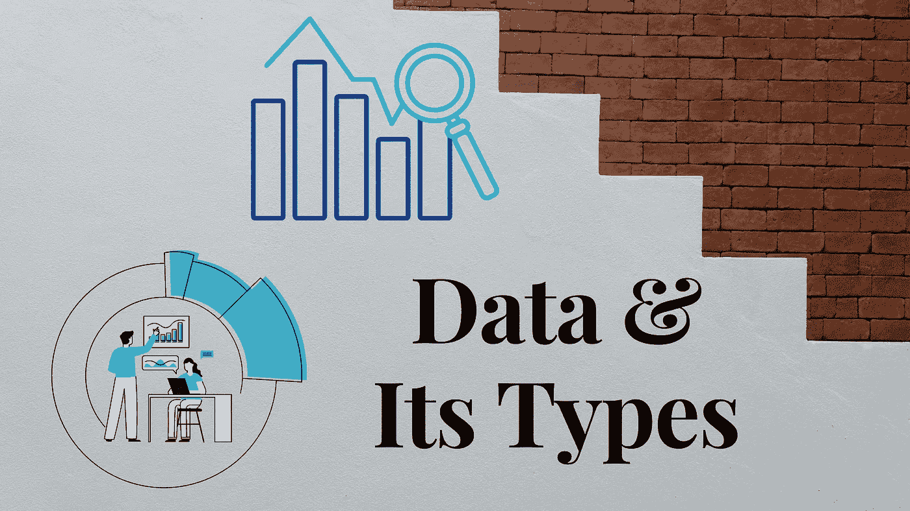
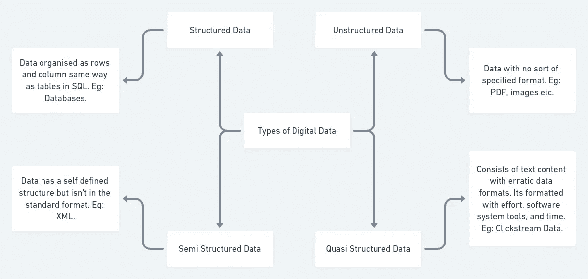

# 数据及其类型

> 原文：<https://medium.datadriveninvestor.com/data-and-its-types-d18ed59c95b2?source=collection_archive---------21----------------------->

各位读者好。如果你在这里，你可能对数据科学感兴趣，并且可能愿意在一个叫做统计学的广阔的金色海洋中潜水。如果我必须解释什么是统计，我会说这是在玩数据，好家伙，这很有趣。

这听起来很令人兴奋，但是数据到底是什么？数据的类型有哪些？你如何收集数据？别担心，我会掩护你们的。

Credits: Created on Canva.com

# 什么是数据？

简答，一切！是的，你周围的一切都是数据。你花在手机上的时间，你的电话号码，你的年龄，你的性别等等。正式地说，数据是信息的集合。但是为什么每个人都对此大肆宣传呢？

通过查看数据，您可以获得各种可用于决策的见解。让我们用一个非常基本的例子来理解这一点，假设在同一地区有 2 家餐馆 A 和 B 开业。

餐厅 A 有一份长长的菜单，上面有各种人们不喜欢的菜，但是餐厅 A 决定什么都不做，照常营业。他们的销售额下降了，最终，他们不得不关闭餐馆。

餐馆 B 也有和 A 一样长的菜单，但是他们没有做任何事情，而是要求顾客反馈(数据)。他们分析了这些数据，并纳入了周围人最喜欢的菜肴。他们重新设计了新菜单，看到了销售额的激增。

从上面的例子中，很明显餐馆 B 的策略奏效了。这显示了数据如何帮助决策。这是一个基本的例子，在现实生活中，情况要复杂得多。您的数据可能格式不正确，可能有缺失值、异常值等。为了获得有意义的见解，你必须提炼和分析你的数据。这就是理解您的数据变得非常重要的原因。哪些数据属于哪种类型，以便确定对其进行提炼的适当步骤。

# 数据类型

数据就像人一样，有各种形状和大小。我们有图像数据、pdf、生物特征数据等。如果我们必须对所有数据进行分类，我们可以将其分为 4 类

Credits: Created on whimsical

在最高级别，有两种数据:定性(分类)和定量(数值)。

1.  **定性或分类数据:**数据属于其中一个类别。例如:血型、颜色等。
2.  **定量或数值数据:**数据是数值。身高、体重等。

 [## 一瞬间学会数据科学！？数据驱动的投资者

### 在我之前的职业生涯中，我是一名训练有素的古典钢琴家。还记得那些声称你可以…

www.datadriveninvestor.com](https://www.datadriveninvestor.com/2020/07/23/learn-data-science-in-a-flash/) 

# 质量数据

在定性数据中，数据由属于其中一个类别的元素组成。例如，在血型中，数据将属于 8 类中的一类(A+/-、B+/-、AB+/-、O+/-)等。

定性数据可以进一步分为 3 种类型

1.  **名义数据:**数据不遵循任何内在顺序，即类别无法排序。例如:在关系状态中{单身、恋爱中、已婚}类别不能被排名。
2.  **二分数据:**只有两类的名义数据。例如:布尔数据(真/假)，性别(男/女)等。
3.  **序数数据:**类别遵循一个内在的顺序，可以进行排序。例如:正面/负面评论等。积极总比消极好。

# 数据

在定量数据中，数据由数字元素组成。例如身高、年龄等。

定量数据可以进一步分为两种类型

1.  **区间:**数据是数值，属于一个区间。温度。
2.  **比率:**与区间相同，只是在比率中，0 表示没有该变量。例如:在高度中，0 高度意味着没有高度。

# 结论

太好了！现在，您已经对数据及其类型有了相当好的理解。你也知道数据是如何帮助你的。了解数据的类型可以帮助您确定测试和处理它的策略。数据无处不在，不同的数据可用于解决不同的问题，现在您已经完成了解决这些问题的步骤 1。

**访问专家视图—** [**订阅 DDI 英特尔**](https://datadriveninvestor.com/ddi-intel)