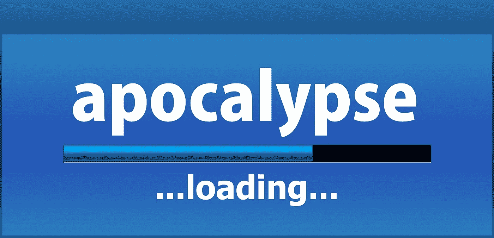

# 以后的数据启示

> 原文：<https://medium.datadriveninvestor.com/data-apocalypse-later-a09182b9cdb0?source=collection_archive---------22----------------------->

数据驱动很棒。只要你能定义实验的规模和用于跟踪它的度量标准。

规模在物理、认知、投资、科学、历史中很重要。

但是，如果你像你希望和声称的那样是数据驱动的，你如何选择定义你如何处理问题的尺度呢？几周前，我听一位资深谷歌人士告诉实际生产和销售产品的公司，他们“不得不”向谷歌的数字化转型放弃他们的数据。或许可以理解，他们不愿意这样做。

哦，当然，我们必须认识到，数据驱动是一个越来越脆弱的咒语，从网上研讨会到《华尔街日报》的思考文章，人们都在绝望地反复念叨。

但是除了你用手指(不要用你的拇指，它有自己的脉搏)把握现实脉搏的自我满足感之外，真正的结果是什么呢？当现实越来越脆弱。如果你没有规模，你拥有的数据的数量和性质是…嗯…没用的。

 [## 一瞬间学会数据科学！？数据驱动的投资者

### 在我之前的职业生涯中，我是一名训练有素的古典钢琴家。还记得那些声称你可以…

www.datadriveninvestor.com](https://www.datadriveninvestor.com/2020/07/23/learn-data-science-in-a-flash/) 

# 想得大还是想得对？

今天，很少有人会接受世界末日的观点

通过预言预言的超自然行为。更多的人会接受，由于气候变化或核战争等生存威胁，世界末日即将到来。当然，旧金山的房地产价格可能会下降，新西兰的地堡建筑可能会增加，但应该用什么尺度来衡量这些“事实”的真正影响。

尽管极右的评论员不断支持犹太-基督教

四骑士启示录，至少从字面上理解，通常被视为一个折扣

不能当真的信条。

但事实并非总是如此。在 1500 年到 1800 年间，在“文明”世界的那一部分，许多最有创造力的人都有着共同的信仰体系。相信他们生活在世界末日，面临人类历史的终结。就像 90 年代的福山。启示录的景象经常被“使用”——有意或无意地——来引发变化。

天启骑士的愿景部分地支撑了 16 世纪的宗教改革、17 世纪的英国内战和 18 世纪的美国革命。这提供了一个关键的催化剂

自由价值观的出现，政治民主，以及现代社会的建立

启蒙运动中的科学。

现代早期并不是启示录第一次渗透到西方智力并重新定义它。这种情况在两个文明之间的年代(公元前 150 年至公元 200 年)曾经发生过一次。在这个时候，世界末日的预期永久地改变了宗教景观，并最终——但必然地——也改变了政治景观。

# 意外的数据后果

1500 年至 1800 年间，第二次遭遇天启创造了现代性，这反过来又创造了我们现在生活的环境。在第二次大遭遇战中，这样的期望在世俗文化的出现中扮演了核心角色——可以说是后中世纪西方最重要的成就。这当然是具有讽刺意味的。一套根深蒂固的关于上帝被激怒的宗教观念被证明有助于人们发展宗教观点的替代品。

世俗的类别，最初，更多的是通过宗教本身的动态和紧张关系，而不是来自对宗教的拒绝。宗教未能对世界如何运转以及个人如何在其中工作提供一个连贯、可信、公平的解释。

虽然天启提供了一个显而易见的直接的宗教“大棒”和“胡萝卜”,但它有意想不到的后果，导致我们从另一个角度思考世界。

那么，在这个任何人都可以进行实验的长期数据驱动的世界中，爆炸可能会产生什么意想不到的影响呢？

你想如何塑造它？

**进入专家视角—** [**订阅 DDI 英特尔**](https://datadriveninvestor.com/ddi-intel)