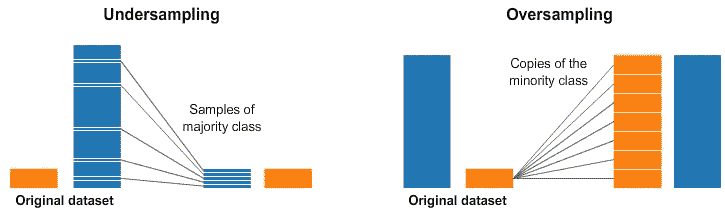

# 深度学习中的数据增强技术。

> 原文：<https://medium.datadriveninvestor.com/data-augmentation-techniques-in-deep-learning-d78c59be8ea5?source=collection_archive---------1----------------------->


Photo by Kaboompics .com from Pexels

最近八个月一直在练习机器学习(主要是深度学习)，作为硕士论文的一部分。在那段时间里，medium.com 和 towardsdatascience.com 帮助我更好地理解事情。许多人建议我在学习的同时写一些关于 medium.com 的东西，我也认为分享我所学到的东西会很好！。

这是我的第一篇文章。

在我的论文中，我主要研究图像数据。有时我收集并准备它们，但有时我会从网站上下载图像数据集。当您这样做时，数据集可能会有许多问题，如缺乏对比度、可变分辨率和类不平衡。

在深度神经网络架构中，我们首先基于我们要解决的问题构建一个深度架构。对于一个典型的图像分类问题，可能是基于卷积神经网络的架构。在构建架构或模型之后，我们将一部分可用数据(训练数据)应用于模型。这个过程称为训练，在这个过程中，模型学习数据分布、数据模式等。在此之后，该模型能够根据它从训练图像中学到的东西对看不见的图像进行分类。但是，对于从训练图像中学习的模型，图像数据集应该满足某些条件，如果不满足，我们必须在将其应用于模型进行训练之前进行大量的数据预处理。

[](https://www.datadriveninvestor.com/2019/01/23/deep-learning-explained-in-7-steps/) [## 深度学习用 7 个步骤解释-更新|数据驱动的投资者

### 在深度学习的帮助下，自动驾驶汽车、Alexa、医学成像-小工具正在我们周围变得超级智能…

www.datadriveninvestor.com](https://www.datadriveninvestor.com/2019/01/23/deep-learning-explained-in-7-steps/) 

使用传统的图像处理技术解决了像低对比度、低分辨率这样的问题。深度神经网络在从低对比度图像中推断知识方面存在局限性，因此使用图像增强技术，如*直方图均衡化*、*自适应直方图均衡化(AHE)* ，以及*对比度受限 AHE (CLAHE)* 等高级技术来解决这个问题。但是，最具挑战性和最有趣的是阶级不平衡问题。

# **阶层失衡！**

类别不平衡或类别偏差意味着样本在类别间的不平等分布。对于二元分类数据集(只有两个类，比如正类和负类)，如狗对猫数据集，当每个类中的样本数量不相等或不大致相等时，会出现类偏移。两个类中的样本数量应该几乎相等，以便模型可以无任何偏差地学习。但是，实际上，第一类中的样本数量可能少于/多于第二类中的样本数量。在这种情况下，我们的模型将学习样本数量更多的类，而不是样本数量较少的类。那么我们最终将得到一个有偏差的模型，该模型在样本较少的情况下对一个类的表现/预测比另一个类好。

这个问题不仅出现在图像数据集中，也出现在任何类型的数据集中。它可以是类似垃圾邮件分类器数据集的表格数据，其样本属于两个类别，垃圾邮件/伪造和原始。在类别不平衡的情况下，数据集在垃圾邮件类别中可能有数千个样本，而在原始电子邮件类别中只有数百个样本。有了这样的数据集，没有机器学习算法能学得更好。使用重采样、SMOTE 等技术来克服这一限制。

# 重新取样

重采样是解决表格数据中的类偏差问题的最直接的技术/思想。这里，我们对可用数据进行**欠采样**或**过采样**，以满足等类别分布的要求。



Image from Kaggle.com

假设我们有一个包含两个类的数据集，第一个类包含总样本数的 95 %,剩下的 5 %归第二个类(很不平衡！！).对于欠采样，我们欠采样最大的类，以使样本数等于最小类中的样本数，如上图所示。也就是说，我们随机删除最大类的一些数据样本/观察值。但是这个过程会导致信息的丢失，因为我们只是简单地避开了各种各样的样本。如果多数类已经有某种数据冗余，那么删除冗余样本不会导致太多的信息损失。

在过采样中，我们一次又一次地对少数类进行采样，直到它等于多数类中的样本数。在这里，通过增加样本，我们正在向少数类引入冗余！。

我们现在可以编写一个说明这些技术的例子。

首先，我们创建一个具有类偏斜的合成数据集。让我们使用 *Keras 库的*数据集模块*创建一个。*

```
from sklearn.datasets import make_classification #Import library 
```

创建包含 1000 个样本的数据集，其中 95%属于类 0，其余 5%属于类 1。

```
nb_samples = 1000  #Total number of samples.
weights = (0.95, 0.05)  #Percentage of split
X, y = make_classification(n_samples = nb_samples, n_features = 2, n_redundant = 0, weights = weights, random_state = 1000)
```

现在，我们有了包含 1000 个样本的合成数据集，包含两个类和两个特征。0 班 95%，1 班 5%。

然后，我们可以重新采样，以获得一个平衡的数据集。

```
# Re-sampling process
import numpy as np
from sklearn.utils import resample
X_1_resampled = resample(X[y == 1], n_samples = X[y == 0].shape[0], random_state = 1000) #Up-smapling #Conacatenate to get up-sampled Xu and yu.
Xu = np.concatenate ((X[y == 0], X_1_resampled))
yu = np.concatenate ((y[y == 0], np.ones(shape = (X[y ==0].shape[0]), dtype = np.int32)))
```

最后，我们在类 0 (Xu[y == 0])和类 1 (Xu[y == 1])中有相同数量的样本。

# **重击**

SMOTE(合成少数过采样技术)是另一种解决类偏移问题的巧妙方法。与重采样技术不同，这里不重复使用可用数据，而是使用类似邻域的方法生成新的合成数据样本。


Image from the internet.

SMOTE 使用样本之间的关系来创建新的合成样本，如最近邻样本。

新的合成样本被放置在连接来自少数类的相邻样本的线上。样本的属性在某个邻域半径以下不会改变，因此它可以创建属于同一原始分布的样本。与带有替换的重采样相反，新的数据集将具有更高的方差，并且合适的分类器可以更好地找到更好的分离超曲面。SMOTE 有 80 多种专门为各种类型的数据设计的变体，sci-kit learn 的 imblearn 库提供了所有功能。

现在，让我们来解决这个问题。

我们可以使用前一个数据中相同的不平衡数据(X，y)来获得求解的数据集。

```
#SMOTE
from imblearn.over_sampling import SMOTE
smote = SMOTE(random_state = 1000)
X_resampled, y_resampled = smote.fit_sample(X, y)
```

# **图像数据集中的类别倾斜**

我最近参考了名为 GTSRB(德国交通标志识别基准)的图像数据集，该数据集包含 43 种不同类别/类型的交通标志。


43 different types of sign classes in the GTSRB dataset. (Image from internet)

但是，一些类包含更多的 2010 图像，而其他一些类包含 210 图像，如下所示。


Class skew in the GTSRB dataset. (image from [here](https://medium.com/@thomastracey/recognizing-traffic-signs-with-cnns-23a4ac66f7a7))

在影像数据集的情况下，解决类倾斜并不容易。我们需要找到一些有效的技术，而不是重新采样等。

图像数据增强是解决这一问题的一种方法。

在图像数据扩充中，我们从可用图像中提取一幅图像，应用一些变换技术，如右移、左移和缩放。在此过程中，创建训练数据集中与原始图像属于同一类的图像的变换版本。

应谨慎选择转换，否则数据集可能会出局。例如，水平翻转猫的照片可能是有意义的，因为照片可能是从左边或右边拍摄的。垂直翻转猫的照片没有意义，并且可能不合适，因为模型不太可能看到颠倒的猫的照片。因此，必须在训练数据集和问题领域知识的背景下，仔细选择用于训练数据集的特定数据扩充技术。

数据扩充中使用的技术有:

图像偏移(宽度偏移和高度偏移)。

图像翻转(水平和垂直)。

旋转。

亮度调节。

缩放。

噪声添加。

数据扩充是通过使用 Keras 的图像预处理模块的 ImageDataGenerator 类来完成的。

我们将对下面的交通标志图像进行各种操作，以使样本相乘。(其实这个不是来自数据集，而是为了更好的可视化，用了网上的这个。)


image from the internet.

```
import matplotlib.pyplot as plt #For plotting
from keras.preprocessing.image import ImageDataGenerator #image data generator.
from numpy import expand_dims
from keras.preprocessing.image import load_img
from keras.preprocessing.image import img_to_array
import cv2
from PIL import Image
%matplotlib inlineimage = Image.open('gdrive/My Drive/Colab Notebooks/sign1.jpg')
plt.imshow(image)
plt.show()
```

所以首先，我们应用**“随机水平移动”**变换。

```
datagen = ImageDataGenerator()
#Random horizontal shift data = img_to_array(image)
samples = expand_dims(data, 0)
datagen = ImageDataGenerator(width_shift_range=[-200,200])
it = datagen.flow(samples, batch_size=1)
for i in range(9):
  plt.subplot(330 + 1 + i)
  batch = it.next()
  image1 = batch[0].astype('uint8')
  plt.imshow(image1)
plt.show()
```

在这之后，我们得到一些水平移动的图像如下。


Horizontally shifted images.


Horizontally shifted image.

然后我们应用另一个操作叫做**“随机垂直移位”。**

```
#Vertical shiftdata = img_to_array(image)
samples = expand_dims(data, 0)
datagen = ImageDataGenerator(height_shift_range=0.5)
it = datagen.flow(samples, batch_size=1)
for i in range(9):
  plt.subplot(330 + 1 + i)
  batch = it.next()
  image2 = batch[0].astype('uint8')
  plt.imshow(image2)
plt.show()
```

然后我们得到这样的样本:


Vertically shifted images.


vertically shifted sample.

接下来的操作是**“随机旋转”。**

```
#Rotationdata = img_to_array(image)
samples = expand_dims(data, 0)
datagen = ImageDataGenerator(rotation_range=90)  #Specify angle of rotation
it = datagen.flow(samples, batch_size=1)
for i in range(9):
  plt.subplot(330 + 1 + i)
  batch = it.next()
  image4 = batch[0].astype('uint8')
  plt.imshow(image4)
plt.show()
```

输出将类似于:


Randomly rotated images.

另一个变换是**“亮度调节”**如下:

```
#brightness adjustmentdata = img_to_array(image)
samples = expand_dims(data, 0)
datagen = ImageDataGenerator(brightness_range=[0.2,1.0]) 
it = datagen.flow(samples, batch_size=1)
for i in range(9):
  plt.subplot(330 + 1 + i)
  batch = it.next()
  image5 = batch[0].astype('uint8')
  plt.imshow(image5)
plt.show()
```


Brightness adjusted samples.


Brightness adjusted sample.

然后我们做一些**【缩放】**变换。

```
#Zoomingdata = img_to_array(image)
samples = expand_dims(data, 0)
datagen = ImageDataGenerator(zoom_range=[0.5,1.0]) 
it = datagen.flow(samples, batch_size=1)
for i in range(9):
  plt.subplot(330 + 1 + i)
  batch = it.next()
  image6 = batch[0].astype('uint8')
  plt.imshow(image6)
plt.show()
```


Randomly zoomed images.

在这个数据扩充过程之后，我们可以将数据集转换成一个没有类偏差的平衡的数据集。

*注意:对数据样本应用所有这些转换并不复杂。因为对交通信号应用一些“随机垂直翻转”不会给出合理的输出。垂直翻转的交通标志不是机器学习模型可以从中推断信息的东西。因此，根据您的数据集明智地应用这些转换。*

数据扩充技术不仅用于图像数据集，也用于其他类型的数据，如表格数据和文本数据。NLP(自然语言处理)中的数据扩充就是一个例子。*从*[*Neptune . ai*](https://neptune.ai/)*这里的*[](https://neptune.ai/blog/data-augmentation-nlp)**看 NLP 中数据增强的一个有趣的阅读。**

***参考文献:***

1.  *奥莱利图书公司。*
2.  *[https://sci kit-learn . org/stable/modules/generated/sk learn . utils . resample . html](https://scikit-learn.org/stable/modules/generated/sklearn.utils.resample.html)*
3.  *[https://www . ka ggle . com/RAF jaa/sampling-strategies-for-unbalanced-datasets](https://www.kaggle.com/rafjaa/resampling-strategies-for-imbalanced-datasets)。*
4.  *[https://medium . com/@ Thomas Tracey/recogniting-traffic-signs-with-CNNs-23 a4 AC 66 f 7a 7](https://medium.com/@thomastracey/recognizing-traffic-signs-with-cnns-23a4ac66f7a7)*
5.  *[https://en.wikipedia.org/wiki/Histogram_equalization](https://en.wikipedia.org/wiki/Histogram_equalization)*
6.  *[https://www . pyimagesearch . com/2019/07/08/keras-imagedata generator-and-data-augmentation/](https://www.pyimagesearch.com/2019/07/08/keras-imagedatagenerator-and-data-augmentation/)*
7.  *[http://benchmark.ini.rub.de/?section=gtsrb&分段=新闻](http://benchmark.ini.rub.de/?section=gtsrb&subsection=news)*
8.  *[https://machine learning mastery . com/how-to-configure-image-data-augmentation-when-training-deep-learning-neural-networks/](https://machinelearningmastery.com/how-to-configure-image-data-augmentation-when-training-deep-learning-neural-networks/)*
9.  *【https://neptune.ai/blog/data-augmentation-nlp *

*我要感谢我的项目指导 Mithun Haridas T. P .先生，我从他那里开始学习从基础到高级的概念；我要感谢 Shameer Khader 博士，在见到他之后，我已经做出了许多改变；我还要感谢 Asharaf 博士，他最近在我的大学(CUSAT)发表了一次演讲，激励我开始写关于 medium.com 的文章。*

*非常感谢来到这里，阅读我的第一篇关于人工智能和机器学习的文章，在 medium.com。*

***请使用下面的评论框**，让我知道您的更正、建议和反馈。*

*再次感谢！。*