# 使用 python 函数在 ML 中清理数据——模型不喜欢脏数据。

> 原文：<https://medium.datadriveninvestor.com/data-cleansing-in-ml-using-python-functions-models-dont-like-dirty-data-5c64d8d3f3a8?source=collection_archive---------2----------------------->

Image credits: DataEntryServices-Info

难道我们不都希望能够完全按照上图所示的方式清理数据吗？嗯，这只是一个愿望。但是在将脏数据输入模型之前，我们在 python 中有一些有趣的方法来处理脏数据。

**首先让我们理解为什么需要数据清理:**

一般来说，需要进行数据清理，以使特征中没有杂乱的数据，并为许多下游过程构建更合适的数据版本。

**然而，在数据科学中，**最重要的事情是模型的准确性，以及它理解未知数据的准确程度，从而给出无错误的预测/结果。这反过来将有助于企业和组织减少意外成本，带来更多的利润。

让我们用一个例子来理解这一点:假设一个节日即将来临，我有一个精品店。所以，为了增加我的收藏并找出能给我带来更多利润的物品，我需要了解前几年的销售趋势。做到这一点的一个方法是建立一些洞察力，并在我收集的海量历史数据上运行一个预测模型。但是如果我用来预测销售额的模型不能给我准确的信息，我的生意就会亏损。这就是为什么我们的模型有最高的精确度是非常必要的。

 [## 将定义 2020 年就业前景的五大数据科学和机器学习趋势|数据驱动…

### 数据科学和 ML 是 2019 年最受关注的趋势之一，毫无疑问，它们将继续发展…

www.datadriveninvestor.com](https://www.datadriveninvestor.com/2020/02/19/five-data-science-and-machine-learning-trends-that-will-define-job-prospects-in-2020/) 

当我们用数据清洗产生的高质量信息训练模型时，以上所有这些都可以实现。

**在一个数据科学项目中，数据清洗消耗了总工作量的 50%以上。**

下面的图表让我们了解了一些需要清理的不相关的数据场景。

我们将逐一讨论这些场景，以及使用 python 处理它们的策略。

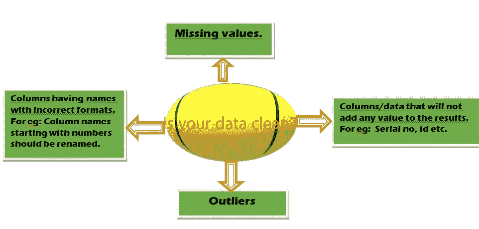

喔呼，现在是时候把手弄脏了。让我们直接进入 Jupyter 笔记本，从一步一步的清洁开始。

**先决条件:**我正在使用数据集 XYZCorp_LendingData。(图片来源:Kaggle)

# ***1>*******导入所有重要的 python 库。****

*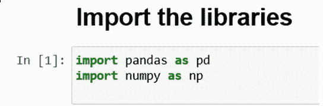*

# ***2>导入数据集。***

*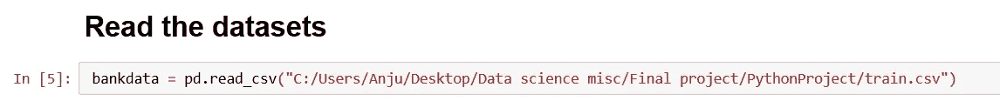*

# *3 >看一下数据。*

*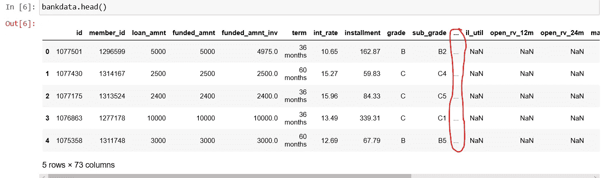*

*I am using head() function here because I want to see first 5 rows.*

*看到上面的截图，我们意识到有些列是隐藏的。当数据集的列数过多，无法全部显示时，通常会发生这种情况。*

*为了解决这个问题，如果我们想查看 Jupyter 笔记本中的所有列，我们可以使用下面的命令:*

*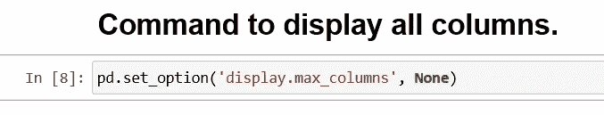*

*现在，如果我们再次读取数据，所有列都将显示在 Jupyter 笔记本中。*

**

# ****4>*******标识列数和行数。*****

**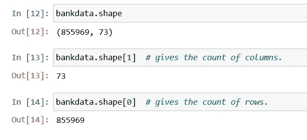**

# ***5 >数据清理:***

****在数据清理部分，我们将首先识别丢失的值，然后确定处理它们的方法。****

*****缺失值*** *通常发生在没有为特定特征存储值时。在整数数据类型中可以用 NA 和 NAN(不是数字)来标识，在字符数据类型中可以用空格来标识。***

****检测缺失值的各种方法:****

**了解缺失值的最简单方法是使用函数 **df.info()** ，该函数让我们对所有列有一个总体的了解，比如它们的数据类型以及它们是否包含空值/非空值。**

**例如，在下面的截图中，我们可以看到我们的示例数据集的所有 73 列的数据类型。我们还知道数据集中的总行数是 855969。因此，以蓝色突出显示的列“desc”有 121812 个非空值，这可能意味着剩余的值是空格/null/NA/NaN。**

****

***检测缺失值*的第二种方法是通过**使用可视化技术。****

**o **Seaborn 库和热图函数**可用于检测缺失值——看一下下图，我们就能了解缺失数据的列。**

**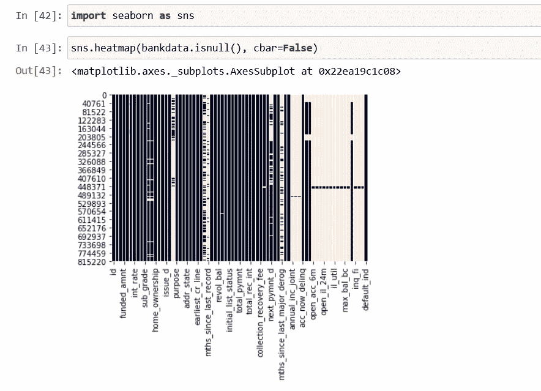**

**The white lines and white spaces in the heatmap shows us the missing values.**

**o **Missingno** 是 python 中另一个有用的可视化库，它有助于可视化数据帧的空值。**

**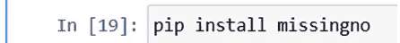**

**Install the library**

**o **Msno.matrix()** 函数给出了与 sns.heatmap()类似的结果。因此，它们中的任何一个都可以用来可视化丢失的值。**

**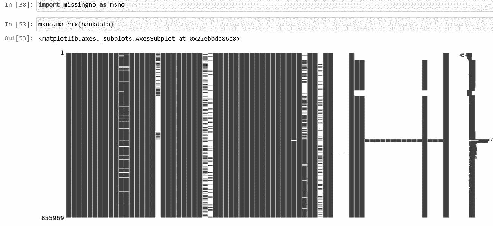**

**The white lines and white spaces indicate that our example dataset has lots of missing values.**

****使用缺失号库**，我们可以**使用 msno.bar()函数绘制缺失值**。**

**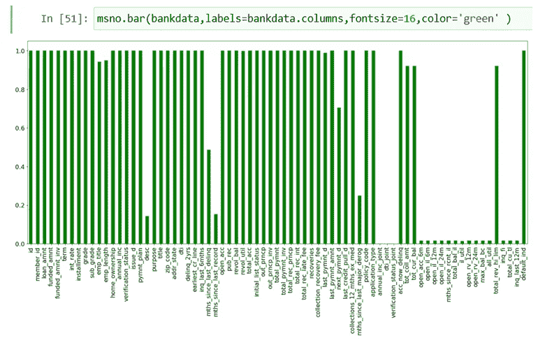**

**In the bar plot, we can easily identify all the columns with missing values.**

****第三种也是最有效的检测缺失值的方法**是使用 python 脚本和 python 函数。**

**如果数据集的列数较少，我们可以使用下面的 python 代码来检查缺失值的数量和百分比。**

**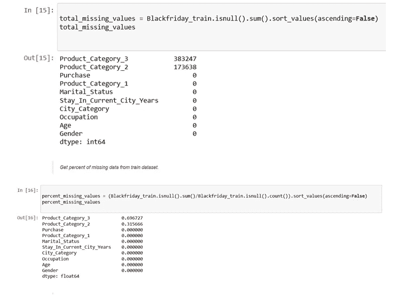**

**Example dataset : BlackFriday sales (Source: Kaggle)**

**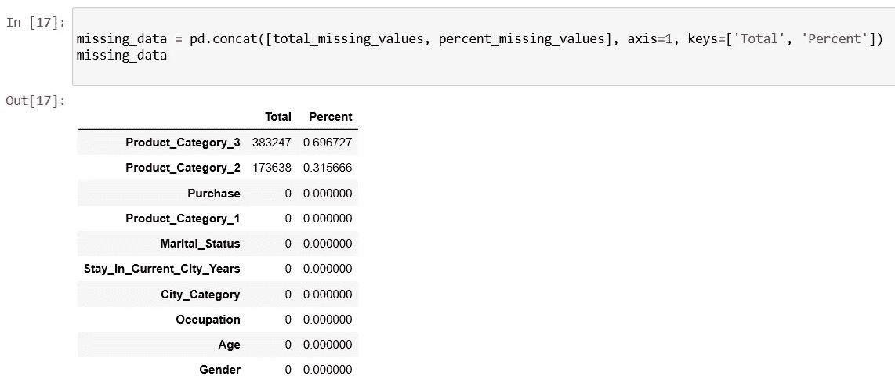**

**The above table gives us a count and percent of missing values**

**然而，如果数据集中的列数量很大，那么这些脚本的挑战在于，所有的列不会一起显示在 Jupyter notebook 中。例如:**

**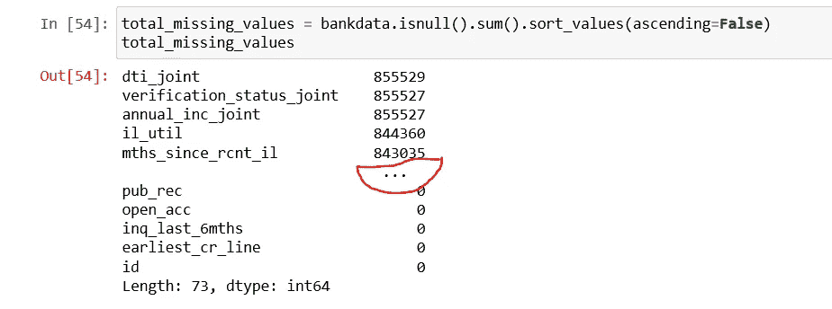**

*****为了克服这个缺点，我们可以编写 python 函数，可以用在各种数据量小或大的数据集上。*****

**首先，我们可以设置一个标志来检查数据集是否有空值。**

****

**True means our dataset has null values.**

**我们可以使用下面的 python 函数来计算缺失值的数量和百分比。该函数可用于任何数据集。**

**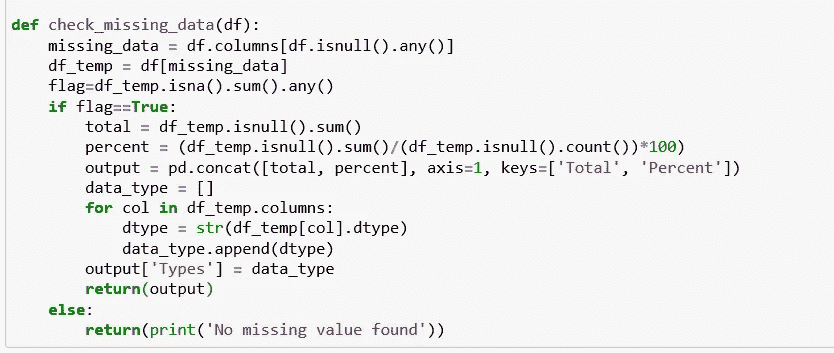**

**现在使用上面的 python 函数检查我们的示例数据集“XYZCorp_BankLending”是否有任何丢失的值。**

**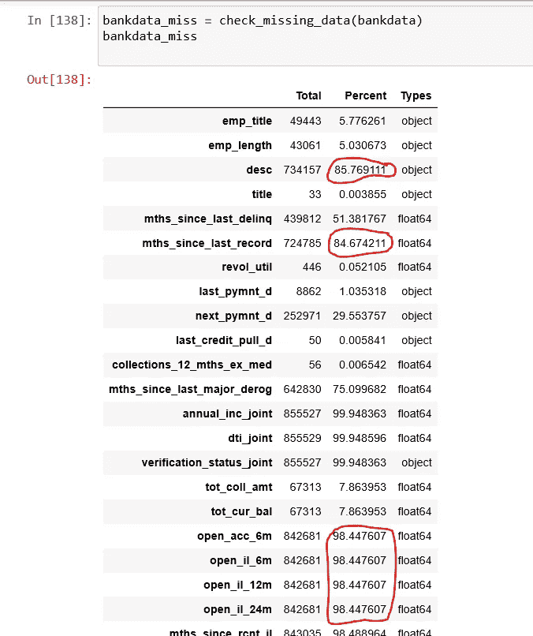**

**Looks like there are lots of missing data.**

****首先，识别缺失值超过 60%的数据:****

**在上面的屏幕截图中，我们可以看到一些以红色突出显示的列有大约 80–100%的缺失值。在进一步检查下面的代码时，我们观察到“True = 20 ”,这意味着 20 列有超过 60%的缺失值。**

**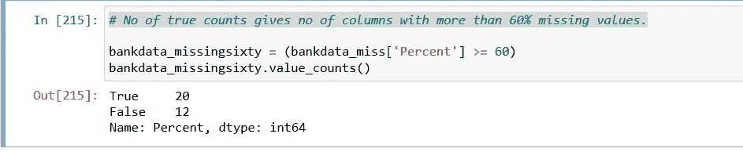****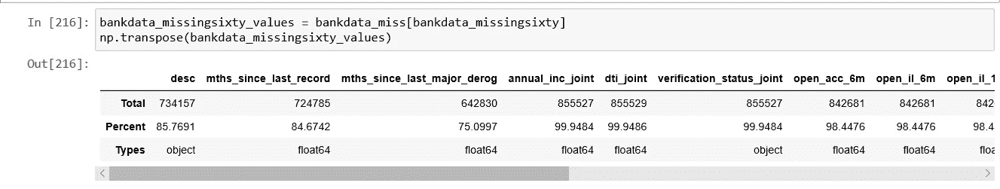**

**The code above indicates that Dataframe ‘bankdata_missingsixty_values’ contains the 20 columns having more than 60% missing values.**

****下一步是识别缺失值少于 60%的数据。****

**下面的脚本让我们了解了缺失值小于 60%的不同数据类型的列的数量和名称。这是必要的，因为它使我们的工作更容易识别不同的数据，以便处理它们，因为浮动数据应由平均值估算，对象数据应由模式估算。**

*   ****标识数据类型为“float”的列。****

**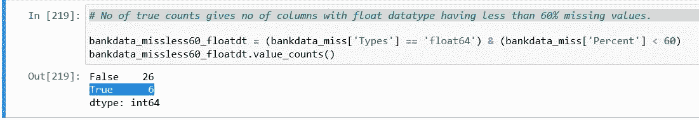**

**True = 6 indicates 6 columns with data type float has < 60% missing values and needs imputation.**

**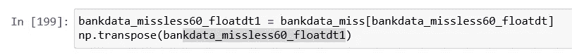******

**Dataframe ‘bankdata_missless60_floatdt1’ contains the 6 columns of datatype float with missing values<60%**

*   ****识别数据类型为“对象”的列。****

**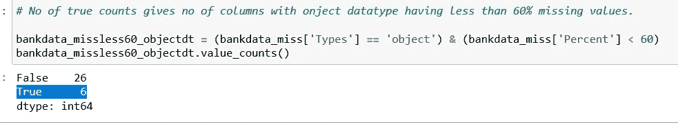**

**True = 6 indicates 6 columns with data type ‘object’ has < 60% missing values and needs imputation.**

**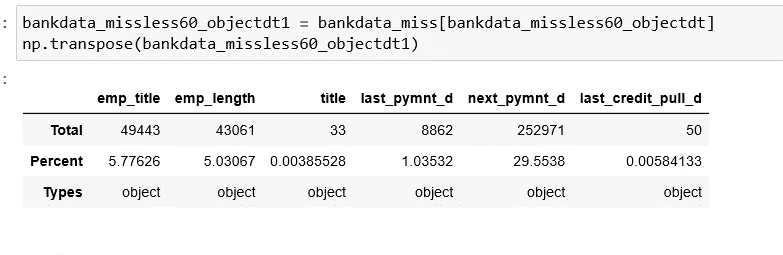**

**Dataframe ‘bankdata_missless60_objectdt1’ contains the 6 columns of datatype object with missing values<60%**

*****既然我们已经确定了有缺失值的数据，我们需要看看处理它们的各种方法。*****

*   ****处理缺失值**的一种方式是，如果一列包含超过 60%的缺失数据**，那么最好**删除列**，因为具有大量缺失值的数据对模型准确性没有太大帮助。****

**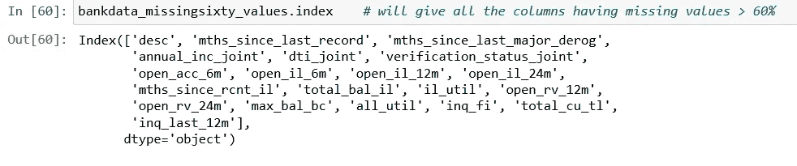****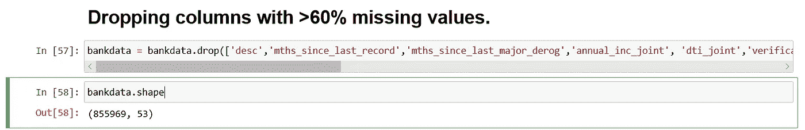**

**After dropping columns with >60% missing values from our example dataset , the number of columns changed from 73 to 53,.**

*   ****第二种方法是估算/替换缺失值。****

**缺失数据少于 60%的列仍可用于进一步处理，但在此之前必须对其进行处理(估算/替换)。**

**我们可以使用来自 Scikit learn 的 SimpleImputer()方法来估算缺失值。**

**但是我在这个 turorial 中使用了 fillna()方法。**

****整型数据类型**，缺失的值可以用**替换，表示该列的**。**

**如果列数较少，我们可以手动逐个进行插补，如下所示；如果需要插补的列数较多，我们可以编写一个循环函数。**

**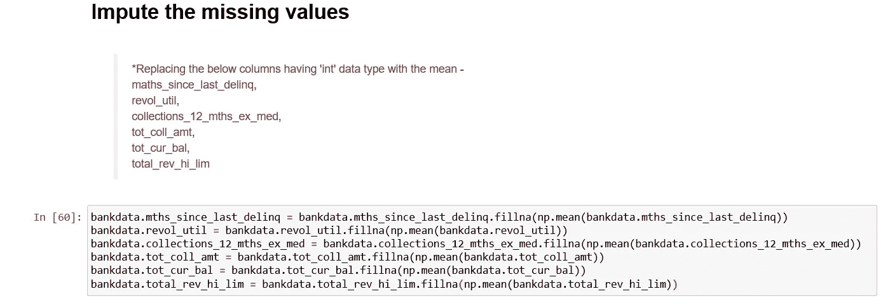**

**Manual Imputation with mean.**

****使用循环:**下面的函数将首先检查列的 dtype。如果它是 float，数据中具有 na 值的列将通过 fillna 方法由平均值估算。这个过程对所有符合标准的列进行迭代。**

**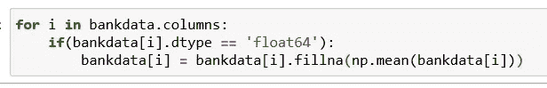**

**Mean imputation using Loop function.**

****同样，对于字符数据类型**，该列的**模式**(出现次数最高的值)可用于估算缺失值。**

**这也可以手动或使用循环来完成。我们将在这里讨论这两个问题。**

**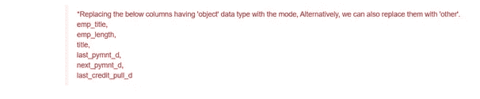**

****手动逐个输入**:当需要输入的列数较少时首选。**

**首先，我将使用下面的函数找到所有需要清理的列的模式，然后用各自的模式估算它们。**

**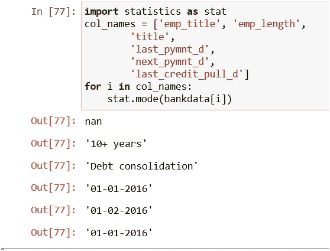**

**Statistics library is used for it.**

**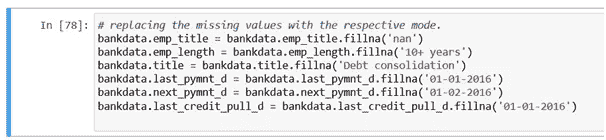**

**Manual imputation with mode.**

****使用循环:**下面的函数将首先检查列的 dtype。如果是 object，数据中具有 na 值的列将通过 fillna 方法由 mode 估算。这个过程对所有符合标准的列进行迭代。**

**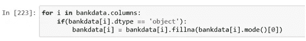**

**Mode imputation using Loop Function**

# ****我们来总结一下上面的过程:****

**1 >使用可视化技术/python 脚本/python 函数检测缺失值(总数和百分比)。**

**2 >删除缺失数据超过 60%的列。**

**3 >对于 int/char 数据类型，分别用 mean/mode 估算剩余值。**

**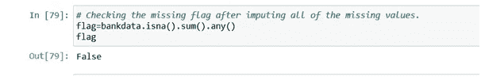**

**After all the imputation done in the preceding steps, the missing flag is finally false which means our example dataset is completely void of missing values now.**

**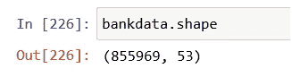**

**Shape of dataset after dealing with missing values.**

****现在，数据清理的下一部分围绕着不必要的列，这些列不会给模型/结果增加任何价值。****

**一些列如序列号、卷号、id 等对于每一行都是唯一的。因此，我们可以删除这种类型的列。**

****识别此类数据的一个简单技术是**创建一个如下图所示的函数，以识别每列中唯一行的数量。如果一列中唯一的行数与该列中的总行数匹配，并且如果它们似乎没有给预测增加任何值，那么我们可以删除它们。**

**然而，在使用这种技术丢弃任何东西之前，我们需要格外小心，因为有时可能会有连续的特征，如年龄、距离等，它们可能都有唯一的值。在这种情况下，我们需要小心，在盲目放弃它们之前，理解观察结果对我们的分析有什么贡献。**

**此外，像人名这样的列也可以删除。**

**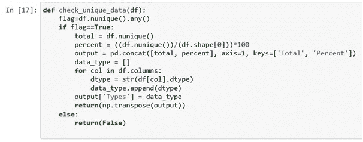**

**Function for finding unique values.**

**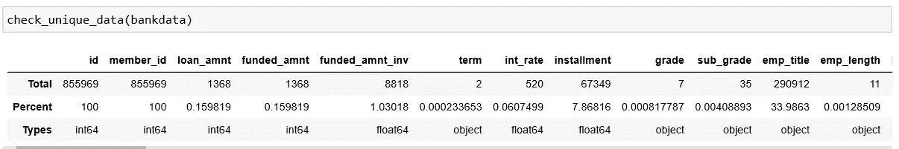**

**In our example dataset ‘XYZCorp_LendingData’, the total number of rows is 855969 and as seen above, the number of unique rows for columns ‘id’ and ‘member_id’ is also 855969\. Hence, we can drop these columns.**

**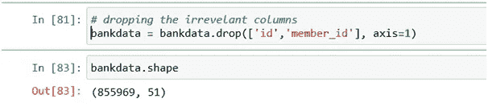**

**Aftercleansing , 51 columns of the dataset turned out to be with appropriate data.**

****另一个需要数据清理的重要场景是处理离群值。**要了解更多关于离群值的信息，请访问我的文章[离群值](https://medium.com/@anjurajbangshi2/outliers-in-data-and-ways-to-detect-them-1c3a5f2c6b1e?source=your_stories_page---------------------------)。**

****最后但同样重要的是，有时，我们收集的数据可能有不正确的列名。****

**例如:一个列名可能以数字开头，可能包含空格，python 不能识别的其他特殊字符。因此，我们需要将它们转换成适当的格式以便进一步处理。**

**在这种情况下，我们可以直接在文件本身中更正它们。**

**但是，我们也可以利用 python 的 replace()函数就是这样的情况。**

**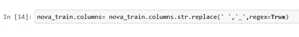**

**Example code to convert all spaces in a column name to underscore(_).**

****附加说明**:此外，有时许多列可能包含值，如'> 9 '，'< 6 '等。**

**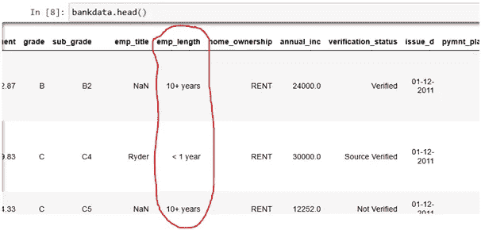**

**Example**

**我们的示例数据集“XYZCorp_LendingData”包含像 emp_length 这样的列，这些列的值在上面的屏幕截图中突出显示。因此，我们需要将这种类型的数据转换为机器/机器学习算法可以理解的正确格式。这可以通过标签编码等策略轻松实现，我们将在另一篇文章中讨论。**

**最后，我欢迎任何关于这个话题的建议/反馈/额外信息，请保持联系。在那之前，享受阅读吧！！**