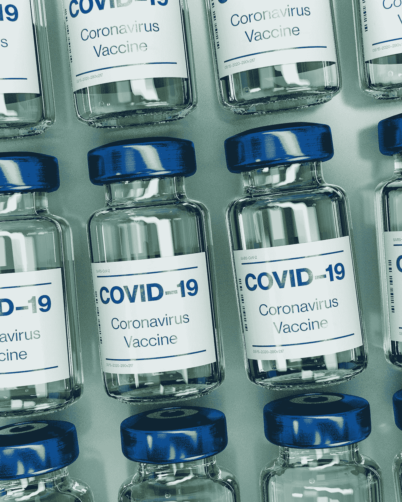
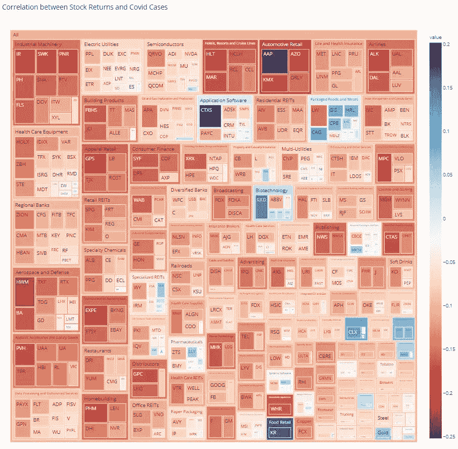

# 选择后 Covid 股票

> 原文：<https://medium.datadriveninvestor.com/data-driven-approach-to-choosing-post-covid-stocks-5fdefda2e0c1?source=collection_archive---------15----------------------->

Photo by [Daniel Schludi](https://unsplash.com/@schluditsch?utm_source=medium&utm_medium=referral) on [Unsplash](https://unsplash.com?utm_source=medium&utm_medium=referral)

# 介绍

突然，希望。这是上周《经济学人》的标题，也是世界的真实感受。Moderna 和辉瑞公司在几周内生产出两种有效率超过 90%的疫苗的消息让世界在这可怕的一年里看到了一丝希望。

市场反应迅速而激烈，在疫苗消息的支持下，标准普尔 500 和 DJIA 打破了历史最高纪录。然而，当我们深入研究这些指数的成分时，我们看到个别股票的波动范围很大，一些股票有两位数的回报，而另一些股票有两位数的损失。这种业绩上的悬殊促使我去分析个股和行业的关系，去 Covid 相关新闻。有了这些知识，我们就能挑选出受益于疫苗在世界各地分发的股票。

# 数据准备

我在这个练习中使用了标准普尔 500 的成分公司，但是它肯定也可以扩展到 DJIA。我从 [Tidyquant](https://cran.r-project.org/web/packages/tidyquant/index.html) R 包中检索了自 2020 年 2 月以来指数中每家公司的每日回报，以及从约翰霍普金斯大学中心[新冠肺炎分析](https://cran.r-project.org/web/packages/covid19.analytics/index.html) R 包中检索了美国确诊 Covid 病例数的每日百分比变化

之后，我计算了每家公司的每日收益与新冠肺炎确诊病例数量趋势之间的相关性。

# 个体公司

相关性可以在下表中看到，不出所料，与确诊病例数高度相关的股票是像 Clorox、Gilead Science 和 Walmart 这样的品牌。

负相关的是 Expedia、Hilton 和 Gap 等品牌，正是那种在疫情期间表现不佳的公司。

# 全行业

然后，我用 S&P 资本智商公司的数据做了一个连接，得到了每家公司的行业，并将它们组合在一起，得到了行业平均相关性。结果如下所示。

不出所料，食品零售、互动家庭娱乐和家居产品在榜单上排名靠前，而航空公司、酒店、度假村和邮轮公司排名垫底。

 [## 为什么我们投资 Totient，也就是人工智能如何帮助我们生产抗癌药物和 Covid | Data…

### 9 月 10 日，一家人工智能驱动的药物研发公司宣布与……建立关键合作伙伴关系，从此悄然出现

www.datadriveninvestor.com](https://www.datadriveninvestor.com/2020/09/13/why-we-invested-in-totient-aka-how-ai-can-help-us-produce-drugs-against-cancer-and-covid/) 

# 市场范围的树形图

为了总结我收集的结果，我使用了 python 的 Plotly 包中的 Treemap 函数。我已经附上了图表的截图，以及下面的互动版本。

只需快速浏览一下树形图，就可以立即看出，市场作为一个整体，与确诊病例数呈负相关。随着案例数量的上升，市场的表现不会更好。当然，也有少数离群的行业，请随意探索树形图来驱动您自己的见解！

# 压力测试

有了过去一周的两种疫苗的消息，我们可以在消息发布后立即使用股票的回报来对我们的模型进行感觉检查。我们将使用 11 月 9 日的辉瑞疫苗新闻作为代理，因为这是第一次宣布疫苗，市场的反应比 Moderna 疫苗更具戏剧性。

没错。看起来我们的模型并不太坏，在 11 月 9 日，辉瑞疫苗宣布的当天，相关性和股票的每日回报之间几乎呈负线性关系。在疫苗宣布的当天，正的 Covid 相关股票通常有负的回报，而负的 Covid 相关股票基本上有正的回报。

# 结论

这是一种数据驱动的方式，筛选出潜在的股票，供投资者考虑即将到来的疫苗全球分销。但是，一如既往，一定要记得做好自己的尽职调查，以补充这种探索性分析！祝你好运！

如果你想了解更多关于特朗普的推文以及它如何影响市场的信息，请查看我以前的文章，因为我使用自然语言处理来分解特朗普的推文！

 [## 唐纳德·特朗普的推特分析

### 基于数据的语篇分析

medium.com](https://medium.com/datadriveninvestor/an-analysis-of-donald-trumps-tweets-46bb85e89022) 

**进入专家视角—** [**订阅 DDI 英特尔**](https://datadriveninvestor.com/ddi-intel)