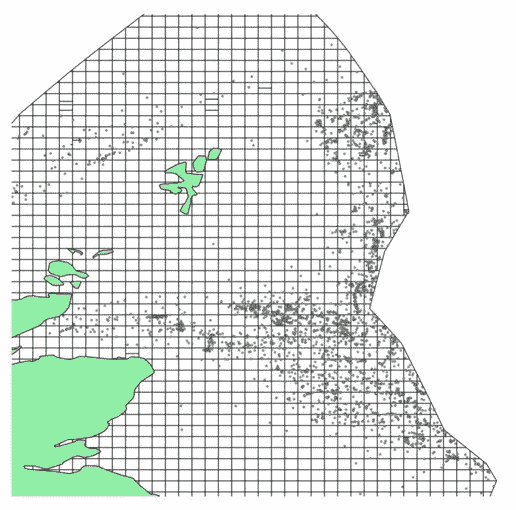
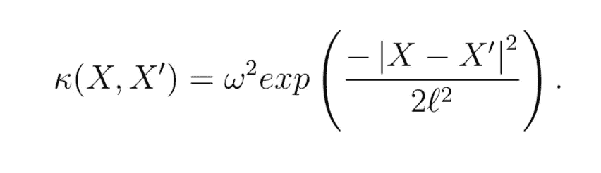
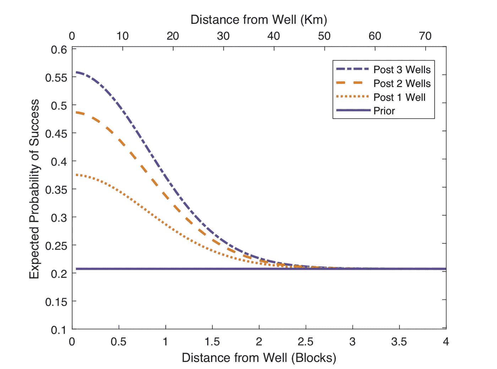
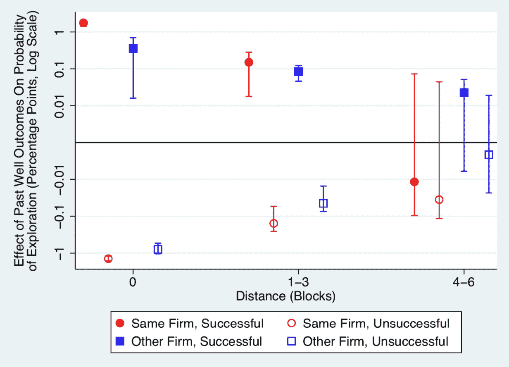
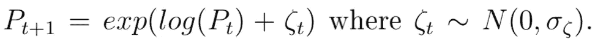
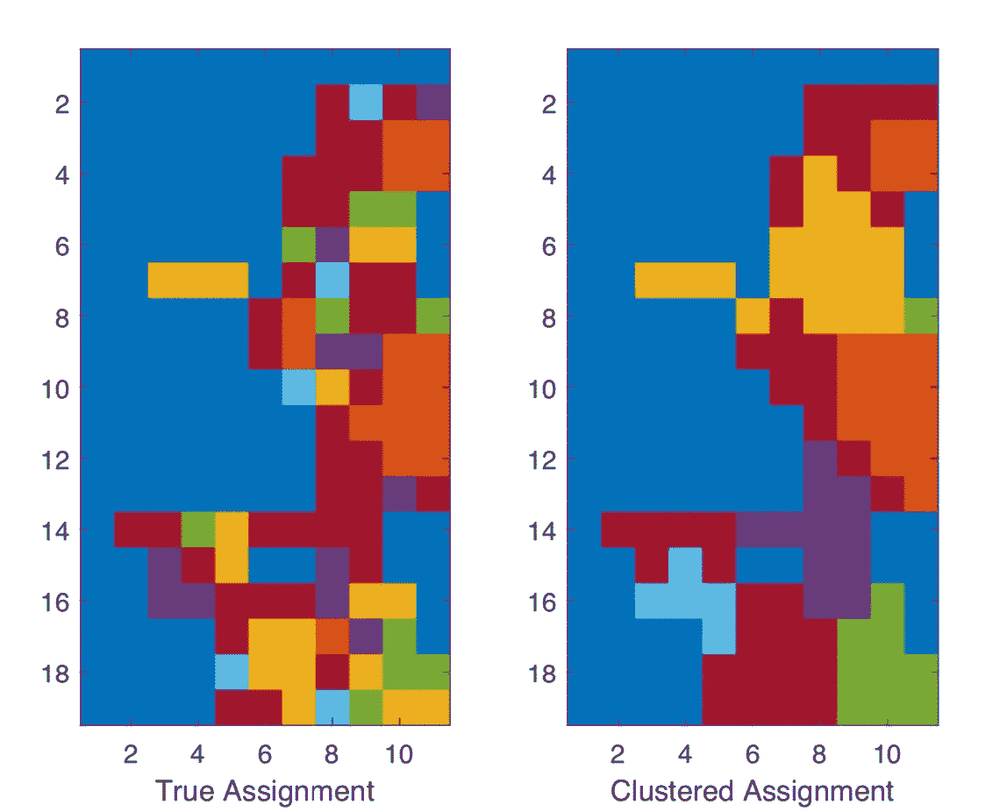

# 数据驱动经济学:石油行业的学习

> 原文：<https://medium.datadriveninvestor.com/data-driven-economics-learning-in-oil-industry-5ec229807d47?source=collection_archive---------11----------------------->

*本质上，这是我对 Charles Hodgson(2018)*[*链接*](https://cpb-us-w2.wpmucdn.com/campuspress.yale.edu/dist/a/3019/files/2019/08/oil.pdf) *最近一篇论文非常简化的总结。*

**背景**

在石油行业，学习是公司日常业务的重要组成部分。在开发任何一块土地之前，有必要进行研究并估计其下的石油储量。由于油井的开发成本过高，开发一片下面几乎没有石油的空地可能是挪用公款。因此，挖掘几口测试井来估计未来可能从地壳下获得的石油是一个合理的想法。

地块成为公司的实物期权，因为如果估计的石油量很高，那么油井的开发将是有利可图的，公司应该行使期权。如果估计很低，那么长期的利润流将不会覆盖今天的大量固定成本，我们不应该继续进行该项目。

 [## 为什么包容性财富指数比 GDP 更能衡量社会进步？|数据驱动…

### 你不需要成为一个经济奇才或金融大师就能知道 GDP 的定义。即使你从未拿过 ECON 奖…

www.datadriveninvestor.com](https://www.datadriveninvestor.com/2019/03/08/why-inclusive-wealth-index-is-a-better-measure-of-societal-progress-than-gdp/) 

如果附近有其他公司同时进行这些挖掘，就会出现一个重要的问题。一方面，“我的”公司可以利用这一信息进行更少的研究并削减浪费的成本，因为地下的石油量在空间上是相关的，这意味着如果邻居的区块有大量的石油，那么我的区块可能也有很多。另一方面，如果我的公司和邻近的公司都依赖于对方的研究，那么将不会进行足够的研究。

如果公司目前的行为不尽如人意，上述机制要求政府进行干预。
问题是如何决定均衡是否是次优的。没有对这个问题有帮助的可用数据，因为不清楚从哪里得到这种次优性的度量。这就是经济学派上用场的地方！

为了产生一些合理的讨论，我们可以在一个简洁的数学模型中用一组数字参数来总结石油公司的相互作用，使用可用的数据用统计方法来估计它们，并评估当前的均衡离最优有多远。在所有这些步骤之后，只要模型的假设是正确的，我们的估计过程是谨慎进行的，我们就可以制定出改善福利的政策。至少这听起来比依赖于一些可能有偏见的专家直觉的模糊论点更有说服力。查尔斯·霍奇森的一篇论文是这种思路的一个很好的例子。

**经济学家的方法**

Drilling history visualized UK Continental Shelf

鉴于英国大陆架 30 年的石油钻探历史，研究人员可以估计石油空间分布的空间相关性统计模型。这将允许推测一个成功的勘探如何提高附近大量石油储备的机会。假设石油分布的模型为高斯过程，两个位置 ***X*** 和***X’***之间的协方差函数如下:

作者通过使用最大似然估计数据中的 ***w*** 和 ***l*** 来捕捉这种空间相关性。下图说明了一块土地下面的大量石油储量的概率是如何根据该特定地块附近的成功挖掘而变化的。

此外，论文提供了额外的证据，证明邻居的学习确实会影响我们自己的决定:

我们看到，成功的研究和附近地块的石油发现增加了公司进行项目的机会，而不成功的研究阻碍了我们投资开发油井。另一个有趣的观察结果是，这种影响随着企业当前被告知其地块资源的方式而变化。如果他们已经进行了一些研究，那么邻居的挖掘并不影响他们的投资决定。然而，如果不确定性水平很高，那么邻居的学习对他们的决策更有影响。

接下来，本文进一步评估了当前企业之间的互动是否是社会最优的，以及是否可以做些什么来改善它们。

作者为此做了几个假设:

*   公司根据高斯模型进行思考，并使用新信息更新他们对地块成功机会的信念
*   每个时期，公司都决定对地块进行研究和/或开发
*   企业选择行动来最大化期望的贴现利润流(类似于总和:价格*数量/利率)
*   这种贴现利润流是用价值函数来表示的，就像强化学习一样

*   对数石油价格被认为遵循随机游走

使用这个决策模型，作者可以评估每个行动的预测概率:

并且通过找到那些解决关于观察到的行为的最大似然估计过程的参数来估计模型的参数。这些参数包括信息溢出率(我们观察他人研究结果的速度)和企业的成本函数。

**结果**

现在，我们可以扮演仁慈的社会规划者的角色，检查如果我们比现在需要更多或更少的信息溢出会发生什么。作者发现，在完全披露的情况下，随着次优研究投资的下降，行业的总剩余增加了 **38%** 。另一方面，禁止共享信息增加了 31%的工业剩余**,加速了平均 1 年**的土地开发**,因为在这种情况下，公司不期望其他人在那里学习。这表明当前平衡处于某种局部最小值。**

**还有其他好的政策吗？作者发现，一个好主意是重新分配地块，并在企业间实现空间集群(每种颜色代表不同企业的所有权)**

****

**当然，这几乎是不可想象的，但这似乎是一个消除外部性问题并使工业更接近社会最优的好政策。**

**我已经与你们分享了我特别喜欢的经济学的一部分，我认为它适用于指导政策和做出数据驱动的决策。请继续关注，我计划在深入研究时分享更多内容。**