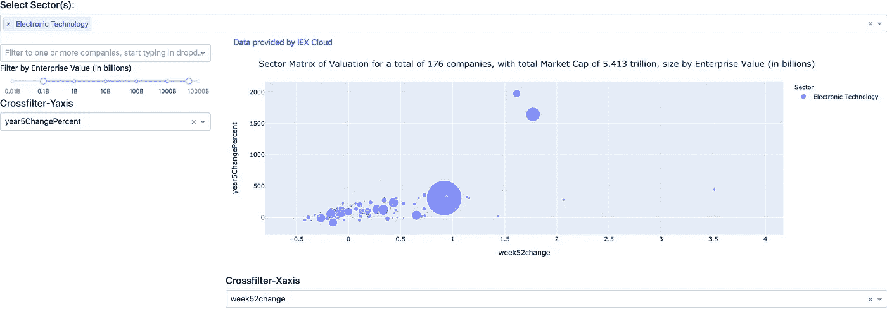

# 目标部门或行业内的数据驱动型投资

> 原文：<https://medium.datadriveninvestor.com/data-driven-investing-within-a-target-sector-or-industry-5726483f86fc?source=collection_archive---------26----------------------->

你最喜欢的投资领域是什么，或者你认为自己在哪个领域具有专家优势？

也许你对某个特定的经济领域有热情或工作经验；这可能是你在了解投资该领域的企业方面的优势。或者，这可能是你正在寻找一个广泛的领域，以获得风险敞口，使你现有的投资组合多样化。在标准普尔 500，这是一个行业搜索分类的良好开端:

 [## 股票市场部门和股票部门搜索-Barchart.com

### 主要市场部门页面显示了您所选择的市场中的部门和行业的表现。美国……

www.barchart.com](https://www.barchart.com/stocks/sectors/rankings?timeFrame=matrix) 

有两种方法找到你的投资:“狩猎”和“钓鱼”。狩猎法意味着你确切地知道你想拥有什么，有一个确定的标准匹配列表，价格可能是你耐心等待得到被狩猎目标的唯一东西。捕鱼方法意味着你对湖泊(行业)或海洋(部门)有一个总体的概念，什么特征是可取的(鱼的大小，估价范围等)。)并且对于目标来说更加开放。

为了让“钓鱼”方法更进一步，我使用了一些流行的估值倍数或商业利润作为这个 [web 应用](https://dcf-valuation-damodaran.herokuapp.com/apps/sector)的行业“细分”的指标。以下面所示的泡沫图为例，其中泡沫的大小代表企业的企业价值(EV)，而
X 轴代表 EBITDA 与 EV(不含杠杆的收益率)

y 轴代表 EBITDA 利润率(扣除利息和税之前，企业将收入转化为现金流的效率)

Sector Valuation Analysis scatter plot

如果该图中的价值轴被划分为 2X2 网格，那么右上角(第一象限)将代表最有吸引力的投资机会。这类业务将代表更高的收益(向右)和更有效率(向顶端)的行业，表现为他们的利润率或同等的定价能力。如果企业没有负债或负债很少，您可以更改 X/Y 轴下拉列表来选择您的指标 P/E 比率和净利润率，或者您可以选择其他指标，如随时间窗口的市场价格变化。然后，在一个 2X2 的网格(左上、右上、左下、右下)内，用细齿梳选择你的大致分析区域。*注意:您也可以使用图例区域上方的工具栏图标缩放/平移该图表。*

另一个使用案例可能是，您想要选取给定行业中目标的两个轴上的(价格)动量(价格在几天、几个月或几年的时间窗口内的变化)，并显示长期变化与短期变化，如下所示:

这种练习的基本思想是根据您想要的度量/标准筛选出您的最佳选择。这使得一个行业中的公司从几百家迅速缩小到不到 10 家左右。然后，你可以对这些商业机会进行深入的估值分析(更多信息，请见另一篇文章！)运行应用程序仪表板的源代码在本文下面分享。*注意:web 应用程序中显示的沙盒数据来自 IEX 云测试响应值，仅供说明之用。如果您想使用实时数据和真实值，请* [*注册 IEX 云，并使用您自己的 API 密钥*](https://iexcloud.io/s/b47b5006) *。*

特色选择允许您选择多个行业(如果需要)，或通过键入公司名称选择少数公司(比如用于竞争分析)，以及在此投资漏斗中考虑企业规模或规模(按企业价值)的过滤范围目标。您会选择哪些指标来进行行业选择，请在评论中分享…

总之，下面是进行这种[基于行业的分析](https://dcf-valuation-damodaran.herokuapp.com/apps/sector)的步骤:

1.  如果需要，选择一个或多个扇区。人们更愿意对同一桶苹果进行比较。
2.  过滤你的“渔网”:通过企业价值，移动滑块任一范围的 2 点。
3.  使用 X 和 Y 值轴的下拉菜单选择指标。
4.  (可选)如果您想要进一步缩小结果范围，请在左上角输入公司名称。
5.  在图上缩小到你想要的区域，选择你想要的几个公司做进一步的深入分析。

做这件事的替代方法可能是可利用的，许多站点提供股票筛选，其中一个过滤器是部门选择。这种屏幕通常被格式化为表格，并且不太适合于由上述气泡图格式提供的快速、交互式反馈，该气泡图格式具有关于气泡大小的视觉维度。此外，这些筛选程序可能或可能不提供基于一个以上选择的度量的排名。同样，使用这种气泡图格式，选择“象限”的视觉元素，它将代表您根据两个度量值轴的视觉排名选择的百分比。

为了完整起见，引用的 web 应用程序的源代码如下:[https://github.com/codepatel/dcf](https://github.com/codepatel/dcf)。最初，该应用程序旨在为上市公司的股权估值进行贴现现金流(DCF)分析，可通过进入相邻选项卡进行访问:

 [## 股权估值分析

### 贴现现金流现值计算器

dcf-valuation-damodaran.herokuapp.com/apps/dcf](https://dcf-valuation-damodaran.herokuapp.com/apps/dcf/AAPL) 

项目网站:[https://codepatel.github.io/dcf/](https://codepatel.github.io/dcf/)

补充说明:使用 EBITDA 对 EV 作为“收益收益率”而不是更流行的市盈率并将其反转的原因是为了消除市盈率中固有的杠杆(债务)效应。两家公司具有相同的市盈率，其中一家没有债务，这两家公司比高杠杆的公司更有投资吸引力(假设利息支出占 EBIT 的百分比相对较小)。此外，公司的收购方将查看其 EV 以完全收购公司并承担其债务，这将是用于赚取 ROIC(投资资本回报)的资本。

## 想要更多的分析和想法？[订阅我的邮件列表](https://hardiksp.substack.com/subscribe)。

*本文仅用于信息和教育目的，您不应将任何此类信息或其他材料理解为法律、税务、投资、财务或其他建议。此处包含的任何内容均不构成我们或任何第三方服务提供商在该司法管辖区或任何其他司法管辖区购买或出售任何证券或其他金融工具的邀约、建议、认可或要约，根据该司法管辖区的证券法，此类邀约或要约是非法的。*