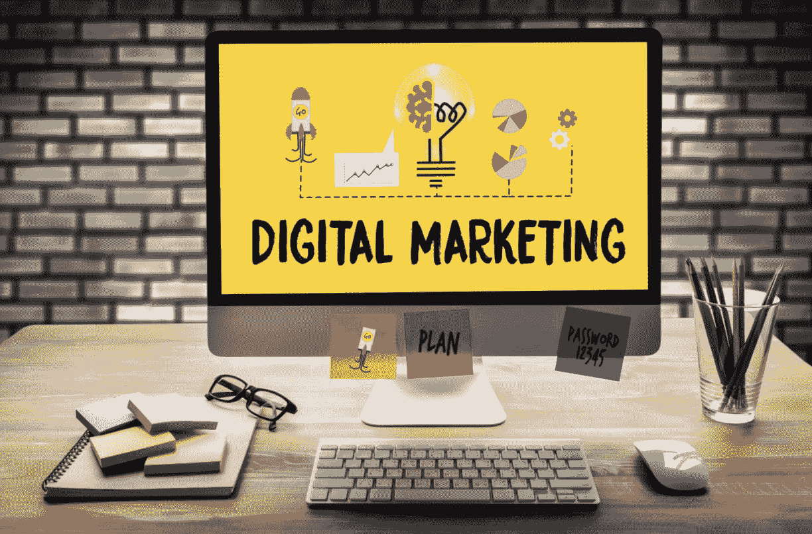
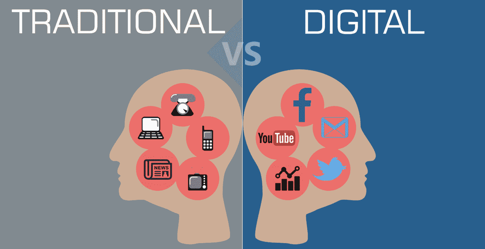
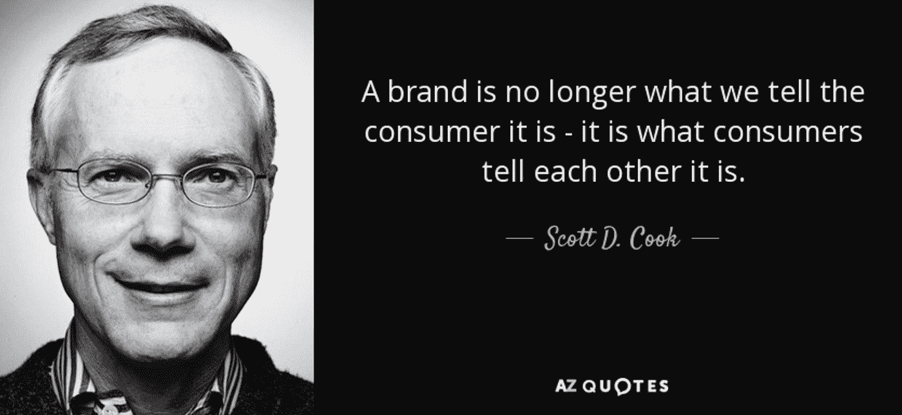
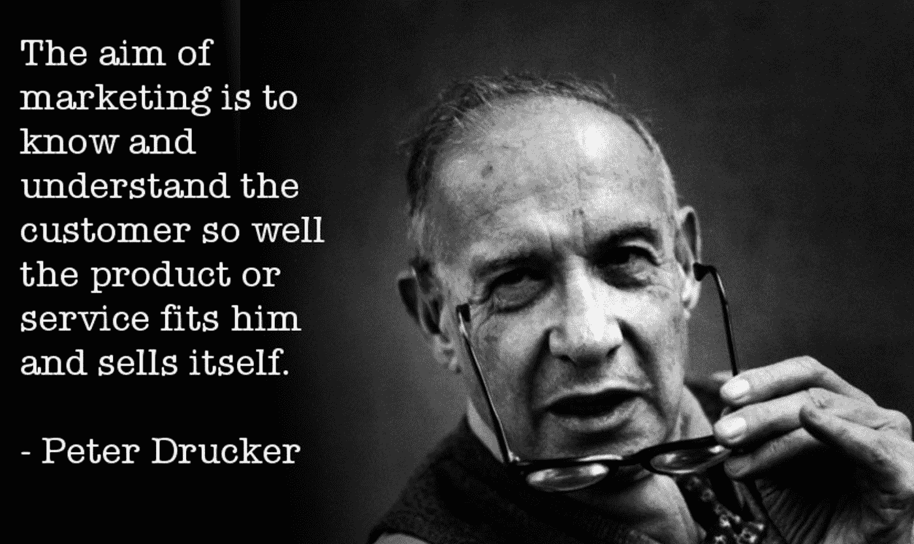

# 数字世界中的数据驱动营销！

> 原文：<https://medium.datadriveninvestor.com/data-driven-marketing-in-the-digital-world-60389f413f87?source=collection_archive---------9----------------------->

Picture Source: [https://miro.medium.com/max/1024/1*vThNvfV1i_uZbTP0FMCYyQ.png](https://miro.medium.com/max/1024/1*vThNvfV1i_uZbTP0FMCYyQ.png)

世界正在走向数字化。我们生活的方方面面都越来越数字化。了解和理解客户是营销的核心，所有的数字技术都前所未有地促进了更好地了解客户和在个人层面上理解他们的过程。

本文简要介绍了营销、营销这些年来的变化、数字时代的营销、主要趋势和挑战。

**营销和营销组合:**

简单地说，营销属性是指一个公司或一个品牌用来推销其产品或服务、吸引顾客和维持与顾客关系的所有活动。因此，每一项小小的服务或产品都需要相当大的营销努力。

营销活动本质上旨在将一家公司的产品和/或服务与想要获得它们的潜在客户相匹配。这种匹配过程——将产品与客户匹配——对于推动公司盈利至关重要。

 [## 影响者在聚光灯下表演|数据驱动的投资者

### 影响者营销是一个脱颖而出的游戏。结果是一个令人难忘的-和可信的-连接到一个产品或…

www.datadriveninvestor.com](https://www.datadriveninvestor.com/2020/01/15/influencers-perform-in-the-spotlight/) 

营销包括广泛的活动和工具，以形成一个全面和有利可图的营销计划。这种多焦点领域被称为“营销组合”，即公司有效营销其产品或服务所需的工具/活动的基本组合。“营销组合”一词是由美国哈佛商学院广告学教授尼尔·霍普·波顿在 20 世纪 50 年代创造的。

**营销组合**的概念围绕着营销的 4 P

1.  **产品**——公司提供/打算提供给顾客的物品或服务
2.  **价格** —公司产品或服务的成本——销售价格
3.  **定位** —产品的分销，这意味着为客户提供渠道
4.  **促销** —推广其产品或服务的综合营销活动，包括广告、直接营销、公共关系、促销等各种活动。

**那么，这些年来，市场营销发生了怎样的变化？**

传统上，在今天所有的数字进步出现之前，营销活动是通过报纸、广告传单、杂志、广播、电视、广告牌等进行的。这是典型的单向对话，定义并强化了消费者的刻板印象。

虽然所有这些营销实践仍然存在，但世界已经经历了巨大的数字转型，因此，数字营销的想法已经进入了画面。消费者不再是被动的参与者，在各种数字平台的帮助下，新的数字消费者积极地相互交流，并与品牌交流。数字消费者消息灵通，现在交流是双向的。正如 Intuit 的共同创始人斯科特·戴维·库克正确指出的那样，

**所以，数字营销:**

数字营销包括利用互联网、社交媒体平台、搜索引擎、智能手机和其他可用的数字渠道进行的营销活动。

主要的数字营销渠道包括网站营销、点击付费(PPC)广告、内容营销、电子邮件营销、社交媒体营销、联盟营销、视频营销和短信。

**那么，是什么推动了这种变化呢？**

正如每个正在利用数字技术进行变革的行业一样，数据是这一变革的关键驱动力。大数据和其他数字技术的出现

1.  促进了每天收集大量数据的过程
2.  提高了存储所谓“大数据”的可访问性和经济性
3.  数据分析、人工智能和人工智能带来了前所未有的分析能力，并以前所未有的速度从积累的数据中获得洞察力。

这些是数据成为当今几乎每个行业的组织最追求的资产的重要原因，营销活动也不例外。

**它是如何帮助营销人员的？**

**三个主要用例:**

**1。了解和理解他们的客户:**

著名的管理顾问彼得·德鲁克曾经说过:“营销的目的是了解和理解顾客，使产品或服务适合他并自我销售”。

这是最有价值的应用，数字技术对营销人员有很大的帮助。在这些技术进步之前，像所有其他行业一样，营销人员也必须使用一些样本数据来分析和了解他们的客户。他们的营销努力集中在把信息发布出去，希望它能到达正确的人(潜在的顾客)。但现在，营销人员能够访问个人实时事件/行为的数据，深入准确地了解他们的客户。这意味着该行业正在从代理数据(即关于人群类别/群体的数据(用作样本))转向源数据(即关于客户本身(个人)的数据)。这对营销人员来说具有巨大的价值，并且在塑造客户的选择和行为方面具有巨大的潜力。

**2。个性化客户体验:**

数字时代的顾客已经很聪明了。个性化客户体验是第一种的扩展用例。现在，大量非常精细的数据已经可用，营销人员可以为他们的每一位(有价值的)客户提供非常个性化的体验——每次都是难忘、独特、难忘、满意、值得推荐的积极体验。

**3。与客户的持续互动:**客户参与各种数字平台。在这些平台的帮助下，营销人员可以不断与客户接触，更好地了解他们，提供个性化的相关内容供他们消费，在预测客户需求和偏好的基础上，提供精心定制的产品以满足客户的需求。

**主要挑战有:**

1.  **种类繁多的数字渠道:**数字渠道的数量在持续增长，客户每天都要与其中的许多渠道进行互动。每个平台都有独特的界面和不同的东西提供给客户。因此，对于营销人员来说，了解这些平台中的哪些对他们来说是重要的，并且对于营销人员来说，整合这些平台中的每个平台的客户体验也是重要的，同样具有挑战性。
2.  **跟上行业竞争:与传统营销方式(如在传单、杂志、报纸等上印刷广告)相比，数字营销方式确实更具成本效益。因此，数字营销越来越受到每个人的青睐，在这场竞争中脱颖而出、吸引和留住客户是一个巨大的挑战。**
3.  **不断增长的数据量:**智能设备和互联网的使用只会越来越多，与之交互的用户所产生的数据也会越来越多。这些数据是数字营销工作的基础，识别正确的数据并从分析如此大量的数据中提取洞察力是一个越来越大的挑战。

**总结思路:**

当数字营销成为潮流时，传统的营销实践也很活跃。这里的**关键点**是找到一个完美的平衡点，最大限度地利用两种营销实践，采用最佳实践，在所有渠道中比市场上的任何人都更了解客户，持续分析和衡量数字营销实践，并在必要时采取纠正措施，以及提供一致、个性化和协调的客户体验。

**参考文献:**

1.  [https://www.investopedia.com/terms/m/marketing.asp](https://www.investopedia.com/terms/m/marketing.asp)
2.  https://www.investopedia.com/terms/d/digital-marketing.asp
3.  [https://www . SAS . com/en _ us/insights/marketing/digital-marketing . html # todays world](https://www.sas.com/en_us/insights/marketing/digital-marketing.html#todaysworld)
4.  《互联的消费者》，作者:微软—[https://www.youtube.com/watch?v=kz8yleuvTgI](https://www.youtube.com/watch?v=kz8yleuvTgI)
5.  什么是数字营销，为什么它很重要 SAS 的观点[https://www.youtube.com/watch?v=_PWqIMQux-g](https://www.youtube.com/watch?v=_PWqIMQux-g)
6.  图片来源:谷歌