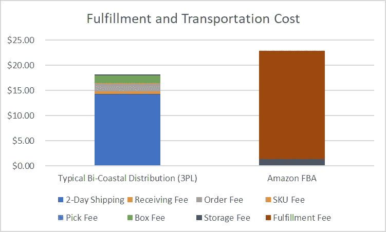

# 供应链中的数据不平等和混合经济学

> 原文：<https://medium.datadriveninvestor.com/data-inequality-and-blender-economics-in-supply-chain-c92b4c55b6c9?source=collection_archive---------10----------------------->

我喜欢奶昔。我几乎每天早上都做同样的食谱。有一天，我可能会被认为是 shokunin。二郎梦见的不是寿司，也许是*马修梦见的是奶昔。*

成本是我决定在家里做这个的一个因素；但是，控制和理解是更大的因素。具体来说，我更愿意控制与我的饮食相关的负外部性——无论是在我消费之前还是之后。从这个角度来看，这意味着零添加糖，杏仁奶，以及公平报酬给那些收获可可和锡兰肉桂的人。

 [## 为什么包容性财富指数比 GDP 更能衡量社会进步？|数据驱动…

### 你不需要成为一个经济奇才或金融大师就能知道 GDP 的定义。即使你从未拿过 ECON 奖…

www.datadriveninvestor.com](https://www.datadriveninvestor.com/2019/03/08/why-inclusive-wealth-index-is-a-better-measure-of-societal-progress-than-gdp/) 

几乎任何投入都会产生负外部性。开车？排放是一种负外部性。你的柴拿铁瘾？糖和热量是负外部性，表现在健康状况不佳。

无论是从个人还是从公司的角度来看，正确的价值评估都需要理解相关的外部性以及与它们相关的责任分配。这构成了数据内在价值的基础，它有望帮助我们确定产品、服务或一般选择的价值。

# 数据不等式

进入信息时代仅仅几十年，人类和机器已经收集了大量的数据。收藏的规模只会越来越大。很好，对吧？

不完全是。预期的结果必须仍然比资源投入更有价值。我们中的许多人——无论是在家中还是在企业中——都无法选择能够保证大量有机数据收集和综合的规模。

某些企业有规模、动力和专业知识来利用他们拥有的*海量数据。一般来说，这些例子围绕着大型科技公司、大型零售商和工业企业。这产生了一种“数据不平等”的衡量标准，即大多数企业产生并经常持有大量数据，但这些数据的可替代性并未实现。*

*B2B 业务中的数据不平等通常会在那些拥有大量可替代数据的企业中滋生出两种商业策略之一。*

1.  *异常复杂的定价，达成协议的实质性谈判，由于复杂性造成的事实上的不透明。UPS 和联邦快递符合要求。*
2.  *捆绑统一价格。一刀切的条款。没有协商，无法了解成本领域。想想亚马逊 FBA，或者通过 Shopify 的运输采购。*

*虽然这两种策略在采购过程中看起来完全不同，但采用这两种策略的公司占据上风。他们控制搅拌机。让我们来看看采用我喜欢称之为“混合经济学”的公司和业务线的前景和方法。*

# *亚马逊 FBA*

*没有一家公司比亚马逊在混合经济学的概念上走得更远。它是主要消费者渠道的核心，也是 FBA 和许多其他业务线的核心。FBA，即 Amazon 的 Fulfillment，允许商家将商品运送到 Amazon 仓库，在那里进行存储、上市、销售和运输。*

*毫无疑问，对于某些商家来说，这种一体化服务是正确的选择。它方便、简单，并为全球的亚马逊客户提供访问权限。*

*另一方面，这有点类似于去你的县监狱吃饭。是的，你会得到食物。充分的平等，因为每个人都在吃同样的粥，所有的房间都完全一样大。很有可能如果你到达时有什么值钱的东西(IP？)，可能会被没收。你可能拿不回来了。*

*举个例子，比如说我开始通过 FBA 在亚马逊上销售黑牌和德克尔牌烤面包机。如果我去计算器，我发现有两个 FBA 费用:每月存储和履行费用。这包括接收、存储、挑选和包装、装运(运输)以及与履行相关的客户支持。相当强大的搅拌机。*

*每个月的存储费用为 1.38 美元。完成量为每件 21.56 美元，总计 22.94 美元。我将每月用四个托盘运送 200 个烤面包机到亚马逊工厂。*

*现在，让我们来看一个典型的 3PL 定价安排，双海岸分销。大约 95%的国内人口可在 1-2 天内获得地面服务。这些数字来自 iDrive 履约合作伙伴，反映了一个烤面包机订单的成本。*

*   *接收费:0.50 美元*
*   *仓储费:0.25 美元*
*   *订购费:1.5 美元*
*   *SKU 费:0.15 美元*
*   *提货费:0.10 美元*
*   *包装费:1.35 美元*
*   *两天运费:14.35 美元*
*   *总计:18.20 美元*

**

*FBA Packs on the Sugar*

*在这种情况下，FBA 是一笔不公平的交易，看不到成本区域，但价格过高。通过利用他们的内部数据，亚马逊已经能够自信地提出一个全包价格。这种混合成本产品因其简单性而吸引人，但在其他地方则完全没有吸引力。正如你将在几段中读到的，这不是(无论如何)唯一的缺点。*

# *UPS 和联邦快递*

*包裹承运商拥有大量可替代数据，以及截然不同的定价和收购策略。通过使用数百种独特的收入杠杆，包括(但不限于)基本费率、附加费、折扣矩阵、回扣和数量范围，UPS 和 FedEx 能够给人以高度定制的产品的印象。事实上，采购专业人员只是在使用不同品牌的搅拌机。*

*假设你卖滑雪板和滑雪靴。你平均每月销售 700 双滑雪板和 300 双靴子。所有物品都通过地面运输到美国各地的住宅。所有靴子的重量都一样，滑雪板也一样。*

*UPS 提出了一项建议，在地面基本费率的基础上提供 20%的折扣，并在住宅附加费上提供 20%的折扣。所有其他附加费都在清单上。*

*你对他们的报价感到满意，但是，你也觉得全面收取送货区附加费是有问题的。UPS 提出了另一个报价，他们将住宅附加费折扣降低到 10%，但对投递区域附加费适用 30%的折扣。你感觉好多了。这是一个很大的折扣，或者你已经听说了。*

*现实并不乐观。DAS 仅影响大约 30%的总包装量。实际上，你只是小幅提高了利率。昂贵的审议。*

# *盘旋回来*

*在前几段，我讨论了外部性的控制。当一个人真正了解他们拥有的数据、他们的业务轨迹和他们渴望的客户体验时，许多负面的外部性就可以避免。*

*让我们再看一下 FBA 产品。如果你正在进口商品化的消费品，并且正在寻找销售渠道，FBA 是相当有吸引力的。销售 10 美元大蒜压榨机或 iPhone 手机壳的商家不需要太关心品牌、配套，或者客户体验是由机器人还是人来处理。*

*相反的情况是，如果你卖的是生活服装或高档化妆品。FBA 给这些品牌列出了一系列潜在的负外部性。*

*其中许多都以客户体验为中心。FBA 商人放弃他们的承运人以及配套选项的选择。此外，一线客户体验由 bot 处理。如果该品牌的原生网站构建良好、内容丰富，并带有相同的 SKU，那么这种产品可能更不令人满意。*

*如果这还不够，品牌稀释/知识产权盗窃的风险就会增加。让我们来看看所有的鸟儿在过去的一年里都经历了什么。*

*我在这篇文章中涉及了很多内容。通过适当的管理和利用您拥有的数据，可以缩小数据平等方面的差距。这反过来允许控制负外部性和双输交易，并允许一个人通过营销噪音，同时为“便利”设定实际价格。在运输和仓储采购中，很少有能力更有价值。*