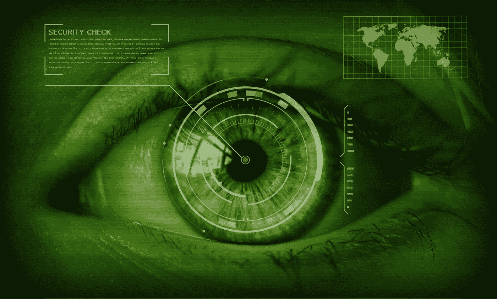
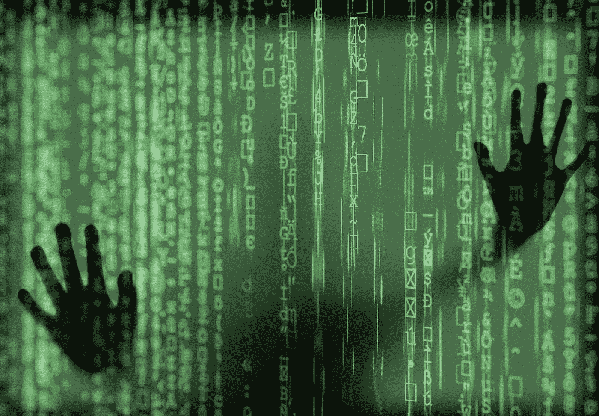

# 数据是新的石油

> 原文：<https://medium.datadriveninvestor.com/data-is-the-new-oil-8baf652b9811?source=collection_archive---------14----------------------->

## 数据就像信息时代的石油，拥有大量数据的公司成为未来全球市值最大的公司

Image by [Thomas Breher](https://pixabay.com/users/tbit-715211/?utm_source=link-attribution&utm_medium=referral&utm_campaign=image&utm_content=1163108) from [Pixabay](https://pixabay.com/?utm_source=link-attribution&utm_medium=referral&utm_campaign=image&utm_content=1163108)

# 介绍

数据就像信息时代的石油。在农业时代，土地是最重要的资产。政治斗争是为了控制土地，部落和国家之间的战争是为了争夺土地。在工业时代，机器、工厂等生产资料比土地更重要，国家之间的政治斗争、斗争都是为了控制生产资料。第二次工业革命后，石油成为最重要的资产。

政治斗争和国与国之间的斗争都是为了控制石油。但是，未来一个拥有大量数据的公司成为全球市值最大的公司，这是大势所趋。

此前，美国政府表示正在考虑限制蚂蚁集团和腾讯在美国的支付业务，理由是数据安全。

蚂蚁集团的 IPO 将筹集 345 亿美元，这一规模打破了 Saudi Aramco 去年 12 月在沙特证券交易所上市时创下的 290 亿美元的纪录。Saudi Aramco 沙特国家石油公司是世界上最大的石油公司。

其市值在上市两周内超越微软和苹果，成为全球最有价值的公司。今年 8 月，苹果以 1.86 万亿美元的市值超越它，重回“世界之巅”。

现在进入信息时代，数据成为最重要的资产，国家之间的政治斗争和斗争将围绕争夺数据展开。

当过多的数据集中在少数人手里，人类就会分裂成两个阶层，有数据的阶层和没有数据的阶层。当然也可以称为占有阶级和无产阶级，因为这个“财产”在不同的历史时期有不同的定义，是信息时代的数据。

# 数据战争:谁在使用我们的数据？

对数据的争夺已经开始。目前的领导者是脸书、谷歌、亚马逊等。，中国的同行是腾讯、百度、阿里巴巴。脸书和腾讯是社交平台的代表，谷歌和百度是搜索平台的代表，亚马逊和阿里巴巴是电子商务的代表。

[https://gph.is/2JBLrPo](https://gph.is/2JBLrPo)

社交平台为每个人提供了一个社交的场所。本质上，线上平台和线下平台没有区别。脸书和推特就像人民公园和茶馆一样，为每个人提供了一个社交的场所。人民公园以前有著名的英语角和股票角，现在有相亲角。人民公园收入场费，茶馆收茶钱，支付运营成本，赚取一定利润。然而，脸书和推特不收费。

> **那么他们靠什么来维持运营和利润呢？**

靠关注。与销售实物商品的商家不同，“注意力商家”销售的是注意力，他们为人们提供免费的场所、信息、娱乐、以及其他服务来获得人们的注意力，然后将这种注意力销售给其他人，也就是那些需要做广告的人，被称为广告主。

**这些公司被称为“注意力商家”，我们已经进入了所谓的“注意力经济”时代。**

社交平台和搜索平台的收入主要来自广告主，卖广告是他们的主业或者说销售关注度是他们的主业。你是他们的用户，但你不是他们的客户，而是他们的“商品”。

> **为什么会这样？**

因为你可以免费获得场地、信息、娱乐和其他服务。天下没有免费的午餐。你实际付出的是你的数据。他们免费为您提供服务，以换取获取和使用您数据的权利。

这是你注册登录时没时间看就打勾的合同的对价。

不过就算有时间看，估计也不会留下勾，因为不勾就无法使用这些服务。在信息时代，没有脸书和谷歌的生活是不可想象的。

**比如**，在工业时代，没有电、汽车、马车、蜡烛的生活是不可想象的。信息时代，做一个严格意义上的“摩门教徒”越来越难。

也许你愿意改变合约的对价，不是用数据换取社交平台和搜索平台的服务，而是用货币。不过目前没有这个选项，以后可能会有。

脸书 CEO 扎克伯格在 2018 年因“剑桥分析公司事件”在美国国会听证会上接受质询时表示，他不会拒绝付费产品的可能性。脸书可能会尝试在社交平台上支付的想法。

Image by [S. Hermann & F. Richter](https://pixabay.com/users/pixel2013-2364555/?utm_source=link-attribution&utm_medium=referral&utm_campaign=image&utm_content=4031973) from [Pixabay](https://pixabay.com/?utm_source=link-attribution&utm_medium=referral&utm_campaign=image&utm_content=4031973)

如果是这样的话，后面付费的用户的数据就不会被误用，不付费的用户就没有这样的待遇。一些视频应用程序现在可以做到这一点。

会员可以跳过广告，非会员不能跳过广告。广告完了就可以看内容了。广告越来越有针对性，所谓的精准营销也不过如此。

**在国内**，在一个微信群里讨论去西藏，马上就会贴出一个西藏旅游的广告。但是微信获取数据推送定向广告的这个功能是可以关闭的，只是隐藏的比较深，需要一段时间才能找到关闭的开关。

和社交平台一样，搜索平台的主要收入是广告。有时，他们甚至牺牲广告搜索的客观性和真实性。

如果你搜索一个疾病，首先弹出来的是各种医院提供的不是很正规的答案里包装成的广告。你必须训练在大量垃圾干扰信息中发现真实客观信息的能力。

这种“淘宝”能力，无论是购买商品还是信息，对于现阶段中国的生存都是非常必要和重要的。

交易平台和社交平台、搜索平台有些不同。收入主要是交易佣金，是卖家在平台达成的销售收入的一部分；第二是广告收入，第一焦点、海景房等大促期间的坑。

费用挺高的。第一个焦点和海景房是电商术语。它们被展示在平台上的不同位置，比如进入一个线下商场门口的横幅和堆头。

除了推广期，平时的各种广告推广费也是少不了的。

> **交易平台的广告部是一个重要的部门。**

他们用最先进的技术收集分析数据，设计广告组合，推荐给商家。阿里巴巴的广告部现在叫 Alimama，从单一的陶内电商营销平台升级为以阿里巴巴大数据为核心的全网营销平台。

现在双十一临近，商家都在买阿里妈妈的资源包，在淘宝和天猫甚至全网上露脸。

电商平台广告收入占比越来越大。或许有一天，电商平台不收商家平台使用费和佣金，依然可以赚钱。

因为商家必须打广告，否则无法生存。那时候交易平台和社交平台一样，卖关注度成了主业。

> **各大电商平台争夺数据的手段越来越激进**

据媒体报道，亚马逊最近推出了一项新计划，直接向消费者支付费用，以获取他们在亚马逊网站以外购买的产品信息以及对简短调查的回应。

这个名为“亚马逊购物者面板”的项目要求用户每月发送 10 张收据，用于在非亚马逊零售商购买商品，包括杂货店、百货商店、药店和电影院、主题公园和餐馆等。

娱乐场所。参与者可以获得 10 美元的奖励。此外，用户每月完成的每一项调查都可以获得额外的奖励。调查将询问参与者可能感兴趣的品牌和产品、他们购买产品的可能性以及他们对广告的看法等。

**除了社交平台**，搜索平台，交易平台，咨询公司，尤其是政治竞选咨询公司也在悄悄使用我们的数据。人们以前没有意识到这个问题的严重性。

**一名英国记者装扮成“潜在客户”参观该公司。**

暗访记录显示，该公司首席执行官亚历山大·尼克斯(Alexander Nix)介绍了他们如何利用个人数据来分析人们的偏好，做他们喜欢的事情，并锁定让人们对政治领导人产生好感并信任他们的信息。

操纵他们的情绪，控制他们手中的选票。他还介绍了另外两个示范项目，肯尼亚 2017 年总统选举和英国退出欧盟公投。该公司秘密参与了世界各国的 200 多次选举，并且总是成功。

这份暗访记录公开后，引起轩然大波。不可能有连任。剑桥分析公司(Cambridge Analytica)选民的个人信息来自脸书，是由一家与脸书合作的第三方公司泄露的。

美国国会对扎克伯格进行了为期两天的听证会，44 名国会议员每天拷问十多个小时。

2019 年 7 月，美国美国联邦贸易委员会(FTC)批准对脸书处以 50 亿美元的罚款，因为这家社交网站对用户的个人信息进行了不当处理。

> 这是美国联邦政府有史以来对一家科技公司开出的最高罚单

人是极其害怕仔细思考的。在数据时代，有些人利用自己的个人数据来分析和影响自己的偏好。我们的决定是自己做的，还是在不知不觉中成为了别人的傀儡？

[https://gph.is/g/Z5ngOrB](https://gph.is/g/Z5ngOrB)

# **没有自由意志，一切都只是算法**

我们现在正处于两次伟大革命的交汇点。一方面，生物学家正在揭开人体的奥秘，尤其是大脑和人类感知的奥秘。

另一方面，计算机科学赋予了人类前所未有的数据处理能力。

对人脑和人体工作方式的科学研究表明，人类的各种感情既不是人类精神所独有的，也不代表“自由意志”。

> **感觉是所有哺乳动物和鸟类都有的生化反应，用来快速计算存活和繁殖的概率。**

人类是万物中的灵长类，因为人类的算法是最先进的。

人的各种感觉，恐惧，愤怒，内疚，爱等等。其实都是大脑的生化机制算法，经历了几百万年的进化和打磨。

如果远古祖先的一种感觉犯了某种错误，塑造这种感觉的基因就不会遗传给下一代。所以，感情和情绪并不违背理性。

感觉和情绪是进化意义上的理性，是你无法感知的理性。

> 你可能会问，那么为什么大多数一见钟情的情侣会离婚呢？

其实这不能怪基因和进化。他们不知道婚姻。他们的目的是让你尽快找到一个近乎合适的人来繁衍后代。

所以爱情一般在认识 18 个月后就消失了。18 个月的时间刚好够谈恋爱、怀孕、生育、养育后代，直到后代理论上可以存活。

> 为什么我们没有意识到我们的感情其实是一种操作？

这是因为这些快速计算远远超过了我们意识的阈值范围。我们感受不到大脑中的数百万个神经元是如何计算生存和繁衍的可能性的，所以我们错误地认为我们对毒蘑菇的恐惧，我们对伴侣的选择，我们对欧盟的看法都是基于神秘的“自由意志”。

其实没有自由意志，一切都只是算法。当然，如果你把“自由意志”定义为一个算法，你也可以说有“自由意志”。

当人类破解了产生情绪和情感的生化机制算法，就可以操纵情绪和情感，所谓的直觉、灵感、灵性、自由意志，就不再是模糊的、难以捉摸的、神秘的东西。

**例如**，人们认为闪电和雷声是某种神秘现象，但后来才知道这只是一种放电现象。现在人们可以人工制造闪电，利用“特斯拉线圈”变压器的高频共振原理，制造出各种炫目的闪电现象。

“特斯拉线圈”使用变压器将普通电压升压至 50 万伏，然后通过两极线圈从放电终端放电。

如果我们知道愤怒的原理，我们可以随时让人生气。换句话说，如果我们知道人的各种感受和情绪产生的原理，我们就可以控制人的决策。

在对 Cambridge Analytica 的暗访记录中，一位高管说，给我们足够的数据，我们可以让任何人当选。

> 选举与理性无关。一切都是情感。只要你能操纵人们的情绪，你就能操纵他们的决定

当尼克松和肯尼迪竞选总统并在广播中讲话时，很明显尼克松比肯尼迪有更清晰的头脑，更严谨的逻辑，更精确的表达，而且后来的民调显示支持率更高。然而，当电视辩论，后来，支持率完全逆转。

肯尼迪的魅力征服了所有女性选民和大部分男性选民，剩下的男性选民，肯尼迪的妻子杰奎琳帮他争取过来。尼克松的政治纲领再高明、再清晰，也无济于事。

肯尼迪和尼克松之间的辩论是历史上第一次总统候选人电视辩论。可以说，尼克松是被电视的发明打败的。政治评论家说，如果林肯在电视时代参选，绝对没有希望当选总统。

Photo by [Science in HD](https://unsplash.com/@scienceinhd?utm_source=unsplash&utm_medium=referral&utm_content=creditCopyText) on [Unsplash](https://unsplash.com/s/photos/john-f-kennedy?utm_source=unsplash&utm_medium=referral&utm_content=creditCopyText)

# **当算法比我们更了解我们的时候**

假设有一天，我们可以问脸书、谷歌、亚马逊，根据你对我的所有了解，哪个品牌的汽车是我的最佳选择？他们根据我的社交评论、搜索记录、购物记录分析了我的喜好，然后告诉我那是一辆特斯拉。那么汽车广告就没用了。

**算法比我们自己更了解我们**并代表我们做出更符合我们需求的购买决策。那时，理论上，脸书、谷歌和亚马逊可以跳过广告商，直接向消费者推荐产品和服务。

他们自己就是最大的广告商。他们目前的商业模式是将注意力卖给广告商，然后广告商通过销售产品和服务将注意力货币化；而在未来，他们可以直接将注意力货币化。

**在更遥远的未来**，也许生物传感器会被植入我们的大脑和身体，无时无刻不在向智能机器传输关于我们的所有数据。拥有数据和计算能力的公司和政府会更容易理解你，操纵你，替你做决定。

历史上，政治家依赖于理解和操纵人类情绪和生化机制的能力。这是他们动员大众的武器。

他们发表引起人们恐惧和仇恨的演讲，一些人把犹太人送进集中营。他们发推特来唤起人们的恐惧和仇恨，有些人走上街头殴打其他种族的人。人民的情绪是政治人物的玩具。他们触动了人们的情感。人们像留声机一样唱歌，像木偶一样跳舞。

> **现在有了数据和计算能力，政治家理解和操纵人类情绪和生化机制的能力增加了无数倍**

人们无处可逃。以前如果对政客不满，只要控制好自己的言行，不表露出来，危险总是可控的。然而，当你的大脑被植入芯片时，你的思想就完全暴露了。

你看到一个政客的口号。虽然没有厌恶或愤怒的表情，但你的心跳在加快，血压升高，肾上腺激素分泌激增。数据传到秘密警察那里，他们就知道你真正认真想的是什么了。

*你的大脑芯片会背叛你。*

政府的监控还没到这种程度，但已经相当厉害了尤其是外部的监控。

Photo by [Franki Chamaki](https://unsplash.com/@franki?utm_source=unsplash&utm_medium=referral&utm_content=creditCopyText) on [Unsplash](https://unsplash.com/s/photos/data?utm_source=unsplash&utm_medium=referral&utm_content=creditCopyText)

## 结论

数据归属问题可能是这个时代最重要的政治问题，得数据者得天下。关于我们的数据属于我们吗？还是给我们提供服务的公司？还是政府？还是全人类？

不知道这个世界统一的乌托邦会不会到来？就算来了，也是遥远的未来。在此之前，个人、公司、政府、国家在潜在数据拥有者之间对于数据的冲突还会继续。个人和公司，个人和政府，公司和政府，政府和政府，政府和国家。

未来国与国之间的数据战争将是最重要的。如果这场战争处理不好，变成一场真正的战争，那么世界统一就会一起完蛋。