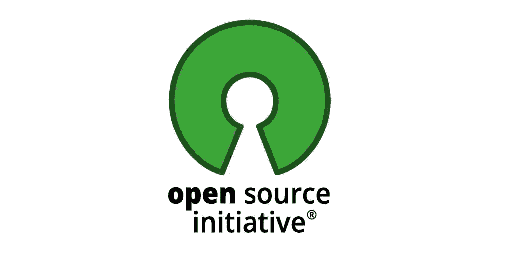

# 数据新闻速成班#4:开源社区

> 原文：<https://medium.datadriveninvestor.com/data-journalism-crash-course-4-open-source-communities-857cbf504b36?source=collection_archive---------30----------------------->

Image by the author

共同创造，合作，分享，社区。这些单词有什么共同点？本质。这些术语都植根于合作、互助和为共同目标而共同努力。

根据这些原则的应用，结果可能是高效的和高利润的——如果不是财务上的，至少是更好地利用时间和人力资源。

对于那些从事数字开发的人来说，最受鼓励的合作形式是开源软件，也称为 FOSS，是自由和开源软件的缩写。

开放项目对于任何想要从其他人那里获得协作、从分析真实项目中学习或者用真正的智能工艺“弄脏自己的手”的人来说都是非常棒的。

开源是一个名副其实的术语。这涉及到软件的源代码，它可以适应不同的目的。这个术语是由 OSI ( [开源倡议](https://opensource.org/))从本质上的技术角度创造的。

[Open Source Initiative](https://opensource.org/)

由于没有许可证成本，开源软件提供了在服务和培训方面加大投资的机会，确保了更大更好的 it 投资回报。在绝大多数情况下，这些工具由开发人员在线共享，任何人都可以不受任何限制地访问它们。

“开源”一词是由 Eric Raymond 和其他 OSI 创始人开发的，目的是以更商业化的方式向公司提供自由软件，避免道德和权利的争论。

术语“开放源码”出现在 1998 年 2 月举行的一次会议上，在一次辩论中，一些名人后来成为该主题的参考。例子包括托德·安德森、克里斯·彼得森、拉里·奥古斯丁、乔恩·马多格、萨姆·奥克曼和埃里克·雷蒙德。

FLOSS 的首字母缩写，意思是自由/ Libre 和开源软件，是一种使用自由软件和开源概念来支持同一软件的聚合方式，因为正如前面提到的，两者只是在论证上有所不同。

开源概念的开发者和支持者说，这不是反资本主义运动，而是软件行业市场的一种替代方案。这种出现在开源中的合作模式导致作者的权利被以另一种方式看待。

开放源码开发实验室(OSDL)的创建是 IBM、戴尔、英特尔和惠普等几家公司为开发开放源码技术所做的巨大努力的一个例子。

OSI 为被视为开源的软件规定了 10 个要点:

1.  **免费分发**
    计划许可不得以任何方式限制通过销售甚至交换的自由访问。
2.  **源代码**
    至关重要的是，软件必须包含源代码，该源代码还必须允许以编译后的形式发布。如果程序没有随其源代码一起发布，开发者必须提供获取源代码的方法。源代码必须对任何开发人员都是可读和可理解的。
3.  **衍生作品**
    软件许可证必须提供修改许可，以及衍生作品。您还必须允许在与原始许可证相同的条款下分发它们，即使在修改之后。
4.  **源代码作者的完整性**但是，许可证可能要求派生程序具有不同于原始程序的名称或版本号。这将取决于代码开发人员的偏好。
5.  不歧视任何人或群体
    许可证必须对任何群体和任何个人开放。
6.  **不歧视活动领域**
    许可证必须允许任何特定部门的任何人使用程序。例如，它不应该阻止一个公司使用它的代码。
7.  **许可证的分发**
    与软件相关的权利必须适用于其程序被重新分发的所有人，无需为这些部分执行新的许可证或额外的许可证。
8.  **非产品特定许可**
    程序不是另一个软件的一部分，要使用它，必须分发整个程序。如果程序是从该发行版中提取出来的，有必要确保所有各方都是可用的，并重新分发给每一个人，因为每个人都拥有与原始程序发行版中保证的权利相同的权利。
9.  **许可证不应限制其他程序**
    如果许可证对与许可程序一起分发的其他程序加以限制，则该许可证不被视为开放源代码。
10.  **技术中立许可**
    该许可必须允许不受限制地采用接口、风格和技术。这意味着许可证中的任何条款都不能为应用于程序的上述要求建立规则。

 [## 一瞬间学会数据科学！？数据驱动的投资者

### 在我之前的职业生涯中，我是一名训练有素的古典钢琴家。还记得那些声称你可以…

www.datadriveninvestor.com](https://www.datadriveninvestor.com/2020/07/23/learn-data-science-in-a-flash/) 

## 开源社区的例子

*   [GitHub](https://github.com/)
*   [SourceForge](http://sourceforge.net/people/)
*   [Gimp](https://www.gimp.org/)
*   [谷歌代码](http://code.google.com/hosting/)
*   [比特桶](https://bitbucket.org/)
*   [代码复用](http://www.codeplex.com/)
*   [代码 52](http://code52.org/)
*   [游戏开发](http://www.gamedev.net/classifieds)
*   [打开舱口](http://openhatch.org/)
*   [铬项目](https://www.chromium.org/)
*   [阿帕奇软件基金会](http://www.apache.org/)
*   [Drupal](http://drupal.org/)
*   [侏儒](https://www.gnome.org/)
*   [Ubuntu](https://ubuntu.com/)
*   [Moodle](http://www.moodle.org/)
*   [Mozilla 开发者网络](https://developer.mozilla.org/en-US/mozilla)
*   [Wordpress](https://wordpress.org/about/)

# 知识共享

Creative Commons Reel video

Creative Commons (CC)是一个非盈利实体，旨在为版权作品的使用提供更大的灵活性。这个想法是让作者/创作者有可能允许第三方更广泛地使用他们的材料，而不会违反知识产权保护法。

有了创作共用许可证，作曲家可以允许其他艺术家使用他的一些作品，例如，通过创作节奏的混合；作者可以提供一篇文章，并允许其他作者使用它，无论是通过在其他媒体上发表，还是通过在新的文本中应用部分内容，或者使用原文，但无论如何都要进行更改。

多亏了互联网，这种“协作精神”变得更加强大。问题是，版权保护法非常严格，往往最终会阻碍许多创作者的愿望，他们不仅会放弃自己的材料，还会使用其他人的作品，这些人也希望分享他们的作品。

有了知识共享，作者和创作者可以更灵活地使用他们的作品。他们可以决定第三方如何以及在什么条件下使用他们的材料。举个例子:作者可以允许任何人使用和修改他自己的文本，除非是在商业应用中。注意，在这种情况下，知识共享许可给予了作品更多的使用自由，但并没有消除原作者产生收入的可能性:他可以在营利性活动的情况下对文本的使用进行收费。

# 维基百科（开放式百科全书）

大约 20 年前，一种谨慎而谦逊的传播和贡献知识的方式出现在互联网上。在维基媒体基金会的支持下，维基百科诞生了，今天有超过**5400 万篇文章，使用 309 种语言**，由世界各地的志愿者合作者撰写。几乎所有的文章都可以被那些希望投稿的人编辑，引用来源和参考资料来丰富信息。

吉米·多纳尔·威尔士和拉里·桑格是该项目的创造者，该项目于 2001 年 1 月 15 日公开。维基百科的名字来源于对夏威夷词 ***维基*** (意思是快速、轻便)和英国术语 ***百科全书*** 的融合。

因为它是一个开放的百科全书，许多用户和互联网用户质疑文章的写作质量，虚拟破坏率，以及信息的准确性。维基百科数据库中的许多文章包含未经核实或不一致的信息；然而，任何认真对待数字百科全书并为其做出贡献的人都有其优点:《自然》杂志在 2005 年比较的科学文章几乎达到了与 ***布列塔尼百科全书*** 相同的精确度。

维基百科在学术界通常被视为不充分信息的来源。学者们指出，由于“编辑战争”，它陷入了困境。在编辑战争中，投稿人努力维护自己的文本，同时压制其他人的文本，尽管他们承认作品中有很大的兴趣和原创性。

然而，国际文献似乎倾向于他们的结论，即维基百科的成功表明，自组织的社区可以构建高质量的信息产品。维基百科的分析越来越详细和批判，没有简单的赞扬或拒绝的余地。

维基百科不仅是一个在线百科全书，也是一种公益，一个公共资源。它的质量和维持依赖于认知盈余，即在受教育者的空闲时间。它被认为是网络上最成功的合作项目之一，建立在数百万贡献者和读者的信任基础上，由促进可靠性和客观性的标准支持。

# 如果你想知道更多

关于。在:维基百科。免费百科全书。佛罗里达:维基媒体基金会，3 月 19 日。2017.[https://en.wikipedia.org/wiki/Wikipedia:About](https://en.wikipedia.org/wiki/Wikipedia:About)

**艾巴尔，e .等人** *大学里的维基百科:教职员工对它的看法和做法。电子图书馆*，第 33 卷，第 4 期，第 668–683 页，2015 年。

**Brasseur *，* VM (Vicky)** 。*用开源打造你的未来:培养你的技能。建立你的人际网络。构建技术的未来。*务实书架. 2018

**DALIP，D. H. et al.** *用于评估 web 2.0 上协作创建内容质量的通用多视图框架。信息科学与技术协会学报*，第 68 卷，第 2 期，第 286–308 页，2017 年。

**赫斯特，科尼利厄斯/ Ehls，丹尼尔。** *开源创新:现象、参与者行为、商业含义。*劳特利奇。2018

 [## 数据新闻速成班#5:高级数据搜索——谷歌

### 谷歌不局限于搜索引擎，搜索引擎也不局限于简单的搜索。许多用户不…

medium.com](https://medium.com/datadriveninvestor/data-journalism-crash-course-5-advanced-data-search-google-3e2a40a2ac52)  [## 数据新闻速成班#3:数据管理

### 因为有大量的可用信息，所以必须非常小心地确保…

medium.com](https://medium.com/datadriveninvestor/data-journalism-crash-course-3-data-curation-bb14726033c)  [## 数据新闻速成班#2:开放数据

### 随着访问公共数据的演变和政府的更大透明度，今天的媒体专业人士…

medium.com](https://medium.com/datadriveninvestor/data-journalism-crash-course-2-open-data-f02c2a9108d6)  [## 数据新闻速成班#1:概念

### 从本质上说，数据新闻是一种利用数字信息和元素生产新闻的方法

medium.com](https://medium.com/datadriveninvestor/data-journalism-crash-course-1-concepts-c8a9bdf62fd) 

## 获得专家观点— [订阅 DDI 英特尔](https://datadriveninvestor.com/ddi-intel)