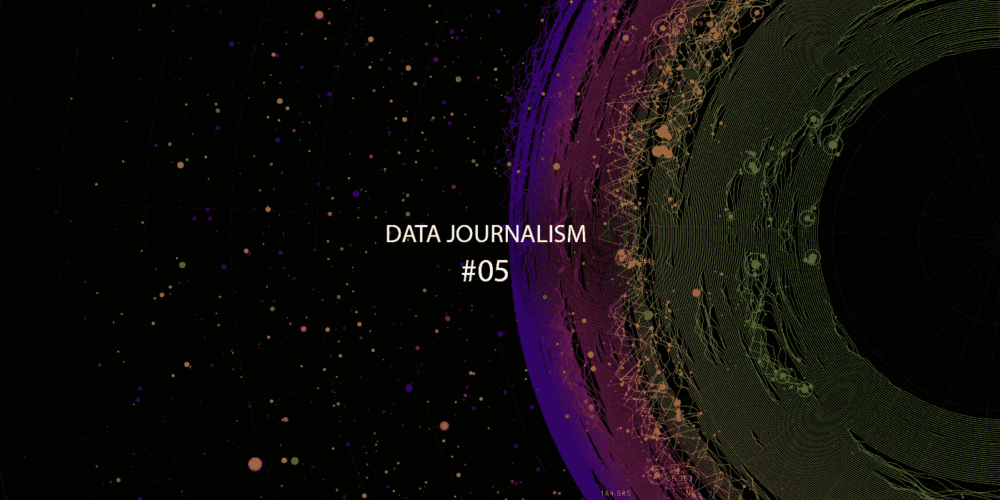
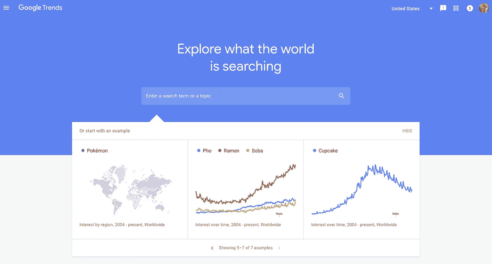
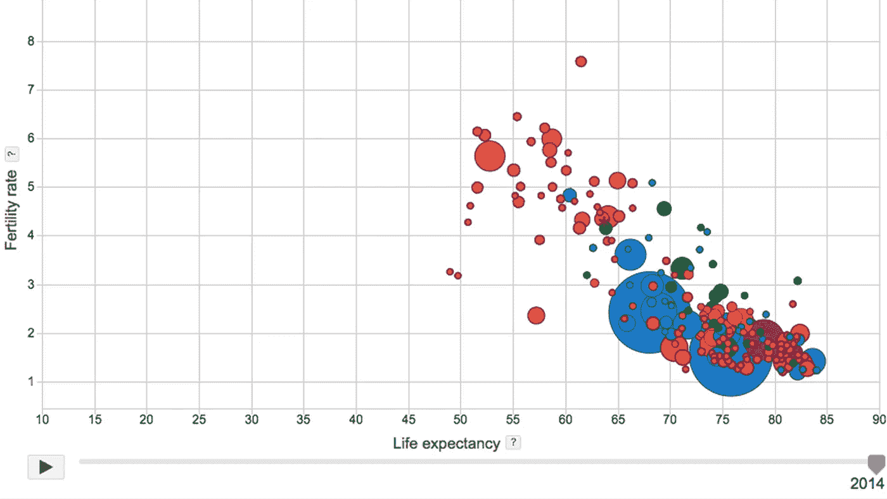
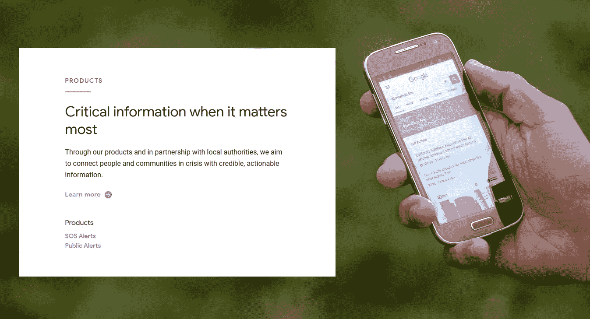
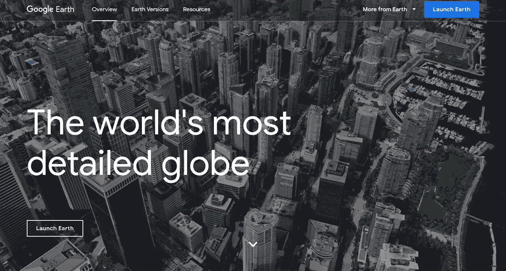
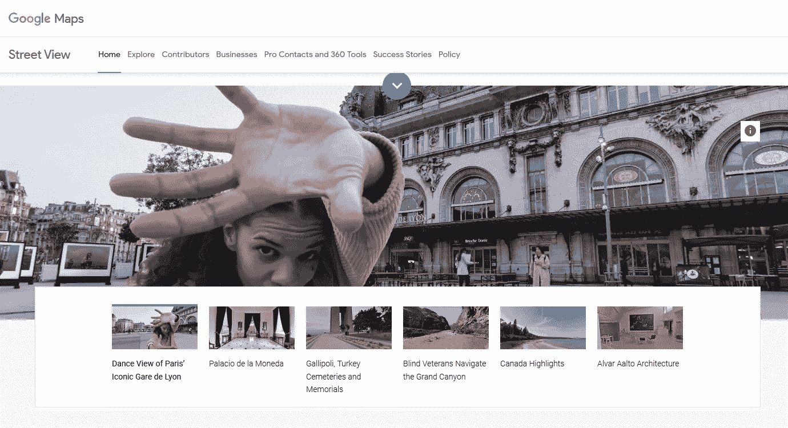

# 数据新闻速成班#5:高级数据搜索——谷歌

> 原文：<https://medium.datadriveninvestor.com/data-journalism-crash-course-5-advanced-data-search-google-3e2a40a2ac52?source=collection_archive---------13----------------------->

Image by the author

谷歌不局限于搜索引擎，搜索引擎也不局限于简单的搜索。许多用户没有充分利用谷歌应用程序的潜力，对于记者来说，知道如何使用它们尤为重要。

## 搜索过滤器

在简单的谷歌搜索中，你可以根据国家、语言、出版日期和城市过滤结果。也可以选择显示所有可用的结果，或者只显示以前访问过的页面、未访问过的页面和文字结果。此操作可以显示与键入的词语完全相同的页面，所有词语都在一起，并且顺序相同。

# 高级搜索和搜索运算符

谷歌搜索引擎有搜索操作符，可以高效实用地优化你的搜索。以下是一些例子:

## 搜索精确的单词或短语

**使用引号:***每个想法都需要一个媒介*“只显示准确包含这句话的结果，不显示包含在页面上不同点使用的四个单词的结果。

## 删除一个单词

**添加一个负号** **(-): idea -medium** 显示的是除了 medium 以外的产品。

## 在单个网站或域上搜索

通过**站点搜索:medium.com**只显示中型站点上的页面结果。

## 搜索文件

按**文件类型搜索:xls** 仅显示 xls 格式电子表格中包含的结果。

## 相关网站

搜索**相关:medium.com**显示了 Vice 本身的其他网站，以及一些与她所处理的主题相关的网站。
Related 不仅仅适用于网站。您也可以搜索术语，并找到讨论您感兴趣的主题的其他网站。

## 正文中的术语

忘记**文章的标题:**有了这个搜索，无论网站的主题是什么，谷歌都会把搜索的重点放在内容的“内部”。
**为此，键入 intext:** 并在冒号后键入关键字，如下例:
**intext:面向初学者的大数据**

## 单页标题中的术语

搜索**标题:medium** 仅显示标题中包含的结果。这是一个简单的方法，可以在制作你自己的文章之前，快速找到互联网上已经存在的内容，或者分析与你的文章相同主题的竞争内容。

查看所有谷歌搜索[**的招数这里**](https://support.google.com/websearch/answer/134479?hl=en) 。有些可以使用 [**谷歌的高级搜索**](https://www.google.com/advanced_search) 来完成，不需要记忆操作符或者查阅 [**帮助页面**](https://support.google.com/websearch/answer/134479?hl=en) 。

# 搜索图像

Google Image Search — Image by the author

谷歌的图片搜索可以根据图片尺寸、颜色、类型(例如图画或照片)和出版日期过滤结果。当选择一个结果时，用户可以选择访问图像源网站并获得关于它的更多信息。

您也可以使用图像作为搜索词。当上传一张图片到 Google Images 时，返回的结果会给出图片名称、包含该图片的页面、相似图片以及具有其他维度的相同图片的建议。唯一的条件是，图像已经存在于一个网站上。可以在发送的图像旁边添加一个关键字，使搜索更容易。搜索操作符也处理这种搜索。

要将图片上传到 Google Images，只需点击搜索框内的照片摄像头图标，然后从您的计算机上传图片或在线粘贴照片的地址。

## [谷歌趋势](https://trends.google.com)

Google Trends — Image by Google

Google Trends 允许您评估一个术语在一段时间内的受欢迎程度，并将其与其他术语的受欢迎程度进行比较，您还可以按国家、日期、类别和 Google 产品(例如图片或 YouTube)过滤结果。

此外，Google Trends 还会突出显示某一特定时期在 Google 上搜索的热门词汇。

## [谷歌公开数据](http://www.google.com.br/publicdata/directory)

Google Public Data — Image by Google

鲜为人知的谷歌公共数据以图表的形式呈现了来自世界银行和欧盟统计局等大型机构数据库的重要统计数据。可以使用应用程序提供的各种过滤器来比较和分析这些信息。

## [谷歌危机应对](https://crisisresponse.google/)

Google Crisis Response — Image by Google

这是一项收集根据灾害情况数据制作的地图的举措，使信息更容易获取。

## [谷歌地球](https://www.google.com/intl/en_us/earth/)

Google Earth — Image by Google

谷歌地球是谷歌最著名的工具之一，拥有三维动画卫星图像。这项功能最终创造了比谷歌地图更具互动性的体验，尤其是在付费版本谷歌地球专业版中。

卫星需要大约 14 天拍摄整个地球的照片。

## [谷歌街景](https://www.google.com.br/intl/en/streetview/)

Google Street View — Image by Google

谷歌街景提供水平 360 度全景和垂直 290 度全景。谷歌地图和谷歌地球的这一功能自 2007 年 8 月就已推出。

当一个位置发生重大变化时，街景通常用于“之前和之后”的情况。

自 2012 年以来，谷歌还使用了 Trekker，这是一种带有 360 度摄像头的高科技背包。有了这种设备，就有可能获得汽车无法到达的地方的图像，比如博物馆、难以进入的主题公园甚至墓地。

通过一个 Trekker 贷款项目，2013 年，志愿者能够开始与街景图像合作。相机是借来的，这样每个人都可以收集他们熟悉的地方的 360 度图像。目前，任何人都可以帮助谷歌街景，无论是普通照片还是智能手机拍摄的全景照片。

通过使用 Trekker，谷歌能够注册以前不被认为是地图的地方。从世界各地的墓地，到拉丁美洲的博物馆，穿过大峡谷，穿过亚马逊雨林，穿过沙漠，直到海底。通过街景，你还可以“参观”著名的电影场景、白宫、潜艇甚至欧洲核子研究中心。该功能允许任何人足不出户就能体验地球上著名的地方。

# 如果你想知道更多

*   【50Minutes.com】T2。 *谷歌，让信息无障碍:改变世界的搜索引擎。*50Minutes.com。2017.
*   佩蒂特，迈克尔/希利斯，肯/贾勒特，凯莉*。* *谷歌与搜索文化。*劳特利奇。2013.
*   **康威·理查德。** *如何登顶谷歌搜索:实用 SEO 指南。新西兰兰登书屋。2019*

 [## 数据新闻速成班#4:开源社区

### 共同创造，合作，分享，社区。这些单词有什么共同点？本质。这些术语中的每一个都是…

medium.com](https://medium.com/datadriveninvestor/data-journalism-crash-course-4-open-source-communities-857cbf504b36)  [## 数据新闻速成班#3:数据管理

### 因为有大量的可用信息，所以必须非常小心地确保…

medium.com](https://medium.com/datadriveninvestor/data-journalism-crash-course-3-data-curation-bb14726033c)  [## 数据新闻速成班#2:开放数据

### 随着访问公共数据的演变和政府的更大透明度，今天的媒体专业人士…

medium.com](https://medium.com/datadriveninvestor/data-journalism-crash-course-2-open-data-f02c2a9108d6)  [## 数据新闻速成班#1:概念

### 从本质上说，数据新闻是一种利用数字信息和元素生产新闻的方法

medium.com](https://medium.com/datadriveninvestor/data-journalism-crash-course-1-concepts-c8a9bdf62fd)