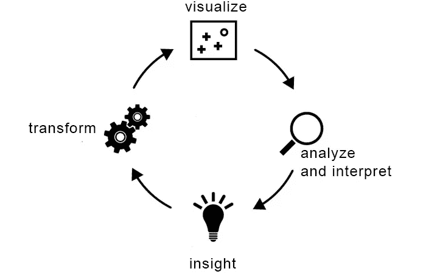
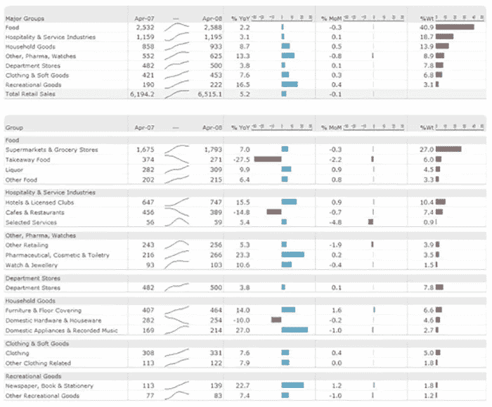
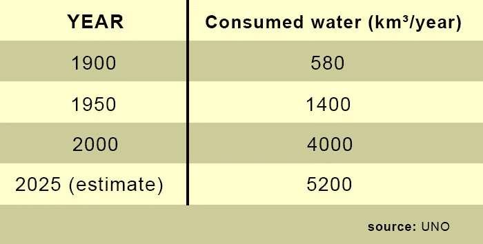
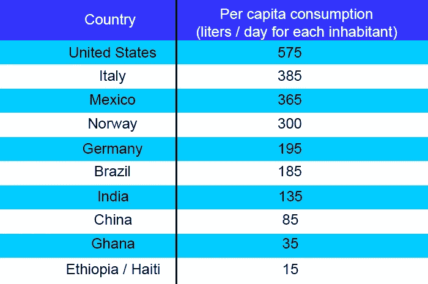

# 数据新闻速成班#6:结构化数据库

> 原文：<https://medium.datadriveninvestor.com/data-journalism-crash-course-6-structured-databases-eea1eca93715?source=collection_archive---------12----------------------->

Image by the author

存储在硬盘或云中的数据本身、位和字节是不可见的。为了评估它们并从中发现意义，我们必须首先将它们形象化。在本文中，我们将采用术语可视化的广义解释，它甚至包括数据的纯文本表示。例如，您在电子表格程序中打开数据集这一简单事实可以被视为数据可视化。因此，看不见的东西在你的屏幕上变成了一个“图形”。问题不应该是内容创建者是否需要可视化数据，而是在每种情况下什么类型的可视化最有用。

换句话说:什么时候值得超越在表格中查看？答案很简单:几乎总是如此。表格不足以给出数据集的概述。而且，单独来看，它们不能让你立即识别模式。最常见的例子是地理模式，只有在查看地图上的数据后才能注意到这一点。但也有其他类型的模式，我们稍后会谈到它们。

# 有洞察力

仅仅基于数据，期望使用可视化技术和工具产生一系列**现成报告是不现实的。没有规则或任何“协议”来保证议程。相反，我认为在数据中寻找想法更有意义，在优秀的内容创作者手中，可以熟练地工作。**

**每一种不同的观点都有可能为评估数据提供见解。**这些见解中的一些甚至可能是已知的(但也许不会付诸实践)，而另一些将被证明是令人惊讶的。它们可能是议程的开始，也可能只是数据错误的结果。在这种情况下，通过数据可视化技术很容易发现问题。

下面描述的过程(以及本节的其余部分)对于提高创意发现的效率非常有用。

# 可视化数据

可视化为数据集提供了独特的视角。你可以通过几种方式达到它。

当您处理相对少量的数据时，表非常有用。电子表格以一种有组织和结构化的方式显示维度和值，如果与信息的选择和过滤相结合，将具有巨大的潜力。此外，美国统计学家和爱德华·塔夫特教授建议在表格的列中包含小图形——例如，每行一个条形或一个小折线图(后来被称为迷你图)。然而，这些表格有其局限性。它们适用于将一维异常显示为前 10 名，但对于多维比较(例如，一段时间内各个国家的人口)来说用处不大

通常，图形允许您用几何形状映射数据维度。关于这些功能的有效性已经写了很多:颜色很难理解，位置就是一切。例如，在散点图中，两个维度映射在 x 和 y 轴上。您甚至可以使用显示的符号的颜色或大小来显示第三维。折线图特别适合随着时间的推移而演变，而条形图非常适合按类别比较数据。仍然可以堆叠图表元素，将它们放置在彼此之上。如果您想要比较少量的数据组，在同一个图表上显示多个示例非常有用。在所有图表中，您可以使用不同的刻度来探索数据的各个方面(例如，线性或对数刻度)。

我们处理的大多数数据在某种程度上都与人有关。例如，地图的力量是将信息与现实世界重新联系起来。想象一组关于犯罪的地理定位数据。本质上，我们想看到的是这些犯罪发生的地方。地图还可以揭示与相关信息的地理关系(例如:从北到南或从城市到农村的趋势)。

Source: [Peterson-KFF Health System Tracker](https://zephyrnet.com/interactive-maps-highlight-urban-rural-differences-in-hospital-bed-capacity/)

# 分析和解释你所看到的

将数据可视化后，下一步是从创建的图像中学习一些东西。你可能会问自己:

*   在那里我能看到什么？这是我所期望的吗？
*   **有没有一个有趣的模式？**
*   **这在数据的上下文中是什么意思？**

您可能会选择一种可视化类型，虽然它很漂亮，但对您的数据没有任何意义。但是从任何视觉化中总有一些东西可以学习，即使是微不足道的。

Table with data on the growth of water consumption in the world

Comparative index between some countries of daily water consumption per capita (source: UNO)

# 记录你的步骤和想法

如果你认为这个过程是一个数据集之旅，那么文档就扮演了日志的角色。它会告诉你你去了哪里，你看到了什么，以及你是如何决定下一步的。您甚至可以在第一次查看数据之前就开始制作文档。

在大多数情况下，当你开始处理一个数据集时，你充满了期望和假设。这是因为，一般来说，对信息的兴趣是有理由的。在这种情况下，一个好主意是通过写下这些想法来开始文档过程。这有助于确定我们的重点，并减少在搜索和找到我们所期望的东西时产生误解的风险。

记录是流程中最重要的部分，也是最容易被忽略的步骤之一。正如您将在下面的示例中看到的，所描述的过程涉及大量的数据操作和表示。看着自己创建的一组 15 个图表会非常困惑，尤其是过了一段时间之后。这些图表只有在它们产生的背景下才是有价值的(对你或任何与你分享你的发现的人)。因此，你应该花点时间记下以下方面:

*   **我为什么要创建这个图表？**
*   **我对创造它的数据做了什么？**
*   这张图表告诉了我什么？

# 转换数据

自然地，有了从你上一次想象中获得的想法，你就能知道你下一步想要寻找什么。可视化可以让您更详细地分析数据集，并找到感兴趣的信息。

可能的转换有:

*   **缩放:**在预览中观察某些细节
*   **拥挤:**将多个指标组合成一个组
*   **过滤:**(暂时)移除不是主要焦点的指标
*   **剔除异常变量:**剔除一些不能代表 99%数据集的点。

让我们假设您可视化了一个图，出现的只是一堆跨越数百条线连接的节点(这是可视化中非常常见的结果，称为“*密集连接的网络*”)。在这种情况下，常见的转换是过滤一些行。例如，如果它们代表了从捐助国到受援国的现金流量，我们可以剔除低于一定金额的所有流量。

 [## 数据新闻速成班#5:高级数据搜索——谷歌

### 谷歌不局限于搜索引擎，搜索引擎也不局限于简单的搜索。许多用户不…

medium.com](https://medium.com/datadriveninvestor/data-journalism-crash-course-5-advanced-data-search-google-3e2a40a2ac52)  [## 数据新闻速成班#4:开源社区

### 共同创造，合作，分享，社区。这些单词有什么共同点？本质。这些术语中的每一个都是…

medium.com](https://medium.com/datadriveninvestor/data-journalism-crash-course-4-open-source-communities-857cbf504b36)  [## 数据新闻速成班#3:数据管理

### 因为有大量的可用信息，所以必须非常小心地确保…

medium.com](https://medium.com/datadriveninvestor/data-journalism-crash-course-3-data-curation-bb14726033c)  [## 数据新闻速成班#2:开放数据

### 随着访问公共数据的演变和政府的更大透明度，今天的媒体专业人士…

medium.com](https://medium.com/datadriveninvestor/data-journalism-crash-course-2-open-data-f02c2a9108d6)  [## 数据新闻速成班#1:概念

### 从本质上说，数据新闻是一种利用数字信息和元素生产新闻的方法

medium.com](https://medium.com/datadriveninvestor/data-journalism-crash-course-1-concepts-c8a9bdf62fd)