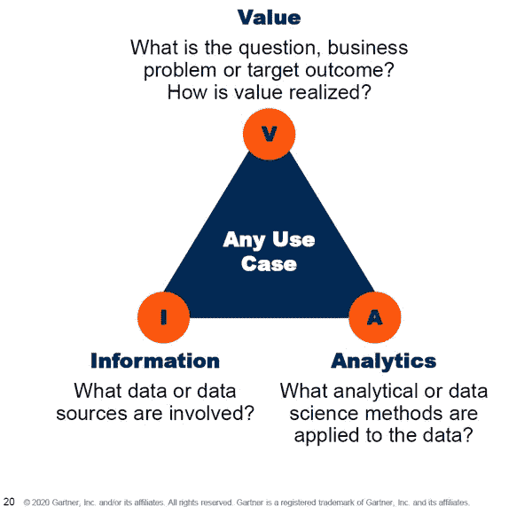
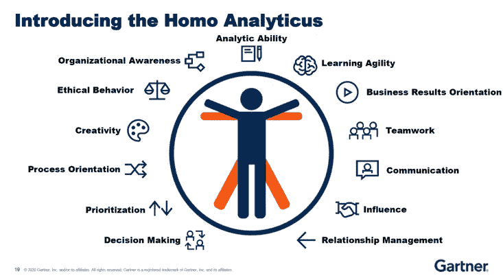

# 数据素养、Homo Analyticus、VIA 等:我从 Gartner Data & Analytics 2020 中获得的最大收获

> 原文：<https://medium.datadriveninvestor.com/data-literacy-homo-analyticus-via-and-more-my-top-takeaways-from-gartner-data-analytics-2020-79b303609fc4?source=collection_archive---------4----------------------->

我参加了上周在悉尼举行的 Gartner 数据和分析峰会 2020。该活动在美丽的国际会议中心举行，约有 1300 名来自各行各业的人士参加，演讲者来自世界各地。以下是我从这次活动中总结的几点。

**1。****(CDO)首席数据官的角色**

主旨促使我们重新思考 CDO 的定义。我们应该将首席数据官视为首席**破坏**官、首席**多样性**官、首席**设计**官和首席**决策**官。网飞欢迎分裂和破坏的例子引起了我的注意。网飞使用一款名为 Chaos Monkey 的软件来测试其云平台的弹性和可恢复性。该软件通过关闭一个或多个虚拟机来模拟云中运行的服务的故障。通过监控这些故障和中断，网飞可以防止这些在现实生活中发生，并提供更好的客户体验。

**2。** **数据素养是组织面临的一大挑战**

Gartner 将数据素养定义为在上下文中读取、写入和交流数据的能力，包括对数据源和结构、所应用的分析方法和技术的理解，以及描述用例应用和最终价值的能力。

通俗地说，就是说，你会‘说’数据吗？

组织中数据素养差的一些例子可能是这样的:

谈论信息是“我们最大的公司资产”或“新的石油”,而不将其视为企业资产

挑选数据来证明已经采取的决策是正确的，而不是检查数据来告知应该采取什么决策

要求提交报告，因为“这是我们一贯的做法”

个人和部门囤积数据，他们没有意识到自己限制了他人使用数据的价值。不将信息视为企业资产

 [## 为什么数据会改变投资管理

### 有人称之为“新石油”虽然它与黑金没有什么相似之处，但它的不断商品化…

www.datadriveninvestor.com](https://www.datadriveninvestor.com/2019/01/25/why-data-will-transform-investment-management/) 

专注于事后分析和“漂亮的饼图”,而不是高价值的诊断、预测和说明性分析

组织中良好数据素养的一些示例可能是这样的:

政策基于数据，而不是教条或信仰。政治家和高管团队轻松地“说出数据”，并对行为进行建模。人们经常听到“数据说明了什么”这句话

数据不被视为副产品。报告和分析不是事后的想法

数据可视化和讲故事技术是常用的

输入数据的人明白为什么数据质量很重要

数据隐私、安全、道德、偏见和风险的本质

**3。** **价值、信息和分析(VIA)模型**

通常(不总是)组织从分析程序开始，寻找数据来支持程序，然后想知道所有这些努力的价值是什么。Gartner 要求我们在考虑任何问题或使用案例时使用 VIA 模型。

**从价值开始:**问题、业务问题或目标结果是什么？价值是如何实现的？你有没有花足够的时间去问为什么？

**找资料:**回答问题需要哪些数据或数据源。他们躺在哪里？它们容易接近吗？要获得信息需要做些什么，我们需要和谁谈？

**引入分析:**我们需要什么平台来接收所有数据？对数据应用了哪些分析或数据科学方法？

**4。** **分析人**

我被介绍给了分析人(Homo analytic us)——数据驱动的决策者:-)

那么，是什么造就了分析人？

三样东西:知识、技能和心态。我们来细说一下。

***知识:我知道怎么做。***

**分析能力:**能与数据一起工作，识别模式；运用判断形成挑战传统智慧的结论

**学习敏捷:**快速获取新知识，学习新技能；利用经验有效地处理歧义

**业务结果导向:**了解业务需求；提供高效和高质量的结果

团队合作:促进和推动同事之间的协调与合作

***技能:我能行***

**沟通**:以易于理解和操作的方式向不同的受众传达信息

**影响力:**在一个矩阵型组织中，主张观点并说服他人获得支持

**关系管理:**与内部和外部利益相关者快速建立关系和信任

**决策制定:**考虑潜在行动的相对成本和收益，以选择最合适的行动

优先化:通过目标设定、时间管理和计划自我指导工作

***心态:我要做***

**创意:**运用原创思维产生新的想法或产品；质疑假设并想象未来的可能性

**流程导向:**遵循指示；设计实践、政策、程序和系统以简化工作和有效利用资源

**道德行为:**考虑并公开讨论组织工作、产品和决策的道德含义，以劝阻不道德的行为

**组织意识:**理解并按照组织的使命、价值观、运营、结构和目标开展工作

**5。** **一些让我思考的名言**

“每个人都有数据，每个人都有分析工具。问对问题你就赢了。你赢在对答案反应最快”

“很快，你个人设备会比你的家人更了解你”

“数据越多不一定越好，正确的数据越好”

“信任是你的新产品。你如何在你的产品设计中建立信任？

不要害怕失败，因为失败是学习的第一次尝试

“商业中最昂贵的七个词——我们一直都是这样做的”

感谢您的阅读。