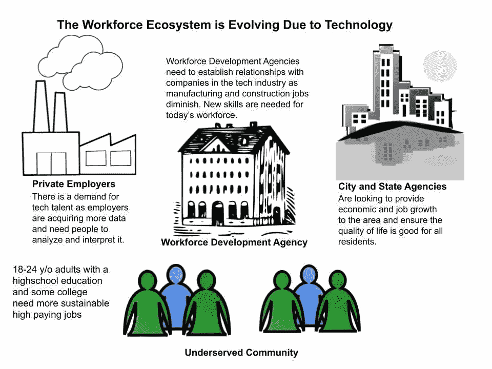
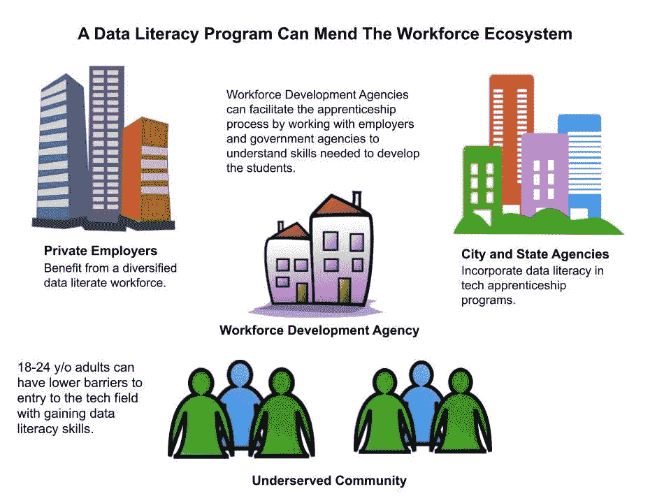

# 数据素养是帮助服务不足社区的关键

> 原文：<https://medium.datadriveninvestor.com/data-literacy-is-the-key-to-helping-underserved-communities-1ece7aeac50d?source=collection_archive---------2----------------------->

## 通过技术学徒创造职业道路

The Domino Sugar Factory was one of several sugar factories located in Northern Brooklyn. Having once produced more than half the sugar consumed in the US in the early 20th century, this NYC landmark represents the industrial waterfront this area was. Photo: [Paul Raphaelson](https://paulraphaelson.com/)

# **利用数据解决种族不平等问题**

当我在 2020 年初开始写这份行动呼吁时，我不知道我会经历两件改变人生的事情。事实上，我认为没有人会想到我们会在一个全球性的疫情航行，以及在美国进行早该进行的关于种族主义的会谈。当新冠肺炎让我们寻找一种新的常态时，乔治·弗洛伊德的谋杀案在美国引起了响亮的“我们受够了”。从治安、房屋所有权到医疗保健等等，美国不得不面对几个世纪以来剥夺黑人权利的系统性种族主义。幸运的是，有许多人站在美国黑人一边，和我们一起愤怒。我们可能没有解决这个问题的答案，但我们有决心。

## ***数据素养是将数据作为信息进行阅读、理解、创造和交流的能力。***

在这个行动呼吁中，我将阐述为服务水平低下的群体提供更好的职业机会是多么重要。生活在一个数据无处不在的世界，一个人对理解数据越熟悉，就越有可能获得更好的职业机会。我很快发现的一个挑战是确定一个基线，让每个人都用数据交流。

## **你回来的时候家就在那里**

我一直在进行一项研究，该研究将通过数据扫盲来帮助弥补布鲁克林北部本地招聘的差距。在过去的几年里，这个领域已经成为初创科技领域的一个主要参与者。根据城市未来中心(CUF)的[布鲁克林创新报告](https://nycfuture.org/research/brooklyns-growing-innovation-economy)，对于新创公司来说，布鲁克林现在仅次于旧金山，自 2008 年以来增长率为 365%。多年来，这个地方也被许多家庭，包括我的家庭，亲切地称为家。

我出生在 70 年代末，当时纽约遭遇了严重的财政危机。我听说过纽约市著名的[大停电](https://en.wikipedia.org/wiki/New_York_City_blackout_of_1977)的故事，还依稀记得地铁车厢里涂满涂鸦，这象征着高犯罪率，是笼罩在这个大都市上空的乌云。这个地区曾经是一个工业区，在 20 世纪初以繁荣的商业和制造业而闻名。我记得古老的[多米诺糖厂](https://en.wikipedia.org/wiki/Domino_Sugar_Refinery)在成长。它曾经生产了美国一半以上的糖。1954 年至 1990 年间，制造业下降了 50%，布鲁克林陷入了困境。现在，该地产正处于重新开发阶段，写字楼、住宅楼和绿地占据了它的景观。

The Domino Sugar Factory operated until 2004 and the remaining portion above was made a New York City designated landmark in 2007\. The refinery was redeveloped as office space, residential towers, and parkland symbolizing the waterfront’s transformation. Source: [Dezeen.com](https://www.dezeen.com/2018/06/08/domino-park-sugar-factory-james-corner-field-operations-williamsburg-brooklyn-new-york/)

纽约能够在 20 世纪的最后十年复兴，显示了我们标志性的毅力。在成长的过程中，我不知道周围环境的影响，也不知道我的父母为了给我们更好的生活所做的牺牲。80 年代中期，我们搬到了皇后区的郊区。因此，带着强烈的怀旧之情和回报养育我的社区的愿望，我帮助解决了这一新的劳动力挑战。你如何创建一个劳动力发展项目，让年轻人为数字时代做好准备？我认为关键是帮助他们学会如何与数据交流。

# **数据素养的重要性**

世界上 90%的数据是在过去两年中创建的。如果我们停下来想一想一分钟产生多少数据，这可能相当于大约 50 万条推文或 1000 次优步骑行。虽然这导致了技术机会的激增，但我们获取数据的速度导致了我们处理和解释数据的差距。事实上，我们的整体劳动力需要通过变得更加舒适地分析和解释来适应由数据涌入引起的加速步伐。换句话说，员工需要变得更懂数据。

在 2019 年下半年，寻找为 18-24 岁、有一些大学经历的成年人创造科技职业道路的方法，在这个旅程的不同时期，一直是令人满意、鼓舞、谦卑和具有挑战性的。你教给学生哪些技能来为他们从事技术工作做准备？你如何让雇主给没有受过传统教育的人一个机会来证明他们的能力？我决定，为了建立一个基线，我们需要教授基础知识。这个项目将帮助一群人:

*   从可用的数据源收集数据
*   **在电子表格中汇总数据**
*   **通过**创建图表来可视化数据
*   **从图表中识别模式**
*   **分析数据**生成信息
*   **讲故事**从数据中发现

**Technology is changing the landscape of business and communities.** As tech companies continue to grow, the workforce development infrastructure is not ensuring underserved residents are benefiting from these opportunities. City and workforce development agencies need to sit down and engage these companies and understand the skills needed and begin to connect local talent with these organizations. Illustrations: Allen Hillery

# 生态系统被破坏了

尽管就业市场的增长为布鲁克林居民创造了数千个带薪工作，但纽约市 850 万居民中约有 25%的人不具备进入年薪至少 5 万美元的职业所需的教育或培训。

纽约市没有劳动力发展基础设施，无法让服务水平低下的居民从这些科技公司的机会中受益。这是一种普遍现象，因为大多数科技中心都在“崭露头角”的社区投资。高科技工作是经济增长的关键驱动力，并为各行各业提供高薪工作。

## **数据素养对于所有员工的重要性正在加速增长。**

技术进步和自动化已经改变了商业的面貌和基础设施。今天的情况包括以更快的速度获取的数据激增，而公司正在将其物理存在减少到在线存在。这种范式转变消除了传统的反馈循环。因此，利用数据了解客户行为和反馈的细微差别是非常必要的。

## **在整个劳动力生态系统中存在严重的脱节。**

这种劳动力对话的关键受众主要有四类:企业领导、劳动力发展主管、市/州发展官员和当地居民。当一家公司搬到一个新的社区，特别是一个充满希望的社区，通常会缺乏与社区的接触。该公司经常低调地进驻。这就是城市和劳动力发展机构需要坐下来与这些公司接触，了解所需的技能，并开始联系当地人才和供应商，以确保每个人都能从这些机会中受益。

## **将数据素养融入技术学徒可以开始为服务不足的社区创造公平的竞争环境。**

提升来自代表性不足的背景的员工的技能将增加获得高薪工作的机会，并帮助公司建立多元化的员工队伍。多元化的员工队伍增加了公司的成功商数，使他们能够更好地了解客户的声音。这是一项涉及商业领袖、劳动力发展官员和地方政府机构的努力。

**Data literacy is the key to mending the ecosystem.** Upskilling employees from underrepresented backgrounds will increase access to high paying jobs and help companies build a diversified workforce. Illustrations: Allen Hillery

随着各方开始共同努力，该系统可以开始修补。服务不足社区的成员可以开始接受相关技能的培训，以满足公司和当地政府机构的期望和要求。当涉及到解释他们的数据时，公司可以有更多的手在甲板上，城市和国家机构可能会给其居民更好的生活。

## **技术学徒需要具备数据素养**

纽约市已经做出了第一次政府支持的努力，通过纽约学徒来扩大学徒模式。纽约学徒计划投资 500 万美元，到 2020 年在工业、卫生和科技行业创造 450 个学徒岗位。大多数项目都专注于网络开发和数据科学。这无疑是一个优势，但数据素养的跟踪将为没有编程能力的个人提供信心和技能。这种较低的准入门槛将使他们能够被雇用，并从整体上缩小数据素养差距。重要的是，所有相关方都要明白，不一定要成为数据科学家才能精通数据。

大多数与数据相关的解释都是基本的统计学和数学。人不需要成为程序员或者机器学习工程师。他们需要能够读取数据，分析数据，并与同事和决策者交流。公司需要懂数据的员工来提高业务效率。拥有一个更懂数据的客户服务团队可以帮助识别客户群，从而更好地吸引他们或向他们提供优惠。这可以通过与精通数据的营销团队合作来实现。这个难题的数据表示部分需要赶上我们在获取和处理数据方面取得的所有进步。

## **公司需要多样化的懂数据的员工队伍才能成功**

当今的经济使得经营企业竞争非常激烈。这在很大程度上可以归因于公司能够收集的大量数据。随着这些年来数据基础设施变得越来越先进、越来越便宜，现在很多业务都是在网上完成的。虽然许多公司已经非常擅长跟踪数据，但他们很难找到足够多懂数据的人来解释和利用数据来发展业务。

公司在招聘和培训数据专业人员时忽略的一件事是，他们与普通受众沟通的能力或愿望。在我的职业生涯中，我曾在几个分析团队工作过，发现对我们的期望有时不切实际。分析师需要争论数据，在了解业务及其战略的背景下分析数据，制作图表，并在较短的周转时间内将它们呈现给业务利益相关者。洗涤、冲洗并重复。我观察到的最大瓶颈是团队理解数据并基于数据做出明智决策的能力。

除了受益于懂数据的员工，雇主还可以通过在组织中表达更多的声音和观点来提高他们的成功商数。对大多数公司来说,“顾客的声音”有多种颜色和各行各业。在当今竞争激烈的市场中，了解不同客户对您的产品和服务的评价至关重要。同样重要的是，让你的员工权衡什么样的产品和服务最适合你的客户。

The Domino Sugar refinery site will be a mixed use development that includes office space, residential towers and parkland. I believe with the help of technology, we can create an inclusive community that benefits all. Source: [6sqft](https://www.6sqft.com/revealed-new-renderings-of-domino-sugar-factorys-waterfront-park-and-esplanade/)

# **融入不断变化的劳动力大军**

Leila Janah 是一个社会企业家，离开我们太早了。她是 [Samasource](https://www.samasource.com/) 和 LXMI 这两家公司的创始人和首席执行官，这两家公司都有一个共同的社会使命，那就是通过给有需要的人提供工作来结束全球贫困。不幸的是，她死于一种罕见的软组织肿瘤——上皮样肉瘤的并发症。Janah 通过她的社会企业留下了非凡的遗产。她的公司 Samasource 迄今已帮助 9 个国家的 11，000 名工人找到了工作。Janah 在 2015 年接受[连线](https://www.wired.com/2015/07/leila-janah-samagroup/)采访时提到，在她的公司接受培训的东非和亚洲工人的平均收入从 800 美元/年上升到 3300 美元/年，并一直保持在这一水平。

莱拉从哈佛毕业后的第一项任务是去孟买，在那里她将管理一个由受过良好教育的印度人组成的呼叫中心。在那里，她经过了亚洲最大的贫民窟之一达拉维。她将这段经历归功于创办自己的公司 Samasource。Sama 是梵语“平等”的意思。Janah 的观点是，尽管外包可能提供了数百万个工作岗位，但它并没有帮助这个国家最贫穷的人。当她无法获得风险投资资金来支持她的想法时，Samasource 作为一个非营利组织成立了，它将穷人与低级技术工作联系起来。

我一直在阅读关于 Leila Janah 的故事，她启发了我对给予人们重要机会融入不断变化的劳动力大军意味着什么的思考。像 Janah 一样，我相信有很多职业机会。了解到生态系统中还有其他人同样热衷于看到数据扫盲计划成为现实，这让这次经历变得值得。有机会与市民领袖、技术高管和当地居民交流，我了解到:

1.  随着越来越多的领导者参与进来，并认识到数据素养的重要性，这个问题就可以得到解决。
2.  有一群年轻人在寻找机会产生影响。
3.  随着技术加快了一切事物的步伐，劳动力发展需要重新审视。

许多善意的人会坚持认为消除贫困是不可能的……也许这曾经是真的，但由于技术的发展，现在不再是了— Leila Janah， [***给予工作:一次一份工作扭转贫困***](https://www.amazon.com/Give-Work-Reversing-Poverty-Time/dp/0735211892)