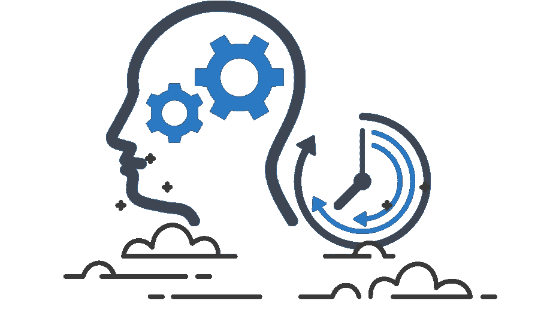
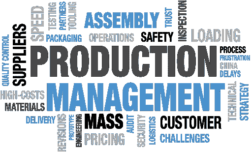

# 建筑行业的数据管理

> 原文：<https://medium.datadriveninvestor.com/data-management-in-construction-sector-a9cdb15450b3?source=collection_archive---------2----------------------->

大家都在说数据，AI，ML。是的，这些很重要。但是我们应该从基本的步骤开始。我们应该了解我们将如何收集和使用数据。

# **数据很重要**

每位经理、主管和高管都认同“数据至关重要”这一说法。但是当你问你是如何管理数据的时候。可惜，答案似乎不切实际。他们谈到了云存储文档管理软件、BIM、ERP、规划工具等。好的，但是数据在哪里，你如何处理数据，数据对项目的影响是什么。

> 数据收集不是一个线性过程，它是混乱的，通常包括未标记的关系。因此，数据收集是所有人工智能工作中最重要的一步。

对你来说一切都是数据。不仅输入系统的数据，而且施工现场的所有正式或非正式关系都是重要的数据源。

# **数据在哪里？**

人、机器、自然、公司创造数据。问题是我们能捕捉到多少数据。不幸的是，只有一小部分数据可以被捕获。

**我们如何增加数据采集？**

> 根据我们的研究，物联网传感器、手机、机器、聊天机器人可以被动增加数据捕获。

如果两个工程师在工地上谈论一个问题，我们应该找到收集这些数据的方法。我们 Botmore Technology 正在使用聊天机器人来获取这些数据。可以把聊天机器人看作是一个新的界面，它管理不同方之间的消息传递，并使数据对各方都更容易访问。这些数据对于了解施工现场的情况以及如何提高生产率非常重要。

物联网是另一个数据来源。您可以使用物联网传感器来收集关于位置、机器性能的数据。

> 施工数据的照片和视频是施工现场非常重要的数据源。因此，我们应该在一个中心竖井中收集这些数据，并且应该很容易到达。

规划软件、ERP、BIM 等所有数字工具都是建筑行业最容易获得的数据源。好的一面是数据通常被很好地标记，坏的一面是这些数据存储在不同的数据仓库中，没有适当的数据管理策略。

# 数据策略

你有数据。数据就像你银行里的钱。你可以允许财务顾问来管理它，或者你可以制定一个投资计划。我的建议是，你应该制定一个数据管理计划，而不是把这个过程委托给第三方。

首先，看看你手上有什么数据。对数据进行分类。

**功能分类:**根据操作功能对您的数据进行分类。比如策划、设计、质量、安全、采购等。

**数据源分类:**物联网、聊天机器人、Excel、机械、照片等。

**数据存储分类:**云(Google Cloud，Amazon，Azure 等。)，本地

 [## 将数据隐私转化为你的优势，重建消费者的信任:下一个投资前沿

### 疫情期间，抖音的使用量激增，全球约有 8 亿用户使用该平台…

www.datadriveninvestor.com](https://www.datadriveninvestor.com/2020/09/18/turn-data-privacy-to-your-advantage-and-rebuild-consumers-trust-the-next-investment-frontier/) 

**数据库类型:** MySQL、MongoDB、Firestore、BigQuery 等。

使用这些分类，您可以深入了解如何处理数据。

> 我们知道数据通常在不同的筒仓中。因此，处理这些不同的数据湖开始变得具有挑战性。因此，在您的数据计划中，您应该说明数据将如何在不同的数据湖之间流动。

当然，最具挑战性的部分是清理数据。是的，毫无例外，您的数据会有不同的问题，如丢失值、错误的数据输入、系统错误、错误的实体选择等。您需要一个严格的计划来清理数据并使其可用。

# 分析数据

现在我们有了数据，也有了数据管理计划。现在，我们应该开始处理数据，以获得洞察力。

首先，我们需要一个问题列表，我们将尝试使用数据进行回复。无限制的问真题。探索数据不应该是一个随机的实验，数据应该给出有意义的结果，可以是正面的，也可以是负面的。

> 不要试图用数据来证明你的想法。这种方法只会让你的数据项目不成功，你失去了你的完整性。数据应该是独立的，你应该用它来诚实地回答业务问题。

第二步，玩数据看不同的细节。使用分析工具，用数据做实验，创建表格，图表来查看不同的关系。使用 SQL 函数过滤、连接和搜索数据以了解更多信息。

第三步，找生活有问题的人聊聊。并听取他们对你在数据分析中的发现的反馈。给他们玩数据的机会，并与他们的经验进行比较。

# **目标**

你可以说我们应该在项目开始时就确定目标。在我看来，理解了数据之后，目标才有意义。所以，我的建议是，在数据分析之后，明确你的目标。例如，一个目标可以是减少建筑垃圾。如果你有关于这个目标的合适的数据集，这个目标是可以满足的。

> 此外，如果您在项目开始时陈述目标，数据团队将关注与数据集相关的目标，这种情况可能会导致偏差。

# **现在，是时候使用机器学习模型了**

此时，您可以开始使用 ML 模型来显示您的分析结果和业务问题的解决方案。不要用复杂的算法，从回归这样简单的算法开始。在制作用于测试和验证的数据组时保持一致。使用测试数据来调整算法，并使用验证数据组来验证您的模型。

过度合身可能是你的噩梦，小心。

> 如果 ML 算法不起作用，请记住这是一个让你更好地理解数据和数据关系的机会。

# 原型

找到合适的 ML 算法后，就该开发原型了。不要刁难，培养一个 MVP。顾客应该很容易尝试。测试用户对成功非常重要。

> 人工智能项目中没有版本控制。该项目从数据中学习，并不断变化。因此，性能检查和连续数据管理是必须的。

# **生产**

你有一个原型，测试版用户反馈，和持续的数据流。我们应该小心将原型发布到产品中。ML 模型的成熟度和精确度应该在可接受的范围内。因此，你应该在不同的条件下尝试。

> 如果你总是在相同的条件下尝试一个 ML 模型，你可能会导致偏见和欺骗你自己。

## 获得专家视图— [订阅 DDI 英特尔](https://datadriveninvestor.com/ddi-intel)