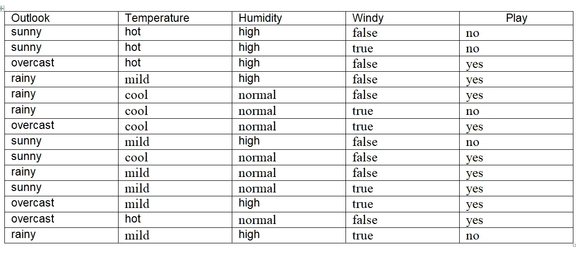

# 数据挖掘是决策的有效工具

> 原文：<https://medium.datadriveninvestor.com/data-mining-is-an-effective-tool-for-decision-making-4edbd3865b5c?source=collection_archive---------23----------------------->

Photo by [Roland Samuel](https://unsplash.com/@rosam2020?utm_source=medium&utm_medium=referral) on [Unsplash](https://unsplash.com?utm_source=medium&utm_medium=referral)

现实生活中的数据集的问题是它们通常是私有的。一个是与您共享他们的客户和产品选择数据库，这样您就可以了解他们的数据挖掘应用程序的细节以及它是如何工作的。公司数据是一种有价值的资产，其价值随着数据挖掘技术的发展而大幅增加，本文将对这些技术进行描述。

因此，在这篇文章中，我将介绍一些[数据挖掘](http://blog.selcote.com/2020/03/11/introduction-to-data-mining/)应用的例子。

# 第一个例子:

这是关于天气的问题:

Weather Dataset Example

通过分析该表，我们可以提取以下模式:

> *如果前景=晴朗，湿度=高，则播放=否*
> 
> *如果展望=多雨多风=真，那么播放=否*
> 
> *如果前景=阴天，则播放=是*
> 
> *如果湿度=正常，则播放=是*
> 
> *如果以上都不是，那么 play = yes*

这些规则应该按顺序解释:第一条，如果第二条不适用，就按此类推。旨在按顺序解释的一组规则被称为*决策列表。*这些规则正确地对表中的所有示例进行了分类，然而，如果脱离上下文，单独来看，有些规则是不正确的。

例如，规则:

## 如果湿度=正常，则播放=是

将其中一个示例弄错(检查是哪个示例)。一套规则的意义取决于如何解释它。

 [## 决策的移情设计方法如何工作|数据驱动的投资者

### 移情设计是一种产品设计方法，首先由多萝西·伦纳德和杰弗里·雷波特在哈佛大学提出

www.datadriveninvestor.com](https://www.datadriveninvestor.com/2018/07/18/how-the-empathic-design-method-of-decision-making-works/) 

不奇怪！到目前为止我们看到的规则是*分类规则:*它们根据是否播放来预测例子的分类。同样可以忽略分类，只寻找与不同属性值紧密关联的规则。这些被称为*关联规则。*从上表的天气数据中可以导出很多关联规则。一些好的如下:

> 如果温度=凉爽，那么湿度=正常
> 
> 如果湿度=正常，风=假，那么播放=是
> 
> 如果前景=晴朗，玩耍=否，那么湿度=高
> 
> 如果 windy = false，play = no，那么 outlook = sunny
> 
> 湿度=高。

# **第二个例子:Irises，一个经典的数值数据集**

数据集由 kaggle 网站提供。感谢您查看下面的链接。

 [## 鸢尾花数据集

### 用于多类分类的鸢尾花数据集。

www.kaggle.com](https://www.kaggle.com/arshid/iris-flower-dataset) 

鸢尾数据集可以追溯到杰出的统计学家 R.A. Fisher 在 20 世纪 30 年代中期的开创性工作，可以说是数据挖掘中使用的最著名的数据集，它包含三种植物的 50 个例子:*鸢尾、杂色鸢尾、*和*海滨鸢尾。*

共有四个属性:*萼片长度、萼片宽度、花瓣长度、*和*花瓣宽度*(均以厘米为单位)。

与以前的数据集不同，所有属性都有数值。

可以从该数据集中学习以下一组规则:

> 如花瓣长度< 2.45 then Iris setosa
> 
> If sepal width < 2.10 then Iris versicolor
> 
> If sepal width < 2.45 and petal length < 4.55 then Iris versicolor
> 
> If sepal width < 2.95 and petal width < 1.35 then Iris versicolor
> 
> If petal length ≥ 2.45 and petal length < 4.45 then Iris versicolor
> 
> If sepal length ≥ 5.85 and petal length < 4.75 then Iris versicolor
> 
> If sepal width < 2.55 and petal length < 4.95 and petal width < 1.55
> 
> then Iris versicolor
> 
> If petal length ≥ 2.45 and petal length < 4.95 and
> 
> petal width < 1.55 then Iris versicolor
> 
> If sepal length ≥ 6.55 and petal length < 5.05 then Iris versicolor
> 
> If sepal width < 2.75 and petal width < 1.65 and
> 
> sepal length < 6.05 then Iris versicolor
> 
> If sepal length ≥ 5.85 and sepal length < 5.95 and
> 
> petal length < 4.85 then Iris versicolor
> 
> If petal length ≥ 5.15 then Iris virginica
> 
> If petal width ≥ 1.85 then Iris virginica
> 
> If petal width ≥ 1.75 and sepal width < 3.05 then Iris virginica
> 
> If petal length ≥ 4.95 and petal width < 1.55 then Iris virginica

# **第三个例子，贷款公司**

接下来的插图倾向于强调学习在绩效情境中的应用，其中强调的是在新例子中表现良好的能力。

例如，当你申请贷款时，你必须填写一份要求提供相关财务和个人信息的问卷。贷款公司根据这些信息来决定是否借钱给你。这种决策通常分两个阶段做出。

首先，用统计方法确定明确 ***接受*** 和**拒绝**的情况。剩下的边缘案例更加困难，需要人的判断。

例如，一家贷款公司使用统计决策程序，根据调查问卷中提供的信息计算数值参数。如果该参数超过预设阈值，则接受申请人，如果该参数低于第二阈值，则拒绝申请人。这占案件的 90%,其余的 10%被提交给贷款官员作出决定。然而，在检查申请人是否真的偿还了贷款的历史数据时，结果是半数获得贷款的边缘申请人实际上违约了。虽然简单地拒绝向边缘客户提供信贷很有诱惑力，但信贷行业的专业人士指出，只要他们的还款前景能够可靠地确定就好了。

正是这些客户的业务应该被拉拢。他们往往是信贷机构的积极客户，因为他们的财务状况长期不稳定。必须在不喜欢坏账的公司会计和不喜欢拒绝业务的销售主管的观点之间达成适当的妥协。