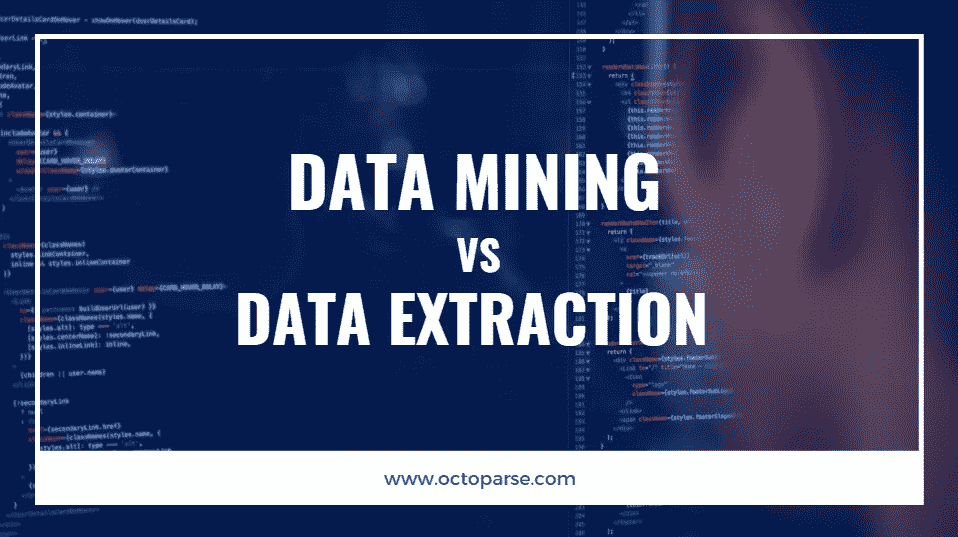
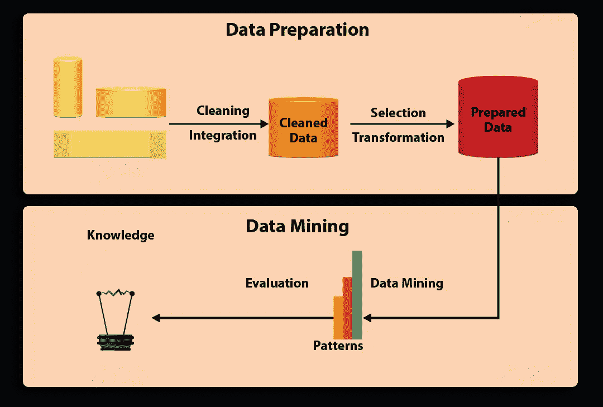
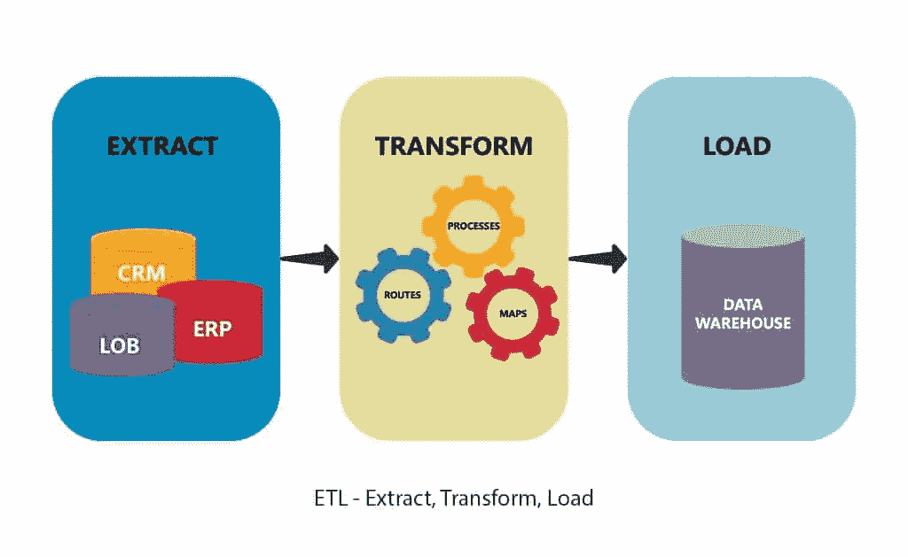

# 数据挖掘与数据抽取:有什么区别？

> 原文：<https://medium.datadriveninvestor.com/data-mining-vs-data-extraction-whats-the-difference-d746b01fecc?source=collection_archive---------16----------------------->

作为与数据科学相关的两个典型术语，数据挖掘和数据抽取迷惑了很多人。数据挖掘经常被误解为提取和获取数据，但实际上要复杂得多。在这篇文章中，让我们找出数据挖掘和数据提取的区别。

# 什么是数据挖掘？

数据挖掘(Data mining)，也称为数据库中的**知识发现(KDD)** ，是一种经常使用统计和数学方法分析大型数据集以发现隐藏的模式或趋势，并从中获取价值的技术。

 [## 将定义 2020 年就业前景的五大数据科学和机器学习趋势|数据驱动…

### 数据科学和 ML 是 2019 年最受关注的趋势之一，毫无疑问，它们将继续发展…

www.datadriveninvestor.com](https://www.datadriveninvestor.com/2020/02/19/five-data-science-and-machine-learning-trends-that-will-define-job-prospects-in-2020/) 

# 数据挖掘能做什么？

通过自动化挖掘过程，[数据挖掘工具](https://www.octoparse.com/blog/7-web-mining-tools-around-the-web)可以扫描数据库并有效地识别隐藏的模式。对于企业来说，数据挖掘通常用于发现数据中的模式和关系，以帮助做出最佳的商业决策。

# 数据挖掘的一些用例

数据挖掘在 20 世纪 90 年代普及后，各行各业的公司—包括零售、金融、医疗保健、运输、电信、电子商务等—开始使用数据挖掘技术从数据中获得洞察力。数据挖掘可以帮助细分客户、检测欺诈、预测销售等等。数据挖掘的具体用途包括:

## 客户细分

通过挖掘客户数据和确定目标客户的特征，公司可以将他们分成一个独特的群体，并提供满足他们需求的特别优惠。

## 市场篮子分析

这是一种基于理论的技术，即如果你购买了某一组产品，你很可能会购买另一组产品。一个著名的例子是，当父亲为他们的婴儿购买尿布时，他们往往会在购买尿布的同时购买啤酒。

## 预测销售额

这听起来可能类似于市场购物篮分析，但这一次数据挖掘用于预测客户未来何时会再次购买产品。例如，一名教练买了一桶应该能维持 9 个月的蛋白粉。出售蛋白粉的商店将计划在 9 个月后发布新的蛋白粉，以便教练再次购买。

## 检测欺诈

数据挖掘有助于建立检测欺诈的模型。通过收集欺诈性和非欺诈性报告的样本，企业能够识别哪些交易是可疑的。

## 发现制造业的模式

在制造业中，数据挖掘通过揭示产品架构、产品组合和客户需求之间的关系来帮助设计系统。它还可以预测未来产品开发的时间跨度和成本。

以上只是使用数据挖掘的几个场景。更多用例，请查看[数据挖掘应用和用例](https://data-flair.training/blogs/data-mining-applications/)。

# 数据挖掘的总体步骤

数据挖掘是收集、选择、清理、转换和挖掘数据的完整过程，目的是评估模式并最终提供价值。

([Source](https://data-flair.training/blogs/data-mining-process/))

通常，数据挖掘过程可以概括为 7 个步骤:

## 步骤 1:数据清理

在现实世界中，数据并不总是干净和结构化的。它通常是嘈杂的，不完整的，可能包含错误。为了确保数据挖掘结果的准确性，首先需要清理数据。一些清理技术包括填充缺失值、自动和手动检查等。

## 步骤 2:数据集成

这是从不同来源提取、组合和整合数据的步骤。这些来源可以是数据库、文本文件、电子表格、文档、数据立方体、互联网等等。

## 第三步:数据选择

通常，数据挖掘并不需要所有集成的数据。数据选择是从大型数据库中只选择和检索有用的数据。

## 步骤 4:数据转换

在数据被选择之后，它被转换成适合挖掘的形式。这个过程涉及到归一化、聚合、泛化等。

## 步骤 5:数据挖掘

数据挖掘最重要的部分来了——使用智能方法来发现数据中的模式。数据挖掘过程包括回归、分类、预测、聚类、关联学习等等。

## 步骤 6:模式评估

这一步旨在识别潜在有用且易于理解的模式，以及验证假设的模式。

## 步骤 7:知识表示

在最后一步，挖掘出的信息用知识表示和可视化技术以一种吸引人的方式呈现出来。

# 数据挖掘的缺点

尽管数据挖掘很有用，但它也有一些局限性。

## 时间和劳动力的高投入

因为这是一个漫长而复杂的过程，它需要高绩效和熟练的工作人员进行大量的工作。数据挖掘专家可以利用强大的数据挖掘工具，但他们需要专家来准备数据和理解输出。因此，可能仍需要一些时间来处理所有信息。

## 隐私和数据安全问题

由于数据挖掘以基于市场的技术收集客户信息，它可能会侵犯用户的隐私。此外，黑客可能会攻击存储在采矿系统中的数据，这对客户数据安全构成威胁。如果窃取的数据被滥用，很容易伤害他人。

**以上是对数据挖掘的简单介绍。正如我提到的，数据挖掘包含数据收集和数据集成的过程，其中包括数据提取的过程。在这种情况下，可以肯定地说，数据提取可能是数据挖掘漫长过程的一部分。**

# 什么是数据提取？

也被称为“ [web 数据提取](http://www.dataextraction.io/)和“ [web 抓取](https://www.octoparse.com/blog/top-30-free-web-scraping-software)”，数据提取是从(通常是非结构化或结构不良的)数据源中检索数据到集中位置进行存储或进一步处理的行为。

具体来说，非结构化数据源包括网页、电子邮件、文档、pdf、扫描文本、大型机报告、假脱机文件、分类广告等。集中式位置可以是现场的、基于云的或者两者的混合。重要的是要记住，数据提取不包括以后可能发生的处理或分析。

# 数据提取能做什么？

一般来说，数据提取的目标分为三类。

## 档案的

数据提取可以将数据从物理格式(如书籍、报纸、发票)转换为数字格式(如数据库)，以便安全保管或作为备份。

## 传输数据的格式

如果您想将数据从当前网站转移到正在开发的新网站，您可以通过提取数据从自己的网站收集数据。

## 数据分析

作为最常见的目标，可以对提取的数据进行进一步分析，以生成见解。这听起来可能类似于数据挖掘中的数据分析过程，但请注意，数据分析是数据提取的目标，而不是其过程的一部分。更何况数据的分析也不一样。一个例子是，电子商店所有者[从亚马逊](https://youtu.be/6TWJ2LKGWQk)等电子商务网站提取产品细节，以实时监控竞争对手的策略。

就像数据挖掘一样，数据提取是一个自动化的过程，有很多好处。过去，人们习惯于手动将数据从一个地方复制粘贴到另一个地方来移动数据，这是非常耗时的。数据提取加快了收集的速度，并大大提高了提取数据的准确性。关于数据提取的其他优势，您可以查看[这篇文章](https://www.octoparse.com/blog/big-data-what-is-web-scraping-and-why-does-it-matter)。

# 数据提取的一些用例

与数据挖掘类似，数据提取已经广泛应用于多个行业，服务于不同的目的。除了监控电子商务中的价格，数据提取还可以帮助个人论文研究、新闻聚合、营销、房地产、旅行和旅游、咨询、金融等等。

## 线索挖掘

公司可以从 Yelp、Crunchbase、Yellowpages 等目录中提取数据，并为业务发展提供线索。你可以看看这个视频，看看如何用[网页抓取模板](https://www.octoparse.com/blog/big-announcement-web-scraping-template-take-away)从黄页中提取数据。

## 内容和新闻聚合

[内容聚合](https://www.octoparse.com/blog/content-aggregators-the-content-publishers-of-the-future)网站可以从多个来源定期获取数据，保持网站的新鲜和最新。

## 情感分析

从 Instagram 和 Twitter 等社交媒体网站提取在线评论/评论/反馈后，人们可以分析潜在的态度，并了解他们如何感知一个品牌、产品或现象。

关于数据提取的更多应用和用例，你可以参考 [25 个利用网络数据提取发展业务的技巧](http://www.dataextraction.io/?p=351)。

# 数据提取的总体步骤

数据提取是 ETL(提取、转换和加载)和 ELT(提取、加载和转换)的第一步。ETL 和 ELT 本身是完整的数据集成策略的一部分。换句话说，数据提取可以是数据挖掘的一部分。

([Source](https://www.astera.com/type/blog/etl-process-and-steps/))

虽然数据挖掘是从大型数据集获得可操作的见解，但数据提取是一个更短、更直接的过程。数据提取过程可以总结为三个步骤。

## 步骤 1:选择数据源

选择要提取的目标数据源，如网站。

## 步骤 2:数据收集

向网站发送一个“GET”查询，用 Python、PHP、R、Ruby 等编程语言解析它的 HTML 文档。

## 第三步:数据存储

将数据存储在您的现场数据库或[基于云的目的地](https://helpcenter.octoparse.com/hc/en-us/articles/360018047092-What-is-Cloud-Extraction-)供将来使用。

如果你是一个有经验的程序员，想要提取数据，上面的步骤对你来说可能听起来很容易。然而，如果你不是一个程序员，有一个捷径——使用[数据提取工具](http://www.dataextraction.io/?p=510)，如 [Octoparse](http://www.octoparse.com) 。数据提取工具，就像数据挖掘工具一样，是为了节省人们的精力，使数据处理对每个人来说都很简单而开发的。这些工具不仅性价比高，而且对初学者也很友好。它们允许用户在几分钟内抓取数据，将其存储在云中，并通过 API 将其导出为多种格式，如 Excel、CSV、HTML、JSON 或现场数据库。

# 数据提取的缺点

## 服务器故障

在大规模提取数据时，目标网站的网络服务器可能会过载，这可能会导致服务器崩溃，从而损害网站所有者的利益。

## 知识产权禁止

当一个人过于频繁地抓取数据时，网站会屏蔽他/她的 IP 地址。它可能会完全禁止 IP 或限制爬虫的访问，以破坏提取。为了[提取数据而不被阻塞](https://www.octoparse.com/blog/scrape-websites-without-being-blocked)，人们需要以适中的速度提取数据，并采用一些防阻塞的方法。

## 法律问题

当涉及到[合法性](https://www.octoparse.com/blog/is-web-scraping-legal-in-some-countries)时，网络数据提取就处于一个灰色地带。像 Linkedin 和脸书这样的大网站在他们的服务条款中明确声明，任何自动提取数据的行为都是不允许的。公司之间有许多关于抓取 bot 活动的诉讼。

# 数据挖掘和数据提取的主要区别

1.  数据挖掘也称为数据库中的知识发现、知识提取、数据/模式分析、信息收获。数据提取可与 web 数据提取、web 抓取、web 爬行、数据检索、[数据采集](https://www.octoparse.com/blog/data-harvesting-data-mining-whats-the-difference)等互换使用。
2.  数据挖掘研究主要针对结构化数据，而数据抽取通常从非结构化或结构不良的数据源中检索数据。
3.  数据挖掘的目标是使可用的数据对产生洞察力更有用。数据提取是收集数据，并将它们收集到一个可以存储或进一步处理的地方。
4.  数据挖掘是基于数学方法来揭示模式或趋势。数据提取基于编程语言或数据提取工具来抓取数据源。
5.  数据挖掘的目的是发现以前未知或忽略的事实，而数据提取处理的是现有的信息。
6.  数据挖掘要复杂得多，需要在员工培训方面进行大量投资。如果使用正确的工具进行数据提取，可能会非常容易且经济高效。

# 结论—数据挖掘与数据提取

这些术语已经存在了大约二十年。数据提取可以是数据挖掘的一部分，数据挖掘的目标是收集和集成来自不同来源的数据。数据挖掘，作为一个相对复杂的过程，是发现理解数据和预测未来的模式。两者都需要不同的技能和专业知识，然而非编码数据提取工具和数据挖掘工具的日益流行极大地提高了生产率，使人们的生活变得更加容易。

*原载于 2020 年 5 月 28 日 https://www.octoparse.com***。**