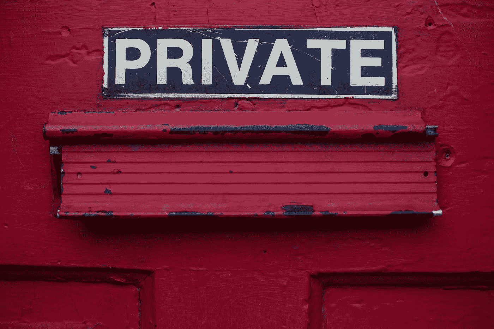
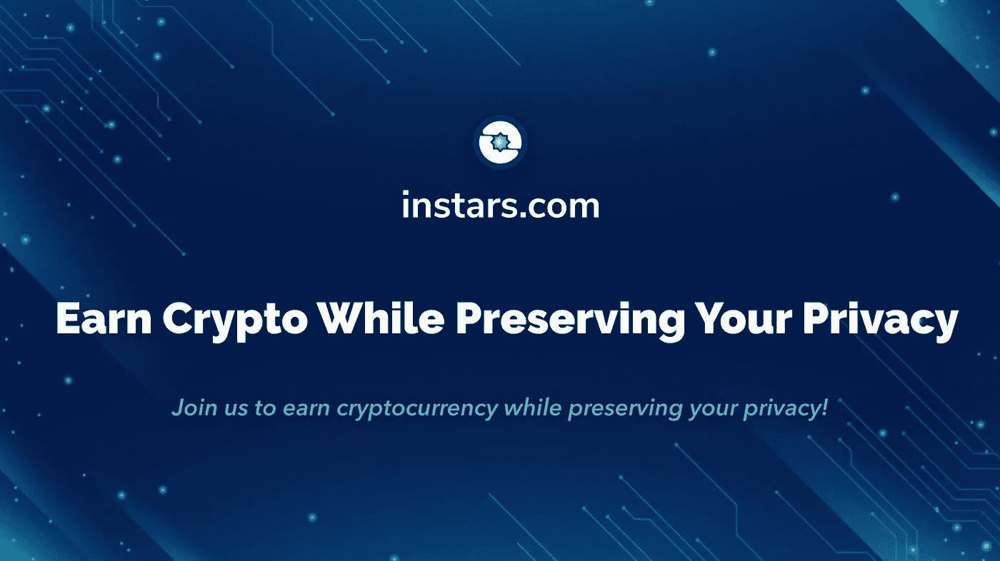

# 数据所有权应该是一项基本人权——为什么不是呢？

> 原文：<https://medium.datadriveninvestor.com/data-ownership-should-be-a-basic-human-right-so-why-isnt-it-f895db86966e?source=collection_archive---------12----------------------->

## 全球人权活动家大赦国际对在线数据隐私进行了调查。结果显示，超过 70%的人希望政府出于对个人数据的担忧，监管大型科技公司。



[Dayne Topkin](https://unsplash.com/@dtopkin1?utm_source=medium&utm_medium=referral) | [Unsplash](https://unsplash.com?utm_source=medium&utm_medium=referral)

该调查还显示，大多数人认为大型科技公司通过访问他们的个人信息侵犯了他们的隐私权。用户需求和现状之间存在如此大的差异，区块链公司能成为这个持续问题的解决方案吗？

据大赦国际技术总监坦尼娅·欧卡罗尔说，

> “民意调查结果是严峻而一致的——显然大多数人担心大型科技对他们生活的影响。”

保罗·多尔蒂最近在推特上进行的一项民意调查进一步证实了她的观点。

在 36，000 多名投票者中，81.5%或约 29，405 人认为数据是一项基本人权。这意味着人们应该能够控制他们所有的数据。然而，事实似乎并非如此。我们仍然没有我们想要的网络。

# **那么我们为什么会处于目前的现状呢？**

最近几年，针对针对性广告的投诉似乎侵犯了隐私。这个名为[让我们成为](https://www.makeuseof.com/tag/your-smartphone-listening-or-coincidence/)的平台，突出了用户在 Reddit 上讲述的一些故事。一些故事中反复出现的一个问题是，大型科技公司可能会从智能手机上记录日常对话。

[](https://www.datadriveninvestor.com/2019/03/20/could-blockchain-powered-social-media-2-0-dethrone-facebook/) [## 区块链驱动的社交媒体 2.0 能取代脸书吗？数据驱动的投资者

### 到 2021 年，活跃的社交媒体用户的数量预计将达到令人难以置信的水平，超过三分之一的…

www.datadriveninvestor.com](https://www.datadriveninvestor.com/2019/03/20/could-blockchain-powered-social-media-2-0-dethrone-facebook/) 

人们声称他们已经收到了他们只谈论过的商品的广告，甚至没有搜索它们。

这一经历突显出人们的期望与大型科技公司的目标之间的脱节。

# **妨碍数据隐私是一项基本人权**

从 2016 年发生的涉及[剑桥分析公司和脸书](https://www.google.com/url?sa=t&rct=j&q=&esrc=s&source=web&cd=12&cad=rja&uact=8&ved=2ahUKEwi_2666paPnAhV7QEEAHQpdCcEQFjALegQIAhAB&url=https%3A%2F%2Fwww.nytimes.com%2F2018%2F04%2F04%2Fus%2Fpolitics%2Fcambridge-analytica-scandal-fallout.html&usg=AOvVaw3ZEHO1hw3Cqkda_AWMaZKR)的事件来看，很明显，大科技收集的一些数据被滥用了。这些公司采用的收集方法也是不道德的，在某些司法管辖区甚至是非法的。

以下是阻碍数据隐私的一些因素:

*   不道德和潜在非法的数据收集方法。
*   过度收集数据，正如李益斌和其他人在他们关于智能城市隐私保护的[论文](https://ieeexplore.ieee.org/abstract/document/7210166)中所强调的。可以说，过度收集数据是全面数据隐私的最大障碍之一。使用智能手机和其他电子设备会加强这种影响。
*   大型科技公司的经济激励。脸书、亚马逊和谷歌等公司是全球经济中的重要实体，因此对通过的有关其业务结构的法律类型有一定影响。这使他们能够控制他们能够影响数据隐私法的程度。
*   技术限制。大多数大型科技公司使用集中式系统，这些系统通常容易受到黑客的攻击。集中式网络将大量用户数据暴露给任何可以访问这些数据的人。这通常会导致数百万个账户或大量用户数据在一次成功的攻击中[受损](http://www.stage2data.com/five-of-the-biggest-data-breaches-of-the-21st-century/)。
*   关于数据隐私的信息不足。在《剑桥分析》披露之前，围绕数据隐私的问题对绝大多数人来说都是模糊不清的。此外，随着智能手机在全球市场的渗透，越来越多的人面临数据泄露的危险，而他们对此一无所知，也没有任何形式的保护。

# **区块链会是必需的解决方案吗？**

正如区块链技术公司所证明的那样，数据保密最好通过分散的方法来执行。迄今为止，区块链已经在各种行业中实施，并取得了不同程度的成功。然而，突出的是通过技术实现隐私。用户可以确信区块链网络中数据的不变性和安全性。

借助区块链技术，以下是用户期望在[数据隐私](https://www.blockchain.com/legal/privacy)方面获得的一些好处:

*   数据收集保持在最低限度。区块链平台只收集他们需要的数据，以使您的平台体验无缝，以及根据运营领域的法律要求的数据。
*   声明第三方数据收集流程，并明确告知用户可以选择退出。
*   所有涉及用户数据的流程都要透明。

凭借简单透明的政策，区块链可以成为数据隐私这一基本人权的推动者，并朝着我们想要的网络迈出积极的一步。

# **instar 的伦理数据收集和数据使用**

[Instars 平台](https://instars.com/)通过应用区块链技术，展示了道德数据的收集和使用。该平台收集数据并仅在用户同意的情况下使用。平台中的所有活动都是透明的，同时仍然维护个人用户的隐私。



[Source](https://instars.com/)

数据收集是通过调查和民意测验完成的。用户因其提供的数据而获得报酬。

[Instars](/instars.com/) 也提供关于区块链技术的课程。这确保了关于区块链和隐私的正确信息容易被其用户访问。该平台还为学习区块链技术提供激励，这表明他们致力于在全球传播正确的信息。

该平台通过区块链技术表明，数据隐私作为一项人权是可能的。它还表明，对所提供的数据进行补偿也是可能的。考虑到这一点，也许是时候让世界停止考虑并开始在任何可能的地方实施区块链技术来实现我们想要的网络了。

```
***Disclaimer:*** *Please only take this information as my* ***OWN*** *opinion and should not be regarded as financial advice in any situation. Please remember to* ***DYOR*** *before making any decisions.*
```

♂️你好，我叫萨尔。*如果你觉得这篇文章有用，并想查看我的其他作品，请务必鼓掌并关注我的* [*中型*](https://medium.com/@salmanmiah) *和* [*LinkedIn！*](https://linkedin.com/in/salman-miah-57aa90a0/) *😎*