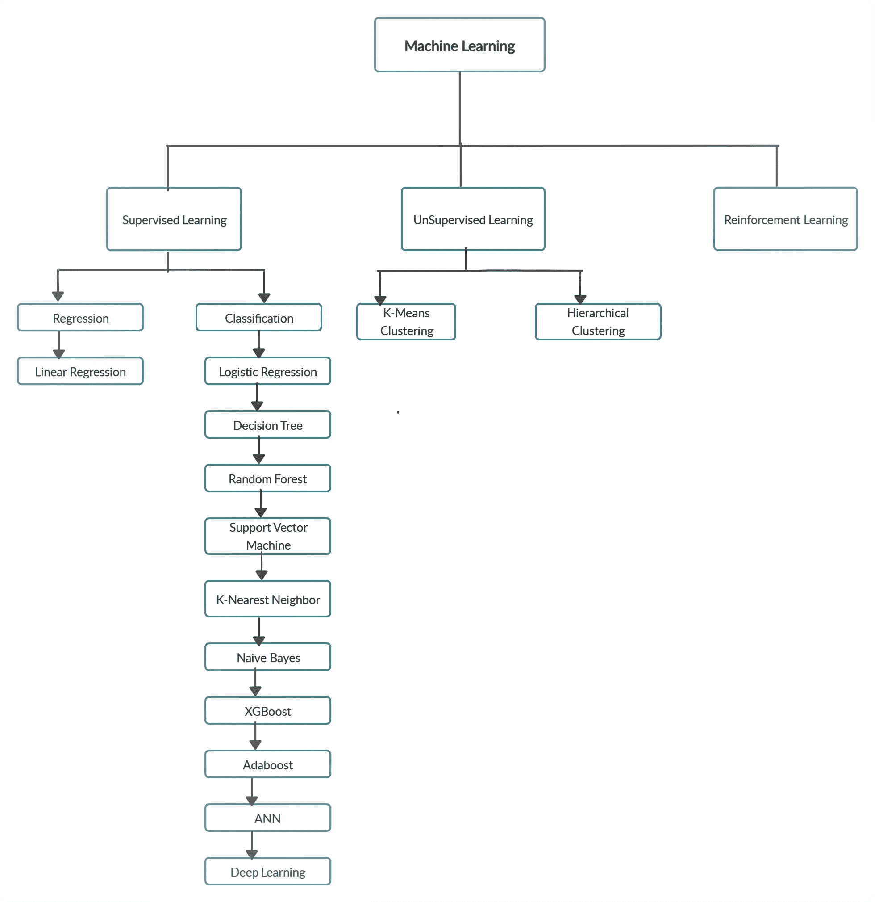

# 机器学习模型的完整生命周期

> 原文：<https://medium.datadriveninvestor.com/data-pre-processing-steps-in-machine-learning-55acce6eeb0f?source=collection_archive---------4----------------------->

image: networkworld.com

## 开发和部署您的 ML 模型的关键步骤

# 需求收集

这首先是重要的一步。需要建模的业务用例应该被识别。可能的情况是，业务问题可以通过软件工程来解决，不需要建模。现在，让我们继续考虑，我们需要一个健壮的模型，它可以为训练和测试数据集提供良好的准确性。

# 收集数据

应该确定和收集数据的来源。少数数据源可以是 SQL 数据库、NoSQL 数据库、云。csv，。txt 等。

# 数据预处理步骤(EDA):

在建立任何机器学习模型之前，执行数据预处理以将正确的数据输入模型进行学习和预测是至关重要的。模型的强度取决于数据的质量。下面是需要执行的各种预处理步骤。详情[此处](https://medium.com/@anjanimca2007/data-science-data-preprocessing-eda-6be2860fbb5d)。

1.  处理空值或缺失值。(在具有连续值特征的情况下，使用均值/中值/众数，使用多数类值或使用任何分类技术来预测具有分类值的特征的值。或者，如果数据集很大，您可以删除具有空值的行)
2.  异常值或偏斜检测和去除。
3.  发现并解决不平衡的班级问题。
4.  重复数据检查。
5.  不一致值检查。
6.  缩放/标准化。
7.  编码分类变量。

# 特征工程/特征选择步骤:

在这一步中，我们将选择那些最适合我们的机器学习模型的特征，并执行以下步骤。详情[此处](https://medium.com/@anjanimca2007/data-science-feature-engineering-feature-selection-18d5cc32bf2c)。

1.  领域专业知识。
2.  相关性检查和相关特征之一的移除。
3.  协方差检查。
4.  零差异检查。
5.  移除具有最大空记录或空记录的要素。
6.  删除重复的特征(如由任何其他列的平方创建的列)。
7.  删除不需要的特征(如身份证、姓名、票号等)。)
8.  虚拟变量的移除。
9.  利用主成分分析(PCA)进行维数约简。

# 型号选择

在这一步中，我们需要为我们的用例选择正确的模型(有监督的或无监督的，基于问题陈述，无论是其回归或分类或聚类问题)和正确的参数集，并训练该模型。一般来说，对于任何用例，都会创建各种模型，并选择提供最佳性能的模型。这一步包括对用例及领域的全面理解。

**回归模型**:预测连续值(如房价或工资)

**分类模型**:预测离散值(例如是/否，真/假)

注意:监督类别中提到的一些分类模型也可以用于回归。

# 模型调整

这是数据科学生命周期中非常关键的一步。在这里，我们检查我们创建的模型的训练和测试准确性。训练精度很高而测试精度很低的模型属于模型过拟合的情况。

在这种情况下，我们的模型不能很好地从我们的训练数据中*推广*到看不见的数据。我们可以说这也是过度拟合——当我们有一个已经记住训练数据集的模型在现实世界中表现不佳。换句话说，如果模型或算法显示低偏差但高方差，就会发生这种情况。

为了避免过度拟合模型，可以执行以下步骤。

1.  在模型中提供不同的参数值，并多次拟合模型，以查看训练和测试得分较高的参数。
2.  使用 GridSearchCV 查找最佳超参数。这将给出该特定模型的最佳参数。

# 模型性能

回归模型有各种不同的性能度量

1.  r 平方(R2)
2.  可调 R 平方(R2)
3.  均方误差
4.  均方根误差(RMSE)

基于分类模型的绩效衡量工具:

1.  混淆矩阵
2.  精确
3.  回忆
4.  ROC 曲线
5.  准确(性)

# 模型部署

一旦模型被创建和测试，我们需要将它部署到生产中。有多种部署方式:

1.  使用 AWS 和 AZURE 进行部署
2.  使用 FLASK 和 DJANGO 进行部署

结论:我们已经在这里讨论了模型的端到端部署应该遵循的所有主要的机器学习生命周期步骤。如果你喜欢我的文章并想了解更多，请张贴 **50 鼓掌**和**关注**我的博客。

想要连接:

联系方式:[https://www.linkedin.com/in/anjani-kumar-9b969a39/](https://www.linkedin.com/in/anjani-kumar-9b969a39/)

如果你喜欢我在 Medium 上的帖子，并希望我继续做这项工作，请考虑在 [**版块**](https://www.patreon.com/anjanikumar) 上支持我