# 使用 Scikit-Learn 进行数据预处理

> 原文：<https://medium.datadriveninvestor.com/data-pre-processing-with-scikit-learn-9896c561ef2f?source=collection_archive---------7----------------------->

当**特征在相对较小的规模上被缩放**并且*正态分布*时，大多数机器学习工作流运行得更好。通用的 **sklearn .预处理包**包括许多效用函数和转换器类，它们*将特征向量*缩放成更适合下游估计器的表示。每个标量、转换器和规格化器对于特定数据集是最佳的，并且不同地影响异常值；每种方法都针对特定的模型类型和特征值进行了优化。

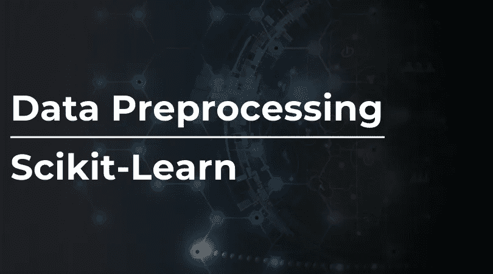

> 我只向已经了解基本 numpy 的读者推荐这篇文章。

# **标准化**

这种方法是在 **sklearn** 中实现的大多数基于 ML 的估计器模型所必需的。如果单个特征不反映具有**零均值和单位方差**的标准正态分布数据，则模型可能表现不佳。大多数时候，我们会忽略数据描绘的分布形状，而只是移除每个特征的平均值并对其进行缩放，这是通过非恒定特征及其标准差的除法来完成的。

 [## 将定义 2020 年就业前景的五大数据科学和机器学习趋势|数据驱动…

### 数据科学和 ML 是 2019 年最受关注的趋势之一，毫无疑问，它们将继续发展…

www.datadriveninvestor.com](https://www.datadriveninvestor.com/2020/02/19/five-data-science-and-machine-learning-trends-that-will-define-job-prospects-in-2020/) 

ML 算法*的**目标函数**中的大多数元素假设特征以零为中心，并且具有相同顺序的方差*。这意味着方差数量级高于其他数据点的特征将支配目标函数；估计器将不能正确地从其他特征中学习。

Sklearn 的**缩放**函数在*类似数组的数据集*上执行同样的操作。**缩放后的数据具有零均值和单位方差**。

> *本质上，缩放指的是在分布形状保持不变的情况下改变值的范围——类似于创建建筑模型，该功能具有相同的比例，但将所有内容缩放到更小的范围(默认为 0 到 1 之间)。*

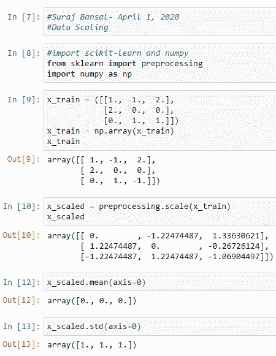

# **标量**

我想进一步探究三个主要标量。

**标准标量**用以下公式标准化特征: *z = (x — u) / s*

> *其中****表示训练样本的均值，如果 with_mean=False 则为 0，* **s** *表示训练样本的标准差，如果 with_std=False 则为 1。***

**这个标量的总分布等于 **1** 以及方差，因为我们知道*方差=标准差的平方*。分布的平均值变为 0，因此大约 68%的值将存在于(-1，1)的范围之间。**

> ***查看属性、参数和方法的链接->*[https://sci kit-learn . org/stable/modules/generated/sk learn . preprocessing . standard scaler . html](https://scikit-learn.org/stable/modules/generated/sklearn.preprocessing.StandardScaler.html)**

**下面是一个标准标量如何工作的例子:**

**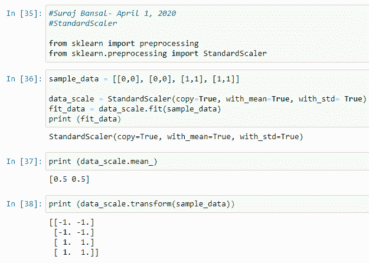**

****最小最大标量** *减去每个特征中的最小值，并除以范围*，该范围是原始最大值和最小值之间的差，同时保持分布的形状。这种转换和计算可以这样解释:**

**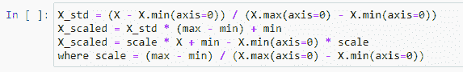**

> ***方法、参数和属性可以在这里找到->*[*https://scikit-learn . org/stable/modules/generated/sk learn . preprocessing . minmax scaler . html # sk learn . preprocessing . minmax scaler . transform*](https://scikit-learn.org/stable/modules/generated/sklearn.preprocessing.MinMaxScaler.html#sklearn.preprocessing.MinMaxScaler.transform)**

**让我们看看这在代码中是怎样的。总结一下，我们导入定标器，定义数据集，定义定标器，拟合变换数据集，然后打印。**

**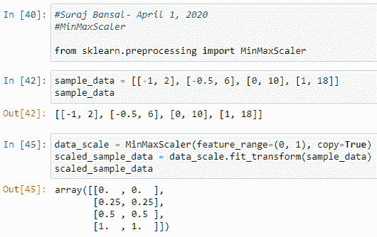**

**接下来，我想解释一下**鲁棒标量**，它通过*从单个特征中减去中值并除以四分位数间距*来转换特征向量。与 MinMaxScaler 不同，RobustScalar 不会将数据缩放到预先确定的区间，并且在减少离群值对模型预测的影响方面**更有效。****

> ***查看本文档了解属性、参数和方法->*[*https://sci kit-learn . org/stable/modules/generated/sk learn . preprocessing . robust scaler . html*](https://scikit-learn.org/stable/modules/generated/sklearn.preprocessing.RobustScaler.html)**

**下面是如何将这种现象解释成代码:**

**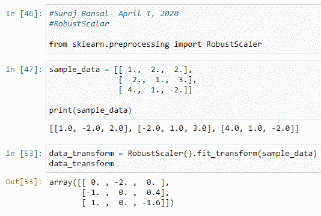**

## ****正常化****

**归一化将缩放单个要素的过程置于上下文环境中，使其具有**单位范数**，对于二次形式(如点积或其他旨在量化相似性的核)尤其有价值。**

> ***单位范数是指每个元素的平方之和= 1。***

**这一理论是向量空间模型的前提，向量空间模型已经广泛应用于文本分类和上下文聚类。规格化器关注于**行而不是**列，并将特征转换为 **(-1，1)** 范围内的值。**

**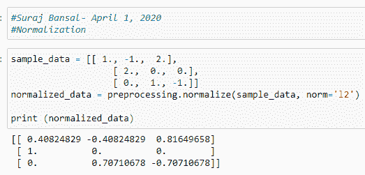**

**规格化器的独特之处在于它们接受来自 spicy.sparse 的密集数组和稀疏矩阵作为输入！对于稀疏输入，数据集被转换成**压缩的稀疏行**，然后被馈送给 Cython 例程。**

> ***这些标量的总结可以在这里找到->*[*https://docs . Google . com/spreadsheets/d/1 mlxh 4 yhzufzi 9 cxnzpmrwnsissxdnitdnaa 7 gf 4 WDM lak/edit？usp =共享*](https://docs.google.com/spreadsheets/d/1Mlxh4YHzUfZI9cxNZPMRwNsIsxditdnAA7gF4WDmLak/edit?usp=sharing)**

# ****非线性变换****

**还有进行**非参数变换**的非线性变换器，其将数据映射到值在 0 和 1 之间的均匀分布。**量化变换器**提供非线性变换，其中边缘异常值和内界值之间的距离减小。 **PowerTransformer** 将数据映射到正态分布，目的是稳定方差。**

***量化转换器*使用公式**g^-1(f(x)】**将每个特征放入相同的分布中。此公式为真，其中 ***F*** 表示特征的累积分布函数，*表示我们输出分布的分位数函数。***

> ***这个公式的前提建立在两个支柱上。***

1.  ***如果 ***X*** 是具有连续累积分布函数的随机变量， ***F*** ，那么 ***F(X)*** 在**【0，1】**范围内均匀分布***
2.  ***如果*代表一个均匀分布的随机变量**【0，1】，**那么*具有分布， ***G********

****这个分位数转换器平滑不寻常的分布，并且比其他缩放器更少受到离群值的影响。也就是说，这扭曲了每个单独特征内部和之间的相关性和距离。****

******PowerTransformer** 有两个主要方法； **Yeo-Johnson** 变换和 **Box-Cox** 变换。Box-Cox 是正数据点专用的**。两个变压器都由通过最大似然估计计算的λ参数化。******

****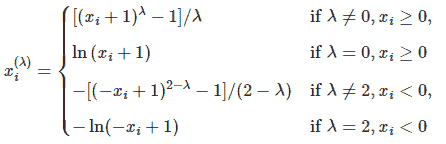********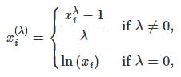****

****数学有点复杂——让我们探索 Box-Cox 的一个例子，其中样本从对数正态分布抽取到正态分布。****

****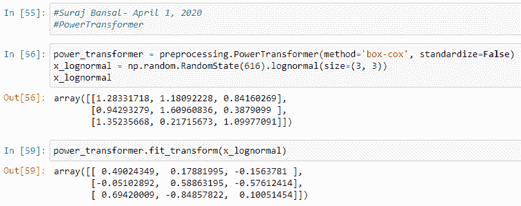****

> *****请注意，默认情况下，设置标准化= False 会将零均值和单位方差标准化应用于转换后的输出。*****

# ******比较影响******

****所有这些标量都是 dope——但是它们有不同的用例。让我们了解一下每一个是如何影响下面的数据分布的****

## ****原始数据可视化****

****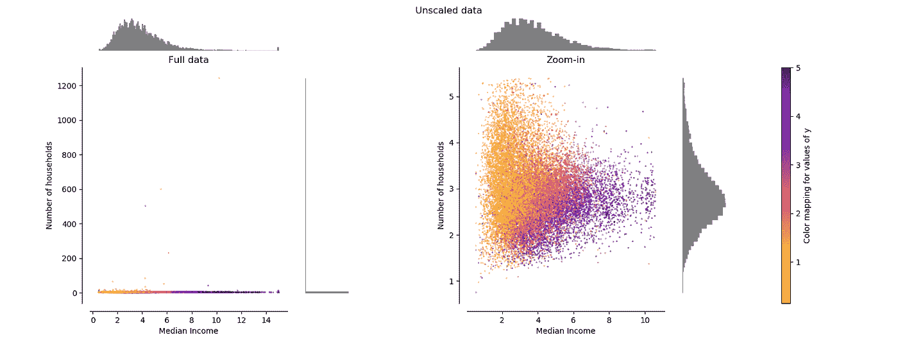****

****左图代表整个数据集，右图显示没有边缘异常值的放大图**。大多数样本被压缩到中等收入的[0.10]和家庭数量的[0.6]范围内。******

## ****标准标量****

****在**消除平均值**后，标准标量将数据缩放至**单位方差**。也就是说，异常值会影响数据集经验平均值和标准偏差的计算，从而缩小特征范围。大多数数据存在于中位数收入的 **[-2，4]** 范围之间，而同一数据进一步减少到家庭的 **[-0.2，0.2】**。****

****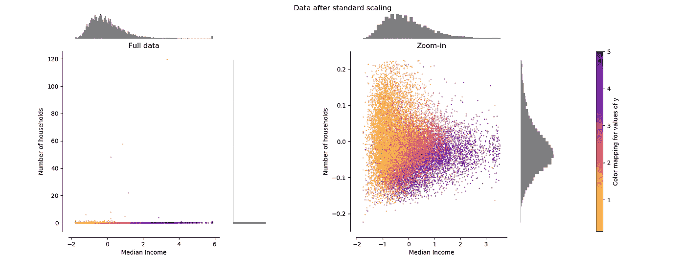****

## ****最小最大标量****

****MinMaxScalar 会将数据重新缩放到默认的特征范围**【0，1】**。这意味着，对于转换后的家庭数量，内联数被压缩到 0 和 0.005 的狭窄范围内。****

****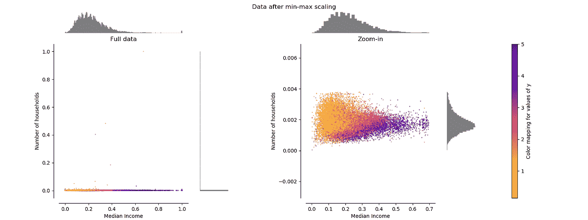****

## ****鲁棒标量****

****稳健标量*受异常和异常值*的影响较小。大多数转换值存在于 **[-2，3]** 的范围之间，并且**异常值仍然存在于**转换数据图中****

********

## ****标准化者****

****标准化器重新调整每个样本的向量以保持单位范数；每个样本被映射到**单位圆**上。由于在本例中特征仅具有正值**，因此转换后的数据仅代表正象限**。该输出根据输入值的数量(负值或正值)而变化。********

******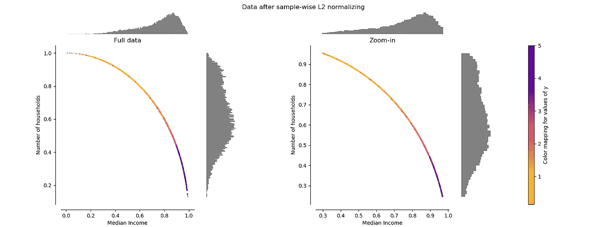******

## ******非线性变压器******

******还记得非线性变压器吗？我们也可以用这些！用 Yeo-Johnson 和 Box-Cox 实现的 **PowerTransformer** 如下所示。请记住，除非另有说明，否则此方法应用零均值、单位方差标准化，并且 Box-Cox 只适用于正值数据。******

> ******在负值足够多的情况下，Yeo-Johnson 无疑是首选。******

******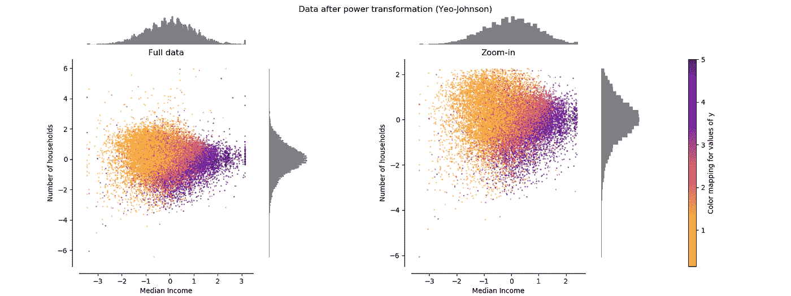******

********量化转换器**的独特之处在于它有一个*附加输出分布参数*，使该方法能够匹配**高斯分布**而不是正态分布。******

******我只建议将此转换器用于具有极值的数据集，因为它会引入饱和伪像，并且是非参数化的，这意味着数据不需要符合正态分布。******

******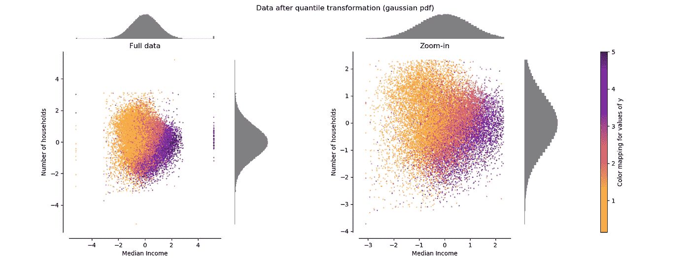******

# ******最后一件事******

> *********WOAH*** *这是大量的数学和代码…希望你能够进一步理解数据预处理和具体的用例。如果你能通过做以下事情来支持我这个作家，那对我来说将意味着一切*******

1.  ******注意👏图标？给我的文章发些掌声******
2.  ********通过 [LinkedIn](https://www.linkedin.com/in/suraj-bansal/) 、[meduim](https://medium.com/@bansalsuraj03)️and[github](https://github.com/Suraj-Bansal)与我联系👈********
3.  ******查看我的个人网站和作品集，了解我的最新作品💪******
4.  ******关注我的旅程，订阅我的每月简讯🦄******