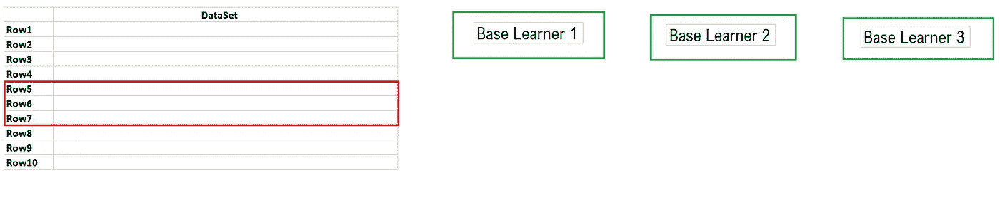
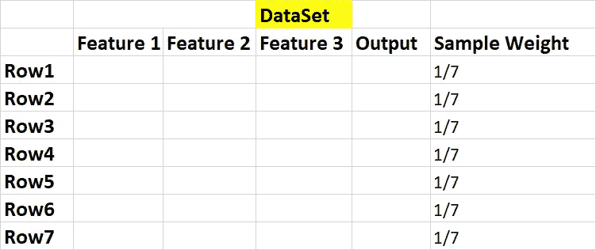
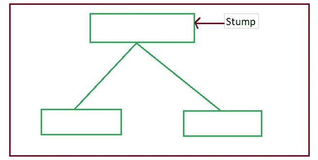
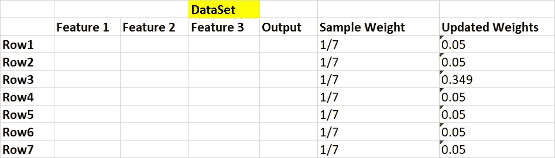
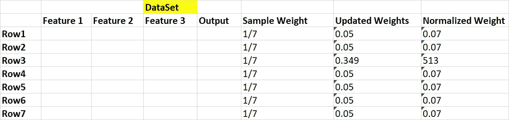
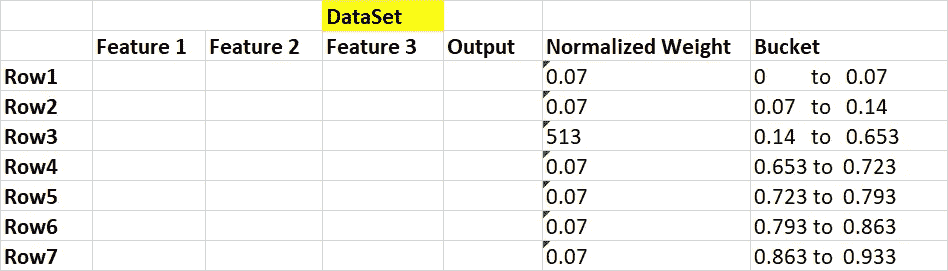
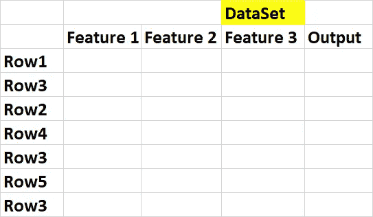
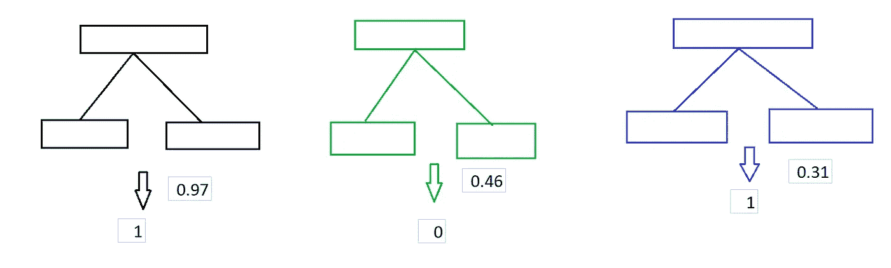

# 数据科学:AdaBoost 分类器

> 原文：<https://medium.datadriveninvestor.com/data-science-adaboost-classifier-4879a45c4300?source=collection_archive---------6----------------------->

image:BBVA

**简介:**

提升是一种用于从多个弱分类器创建强分类器的集成技术。集成技术的一个众所周知的例子是随机森林，它使用多个决策树来创建一个随机森林。除了 Adaboost 之外，一些众所周知的增强技术是梯度增强、XGBoost 等。

## **直觉:**

[AdaBoost](https://en.wikipedia.org/wiki/AdaBoost) ，简称 **Adaptive** **Boosting** 是第一个成功开发的用于二分类的 Boosting 算法。它是一种受监督的机器学习算法，用于提高任何机器学习算法的性能。它最适合像决策树这样的弱学习者。这些模型在一个分类问题上达到的准确度仅高于随机几率。

## **AdaBoost 的概念很简单:**

我们将把我们的数据集传递给多个基础学习者，每个基础学习者将尝试纠正被其前辈错误分类的记录。

我们将数据集(如下图所示，所有行)传递给**基础学习者 1** 。**基础学习者 1** 的所有误分类记录(第 5、6 和 7 行被误分类)将被传递给**基础学习者 2** ，同样**基础学习者 2** 的所有误分类记录将被传递给**基础学习者 3** 。最后，基于每个基础学习者的大多数投票，我们将对新记录进行分类。

**让我们看看 AdaBoost 分类器的逐步实现:**

**步骤 1** :取数据集，给给定数据集中的所有样本(行)分配初始权重。

W=1/n =>1/7，其中 n 是样本数。

第二步:我们将创建第一个基础学习者。在 AdaBoost 中，我们使用决策树作为基本学习器。这里要注意的一点是，我们将只创建深度为 1 的决策树，它们被称为**决策树桩或树桩。**

我们将为数据集的每个要素创建树桩，就像在我们的例子中，我们将为每个要素创建三个树桩。

**步骤 3** :我们需要根据每个特征的熵值或 ginni 系数来选择任何一个基础学习器模型(为特征 1 创建的基础学习器 1、为特征 2 创建的基础学习器 2、为特征 3 创建的基础学习器 3)。(我已经在我的决策树文章中讨论过 ginni 和熵)。

熵或 ginni 系数值最小的基学习器，我们将选择它作为我们的第一个基学习器模型。

**步骤 4** :我们需要找到多少记录被正确分类，以及多少记录被我们在步骤 3 中选择的基本学习者模型错误分类。

我们必须找出所有错误分类的总误差。假设我们正确分类了 4 条记录，错误分类了 1 条记录

总误差=错误分类记录的样本权重总和。

因为我们只有一个误差，所以总误差=1/7

**第五步**:用下面的公式检查树桩的性能。

当我们把总误差放入这个公式中时，我们将得到值 0.895(不要偷懒放值和计算)

通过以下等式更新正确和错误分类样本(行)的样本权重。

**错误分类样品的新样品重量=**

**正确分类样品的新样品重量=**

注意:我们假设第 3 行分类不正确

**步骤 6** :我们在此考虑的要点是，当我们将所有样本权重相加时，其等于 1，但在更新权重的情况下，总和不等于 1。因此，我们将每个更新的权重除以它们的总和，我们将得到归一化值 1。

更新后的权重之和为 0.68

**第 7 步:**我们将通过删除“样本权重”和“更新权重”特性来创建数据集，并将每个样本(行)分配到一个存储桶下。

**步骤 8 :** 创建一个新的数据集。为此，我们必须从 0 到 1(对于每个样本(行))中随机选择值，并选择该样本，它落在桶下，并将该样本保存到新的数据集中。由于错误分类的记录具有更大的存储桶大小，选择该记录的概率非常高。

我们可以看到，分类不正确的记录(行 3)在我们的数据集中被选择了 3 次，因为它的存储桶大小比其他行大。

**步骤 9 :** 对下一个树桩(基础学习者 2、基础学习者 3)使用这个新数据集，并对所有特征执行步骤 1 到 8。

Adaboost 模型通过让森林中的每棵树对样本进行分类来进行预测。然后，我们根据他们的决定把树分成组。现在对于每个组，我们把组内每棵树的重要性加起来。森林作为一个整体所做的最终分类是由具有最大总和的组确定的。下图。

**Adaboost 分类器的分步 Python 代码:**

## AdaBoost 分类器的优势:

1.  AdaBoost 可用于提高弱分类器的准确性，从而使其更加灵活。它现在已经扩展到了二元分类之外，并且在文本和图像分类中也有使用案例。
2.  AdaBoost 具有很高的精确度。
3.  不同的分类算法可以用作弱分类器。

## **缺点:**

1.  助推技术循序渐进地学习，确保你有高质量的数据是很重要的。
2.  AdaBoost 对噪声数据和异常值也非常敏感，因此如果您计划使用 AdaBoost，强烈建议您消除它们。
3.  AdaBoost 也被证明比 XGBoost 慢。

结论:在本文中，我们讨论了理解 AdaBoost 算法的各种方法。如果使用准确，AdaBoost 就像是提高我们分类算法准确性的福音。

希望你喜欢我的文章。请鼓掌(最多 50 次)，这将激励我写更多。

想要连接:

链接进来:[https://www.linkedin.com/in/anjani-kumar-9b969a39/](https://www.linkedin.com/in/anjani-kumar-9b969a39/)

如果你喜欢我在 Medium 上的帖子，并希望我继续做这项工作，请考虑在**上支持我**