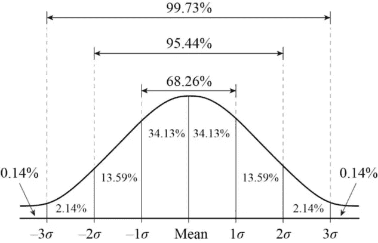
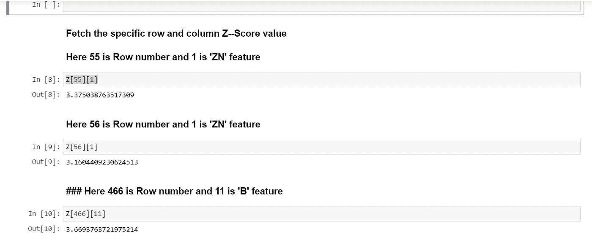

# 数据科学:数据预处理(EDA)

> 原文：<https://medium.datadriveninvestor.com/data-science-data-preprocessing-eda-6be2860fbb5d?source=collection_archive---------3----------------------->

image:[securityindustry.org](https://www.securityindustry.org/)

# 数据预处理步骤(EDA)

在建立任何机器学习模型之前，执行数据预处理以向模型提供正确的数据来进行学习和预测是至关重要的。模型性能取决于提供给要训练的模型的数据质量。

下面是各种预处理步骤。让我们在这里详细讨论

## **处理空值/缺失值。**

在任何给定的数据集中，如果任何特征有超过 30%的缺失值，我们需要检查该特征的重要性。如果该特征是重要特征，则使用统计方法，如平均值、中值或众数来填充缺失值。如果特征不重要，则需要从数据集中移除该特征。

1.  **识别数据中的**缺失值
2.  **替换数据中的**缺失值，以及
3.  **从数据中删除**缺失值。

步骤**识别**、**替换或移除**具有空值的特征。

假设我们有下面的数据集。

HousePrice.csv

## **处理偏斜数据。**

偏斜数据在数据科学中很常见。偏斜度是正态分布的扭曲程度。

**偏态的类型。**
广义来说，有两种偏态:
它们是

(1)正偏度。

(2)负偏态。

在二进制分类情况下，偏斜数据意味着一个类在数据中比另一个类更具代表性。

 [## 将定义 2020 年就业前景的五大数据科学和机器学习趋势|数据驱动…

### 数据科学和 ML 是 2019 年最受关注的趋势之一，毫无疑问，它们将继续发展…

www.datadriveninvestor.com](https://www.datadriveninvestor.com/2020/02/19/five-data-science-and-machine-learning-trends-that-will-define-job-prospects-in-2020/) 

偏斜导致的可能结果首先是最严重的:

**坏模型**:你学习的分类器将不能完成它的任务(识别正确的类)。
**低效的培训**:培训过程会投入大量的时间和精力来调整“无趣的参数”，因为它们似乎会区分不同的类别。
**遗漏好的特征，强调无用的特征**

为了消除偏斜，可以对数据进行归一化或缩放。
归一化或缩放是指将所有列纳入同一范围。两种最常见的标准化/缩放技术是:

1.  最小-最大值:

2.z 分数:

**注**:缩放(通过 Z 得分完成)更好，因为它将数据转换为标准正态分布或 Z 分布，其中均值=0，标准差=1。它也处理异常值。

## **异常值检测和剔除**

简单来说，离群值是远离其他数据点的数据点。*在统计学中，一个* ***离群点*** *是一个远离其他观测值的观测点。*

如下所述，有各种方法来识别数据集中的异常值。

1.  四分位距(IQR)——可变性的一种度量。
2.  箱线图——通过四分位数对数值数据的图形描述。

Boxplot

3.散点图—使用散点的图形描述。

下面是散点图。我们可以在图表顶部看到一些异常值。

Scatter Plot

4.直方图也强调了异常值的存在。

5.z 分数——它告诉我们任何数据点距离平均值有多少标准偏差。

**使用 Z 分数识别异常值:**

为了将正态分布(也称为高斯曲线或钟形曲线)转换为标准正态分布(Z 分布),我们使用 Z 得分。

Image:chegg.com

Z-score 是寻找平均值为 0、标准差为 1 的数据分布。正如已经讨论过的，Z 得分值将告诉我们我的数据离平均值有多少标准差。这些远离平均值的数据点将被视为异常值。

在大多数情况下，使用阈值 3 或-3，即如果 Z 分值分别大于或小于 3 或-3，则该数据点将被识别为异常值。

当我们有小数据集时，很容易识别异常值，但是当我们有数百万行和数千个特征时，我们该如何处理呢？

我们需要使用一些统计技术来找出异常值。让我们看看我们的代码。我们导入了著名的“波士顿”数据集来寻找异常值。

我们使用 scipy 的统计模块来查找 z 疮。

查找 Z 得分值并过滤掉大于 3 的 Z 得分。

这里 3 表示数据点距离平均值 3 个标准差。(见上图)

下面的代码将向您显示异常值，以及这些特性和行的详细信息。类似地，我们可以打印所有异常值特征和行号。

离群值(如果可能，在业务离散后)应被删除，因为它们扭曲统计分析并违反其假设。

## **查找并修复不平衡类。**

机器学习模型受不平衡类的影响。当数据集中的一个类比另一个类占优势(拥有更多数量的数据值)时，就会出现这种情况。例如，当一个类支配另一个类时，如果数据不平衡，决策树学习者会创建有偏向的树。据说是在训练机器学习模型之前修复这个问题。

**以下是解决不平衡等级问题的一些方法。**

1.  对不平衡数据使用基于 Bagging 的技术。支持*带替换重采样和无替换重采样*。
2.  惩罚算法(对成本敏感的培训)
3.  尝试按如下方式更改您的绩效指标。
4.  您可以从被称为过采样(或更正式的替换采样)的代表性不足的类中添加实例的副本。
5.  您可以从被称为欠采样的过表示类中删除实例。
6.  尝试生成合成样本。(使用 SMOTE -合成少数过采样技术。这使用 KNN 算法来生成合成样本)

建议查看以下性能度量，这些度量比传统的分类准确性更能洞察模型的准确性:

A.混淆矩阵:将预测分解成一个表格，显示正确的预测(对角线)和错误预测的类型(错误预测被分配到哪个类别)。

B.精度:对分类器准确性的一种度量。
C .召回:分类器完整性的度量
D. F1 分数(或 F 分数):精确度和召回的加权平均值。

 [## 机器学习模型的性能度量

### 众所周知，当我们创建机器学习模型来预测任何连续值(如房子…

medium.com](https://medium.com/analytics-vidhya/performance-metrics-for-machine-learning-models-48990018ebd6) 

## **编码分类数据**

正如我们所知，大多数机器学习模型(如线性回归、逻辑回归、svm 或 k-means 等。)处理连续数据，需要将数据集中可用的分类变量转换为连续变量。

有各种方法可以做到这一点。

1.  标签编码:用于将非数字标签转换为数字标签。
2.  使用统计平均值或模式将数字箱转换为数字，例如*0–17 到 14* 。

最后注意:我已经给了你数据预处理步骤的要点。可以有更多的业务和项目的需要，但这些是主要的。希望你喜欢阅读。如果你喜欢我的文章并想看更多，请张贴 **50 个掌声**和**关注**我的博客。

想要连接:

联系方式:[https://www.linkedin.com/in/anjani-kumar-9b969a39/](https://www.linkedin.com/in/anjani-kumar-9b969a39/)

如果你喜欢我在 Medium 上的帖子，并希望我继续做这项工作，请考虑在 [**版块**](https://www.patreon.com/anjanikumar) 上支持我