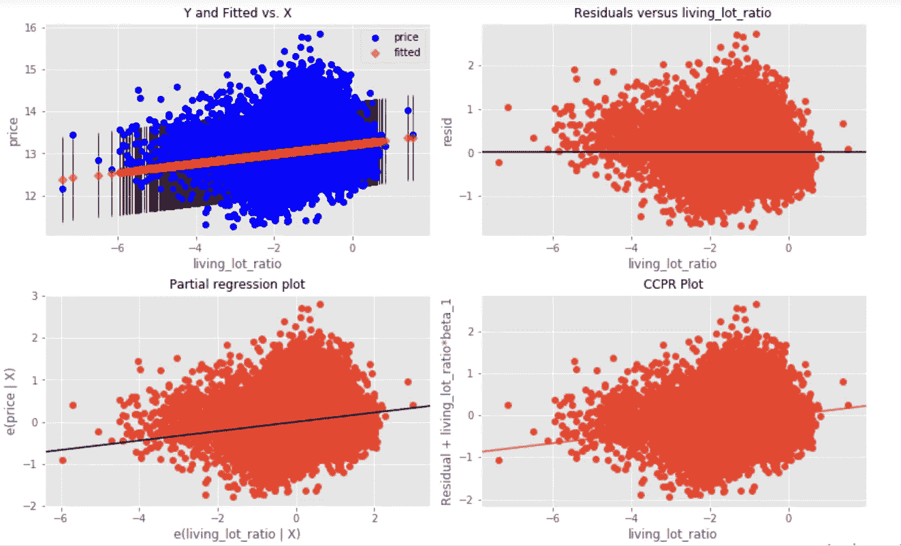

# 数据科学汇报:我的第一个多元回归分析+ 4 个关于逐步加法的问题

> 原文：<https://medium.datadriveninvestor.com/data-science-debrief-my-first-multiple-regression-analysis-4-questions-about-stepwise-addition-33c8244aa1d0?source=collection_archive---------16----------------------->

Photo by [Külli Kittus](https://unsplash.com/@kyllik?utm_source=unsplash&utm_medium=referral&utm_content=creditCopyText) on [Unsplash](https://unsplash.com/s/photos/still?utm_source=unsplash&utm_medium=referral&utm_content=creditCopyText)

> 拟合最终选择的模型，然后报告估计值和置信区间，而不调整它们以将模型建立过程考虑在内的频繁实践导致了完全停止使用逐步模型建立的呼吁[【5】](https://en.wikipedia.org/wiki/Stepwise_regression#cite_note-Flom2007-5)[【6】](https://en.wikipedia.org/wiki/Stepwise_regression#cite_note-6)，或者至少确保模型不确定性得到正确反映。[【7】](https://en.wikipedia.org/wiki/Stepwise_regression#cite_note-Chatfield1995-7)[【8】](https://en.wikipedia.org/wiki/Stepwise_regression#cite_note-8)—来自维基百科

**注**:如果你想直接进入 *S* tepwise 加法题，请向下滚动一点:)

在我通过熨斗学校参加的兼职在线数据科学项目中，完成我的第一个完整、真实的*鱼生活、*和专业的数据科学项目既有挑战性又有回报。

我经常听到术语*多元回归分析*，但是现在，我对*是什么、* [如何完成一个](https://github.com/emel333/house-price-predict)有了更全面的理解，为什么理解它很重要，它甚至帮助我了解了更多关于标记化的不动产在加密世界中是如何工作的。

## 我是这样解释多元回归分析的:

> 多元回归分析是一种利用两个或多个变量的*已知值来预测一个变量的 ***未知值*** 的技术。*

*由于该项目要求我使用一个众所周知的住房数据集，我受到启发，将该项目的商业案例集中在探索以分散、不信任的方式预测房价的方法上，这些方法针对的是一群分散的个人，他们在自己国家以外的令牌化房地产上进行部分投资。*

*目前，这仅仅是一个概念框架，用来指导我的第一个多元回归分析。*

*还有一些项目正在努力开发这方面的解决方案。*

***我只是尝试了一些我认为可能有用的功能工程**——考虑到商业案例的背景——尽管没有一个能够通过回归假设或在项目的建模阶段产生可接受的 p 值。*

## *例如:*

**我想在建模过程中，也许活批次比率会有助于获得高 R 平方值，但事实证明并非如此。**

**此外，生活批次比率的残差对其分布显示出异方差性，所以最终我放弃了它作为一个独立变量。**

**

*The residual plot visualization for a feature I engineered — living_lot_ratio.*

*尽管如此，探索住房数据、开发假设并设计实验来测试它们还是很有趣的。*

*特别有趣的是，广泛用于拟合回归模型的*逐步加法*方法*去掉了*我的一个特性。*

*这让我对这个方法很好奇，这也是我将在这篇文章的剩余部分讨论的。*

# *关于逐步加法的 4 个问题*

*到最后，我们将有以下问题的答案:*

1.  *到底什么是逐步加法？*
2.  *对回归建模有多大价值？*
3.  *逐步加法如何影响现实世界的解决方案？*
4.  *在回归建模过程中使用逐步加法时，需要记住哪些重要的事情？*

* [## 一瞬间学会数据科学！？数据驱动的投资者

### 在我之前的职业生涯中，我是一名训练有素的古典钢琴家。还记得那些声称你可以…

www.datadriveninvestor.com](https://www.datadriveninvestor.com/2020/07/23/learn-data-science-in-a-flash/)* 

# *什么是逐步加法？*

***用我的话来说:**这是一个基于底层测试添加和删除自变量的自动化过程*

*更官方的说法(**来自**[**Investopedia**](https://www.investopedia.com/terms/s/stepwise-regression.asp)):逐步回归是逐步迭代构建回归模型，其中**涉及选择最终模型中使用的自变量**。它包括连续添加或删除潜在的解释变量，并在每次迭代后**测试统计显著性**。*

*有三种主要方法(来自维基百科):*

*   ***正向选择**——从没有变量开始，执行统计测试以找到对模型给出最显著统计改进的变量，并重复此过程，直到不再有变量改进模型*
*   ***反向消除** —从所有变量开始，根据某个标准选择删除一个变量，并重复此操作，直到不再有变量被删除，从而导致模型出现统计上的重大损失*
*   ***双向淘汰**——差不多是向前和向后的结合*

**第三种方法是我采用的方法。**

*如果你愿意，可以查看这个项目的[库](https://github.com/emel333/house-price-predict)！*

# *逐步加法对回归建模有多大价值？*

*我在这里可以说的是，我看到了能够使用自动化过程来选择变量的价值。这尤其是因为我一次性编码了很多次，所以有很多虚拟变量。*

*拥有许多虚拟变量的一个后果是，当一个变量被删除时(例如，由于 p 值大于 0.05)，所有其他变量都会以某种方式进行调整，以适应没有删除变量的情况，因此剩余变量的 p 值可能会发生变化！*

*而且，这么多自变量，没有确凿的理由，我不想掉一个变量。*

*这就是为什么我想象逐步的方法经常被使用。这是业界公认的节省时间的方式。*

# *逐步加法如何影响现实世界的解决方案？*

*在一个充满大数据的世界里，潜在解释变量的数量可能会很大，因此从这个角度来看，这也许有助于使解决问题成为一种更有效的努力？*

*但是，另一方面，有人担心逐步添加会弊大于利。事实上,[这篇来自《大数据杂志》的论文](https://journalofbigdata.springeropen.com/articles/10.1186/s40537-018-0143-6)使用了一系列蒙特卡洛模拟来证明逐步回归是解决变量过多的糟糕解决方案。作者的主张是，事实上，**潜在解释变量的数量越大，逐步回归就越有可能产生误导。***

# *在回归建模过程中使用逐步加法时，需要记住哪些重要的事情？*

*以下是我今后将牢记在心的内容，我希望这对正在阅读这篇文章的人也有所帮助:*

*   ***考虑逐步加法作为*的手段*，而不是作为*的结尾****

*在做了一些逐步添加后，我的模型没有 p 值大于 0.05 的独立变量，但是，我认为仍然有太多的变量，并决定继续迭代和尝试其他方法，这样我就有希望达到用尽可能少的变量获得可靠的 R 平方值的目标。我有时也会问自己*为什么*一个特定的变量被遗漏了，比如我设计的功能(这是一个量化一个家庭的居住空间与其地段大小之比的功能)。我认为，如果头脑中没有清晰的业务案例或目标，并且没有适当的领域专业知识，很容易将逐步方法过度应用到数据科学实践中。*

*   ***如果你对一个或多个变量进行对数变换或缩放，将它们都包含在逐步加法过程中***

*这是我有一次最后做的事情。我选择缩放两个对数转换的变量，认为缩放将提高运行模型时变量的性能。然而，逐步增加揭示了我以前的变量有一个更好的“适合”,所以最终我放弃了缩放变量。我还有两个具有强烈多重共线性的变量，逐步方法显示了这些变量中的一个哑变量如何始终更好地“适合”模型。所以，我发现逐步加法在这方面很有用。*

**

*It’s good to step away from the laptop — to debrief, unwind and refresh. Isn’t it?*

*你怎么想呢?逐步添加是一种好的做法吗？你觉得用逐步加法进行大数据分析有意义吗？*

*我很想听听你的想法。*

*和平与富足*

## *获得专家观点— [订阅 DDI 英特尔](https://datadriveninvestor.com/ddi-intel)*