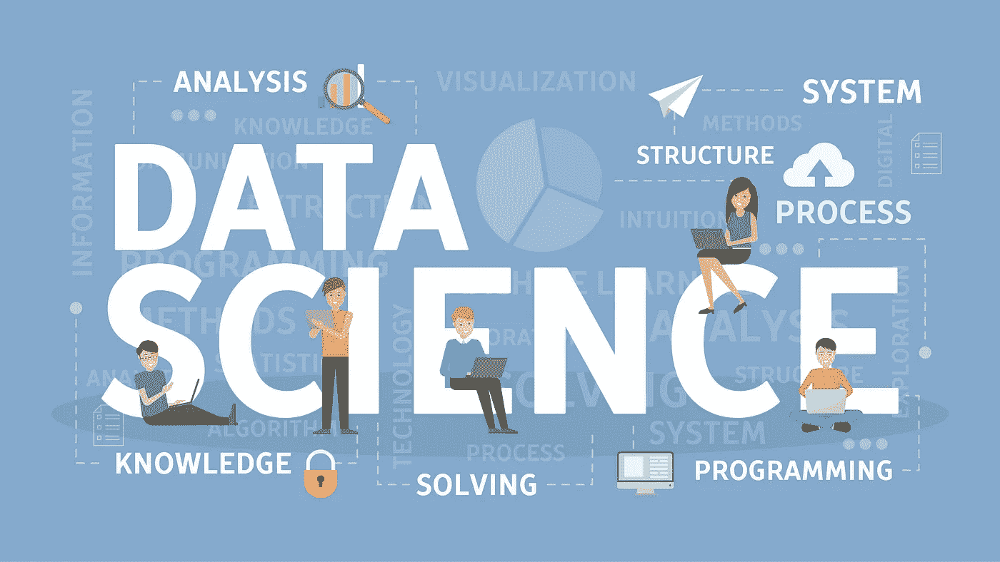
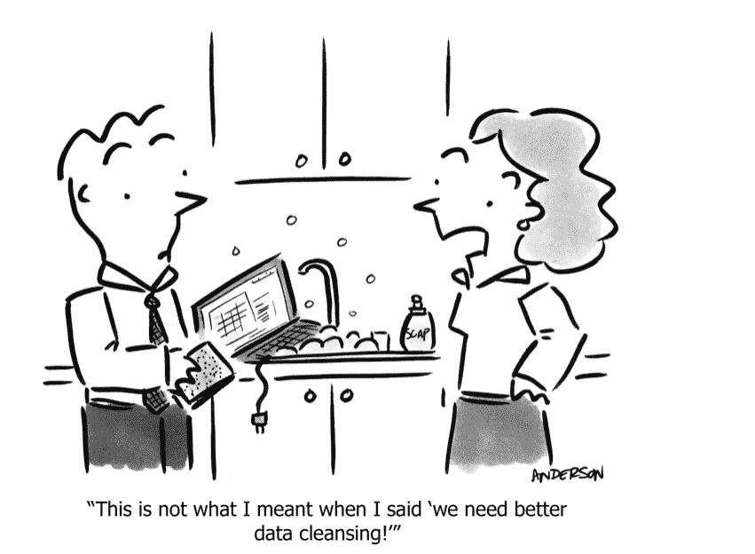

# 什么是数据科学？(数据科学揭秘)

> 原文：<https://medium.datadriveninvestor.com/data-science-demystified-what-is-data-science-ef031f6d0b6d?source=collection_archive---------6----------------------->

Data science includes many skills…

如果你听说过数据科学，请举手…如果你没有意识到你已经听说过这件事，我很抱歉。自从我们制造了计算机，我们就一直在产生源源不断的数据。这些数据大多是杂乱无章的，在极度空闲的情况下做不了多少事情。

 [## 成为数据科学家所需的 8 项技能|数据驱动型投资者

### 数字吓不倒你？没有什么比一张漂亮的 excel 表更令人满意的了？你会说几种语言…

www.datadriveninvestor.com](https://www.datadriveninvestor.com/2019/02/07/8-skills-you-need-to-become-a-data-scientist/) 

客观地说，我们所做的一切都会产生数据。当我去工作时，我的旅程(相当长..)产生海量数据。我的速度，我的路线，我拐了多少个弯，我诅咒了其他司机多少次，我的车消耗了多少燃料，这是里程数——这个列表几乎是无穷无尽的。我没有考虑这些数据的事实意味着我没有用它做任何事情，它是存在的，但同时也是无用的。这就是数据科学的用武之地。

> ***数据科学是对数据进行收集、存储、处理、描述和建模的科学。***

好的……让我们试着更精确一点。

*你有数据。要使用这些数据为您的决策提供信息，这些数据必须是相关的、组织良好的，最好是数字化的。一旦你的数据是连贯的，你就可以继续分析它，将它可视化，以便更好地理解你的业务表现。然后，你将目光投向未来，开始生成预测分析。借助预测分析，您可以评估潜在的未来场景，并以创造性的方式预测消费者行为。*

这概括地描述了上述定义中提到的 5 个步骤。

## **1。收集数据**

收集数据取决于提出的问题和业务环境。

示例 1:

让我们假设数据科学家在一家电子商务公司工作。数据科学家可能感兴趣的一个问题是**客户购买哪些商品？**

这里，数据已经存在于组织内部，数据科学家必须具备使用编程、SQL 或 NOSQL 访问数据的知识..等等。

示例 2:

让我们假设数据科学家正在为一个政党工作。数据科学家可能感兴趣的一个问题是**人们对党的新议程有什么看法？**

这里的数据是存在的(来自推特、脸书的帖子……)，但不在组织内部。因此，除了编程技能之外，数据科学家还必须具备网络抓取(抓取)和其他技能。

示例 3:

让我们假设数据科学家正在和农民一起工作。数据科学家可能感兴趣的一个问题是**种子类型、肥料、灌溉对产量的影响？**

在这里，数据是不可用的，数据科学家需要设计实验来使用统计等方法收集数据。

**因此，收集数据所需的技能是:**

*   中间程序设计
*   数据库知识
*   统计知识

## **2。存储数据**

一般来说，现实生活中存储的数据有三种类型:

1) **交易和运营数据**，包括病历、索赔发票、客户记录等。这些数据是结构化的，通常存储在关系数据库中。该数据针对 SQL 查询进行了优化。

2) **来自多个数据库的数据**，包括银行账户、信用卡和投资等。需要将这些数据集成到一个公共存储库中。这就是数据仓库发挥作用的地方。数据仓库从各种数据库中积累结构化数据。这些数据经过整理和优化，可用于分析。

3) **非结构化数据**包括文本、数据、视频和语音。这种类型的数据具有

1.  高容量
2.  高品种
3.  高速度

这些 3 V 是**大数据的特征。**它存储在数据湖中。这些数据不是经过策划的。

**存储数据所需的技能:**

*   编程；编排
*   关系数据库知识
*   NOSQL 数据库知识
*   数据仓库知识
*   数据湖知识(Hadoop)

## **3。加工数据**

*1)数据争论或数据欺骗:*

ETL(提取、转换和加载)的完整过程被称为数据争论或数据管理。

(或)

通过转换将不同格式的外部资源的数据集成到我们的数据库中被称为数据角力或数据管理。

*2)数据清理:*

数据清理包括

*   填充缺失值
*   纠正拼写错误
*   识别并移除异常值
*   标准化关键字标签

*3)数据缩放、标准化和规范化:*

缩放包括将公里转换成英里，或者将卢比转换成美元等等。

*标准化*包括确保数据的平均值和单位方差为零。

标准化数据包括 0 到 1 之间的值。

**数据处理所需技能:**

*   编程技能
*   Map Reduce(Hadoop)
*   SQL 和 NOSQL 数据库
*   基本统计

## **4。描述数据**

*1)可视化数据:*

理解数据如何有效理解是数据可视化。示例包括**分组条形图**和**散点图。**

*2)汇总数据:*

汇总数据有助于回答与之相关的问题。**推断统计**和**描述统计**有助于以更好的方式描述数据。

**描述数据所需的技能:**

*   统计数字
*   擅长
*   计算机编程语言
*   稀有
*   （舞台上由人扮的）静态画面

## **5。建模数据**

这是大多数人认为有趣的阶段。正如许多人称之为“神奇发生的地方”。它有两种类型

1.  统计建模

简而言之，**统计建模**是一种简化的、数学形式化的方法，用于逼近现实(即生成数据的因素)，并根据这种逼近进行预测。**统计模型**是使用的数学方程式。

2.算法建模

这种类型的建模侧重于构建处理高维数据的函数。该建模的目标包括

*   使用数据和优化技术估计函数。
*   给定一个新的输入，预测输出。

**数据建模所需技能:**

*   概率论
*   推论统计
*   结石
*   优化算法
*   机器学习和深度学习
*   Python 包和框架(numpy，scipy，scikit-learn，TF，PyTorch，Keras)

# 概述

我在这里展示的是对什么是数据科学的见解，以及典型的数据科学项目所涉及的步骤。我希望你今天学到了一些东西。如果您有任何反馈，请随时留言，并与任何可能觉得有用的人分享。