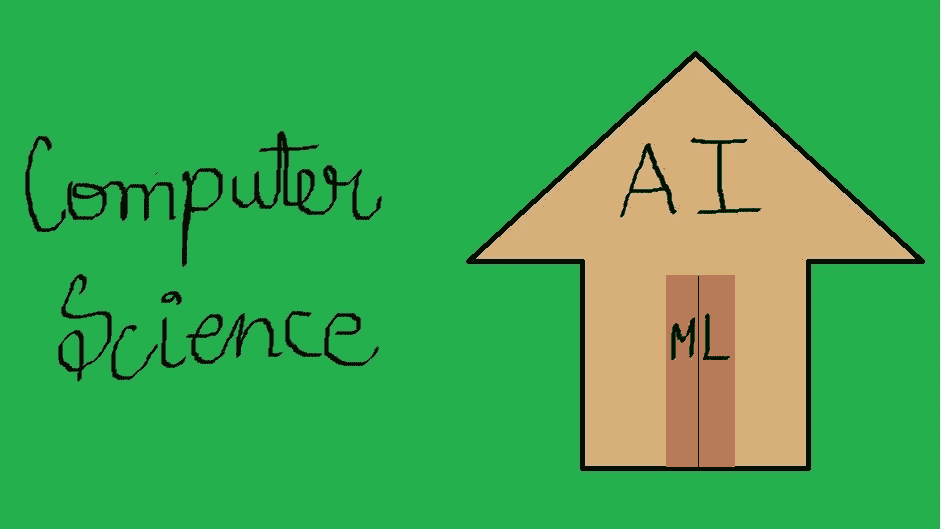
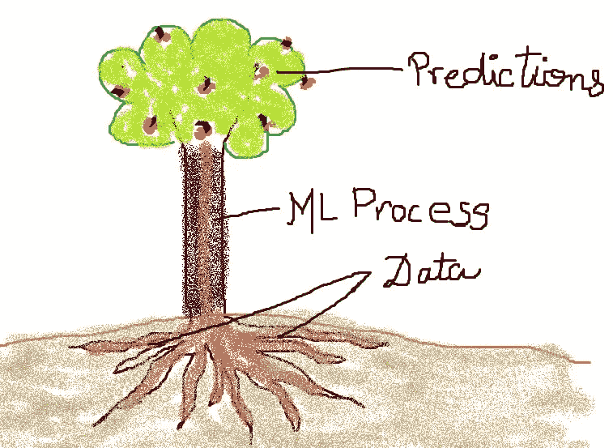
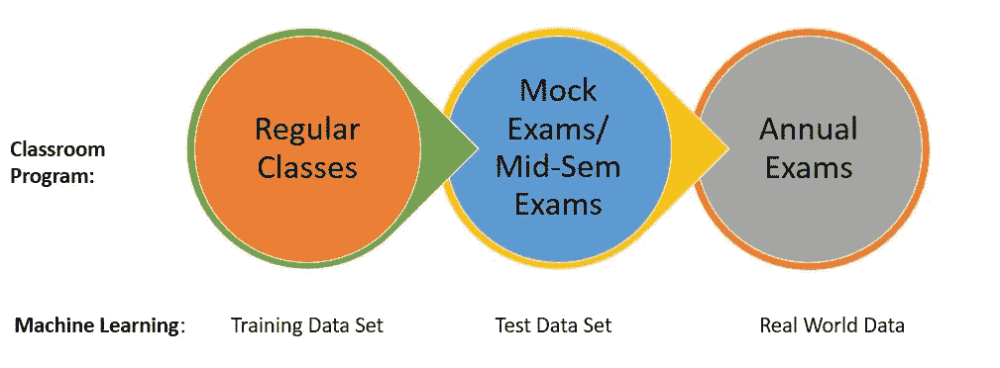

# 面向非数据科学家的数据科学(第 1 部分)

> 原文：<https://medium.datadriveninvestor.com/data-science-for-non-data-scientists-part-1-2689f422bea0?source=collection_archive---------2----------------------->

## 帮助你成为现实世界中的数据科学家的 10 个步骤！

经常听到没有数据背景的人对机器学习产生怀疑。老实说，几年前我也有过类似的疑虑！所以，这是我试图让你们一步一步地理解机器学习。

我相信你们都知道机器学习是人工智能的一部分，而人工智能是计算机科学的一部分。在我们的日常生活中使用它的地方有:*你可能认识的人(脸书)，个人助理(Google Home，Alexa 等。)、垃圾邮件检测、查看了该项目的客户也查看了(亚马逊)等。*

因此，让我们从 ML 的 0 级开始，了解机器学习过程是如何工作的。

# 什么是机器学习(ML)？机器学习中的“机器”是什么？

*   机器学习过程/模型只不过是一组规则(称为算法)，使用这些规则我们可以获得一个输出(称为预测)。但这些“机器学习”算法的特殊之处在于，这些“规则”可以根据更多数据、更多时间等不同因素不断改进。

> 因此，我们可以说“机器”是可以不断“学习”的算法，可以根据随时间推移提供的数据进行改进。因此，机器学习这个术语。

*   每一个人和每一件事——公司、大学、餐馆、家庭、人们——长期以来一直在收集和存储数据。并且该数据被认为是 ML 模型的根。因为如果没有数据，就没有建立 ML 模型的基础。我们将在下一部分看到原因。

# 数据对于 ML 模型来说是宝贵的！

*   机器学习过程建立在历史数据的基础上。这种“历史数据”只不过是以表格形式书写的历史(如卡交易、天气预报、经济、健康等。).还有各种其他形式，如文本、声音、图像等。但是我们现在将讨论表格数据。
*   “历史重演！”-从这些历史数据集中，如果出现类似的模式，ML 将尝试学习模式以预测未来的结果。(听起来很模糊？继续读！)
*   例如，在过去的 10 年里，如果我得分超过 90 分，我爸爸会给我一支笔，否则会给我一块巧克力。第 11 年，ML 模型预测如果我得分> 90%，他会给我一支笔，否则会给我巧克力。因为这是模型从历史数据中学到的模式。这个例子是解释**“模式”和“预测”的一种非常幼稚的方式。**

> 我知道你们这些好奇的人在这一点上会有很多问题，比如:*如果过去没有发生什么事情，这个模型会预测什么)，或者有多少数据足以理解这个模型的模式？*

这些问题取决于你正在解决的问题的类型，或者正在使用的算法的类型，或者数据有多“干净”，等等。当我们讨论不同的 ML 用例时，我们将尝试回答这些问题。

# ML 流程的 10 个阶段:

有各种类型的 ML 问题(监督的，非监督的，强化的，等等。，但我们将在接下来的帖子中讨论它)。我会试着从总体上解释 ML 的各个阶段，而不考虑 ML 问题的类型，这在很大程度上帮助了我。

 [## 将定义 2020 年就业前景的五大数据科学和机器学习趋势|数据驱动…

### 数据科学和 ML 是 2019 年最受关注的趋势之一，毫无疑问，它们将继续发展…

www.datadriveninvestor.com](https://www.datadriveninvestor.com/2020/02/19/five-data-science-and-machine-learning-trends-that-will-define-job-prospects-in-2020/) 

此外，在接下来的文章中，我会试着解释更多关于这些阶段和其他 ML 的东西。

## 1.发现问题了？进攻！

这个世界充满了许多问题。在沉迷于杂乱的数据工作之前，挑一个你有兴趣解决的事情，试着彻底理解它。这一部分可以通过自我研究或与更了解该领域的领域专家交谈来理解。

## 2.数据、数据和更多数据

一旦你有一个吸引你注意力的问题，获取所有你认为对预测有帮助的数据。数据越多，你就有越多的选择去探索和分析问题，你永远不知道最终什么会有用！

接下来的两个阶段称为数据预处理，它涵盖了 ML 过程的 60–70%。

## 3.探索和分析(预处理 1/2)

在这一步中，我们试图理解各种级别和类别的数据，识别任何异常或垃圾值，甚至在 ML 过程中跳转之前寻找任何可以理解的模式。这被称为 EDA(探索性数据分析)步骤。

## 4.打扫卫生？你有时间吗？(预处理 2/2)

数据清理是机器学习过程中非常重要的一部分，因为如果这个过程做得不好，模型可能会学习不存在或错误的模式，或者可能根本无法学习模式。清理数据指的是移除垃圾值&离群值，填充空值，过滤不想要的数据等。

## 5.留些蛋糕在一边！(训练/测试数据部)

在机器学习中，我们一般不使用整个历史数据进行建模，而是将其分为两种:训练数据集和验证/测试数据集(也有其他方法，但这是最通用的方式)。

让我们尝试将机器学习的这个阶段与课堂程序联系起来。

在这里，如果我们将学生与 ML 模型联系起来，将班级与数据集联系起来，学生上课来学习主题，类似地，模型使用**训练数据**来学习模式。

模拟考试/期中考试就像是年度考试的一个样本。并且**测试数据**可以与模拟考试相关联，因为它们是真实世界数据的样本。

同样，就像学生在考试前不会收到年度考题一样，模型也不会提前收到**真实世界的数据**，因为我们没有这些数据，也不知道这些数据在未来会如何。

## 6.选择正确的算法

了解你想解决问题的类别，以及什么类型的算法可以用于相同的目的。

例如，如果我妈妈给我一盒混合浆果，让我挑最好的，我该怎么办？我应该把它们分成不同种类浆果的组(聚类)并挑选我最喜欢的种类作为最好的吗？还是应该只把每一个都标上熟不熟(分类)，挑熟的？或者我应该给每种浆果一个等级，从 1 到 10 不等。(回归)？

## 7.让模型学习(训练)。

以第五步的例子为例，选择算法就像上大学一样，对所有学科都是通用的。模型训练就像去一个特定的教室(比如科学、数学等。)在大学里学习那个学科。

## 8.测试很重要。

学生学完这些科目后，会进行模拟考试、期中考试等。这就像年度考试的样本，用于在期末考试前验证他们的学习。类似地，**测试阶段**就像是对 ML 模型的模拟测试，并评估模型在现实世界中的行为。

## 9.还是敲定吧…还是等等吧！

步骤 3-7 是迭代的，最终选择“最佳”模型。好吧，最佳是一个主观术语，但是我们直觉地选择满足度量、业务逻辑、真实例子等的模型/管道。

## 10.可视化是关键！

结果出来后，良好的数据可视化有助于利益相关者了解全局。

*这些是适用于大多数地方的机器学习过程的一些基本步骤。我试图用最简单的方式解释这个话题，把它和现实生活中的场景联系起来，我不是专家，但是这是一个真诚的分享我的知识的尝试！*