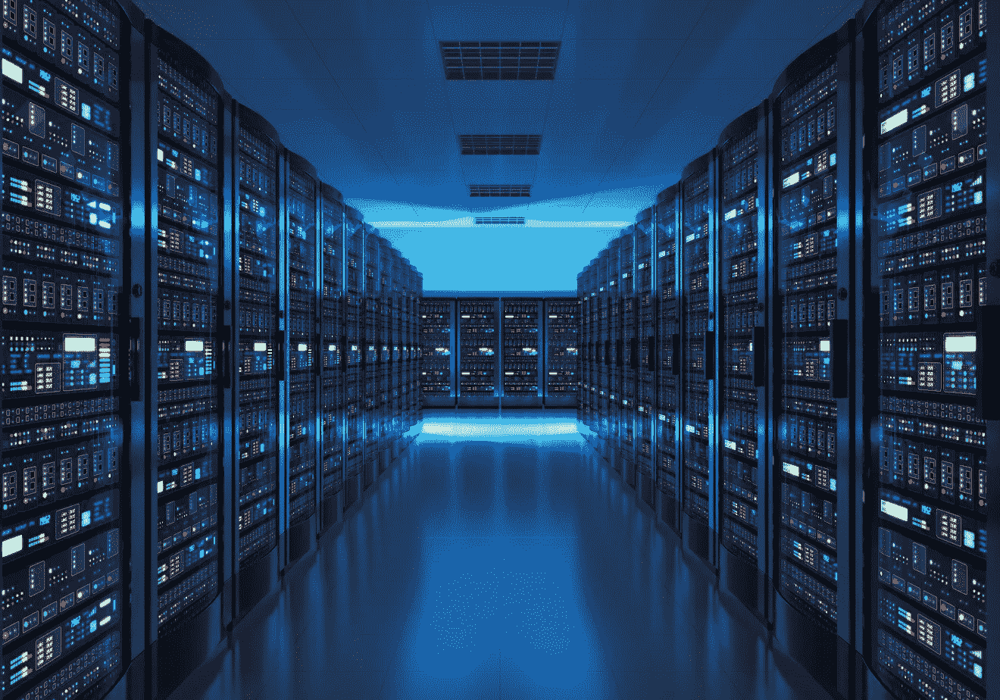
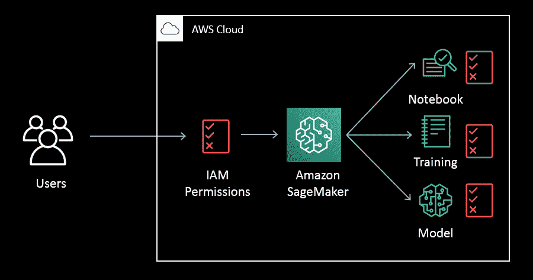
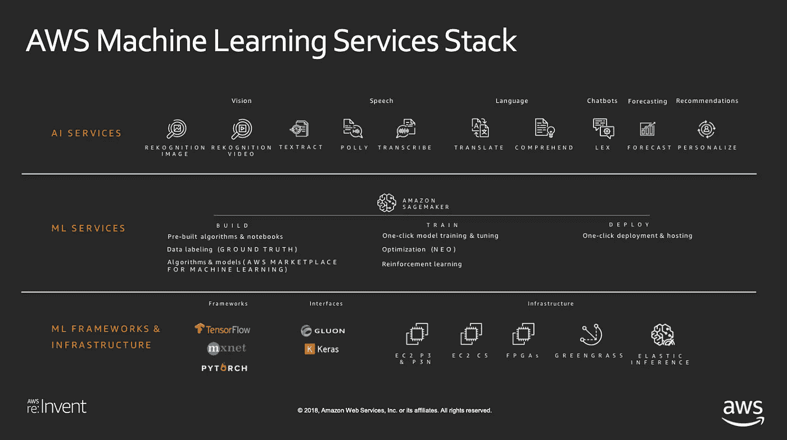

# 云计算时代的数据科学

> 原文：<https://medium.datadriveninvestor.com/data-science-in-the-age-of-cloud-computing-3720a12541a2?source=collection_archive---------9----------------------->

在这篇文章中分享的想法和观点是我自己的，与亚马逊网络服务无关。

我大学毕业后的第一份工作是作为云计算平台的解决方案架构师。解决方案架构处于业务、技术和通信的十字路口。它包括与利益相关者交流以了解他们的业务问题，然后帮助他们规划云中的实现。

在我担任解决方案架构师期间，我了解了很多关于云基础设施、公司当今面临的常见业务和技术问题，以及云计算被用来革新机器学习和人工智能的方式。

# 什么是云计算？

***云计算是通过互联网交付随需应变的 IT 资源，采用现收现付的定价模式。***

你可以像看待电力等公用事业一样看待云计算；所有关于电如何从 A 点到 B 点的细节都从你身边消失了。也就是说，电厂的基础设施、维护、安全、容错都不是你需要操心的事情，因为你的电力公司是替你管理那些事情的。

当你打开电灯开关时，你就开始接收电力，你为你使用的电量付费，你可以随时关掉开关。云计算遵循与我们的电力公司示例相同的交付模式，但云提供商不是交付电力，而是交付 IT 资源，如计算、存储、数据库、网络和安全功能。

# 什么是云？

云的基本单元是服务器。服务器是可以与程序或其他设备交互的任何硬件或软件。你 1997 年的笨重的台式电脑是服务器，你的 iPhone 是服务器，甚至你的 Peloton 也是服务器。

事实上，互联网只不过是地球上所有的服务器，不断地相互连接和交换信息。当我在 iCloud 中存储我的 iPhone 照片时，这仅仅意味着它们存储在苹果管理的服务器上，而不是我的 iPhone 上。

# 云中的 AI 和 ML

除了服务器，云计算还包括存储、网络、安全、数据库等等。云计算中最近兴起的一个特殊领域是云中的人工智能和机器学习。由于能够利用数千台同时工作的机器来完成一项任务，数据科学家能够在几秒钟内完成复杂的培训和测试，而不是几小时或几天。

亚马逊 Sagemaker 就是这样一种为云中机器学习而构建的云服务。Sagemaker 是一项完全托管的服务，允许数据科学家在云中构建、训练和部署机器学习模型。Sagemaker 利用类似于 Jupyter 的基于云的笔记本电脑，附带预构建的算法和模型，一键超参数调整等等。

Amazon Sagemaker Workflow

另一组正在迅速获得牵引力的服务是人工智能服务，如亚马逊 Rekognition、亚马逊理解、亚马逊 Polly 和亚马逊 Lex。实际上，这些服务利用了相同的云核心计算基础设施:虚拟化服务器。它们抽象出所有复杂的机器学习工作，允许最终用户利用令人难以置信的人工智能能力，如图像和视频识别、文本到语音通信和自然语言处理。

The Amazon Web Services AI/ML Stack

# 善良和丑陋

随着技术的突破，不可避免地带来了滥用和侵犯个人自主权的可能性。云计算通过面部识别等工具实现了广泛的监控，这些工具用于以惊人的速度识别和拘留人，尤其是少数群体。

利用云的计算和存储能力的能力还允许挖掘和分析大数据——Pb 级和 EB 级的数据。这是社交媒体公司数据科学团队的常见做法，算法从用户的个人数据中学习，然后创建最有效的模型来垄断他们的注意力。这种利用数据创造产品的过程会让人上瘾，操纵用户的情绪，因此可能有害，这种过程在道德问题上很微妙。

云计算彻底改变了我们交换信息的方式。我们今天认为理所当然的便利，如网飞和 Twitch，之所以能够发挥作用，要感谢 50 年前人们做梦也想不到的巨大技术成就。然而，重要的是要记住，随着技术以指数速度增长和发展，我们管理和评估技术对更大利益的影响的方式也必须如此。