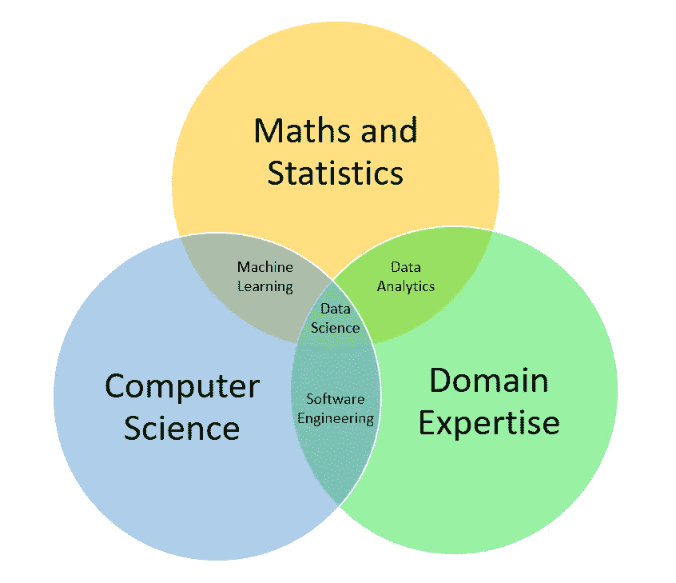

# 数据科学超越了回归和分类

> 原文：<https://medium.datadriveninvestor.com/data-science-is-beyond-regression-and-classification-eac56178e20b?source=collection_archive---------6----------------------->

很多人都说“数据科学是本世纪最性感的工作”

 [## 数据科学家:21 世纪最性感的工作

### 2006 年 6 月，当乔纳森·戈德曼(Jonathan Goldman)来到商务社交网站 LinkedIn 工作时，这个地方仍然让人感觉…

hbr.org](https://hbr.org/2012/10/data-scientist-the-sexiest-job-of-the-21st-century) 

理所应当的是，该行业对合适人才的需求出现了**式的急剧增长。作为人才输出中心的印度，预计今年数据科学的职位空缺**将增加**62%**

> 但是数据科学到底是什么？

**每个人都有自己的定义**。更重要的是，它最近也成为了行业中的一个时髦词，因为许多在数据领域担任各种角色的专业人士将他们的职位称为“数据科学家”，而许多人则在追求无数的在线课程和离线课程，以便快速进入这个有前途的领域。

但似乎很少有人明白它到底是什么。

在所有这些中，我发现这个定义最适合数据科学(摘自同一篇 HBR 的文章)

> “最重要的是，数据科学家在数据中游泳时会有所发现”

但是我们看到它发生了吗？在数据中游泳时有所发现？

> 让我们暂时忘记在数据中游泳吧！

对于大多数有抱负的人来说，数据科学只不过是从可能的“单调的开发人员工作”或任何其他当前工作中的一个突破(尽管它因情况而异，因为软件工程本身是一个非常具有挑战性的领域)。在著名的互联网繁荣之后的过去十年里，这些人中的大部分都是追逐流行的“编程”关键词的人。虽然这个领域前景看好，但也可能是另一边的草看起来更绿。

 [## 一瞬间学会数据科学！？数据驱动的投资者

### 在我之前的职业生涯中，我是一名训练有素的古典钢琴家。还记得那些声称你可以…

www.datadriveninvestor.com](https://www.datadriveninvestor.com/2020/07/23/learn-data-science-in-a-flash/) 

当我们听到“**人工智能**”时，有些人超越了术语。他们对该领域的期望和当前的认识(或缺乏认识)可能会在某个时间点后导致失望的**之路**，当他们知道数据科学是一门**科学**，它不能局限于解决问题的任何一个特定方面，而是实际上涉及**收集数据**并在其中畅游，以**获得帮助解决**现实世界问题**的见解**。

因此，让我们为读者分解一下，什么是数据科学，以及它如何帮助解决业务问题。

数据科学是**领域**知识(或对它的兴趣)**编程**技能(或技术工具的知识)和**数学/统计**技能的混合体。

Image by [Author](https://medium.com/@jangirshubham). Inspired by [Drew Conway](http://drewconway.com/zia/2013/3/26/the-data-science-venn-diagram)

当我们阅读许多数据科学职位的职位描述时，大多数时候它们要么属于“数据分析”类别，要么属于“机器学习”类别。理所当然地，也有特定头衔的“**数据分析师**”和“**机器学习工程师**”，有特定的期望。

> 但是数据科学不止于此！

这是**而不是**仅仅是将 **5 行代码**与他人给出的**现成**数据进行拟合，并执行线性/逻辑回归、梯度提升树或任何神经网络模型，但它大量涉及数据处理(有时实际上是 **60%的工作**)、假设检验、寻找有意义的相关性、创建有意义的可视化、特征工程，以及最终在预测分析的情况下拟合**相关模型**

而随着**非结构化数据**的兴起，数据清洗和无监督学习(聚类和关联学习)的重要性只增不减。

# 那么什么是**现实世界的数据科学**呢？

以下是我如何打破现实世界数据科学日常工作的碎片:

1.  从利益相关者处获得**需求**/做出假设
2.  获取所需的**正确类型的数据**
3.  数据清理和**预处理**(如果公司有单独的配置文件，则由数据工程师处理)
4.  **探索性数据分析**(图表、相关性、发现异常等。)
5.  **功能**工程(构建或改造功能)
6.  特征**选择**(列出重要的和相关的)
7.  选择合适的与**相关的型号**来配合
8.  **评估**结果(测试阶段)
9.  最终确定**建议**
10.  **向利益相关者展示**

其中每一个都需要一个**规范的**和**多方面的**方法。

在特定领域工作需要领域技能。做分析需要数学/统计技能，自动化或大规模转换需要技术/编程技能。最重要的是，与商业利益相关者打交道或向任何人解释调查结果，需要一套软技能。

许多新的有志者忽略了其中的许多内容，并直接转向诸如“在 60 天内成为数据科学专家”的课程。现实可能与真相相去甚远，因为这是我们正在谈论的一门科学，需要一些真正的努力。成为一名专家需要有科学的思维方式，以及适量的练习。

当我们将“数据科学”分解为“**数据**”和“**科学**”这两个词时，就非常清楚地表明，它需要**繁重的数据技能**(并融入其中)，还需要**科学的思维定势**。说到科学，它包括不断的实验和从失败中学习。

> 有时你不需要去模型构建部分！

因为有时候，所有的业务需求，都是对一个简单而又深思熟虑的业务问题的回答，比如

*   这和那之间有没有**关系**(而且不好回答)？
*   为什么我的**销量下降**(又没那么好回答了)？
*   或者说，为什么这个 **KPI** (关键绩效指标)下降了？
*   为什么某个**特定的**商店/区域/部门表现不佳？

这比任何显式编程技能更需要**数据分析**技能。

有时，问题可能有些复杂，可能需要头脑风暴和不断的实验和学习来解决，例如-

*   我应该瞄准哪些客户？以及如何和何时？
*   如何让我的供应链**高效**？
*   如何理解大量正在流动却未被使用的**非结构化数据**？

这些问题需要**机器学习**技能，但它们也需要回到**白板**并让利益相关者健康参与，以学习、试验和改进结果。

因此，只有当一个问题陈述变得结构化和最终确定，如果它需要机器学习，那么只有你需要决定使用什么方法，这可能是—

## 3 种机器学习

*   监督学习(回归/分类)
*   无监督学习(聚类、关联学习)
*   强化学习(模拟环境和模拟行动顺序，以最大化整体回报)

**如何在这些中建立基础？**

数据是**不断增长的**，组织确实需要人们**去理解它**！

1.  首先，你应该熟悉任何电子表格工具，比如微软的 Excel、谷歌的 Sheets 或者 OpenOffice。他们有很多基本的功能来导入数据，进行任何计算，并以图表的形式可视化。
2.  然后你可以开始学习 **SQL** (结构化查询语言)，它主要用于从关系数据库系统获取数据并进行一些转换。它是数据科学中最流行的编程语言之一。
3.  一旦你熟悉了基本工具，就可以对**统计**有一些基本的了解。它需要形成一个基本假设，并验证它们，从数据中得出某些结论。
4.  在此之后，您可以继续学习 **R** 或 **Python。**这两种编程语言在编写任何自定义数据操作和应用数据科学算法方面都为您提供了灵活性。基于用例，这两者都有许多你可以直接使用的包。
5.  从简单的技术开始，如**线性回归、逻辑回归、决策树、K-means 聚类、**，然后根据问题的**复杂性**转向稍微复杂一点的技术，如随机森林、梯度推进、神经网络等。

如果一个问题可以通过简单的技术解决，那么就没有必要应用任何复杂的黑盒技术。在这里我们可以记起著名的 [**奥卡姆剃刀**](https://en.wikipedia.org/wiki/Occam%27s_razor) 原理，其中指出——

> 没有必要，不能假定有多个。

该理论主张——在其他条件相同的情况下，简单的解释通常比复杂的解释更好

一旦基本的基础建立起来，选择任何开源数据，并开始解决基本的问题。 **Kaggle** 可以作为这类问题的一个很好的平台。首先，一个流行的问题是——[预测泰坦尼克号上的幸存者](https://www.kaggle.com/c/titanic)和[房价预测](https://www.kaggle.com/c/house-prices-advanced-regression-techniques)。这两者对探索性数据分析和统计建模都有很大帮助。

此外，跟上数据科学中基本的**统计**概念。关于这一点，你可以参考这本书(也有免费的电子书)——**ISLR**(*斯普林格*的《统计学习导论:在 R 语言中的应用》)。前 4 章很好地概述了基本概念。我发现这本书对我从事这一领域的最初几年很有用。

只有当熟悉了基础知识，才能继续学习高级学习技术，如**神经网络**和**深度学习**，NLP ( **自然语言处理**)，以及**计算机视觉**(图像处理)。

但是在解决任何现实世界的问题时，要保持科学的学习心态，因为现实世界是以**实验**和**不断学习**为模型的。

在整个旅程中，保持对数据的好奇。这是最重要的部分。

我希望我能够从一个数据科学家的角度深入了解组织的期望，以及对该领域感兴趣的有志之士可以如何着手。

快乐学习！

*可以关注我这里，或者上*[*Linkedin*](https://in.linkedin.com/in/jangirshubham)*，和*[*Quora*](https://www.quora.com/profile/Shubham-Jangir-1)*，了解更多更新。此外，关于数据科学的任何讨论，请随时给我发消息。*

## 获得专家观点— [订阅 DDI 英特尔](https://datadriveninvestor.com/ddi-intel)