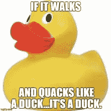
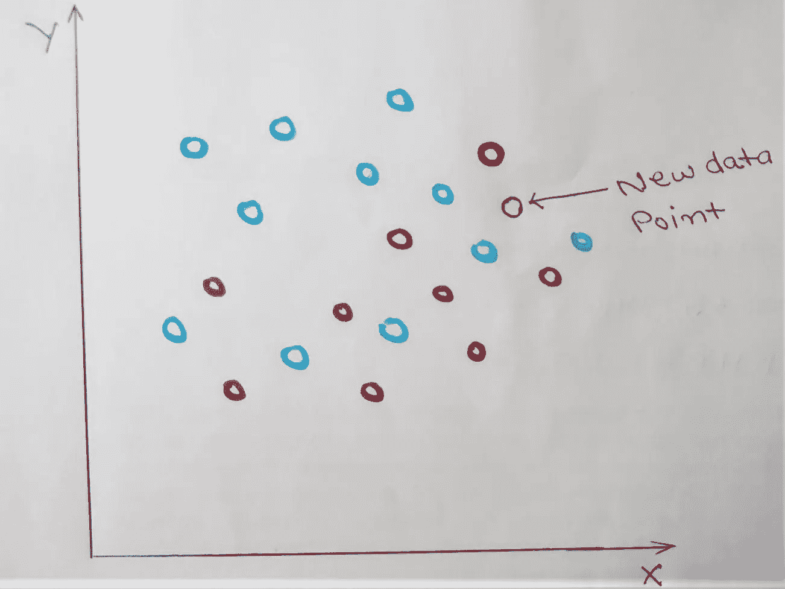
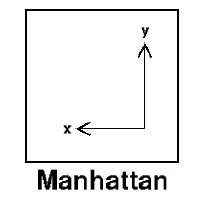
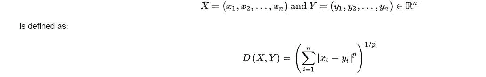
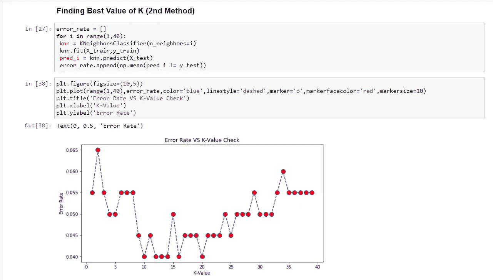
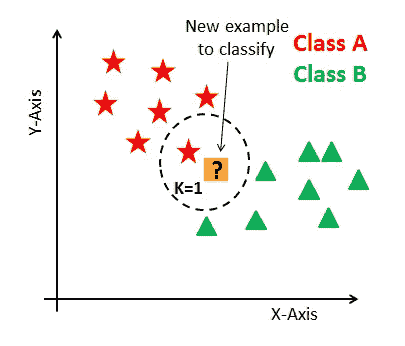

# 数据科学:K-最近邻

> 原文：<https://medium.datadriveninvestor.com/data-science-k-nearest-neighbor-b7843b285300?source=collection_archive---------3----------------------->

Image:ComplexDiscovery

# 介绍

k-最近邻也称为 KNN，是一种用于分类和回归问题的监督机器学习算法。最近邻分类器背后的思想很简单。

如果它像鸭子一样走路，像鸭子一样嘎嘎叫，那么它很可能是一只鸭子

Image: rashmee.com

# **直觉:**

KNN 是非常简单的机器学习算法。该算法使用 K-最近邻对新数据点进行分类。

这里，我们讨论的是不同类的数据点，我们的新数据点的类是基于各种类的最近 K 个数据点的类来决定的。

它也被称为基于实例的分类器。基于实例的分类器有两种类型。

1.  死记硬背的学生
2.  最近邻(使用 K 最近邻)

**让我们用一个简单的图表来理解这一点:**

我们可以看到红色和浅蓝色各种数据点，我们创建了一个二维空间(X 和 Y 坐标)。

当一个新数据点出现时(如图所示)，我们需要对其进行分类(考虑到我们有红色和浅蓝色两个类别)。在 KNN，我们使用 K-最近邻对这个新数据点的类别进行分类。

希望现在你已经清楚了 K-最近邻的定义以及它将如何解决这里的分类问题。

现在，由于我们必须找到 K 个最近的邻居，问题是**我们应该考虑**多少个邻居来预测新数据点的类别，以及**如何测量哪个邻居是最近的**。

## 我们需要三样东西来创建一个 KNN 算法

1.  存储的记录集(基本上是训练数据集)
2.  计算数据点之间距离的距离度量。
3.  K 的正确值，最近邻的数目。

## **如何衡量哪个邻居最近？**

**为了测量最近的邻居，我们使用距离度量**。这些距离度量使用各种距离度量来寻找新数据点和最近的 K 个邻居之间的距离，并且基于大多数邻居，我们对新数据点的类别进行分类。

基础数学定义(来源维基百科)，

> *距离度量使用距离函数，该函数提供数据集中每个元素之间的关系度量。*

**距离指标有多种类型。主要问题如下**

1.  欧几里得距离
2.  曼哈顿距离
3.  闵可夫斯基距离

**欧几里德距离:**

欧几里德距离表示两点之间的最短距离。

这里(X2，y2)和(X1，Y1)是二维空间中的两个点，我们使用给定的公式计算两个点之间的距离 d。

**曼哈顿距离:**

曼哈顿距离是所有维度上的点之间的绝对差之和。曼哈顿距离也被称为出租车几何，城市街区距离等。

在点 1 位于(x1，y1)且点 2 位于(x2，y2)的平面中。

曼哈顿距离= |x1 — x2| + |y1 — y2|

**闵可夫斯基距离:**

闵可夫斯基距离是欧几里德距离和曼哈顿距离的推广形式。

两点间的闵可夫斯基距离序 *p*

**我们将使用欧几里德距离作为我们的 KNN 分类器。**

## **寻找 K 的正确值:**

k 是分类时要考虑的邻居/数据点的总数。

为了选择最适合您的数据的 K，我们使用不同的 K 值运行 KNN 算法几次，并选择减少我们遇到的错误数量的 K，同时保持算法在给定以前从未见过的数据时准确做出预测的能力。

带有图片的 Python 代码将清除这一点。取误差为常数的 K 值(对于多个点)。或者，我们可以使用 GridSearchCV 来寻找最佳参数。

这里我们可以看到，从 K=16 开始，误差是恒定的，因此我们将选择 K=16。

**创建 KNN 模型时的重要注意事项:**

KNN 需要缩放/标准化，因为它使用距离作为两个数据点之间的度量。对于一个好的模型，要求所有的特征都具有相同的比例，这样一个特征就不能支配另一个特征。

一旦我们找到 K 的最佳值并最终确定要使用的距离度量，我们将获得一个模型，该模型将基于其最近邻对新数据点进行分类。

在图片中，由于选择了 K=1 的值，新数据点的类别为**A 类(红星)**

image:KDnuggets

请找到正在逐步实现 KNN 算法的 python 代码。

**KNN 的优势:**

1.  算法简单，易于实现。
2.  它适用于线性和非线性数据集。
3.  对输入数据中的噪声具有鲁棒性。
4.  算法是通用的。它可用于分类、回归和搜索。

**缺点:**

1.  它是懒惰的，也叫做懒惰的学习者。必须执行每个 KNN 模型来寻找新的看不见的数据点的类别。
2.  没有办法确定数据集是线性的还是非线性的。我们只能尝试检查性能，如果模型不能为线性数据集提供良好的准确性，我们可以认为数据集是非线性的。
3.  由于它是懒惰的学习者，人们避免使用它，因为计算成本很高。

**结论** : KNN 是一种简单的算法，对非线性数据集也有很好的表现，可以在数据量较低时使用。随着数据量的增加，算法的计算成本增加。

 [## 将定义 2020 年就业前景的五大数据科学和机器学习趋势|数据驱动…

### 数据科学和 ML 是 2019 年最受关注的趋势之一，毫无疑问，它们将继续发展…

www.datadriveninvestor.com](https://www.datadriveninvestor.com/2020/02/19/five-data-science-and-machine-learning-trends-that-will-define-job-prospects-in-2020/) 

我希望你喜欢我的文章。如果你喜欢并希望我激励你写更多，请点击**拍手**。也与你的朋友分享。

想要连接:

链接地:【https://www.linkedin.com/in/anjani-kumar-9b969a39/ 

如果你喜欢我在 Medium 上的帖子，并希望我继续做这项工作，请考虑在[上支持我](https://www.patreon.com/anjanikumar)