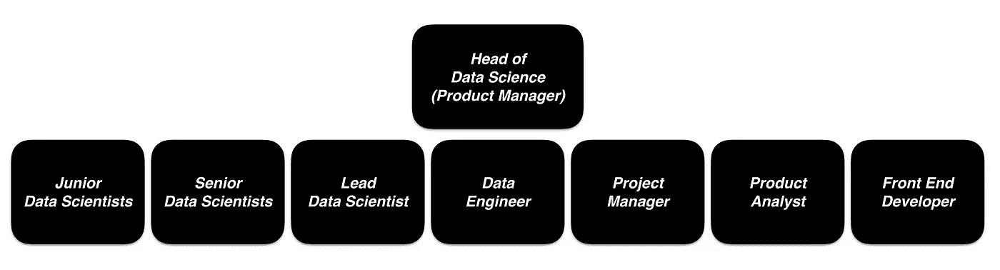
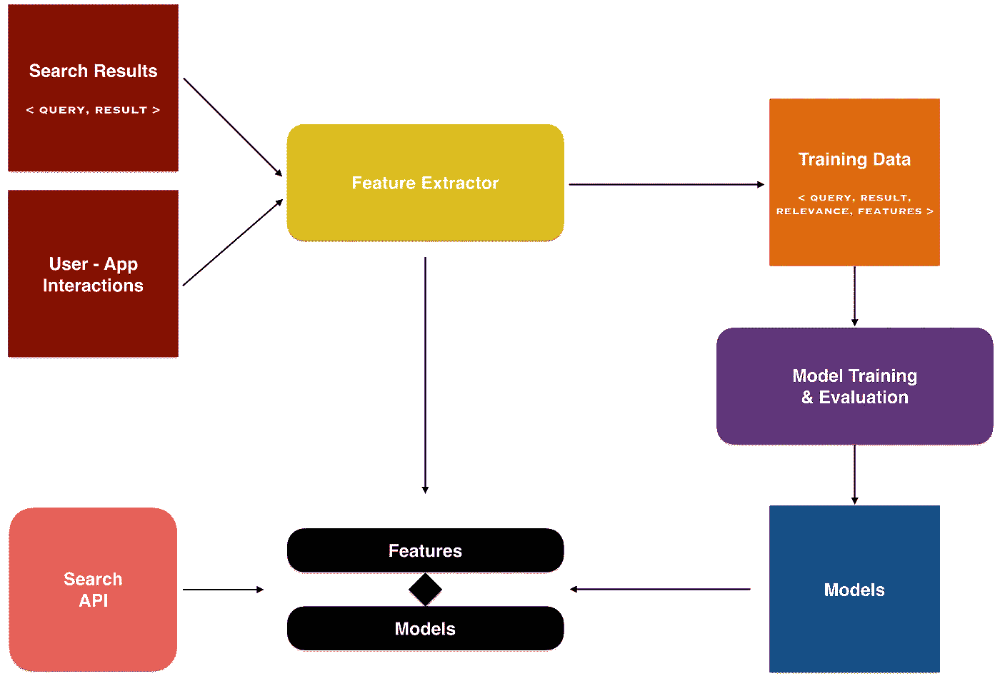
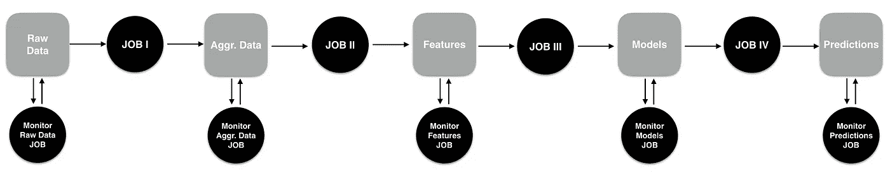

# 数据科学团队指南

> 原文：<https://medium.datadriveninvestor.com/data-science-manifesto-78ca98101eae?source=collection_archive---------7----------------------->

Photo by [Mark Duffel](https://unsplash.com/@2mduffel?utm_source=medium&utm_medium=referral) on [Unsplash](https://unsplash.com?utm_source=medium&utm_medium=referral)

> **如何成功建立、构建和管理数据科学团队**

# 介绍

目前，各公司一直在称赞数据在内部业务决策过程中的重要性，并加大了对数据团队的投资。最近发生了一场竞赛，特别是在大型科技公司之间，以扩大他们的数据团队来满足需求。

在我的职业生涯中，我有机会为一些大公司工作，并在他们的数据团队中担任不同的角色。到目前为止，我还参加了许多不同规模的公司的大量数据科学面试。根据我以前的经验，与软件工程或数据工程等其他技术学科相比，数据科学仍然不够成熟，这一点我不会说错。我也认识到一个痛苦的事实，即在当前的数据科学世界中，没有一套定义明确且被普遍接受的标准。这就是我决定写这篇文章的主要原因，通过头脑风暴来开始对它的讨论。

不用说，如果我们期望所有的公司都遵循完全相同的一套标准，那是不现实的。然而，尽管数据科学是一个相对较新的领域，我认为我们仍然需要找到系统的方法来解决这个领域的共同问题。在本文中，我想谈谈我对任何数据科学团队都可以遵循的通用指南的看法。

目录:

*一、最佳数据科学团队结构:角色定义列表*

*二世。如何聘用数据科学家:数据科学面试流程*

*三。如何为新聘用的数据科学家设计有效的入职流程*

*四。如何进行技术尽职调查以评估数据科学项目*

*五、数据科学产品交付流程中的挑战和最佳实践*

*六。数据科学实现宣言:如何设计实现管道的不同子组件*

让我们在本文剩余部分的单独章节中讨论每一个单独的主题。

# I .最佳数据科学团队结构:角色定义列表

**Roles in an Ideal Mid-Sized Data Science Team** (Image by Author)

数据科学团队的规模因公司规模而异。在这里，我将定义一个理想的中型数据科学团队中不同角色的列表。

> **初级数据科学家:**

可以说，对于初级数据科学家来说，最重要的职业决策之一是找到他们将为之工作的第一家公司。这个决定很可能会塑造他们在这个领域的整个未来。因此，对于那些处于职业生涯这一阶段的人，我强烈建议明智地选择第一家公司，在那里他们可以在他们想专注的领域发展技能。(例如深度学习、数据科学在营销、金融或健康等领域的应用。)

现在，让我们谈谈这群数据科学家的共同素质，以及在组建一个成功的数据科学团队时，对他们有哪些期望。

与团队中的其他人相比，这些数据科学家相对缺乏经验，并且需要一直向首席数据科学家报告。因此，对于初级数据科学家来说，不可避免地会有很高的学习曲线。根据团队愿景，他们应该接受首席数据科学家的培训和直接监督。因此，例如，如果你看到你的数据科学团队在深度学习应用程序方面的未来，那么你应该寻找一个以前有一点经验并希望在深度学习方面走上职业道路的大三学生。

你不能指望一个初级数据科学家知道如何用各种编程语言编码，或者能够应用许多机器学习算法。因此，在寻找新人加入你的团队时，你最好以任务或项目为导向。让我再举一个例子来说明我的观点。假设您决定在不久的将来发现欺诈检测模型并加大投资。尽管您的团队可能使用了不同的编程语言，但总有一种语言对您的生产环境更友好。然后，你需要寻找一个初级的数据科学家，他在特定的编程语言和欺诈类项目(如流失预测)方面有一些经验。

> **高级数据科学家:**

初级和这一组的主要区别是，我们可以期望高级数据科学家有能力从开始到结束领导一个项目。他们应该负责一个不需要长时间学习曲线或直接监督的项目。

这个角色的另一个职责是帮助团队中的初级数据科学家。例如，由于高年级学生应该更加了解基础设施和数据源，所以当低年级学生向他们寻求帮助时，他们应该指导低年级数据科学家找到合适的数据源或合适的人，他们可以帮助他们找到他们正在寻找的东西。

预计他们还将与初级数据科学家一起审查他们的代码。这对团队有两方面的积极影响。首先，低年级学生将在这些审查过程中学到很多东西，并且高年级学生对代码的双重检查将使模型更加健壮。

尽管他们大部分时间被首席数据科学家分配到特定的任务或项目，但我们也可能期望高级数据科学家提出新的想法来激励团队和业务。自然，需要在这个领域有一定的资历来捕捉和形式化那些与数据相关的业务问题。

最后，这组数据科学家还需要一直向团队领导汇报。

> **首席数据科学家(团队领导)**

首席数据科学家必须是拥有全面技术数据科学知识的团队成员。我们可能不指望初级或高级数据科学家知道如何用不同的语言或使用不同的框架进行编码，但首席数据科学家必须精通团队使用的所有编程语言和工具。由于他们丰富的经验，这个角色还负责团队中初级数据科学家的技术培训。

所有项目都必须在首席数据科学家的技术监督下运行。用 GitHub 的行话来说，你可以把这个人看作是我们把一个分支合并到主分支的最后一步。如果一个团队使用 Github 作为版本控制系统，团队领导必须负责管理代码回购，并在团队中进行编排。

该角色必须确保每个项目的技术文档都由其所有者数据科学家清楚地编写。换句话说，首席数据科学家负责组织团队中的技术文档。这些技术报告应该集中在一个地方，比如技术团队博客。

最后，首席数据科学家应始终与项目经理保持一致，并向数据科学主管汇报。

> **项目经理**

项目经理是唯一不需要技术背景的团队成员。然而，我们仍然期望项目经理了解数据科学领域的技术术语。这是因为这个角色有点像团队中的交流枢纽，将所有团队成员团结在一起，同步工作。

项目经理应该负责改善内部团队沟通，并确保每个数据科学家都充分了解其他团队成员的项目。这可以通过安排团队和一对一的协调会议来实现。对于每次会议，该角色应提前设定目标，计划可能的后续行动，并收集一些会议笔记，以便稍后与所有与会者分享。

如果团队使用一个项目管理工具如吉拉，项目经理必须确保所有数据科学家都正确并定期使用这个工具。板上的每项任务都必须由这个人仔细检查，看它是否符合团队的任务标准，并给出关于任务的足够详细的信息。

除此之外，这个角色还需要成为客户(业务)和团队之间的沟通桥梁。最重要的职责之一是在整个项目中协调双方——客户和供应商。

> **数据工程师**

大多数时候，数据科学团队需要其他工程团队的一些帮助，以使他们的产品符合当前的生产环境。如果数据科学团队能够设法拥有自己的 API 和生产流程，这将是一种特权和巨大的优势。

由于几个原因，一直依赖工程团队会使数据科学团队的工作变得复杂和低效。首先，公司中的每个团队都有自己的优先事项，这就是为什么你的任务要等很长时间才能被工程团队接手。根据工程团队的能力，这甚至可能需要几个月才能看到你的模型在运行。同时，你的客户可能会对你的产品失去兴趣，甚至忘记它。其次，一旦你的模型脱离了你的控制，数据科学家很难在不与工程团队再次联系的情况下对模型中的参数进行哪怕是一个简单的更改。

因此，数据科学团队需要分配一名内部数据工程师，以便不面对上述问题，并拥有更加动态的工作环境。数据工程师将帮助启动团队自己的 API，在生产中提供 ML 模型的结果。该角色还负责维护数据科学生产管道，或最近称为 MLOps。

一般来说，由于数据工程师比数据科学家更了解软件设计原则，因此由数据科学家完成的实现应该由该工程师与项目所有人数据科学家合作重新访问和配置。通过这种方式，数据科学家将了解到更多关于稳定和产品友好的实现设计，而不会失去对自己代码的所有控制。

数据工程师应向数据科学主管和数据工程主管汇报。它可以设计成这样一种方式，即该数据工程师在技术问题上与数据工程团队保持密切联系，同时仍然是数据科学团队的正式成员。

> **产品分析师**

产品分析师是负责设计实验和运行 A/B 测试以评估模型在真实用例中的性能的团队成员。

这个角色需要高水平的统计知识，实验设计和良好的数据可视化技能。最后，向业务人员报告最终结果时，要有易于理解且生动的演示，这一点很重要。

> **前端开发者**

对于许多数据科学应用程序和模型，需要有一个仪表板，以一种更吸引人的方式在一个地方呈现所有结果。我相信，向公司的其他团队成员销售团队产品是最有效的方法。假设您的团队一直在开发几个预测模型，这些模型会产生许多用户数据点，如流失风险评分、购买可能性、欺诈风险评分、预测年龄、预测性别、客户生命周期阶段、推荐产品等。基本上，我们可以使用许多不同的机器学习模型的结果来绘制预测性的 360 用户简档。然而，总是用幻灯片展示这些结果并不美观。因此，前端开发人员应该为团队创建一个数据科学仪表板，同时与产品分析师密切合作，以实现数据可视化和绘制部分。

它不总是仅仅是一个仪表板。有时，需要有某种简单的 UI 来整洁地显示模型的性能。例如，显示新开发的推荐器比基准推荐器表现得更好并不是微不足道的。前端工程师也可以创建一个好看的 UI 应用程序来比较来自这两个推荐器的推荐质量。

> **数据科学主管**

你可以把数据科学负责人想象成团队的产品经理。然而，并不是市场上的任何产品经理都有资格担任这个角色。这是很多企业在这个领域经常犯的错误。仅了解数据科学术语和一些高级数据问题不足以填补团队中的这一重要职位。此人之前必须是高级或首席数据科学家，以便拥有强大的技术数据科学背景。也许，这个角色更好的定义是“技术产品经理”。

每个人都在谈论优秀数据科学家的一个品质，那就是产品知识。总的来说，我同意这种说法，即对于数据科学家来说，改善其产品方面也是一个巨大的优势。然而，这是一项必备素质，尤其是对于数据科学主管职位而言。这个人还必须有透彻的产品视野和业务理解。

这个角色最重要的职责是成为业务/产品和数据科学世界之间的桥梁。因此，需要能够将业务问题与现有的数据解决方案相匹配，反之亦然。这样，团队将有机会与企业建立双向关系。他们也可以使用当前的数据工具和算法输入可行的业务，而不是一直期待来自业务方的产品请求。这将使团队在公司中更加引人注目。因此，改变 C 级或业务人员对数据科学的心态可以算作这一角色的另一个规范。

数据科学负责人还负责绘制团队的长期和短期路线图，制定季度计划，并按优先顺序列出项目想法。每个想法都应该在一页纸的项目描述中详细说明，包括要解决的问题、业务成功指标、可能的高级技术方法和模型的一些具体最终用例。

最后，这个角色应该运行一个团队博客，并撰写关于内部团队项目的文章。此外，他还将作为主题发言人出席会议，与外部数据科学社区分享团队成果，并对团队进行总体营销。

# 二。如何聘用数据科学家:数据科学面试流程

不同的公司在招聘数据科学家的过程中遵循不同的策略。在我迄今为止的职业生涯中，我见过许多不同公司的面试过程。在这一部分，我将描述我对面试阶段应该如何设计的观点，以雇用一位合适的数据科学家加入您的团队。

数据科学面试流程必须围绕一系列案例研究展开。在这些情况下，您很容易质疑下面列出的数据科学家的素质:

*   如何与企业进行沟通并询问相关问题，以收集有关问题的足够信息。 **→产品视觉**
*   如何在最初发现数据时预测并避免项目的缺陷 **→如何处理数据问题**
*   如何设计实施阶段，做出关键的模型决策及其推理 **→应用机器学习**
*   如何向利益相关者展示结果和销售最终产品的方式 **→可视化和展示技能**

**3 Interview Stages in a Data Scientist Hiring Process** (Image by Author)

## **案例分析**

总共 3 个案例研究将完成我们希望完成的工作，从而使一名数据科学家有资格在团队中担任某个角色:

> **案例一:请一位数据科学家展示他以前的作品:**

*   期望全面了解该项目中所做的工作，包括所有技术和非技术步骤。

> **案例二:请一位数据科学家为您的团队最近一直在努力解决的一个问题提出一个“端到端”的解决方案:**

*   为你的业务问题提供一个高层次的定义，但不要给出所有的细节。期待候选数据科学家提出相关问题，以便更清楚地了解解决方案。
*   设计数据科学项目管道的每一步可以说是在这种情况下要测试的最关键的质量。它会给你一些线索，如果候选数据科学家考虑到最后阶段，如生产模型，或只是专注于单个笔记本中的发现工作。
*   您可能不会要求候选人了解如何进行在线测试(如 A/B 测试)的所有细节，但至少希望他知道端到端解决方案中的这一步骤。
*   请候选人向您展示最终的端到端解决方案，就像您是项目的业务利益相关者之一一样。

> **案例三:请数据科学家提出您的企业可能一直在处理的 5 个可能的数据相关问题:**

*   重要的是找出衡量候选人对你的业务的兴趣和专业知识。
*   评估这位候选数据科学家的产品愿景有多强也很重要。
*   为每个问题寻求高层次的解决方案。

# 三。如何为新聘用的数据科学家设计有效的入职流程

大多数公司在招聘新的数据科学家时，要么跳过要么忽略这一入职流程。只有少数公司有这样的流程，但总体而言，它们都是粗略的、无组织的入职培训。就我个人而言，我发现这些培训课程对于新的数据科学家来说至关重要，可以让他们更清晰、更快速地了解全局。因此，公司不应该介意花一整个月的时间来培训新员工，让他们熟悉业务和产品本身。这一点非常重要，尤其是对数据科学团队而言，原因如下:

*   数据科学家必须了解公司的愿景和使命，才能将业务问题和数据联系起来。您应该始终牢记数据科学家的产品方面，并确保向他们提供必要和详细的业务信息。
*   数据科学家必须了解业务战略以及业务增长和扩张的近期计划，以决定他们应该更加关注哪个领域，并相应地确定项目的优先级。
*   数据科学家首先必须是产品**T3 的好用户。你可能并不总是期望新员工是你产品的忠实用户，但是你可以通过向他们传授你产品或平台的每一项功能，让他们成为你产品的忠实用户。数据科学家必须了解用户在使用产品时的感受或需求。拥有这种真实的用户体验对于一个数据科学家来说尤其重要，他需要从用户的角度思考，并对产品流程有一个透彻的理解。这在您让数据科学家开始数据之旅之前就已经完成了。**
*   数据科学家必须了解企业的所有收入来源。基本上，这个问题的答案对一个新员工来说应该足够清楚:公司从哪些渠道赚钱？
*   数据科学家必须花一些时间与公司的其他团队(如工程、营销或分析)在一起，以全面了解内部业务流程。例如，营销团队一直在使用什么工具来锁定用户？他们一直在努力改进什么样的业务指标？(例如转换次数、活跃用户数、总花费时间等。)

对于新员工，为了完成上面的列表并使入职流程有效，需要预先组织一系列与公司不同团队的协调会议。在每次调整中，必须在入职培训文件中明确设定目的，并将其交给受训者。最好从业务和产品组合开始设计，然后是其他团队，包括营销和工程等。

由于我目前在一家在线市场企业工作，我将从较高的层面描述我们如何为新员工设计产品培训课程，以介绍我们的市场平台。不用说，每个企业都需要针对他们的产品详细规划这种培训。

Photo by [Kelly Sikkema](https://unsplash.com/@kellysikkema?utm_source=medium&utm_medium=referral) on [Unsplash](https://unsplash.com?utm_source=medium&utm_medium=referral)

## **用户体验培训:深入了解市场中的用户**

我们的市场平台上有两个主要的用户群:买家和卖家。如果你在我们的平台上购买一件物品，那么你是一个买家，但如果你在我们的平台上发布一个出售物品的列表，那么你是一个卖家。在这个产品环节中，你应该要求你的新员工首先扮演一个买家，然后在平台上扮演一个卖家。

> **案例一:你是买家**

创建一个帐户→浏览不同的类别→浏览不同的物品→收藏某个物品→进入你的“我的页面”列出你最喜爱的物品→在搜索栏中键入一些内容→浏览搜索结果→使用不同的搜索过滤器组合优化这些结果→保存“优化的搜索”以备后用→登陆某个特定的物品页面→出价购买→向卖家发送消息

> **案例二:你是卖家**

创建帐户→选择要在平台上出售的物品→在类别列表中搜索，找到最适合你的物品的类别→填写你要出售的物品的相关属性，如尺寸、颜色、价格等。→张贴你的物品并检查你是否收到任何确认电子邮件→你的物品在平台上列出后，进入“我的广告”页面查看你的物品。→试着为你的广告收集一些业绩数据，比如到目前为止有多少人查看或喜欢你的商品→从买家那里获得信息→与买家进行一次体面的长谈→从平台上删除你的列表

# 四。如何进行技术尽职调查以评估数据科学项目

让我们做一个练习，进一步了解如何质疑数据科学项目。下面，您将看到一个新的搜索排名管道的高层次概述。在本练习中，我们将思考可以就此管道提出哪些相关和重要的问题，以发现其中可能存在的风险，以及如何通过建议来改进它。我会将我的问题按照它们的上下文进行分组，并将它们列在不同的标题下:业务、数据收集、特征提取、培训和评估以及生产问题。

**High Level Search Ranking Pipeline** (Image by Author)

## 商业问题

1.  这个系统应该解决什么样的业务问题？
2.  企业“成功搜索”的正式定义是什么？(例如，顶部搜索结果中的相关性与语义相似性或多样性)
3.  当前的基线搜索系统是如何工作的？
4.  基线的主要痛点是什么？
5.  任何预定义的商业规则将被应用到新的搜索排名系统中吗？(**风险！:**生意上明确的该做和不该做是需要考虑的。)
6.  这项新搜索的目标是提高哪项业务指标？

## 数据收集

1.  此管道连接到哪种类型的输入数据集？(例如，印象、点击、搜索结果等。)
2.  输入数据集所在的位置。这个数据集上有分区吗？
3.  输入数据有多大？(**风险！:**我们可能需要通过创建一系列数据转换作业来逐步进行数据聚合。)
4.  这个渠道是面向单一平台用户(例如仅网络)还是多平台用户(例如网络和移动)？(**风险！:**网络用户的搜索特征很可能与移动用户不同，需要区别对待。)
5.  这种分析是针对登录用户还是包括匿名用户在内的所有用户？(**建议:**为登录用户考虑更丰富的用户特性)
6.  输入数据采集是实时流作业还是批处理作业？(**建议:**据此确定以下流水线和作业频率)
7.  之前是否进行过任何数据发现，以从数据中提取一些见解？(**风险！:**也许，你 80%的搜索结果数据只来自 5%的用户，剩下的 20%来自 95%的用户。→有偏见的搜索排名)
8.  在生成培训数据之前，是否有任何数据清理工作？(**风险！:**从分析中排除所有无意产生的搜索结果和点击诱饵。*或*从分析中删除已经移除/删除的项目。)

## 特征提取/训练数据

1.  从数据记录中生成什么样的特征，总共有多少？
2.  相关性分数的标记策略是什么？如何给训练数据贴标签？(**风险！**:泄露标签→必须在执行特定搜索的日期之前提取每个搜索结果的特征)
3.  如何决定在产品中使用最终的特性集？
4.  **可考虑的新方法:**如果不考虑，添加个性化功能→更个性化的搜索排名
5.  **要考虑的新方法:**使用嵌入策略来生成特征，而不是使用显式手动调整的特征。

## 培训和评估/模型

1.  建模部分是如何制定的？(例如二元、多类、回归等。)
2.  使用过哪种 ML 算法，为什么选择它？
3.  什么是损失优化函数？
4.  模型验证是如何进行的？(例如交叉验证或单独的训练/有效/测试集)→ **风险！:**对于搜索排名这样的问题，根据时间戳将数据分为训练/有效/测试是很重要的。应该按照这个时间顺序:训练→有效→测试
5.  你如何决定最好的模型？在哪些算法参数上，进行了网格搜索超参数调整？
6.  在建模阶段，如何决定哪些特性是最重要的？(**建议:**部分相关图增加了模型的解释力。)

## 生产问题

1.  生产中有多少组件/作业在运行？
2.  培训作业运行的频率如何？
3.  这项培训工作是一项单独的工作，如整个 Jupyter python 笔记本，还是一系列较小的工作？(**风险！:**在生产中，单个作业总是更容易出错，也更难跟踪。)
4.  冷启动问题怎么处理？对于新增加的记录有什么特殊的不同流程吗？
5.  生产中运行的训练数据和模型存储在哪里？
6.  搜索 API 的端点是什么？
7.  如何对此产品进行 A/B 测试？哪项指标用于评估绩效？
8.  关于整个管道，你在监控什么？(**风险！:**监控所有数据集(包括输入和所有中间数据集)以发现数据中的异常是一种良好的做法

# 动词 （verb 的缩写）数据科学产品交付流程中的挑战和最佳实践

我们真的可以说，一个数据科学项目从一个想法到一个运行的产品通常需要太长的时间。数据科学产品流程中有几个问题导致数据科学团队工作效率低下。

数据科学与软件工程的主要区别是它自己的实验性质。因此，常规的软件工程标准可能并不总是适用于数据科学团队。这是一门不同的学科，需要小心处理。将机器学习模型投入生产也有其不同于其他产品的独特挑战。因此，在讨论数据科学中的常见挑战和最佳实践时，我需要将其分成两个主要部分，以便您能够轻松理解并跟上进度。我将第一部分命名为:实验(开发)，第二部分命名为生产(部署)

> **第一部分:实验(开发)**

在这一部分中，我们将讨论模型开发阶段的问题，并特别关注数据科学项目管理中的最佳实践。

敏捷方法可以作为数据科学项目开发周期的基础。然而，需要对其进行微调，以更好地适应数据科学本身的性质。现在，让我们讨论一下哪些敏捷原则适用于这个相对较新的领域，还有哪些原则需要改变。

*   当我们将敏捷应用到快节奏的开发周期中，并且如果项目需求可能在整个周期中发生很大变化，那么它就是最好的。对于数据科学来说，需求总是有可能改变的，这也是部分事实。如果一开始就没有明确设定期望，这种情况甚至可能在项目结束时发生。然而，与任何其他软件项目相比，数据科学项目需求相对稳定。这就是我们需要改变数据科学敏捷原则的地方。与最大限度减少前期规划和设计的敏捷原则相反，详细的文档和预先规划对于数据科学项目至关重要。在项目开始时，我们需要投入足够的时间来确保数据科学家和业务利益相关者都在同一页上。这是因为设计一个 ML 模型很大程度上是基于那些来自业务方面的初始反馈和产品细节。换句话说，即使是模型开发和技术决策也会受到项目开始时业务和数据科学团队之间的联系的影响。这是数据科学世界的美妙之处，也是最大的挑战之一。我举个例子，让大家更清楚地去消化。假设我们想为欺诈预测问题创建一个模型解决方案。诸如欺诈的明确定义或平台上用户可能是欺诈者的迹象等信息应来自业务部门。这是一场商业界也有望参与的讨论，以便为数据科学家铺平道路。
*   微观管理可能是数据科学团队经历过的最糟糕的事情。将数据科学项目分解成像软件开发这样小的子任务并不容易。这是不可能的，因为数据科学本身独特的实验发展性质。
*   在数据科学团队中，不需要努力争取每天都站起来。否则，您可能会听到数据科学家在一周内向团队提供完全相同的更新，例如“我仍在优化我的模型参数。”相反，对于一个数据科学团队来说，每周可能只有两次快速起立是一个更好的实践。
*   考虑到前面提到的数据科学的实验性质，任务规划或 Scrum Poker 原则也应该以不同的方式应用于数据科学团队。不要像软件开发那样估计每个小任务所需的工作量，而是应该为每个项目阶段预先设定时间周期。一个团队成员应该在一个特定的项目步骤上投入多少时间？对于项目步骤 A，项目负责人数据科学家将花费最多 X 天的时间，并在步骤 A 设定的时间框架内使用最佳可能结果继续步骤 B。这里有一个关于数据科学的有趣事实:数据科学家甚至可以花一整年的时间来考虑向模型中添加新功能以改进模型，或对机器学习算法进行参数调整以最终获得最佳结果。这句话总结了数据科学“实验”的一面，并解释了为什么我们称之为“科学”。
*   在数据科学项目中，积压工作也可以有不同的设计。数据科学家应该为项目的每个步骤创建多个备份计划，作为待办事项任务。如果模型中需要任何进一步的改进，可以以某种方式对这些积压进行优先排序，以便尝试其他机器学习算法或功能。例如，如果当前的特征集没有给出我们想要的结果，那么接下来要做的就是利用另一个数据源来扩大特征集。这些待办事项任务必须是特定于项目或所有者的。与软件工程中的相反情况相反，等待积压任务不能分配给团队中的任何数据科学家。这是因为大多数时候一个项目只由一个数据科学家领导。这是软件和数据科学开发周期之间值得一提的另一个主要区别。
*   敏捷的原则要求面对面的会议，并在项目开发过程中让利益相关者参与进来，这也非常符合数据科学。然而，“更少的会议，更多的文档”将是提高团队生产力的最佳策略。每周有两次站立会议和一次内部团队会议就足够了。除此之外，数据科学主管和项目经理应该在整个项目期间定期与业务部门召开面对面的协调会议，主要有两个原因:首先，更新业务部门关于项目当前状态的信息。第二，也是更重要的一点，确保企业在产品发布之前做了他们应该做的事情，比如为最终产品提出更具体的用例。例如，如果团队正在开发一个预测模型，通过电子邮件营销以更加个性化的方式锁定目标用户，那么业务部门应该设计并最终确定电子邮件模板，一旦模型准备就绪，就可以使用这些模板。因此，对于数据科学来说，利用敏捷的面对面会议策略也是至关重要的。
*   对于数据科学团队来说，sprints 往往比软件工程团队需要更长的时间。计划一个月的冲刺比一周或两周更有效。当然，在每次冲刺之后召开回顾会议，看看团队是否做得很好，或者是否落后于项目进度或截止日期，这总是一个好主意。

> **第二部分:生产(部署)**

在整个数据科学项目管道的第二部分，我们需要部署来自先前实验(开发)阶段的经过训练的模型。目前，这可能是数据科学团队面临的最大挑战。因此，人们开始讨论不同的工具来拥有一个平滑的产品部署流程。我们已经有了一个解决方案和一套预定义的工具来为软件工程做同样的事情。这叫 DevOps。它使软件工程师能够沿着管道进行持续的开发、测试和集成。由于数据科学有其自身的需求和独特的性质，它需要以不同于 DevOps 的方式处理，他们将其命名为“MLOps”。

让我们首先列出数据科学团队在产品部署期间面临的最大挑战。有一个数据科学层，其中包含团队使用的所有工具、框架、ide 或编程语言。还有一个生产环境层，数据湖位于其中，应用程序在其上运行。然而，这两层之间的错误连接给团队带来了许多问题，需要填补数据科学家和生产环境之间的差距，以提高数据科学团队的效率。这就是 MLOps 发挥作用的地方。

MLOps 是针对以下问题的补救措施:

*   在将新的训练好的模型传递给数据工程师并将其放入生产环境后，数据科学家不再对他们自己的模型有很强的控制力。即使一个简单的模型改变也需要很长时间。数据科学家应该能够尽快看到他们的最新更改对模型的影响。这就是我们所说的“持续发展/实验”。
*   每个团队都需要使用像 Github 这样的“代码仓库”来存储项目的所有实现。这些代码必须展示一些标准或符合由数据科学主管和首席数据科学家预先定义的团队实施宣言。我们将在下一节详细讨论这一点。
*   模型版本控制在这里起着至关重要的作用。如果能看到一个项目的模型历史，或者之前做过的跟踪实验，以得出最佳的最终模型，那就太好了。例如，数据科学家可能会尝试不同的功能集、不同的机器学习模型以及每个模型的不同参数组合。这是大量的试验，需要一个版本控制逻辑。最终，生产候选车型在中央“车型回购*注册。*
*   *大多数时候，数据科学项目会有共同的特征，并相互启发。他们甚至可以利用相同的特性集，但是通过在特性和目标之间建立不同的映射来发展成不同的解决方案。例如，客户流失模型和欺诈模型在本质上有很多相似之处。他们可能使用类似的用户特征来预测用户是否会流失或是否是欺诈威胁。在这里，有一个中央“特征回购”的重要性开始发挥作用。一个团队应该有一个要素存储，其中驻留了一些中间数据集并存储了一些高级数据点。这将极大地改善团队内部的协作。*
*   *“持续培训流程”是数据科学项目流程的主要部分之一。这意味着需要自动、重复和连续地执行训练模型的作业。这可以通过每天/每周运行的定期计划的训练作业来完成，或者由一些其他因素来触发，例如每当新的训练数据可用时。该流程将输出新训练的模型，并将它们保存在中央模型库中，生产中所有运行的模型都存储在该库中。*
*   *使用训练好的模型在生产环境中生成预测需要一个“连续的预测流”。这些预测应该通过一些预定的预测作业实时生成和提供。该流程将通过向模型提供最新的数据来输出新的预测，并将结果保存在为生产服务的数据存储中。*
*   *就我个人而言，我认为 MLOps 的监控设备是所有设备中最重要的。在将模型投入生产后，始终监控数据和模型以捕捉问题并快速解决它们是至关重要的。由于数据收集或生成中间数据集的作业中出现问题，整个管道中的原始或中间数据集中可能存在一些数据偏差。一些统计数据，如列的平均值、最大值、最小值或百分比分布，应该在无错误的生产环境中保持一致。如果特定数据点突然出现峰值或变化，那么它将对所有后续组件产生影响，并导致最终服务结果表中出现问题。因此，需要立即发现、发现并解决这些问题。这里是“数据监控”发生的地方。例如，如果您的项目管道从点击流点击量级数据开始，并且在流数据收集作业中出现问题，则可能会影响整个数据管道，直到最后。大多数时候，这些流数据收集工作由其他团队管理，但数据科学家至少可以监控数据统计，并将其与之前生成的数据进行比较，以确定数据中是否有问题。对于中间级别的数据集也可以这样做。监视它们，看看生成中间级别数据集的作业是否有问题。例如，如果您的工作是将命中级别的数据转换为聚合用户级别的数据，那么对用户级别的数据进行健全性检查也是一个很好的实践。另一个例子是将这种用户级数据转换成高级训练数据特征。需要一直监控这个特性集，以便让数据科学家知道训练数据生成作业是否正常工作。*
*   *还需要监控来显示模型性能，以及模型指标是否有突然的变化。这就是所谓的“模型监控”。这将为您提供一些关于模型和建模工作健全性的线索。*
*   *同样，我们需要一个“预测监控”来了解最终预测的分布中是否发生了任何突然的偏差，以防止预测工作中出现问题。*

# *不及物动词数据科学实现宣言:如何设计实现管道的不同子组件*

*对于大多数数据科学家来说，将所有代码写在一个笔记本上并在这个笔记本上工作到最后是一种常见的做法。我不认为这是一个生产友好和有效的方式来实现一个 ML 建模项目。只有当你不断发现数据，并试图从概念验证(POC)工作中获得初步结果时，坚持使用笔记本电脑才有用。然而，在进行生产集成之前，您将不得不在实施中使用更有组织性和循序渐进的方法。必须要求数据科学团队的每个成员遵循预先设定的编码指南，了解如何设计内部团队项目的实施阶段。*

*很可能，你已经看了很多关于一般数据科学项目中常见的主要阶段的内容:数据清理→特征工程→建模→生成预测。这些是数据科学家在处理案例时必须遵循的连续步骤。更重要的是，这些步骤必须设计成独立的组件。这样，我们将减轻后续产品部署步骤中的挑战，并增加我们最终获得更多无错误生产管道的机会。最后，数据科学家应该始终记住这样一个事实，即这些步骤将作为连续作业在生产中运行。因此，实现阶段和编码设计模式在这里起着关键作用。*

*这是您可以在实现管道中利用面向对象编程原则的地方。以下是为什么在您的管道中拥有连续的组件或作业很重要的原因列表:*

*   *这将降低整个管道的复杂性。大多数情况下，如果您有一个真正的大数据，在单个作业中运行所有内容是不可行的。这些基础设施也不可能扩大规模。因此，您应该总是寻找机会将流程分成足够数量的较小工作。*
*   *这将使管道更易于管理，因此特定组件中的任何更改都将更快生效。得益于一步一步的实施流程，您现在已经对所有子组件有了全面的了解，并且知道特定步骤中的单个更新如何影响后续步骤。这使您能够将此更新过程作为一个事件链来自动化，而不是从头开始再次运行所有内容。*
*   *它将使我们能够存储中间数据集。每个作业输出一个数据集，将其作为输入传递给管道中的下一个阶段。如果我们把这些数据集保存在某个地方，这将增加团队的合作。例如，如果您有一个子组件，只是为了将点击级别的数据转换为聚合的用户级别的数据，那么其他一些团队成员可以将这些用户级别的数据用于他们自己的项目。*
*   *更容易发现和纠正生产错误。您将很容易地发现有问题的组件或工作，然后直接处理管道的特定部分。*
*   *这也将使监测更加容易和易于管理。通过比较以前生成的数据集和新生成的数据集和模型，您可以对中间数据集和模型进行健康检查。这些监视作业应该将这些比较日志文件保存在系统中的某个位置。然后，您甚至可以创建自己的仪表板，只需将这些日志文件可视化成一些奇特的图形。*

*在下图中，我将向您展示数据科学生产管道中常见组件的高级流程。*

**

***High-level Flow of Common Components in a Data Science Production Pipeline** (Image by Author)*

*你一定已经意识到，这一节和我之前谈到 MLOps 的那一节有很大的相似之处。原因是 MLOps 策略在实施阶段完全依赖于组件分离原则。最终，这些 MLOps 工具将帮助您准备好这种逐步设置。因此，强烈建议使用外部 MLOps 工具，或者按照我们在本节中描述的方式设计实现步骤。*

**

*Author Signature*