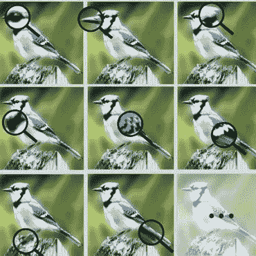
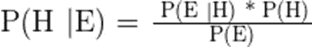
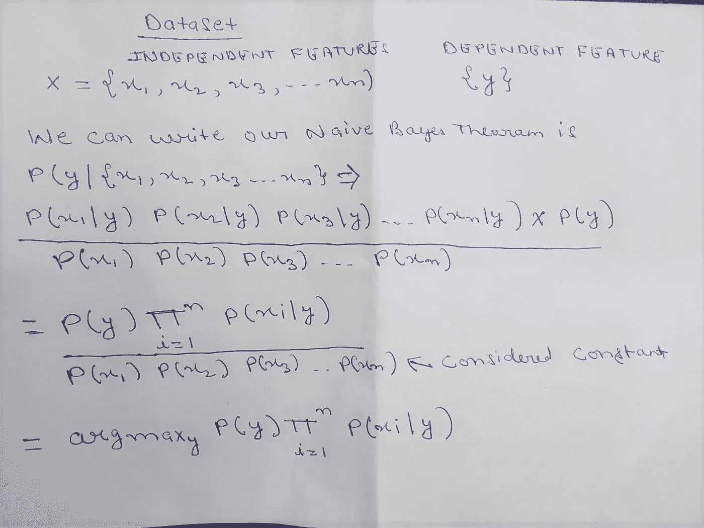
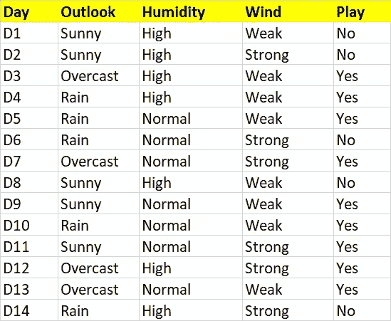
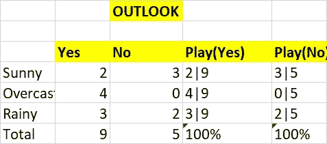
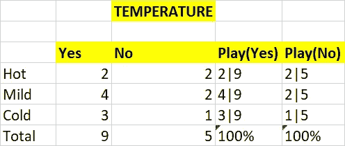
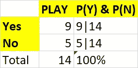
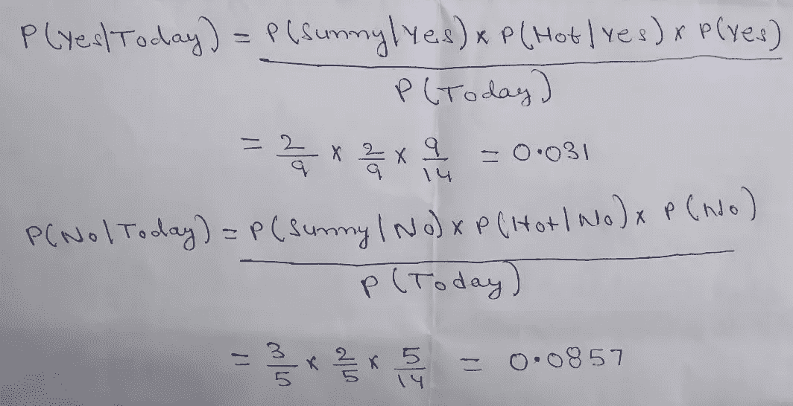

# 数据科学:朴素贝叶斯分类

> 原文：<https://medium.datadriveninvestor.com/data-science-naive-bayes-classifications-1044a71e21c2?source=collection_archive---------2----------------------->

Image credit: [Looking for the Devil in the Details](https://arxiv.org/pdf/1903.06150v2.pdf)

**简介:**

朴素贝叶斯分类是一种用于分类的监督机器学习算法。为了理解朴素贝叶斯分类器，我们需要理解贝叶斯定理。所以我们先来讨论一下贝叶斯定理。

**什么是贝叶斯定理？**

以托马斯·贝叶斯牧师命名的贝叶斯定理。它基于条件**概率**。条件概率是某件事将要发生的概率， ***给定其他事情*已经发生**。使用条件概率，我们可以使用事件的先验知识来计算事件的概率。

下面是计算条件概率的公式。

**其中**

*   P(H):这被称为先验概率 H。
*   P(E):证据 E 的概率(不考虑假设)。
*   P(E|H):假设假设 H 为真，证据 E 的概率。
*   P(H|E):假设证据 E 存在，假设 H 的概率

**为什么朴素贝叶斯这么‘天真’？**

它基于预测者之间的独立性假设。简单来说，**朴素贝叶斯分类器**假设一个类中特定特征/变量的存在与任何其他特征的存在无关。

它对数据集中的每个特征给予同等的重视。

关于朴素贝叶斯工作的一些方程。

Naive Bayes Implementation

这里我们需要考虑 Y=0 或 Y=1 的概率，我们将考虑哪个概率更高。

如果 0 类的 Y 是 0.7，1 类的 Y 是 0.5，我们将认为 0.7 是 argmax(在公式中提到)

**大量的定义和公式。让我们用一个例子来理解。**

这是我们的数据集。在这里，我们将找到基于给定特征的游戏概率。

让我们来看看一些特征展望和温度的统计数据

播放概率 w.r.t 目标特征。

现在我们必须找出今天玩耍的概率=是(前景=晴朗，温度=炎热)

同样，我们必须找出今天玩耍的概率=否(天气晴朗，气温炎热)

让我们做一些计算。

注意:这里我们跳过了 **P(Today)** 的计算，因为它对所有的值都是一样的。

现在，当我们必须计算“是”的概率时，我们必须将这些值归一化为 1。让我们开始吧。

**P(是)**= 0.031/(0.031+0.0857)= 0.265

**P(否)** =1-P(是)= 1–0.265 = 0.735

我们在这里可以看到 **P(否)大于 P(是)**所以对于我们今天的**(前景=晴朗，温度=炎热)**给定的条件，它被分类为不玩。

让我们看看 Python 代码。

这是用朴素贝叶斯定理计算概率的简单方法。

**朴素贝叶斯分类器的优势:**

1.  如果独立性假设成立，那么它比其他算法更有效。
2.  并且它需要较少的训练数据。
3.  它是高度可扩展的。
4.  它可以进行概率预测。
5.  它可以处理连续和离散数据。
6.  对无关的特征不敏感。
7.  它可以很容易地处理缺失值。
8.  最适合文本分类问题。

**缺点:**

1.  关于特征是独立的强假设，这在现实生活应用中几乎是不真实的。
2.  零频率，即如果在训练数据集中没有看到任何分类变量的类别，则模型将该类别的概率分配为零，然后很难进行预测。

 [## 将定义 2020 年就业前景的五大数据科学和机器学习趋势|数据驱动…

### 数据科学和 ML 是 2019 年最受关注的趋势之一，毫无疑问，它们将继续发展…

www.datadriveninvestor.com](https://www.datadriveninvestor.com/2020/02/19/five-data-science-and-machine-learning-trends-that-will-define-job-prospects-in-2020/) 

结论:我们详细了解了朴素贝叶斯算法的概念。它主要用于文本分类。它易于实现，执行速度快。如果你喜欢这篇文章，请点击拍手(最多 50 次拍手)。

想要连接:

联系方式:【https://www.linkedin.com/in/anjani-kumar-9b969a39/ 

如果你喜欢我在 Medium 上的帖子，并希望我继续做这项工作，请考虑在 [**patreon**](https://www.patreon.com/anjanikumar) 上支持我