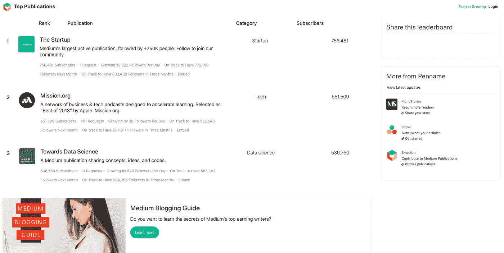
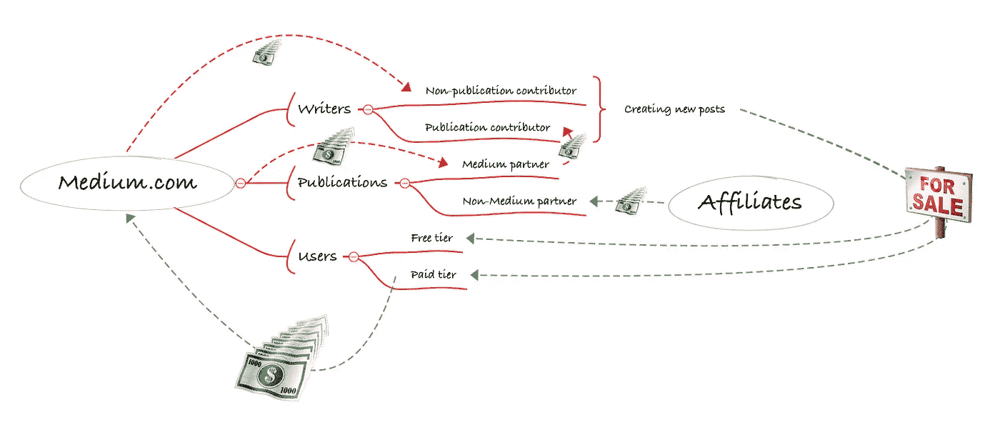

# 抽象的商业模式和行动指向理解 Medium.com 的用户

> 原文：<https://medium.datadriveninvestor.com/data-science-project-get-rewarded-by-knowing-medium-com-user-pool-modeling-business-problem-part-b93b8088c644?source=collection_archive---------34----------------------->

Photo by free stocks on [Unsplash](https://unsplash.com?utm_source=medium&utm_medium=referral)

# 简而言之，一个问题和答案

一周前，我开始在 Medium 上写作，并在这里发表了我的第一个故事。我知道我绝不是英语世界的顶级作家，但结果是如此可怕(14 次浏览，9 次阅读，3 秒。平均值。一周内付费会员的阅读时间)，这不可能是唯一的原因。环顾四周，在这样一个涵盖广泛话题的平台上，不仅好的作家得到认可，得到回报。

 [## 作为未来的数据科学家，管理您和您的雇主的期望

### 看我的店。做出你的选择——一位数据从业者的话。

jkcandick.medium.com](https://jkcandick.medium.com/a-letter-to-the-future-data-scientists-what-to-expect-and-what-is-expected-877d73847d31) 

当我看到一个问题时，我自然会问问题并寻求解决办法。问题是显而易见的:为了让我的帖子被更多的媒体用户浏览、通读和奖励，应该采取什么样的措施。

答案是关于 3 个方面的改进:帖子的内容，目标群体，以及你的帖子和读者之间的化学反应。

# 从答案到解决方案

变得擅长写故事绝对是首要任务。但这将是一个长期的努力和渐进的过程。肯定有一些低垂的果实。它们是什么？

写作更频繁？不，这无助于提高单个职位的绩效。在环顾四周并消化信息后，适当地添加伟大的图片和引用会提升你的内容，这反过来意味着更长的阅读时间。这是一个很好的实践，并且易于应用。

> “中国谚语。一图抵一万字。”——*印刷油墨，1927 年 3 月。*

以你在创建内容时所做的最好的工作，你如何能让尽可能多的人看到它？

将你的故事发送到出版物似乎是特定人群的绿色通道。只有当你能成为一个受欢迎的出版物的投稿人，并且你的作品被选中时，这才是真的。不幸的是，几乎所有这些受欢迎的贡献者的数量已经饱和，新来者很少被接受。这实际上不再是一个有效的选择。

那么在社交广告上花几块钱或者在搜索引擎优化上花几个小时值得吗？也许吧，但绝对不是现在。

 [## 在媒体上获得更多浏览量的 7 种简单方法

### 当许多社交网络上的有机接触正在减少(或死亡)时，媒介是一个闪亮的希望灯塔，如果…

medium.com](https://medium.com/the-mission/7-easy-ways-to-get-more-views-on-medium-519bff6befd1) 

了解了社交广告和 SEO 的工作机制，几乎可以肯定的是，在你了解媒体的用户群和你文章的目标群体之前，没有一个会比你的投资回报更多，甚至更少。如果可以的话，了解这个平台的用户兴趣，以及付费会员在这些用户中的比例，真的很有帮助。另一个需要理解的重要信息是用户阅读他们感兴趣主题的频率。与更多受众建立更紧密关系的机会与你对他们的了解程度成正比。

不难想象，平台不想让你知道这样的信息，也永远不会给你接触的机会；这可能(但只是可能)违反隐私保护规则，每个人都应该在这个平台上永远免费为他们写作。幸运的是，有一种方法可以合法地“黑掉”观众群的信息，而不知道每个人的信息，使用媒体的[顶级出版物数据。这里是你能在这页上得到的一瞥。](https://toppubs.smedian.com/)

它为什么有用，应该如何使用？这是棘手的部分。下面的思路是基于对未知信息的假设进行推理的。

第一个假设是，尽管有崇高的目标，但运营这个平台本质上是一项业务。大多数利益相关者都在尽力使他们的利益最大化。

此外，还假设非媒体合作伙伴出版物仅由其附属机构支持，并且所有特定于公司和特定于品牌的出版物都属于这种类型。

最后但同样重要的是，这里忽略了这个平台的同行竞争者和合作伙伴之间的动态。

因此，他们的业务得到了简化，并按照利益相关者关系和下面的资金流动进行建模(资金流动指的是[这篇文章](https://findingtom.com/how-do-medium-publications-make-money/))。我们会回来，并在前进的过程中一遍又一遍地引用它。

Theoretical Medium.com Business Model by the author

基于这种模式，平台通过货币循环盈利(平台->作者->帖子->订户->平台)。在理想的条件下，通过适当的管理，这种循环可以养活自己，并无限放大增长。然而，现实世界中没有什么是理想的。这个平台的作者和订阅者都很有限，不需要提及竞争。

因此，关键的现实将迫使管理委员会使用我们试图了解的信息(这些信息不会公布)来留住当前的订户，并尽可能多地获得新订户。那么平台愿意付出什么代价呢？第 1 部分:在这组作者没有关于付费订户构成的信息的情况下，基于非出版物贡献者对客户保留和获取的贡献，对非出版物贡献者的最低要求金额。第二部分:在知道付费用户利益构成的情况下，发行伙伴保证一定比例的客户保留和获取的最大可行量。

如果假设成立，并且上面的模型接近事实，那么出版物中的一些统计数据可以作为很好的样本来研究这个平台的用户池，例如，每个话题的关注者分布类似于整个用户池的兴趣分布，等等。当然，通过更复杂的分析，可以从用户池中获取更多的信息。所有这些你能知道的将帮助你获得更多的观点和更多的回报，就像它能帮助这个平台一样。

# 将解决方案转化为行动要点

希望这些想法和主意在这一点上对你有意义。接下来，我们将从解决方案中导出行动点。

1.  首先第一件事，就是一点一点提高写作能力。这需要毅力和坚持。(尽量增加平均阅读时间)
2.  任何人都可以做些事情来改善内容，那就是使用如上所述的图片和引文。(尽量增加平均阅读时间)
3.  通过使用可用的发布数据[了解该平台的用户群，此处](https://toppubs.smedian.com/)。(努力获得更多的浏览量和/或付费浏览量)
4.  使用搜索引擎优化(SEO)实践优化你的标题、描述和标签(尝试获得更多曝光，但在步骤 3 完成后更有效。)

这些后续项目将涵盖行动要点三和四，主题如下:

*   抓取出版物数据并保存在本地或谷歌工作表中(链接[此处](https://medium.com/datadriveninvestor/scraping-top-publications-data-with-python-using-selenium-imaplib-and-beautifulsoup4-18fcf9b95c47))

 [## 使用 Python 抓取顶级出版物的数据(使用 Selenium、Imaplib 和 BeautifulSoup4)

### 数据科学项目的一部分，以获得更多的意见和金钱对 Medium.com。这篇文章的重点是收集数据…

medium.com](https://medium.com/datadriveninvestor/scraping-top-publications-data-with-python-using-selenium-imaplib-and-beautifulsoup4-18fcf9b95c47) 

*   数据分析和报告，以了解用户群(链接[此处](https://medium.com/datadriveninvestor/how-to-make-money-on-medium-in-2021-37fbffbd48f1))
*   实用的文章“页面搜索引擎优化”

 [## 博客的终极搜索引擎优化指南，附示例

### 优化你的故事和博客，提高知名度。最佳实践的搜索引擎优化解释了一个…

medium.com](https://medium.com/datadriveninvestor/an-ultimate-search-engine-optimisation-guide-for-bloggers-with-examples-c46f11ffea39) 

如果你有灵感，也对这些话题感兴趣，请随时关注并保持关注。

# 作者的其他帖子

 [## 通过模式识别实现自动化股票交易——一种递归编程方法

### 股票模式识别的一种高度概括的全局递归程序设计方法及其实现

medium.datadriveninvestor.com](/empower-automated-stock-trading-with-pattern-recognition-a-recursive-programmatic-approach-5930da422555)  [## 使用 Python 抓取顶级出版物的数据(使用 Selenium、Imaplib 和 BeautifulSoup4)

### 数据科学项目的一部分，以获得更多的意见和金钱对 Medium.com。这篇文章的重点是收集数据…

medium.datadriveninvestor.com](/scraping-top-publications-data-with-python-using-selenium-imaplib-and-beautifulsoup4-18fcf9b95c47)  [## 如何在介质上写作赚更多的钱？

### 用数据解释。有哪些热门话题？哪些是盈利的？使用最佳实践在…上写作、出版和赚钱

medium.datadriveninvestor.com](/how-to-make-money-on-medium-in-2021-37fbffbd48f1)  [## 博客的终极搜索引擎优化指南，附示例

### 优化你的故事和博客，提高知名度。最佳实践的搜索引擎优化解释了一个…

medium.datadriveninvestor.com](/an-ultimate-search-engine-optimisation-guide-for-bloggers-with-examples-c46f11ffea39)