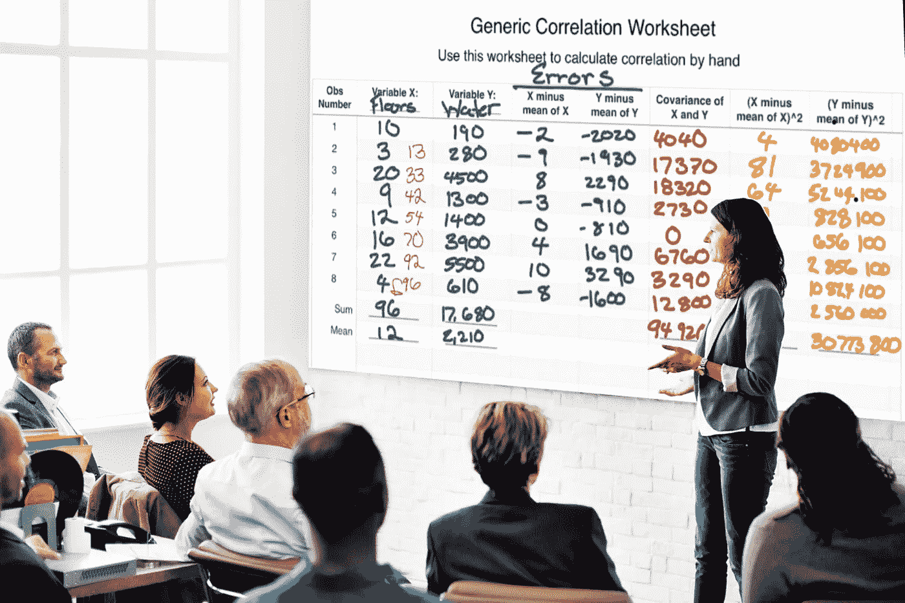

# 数据科学快速入门 Udemy 课程大纲

> 原文：<https://medium.datadriveninvestor.com/data-science-quick-start-udemy-course-outline-88cd0afe0d59?source=collection_archive---------18----------------------->

Image Credit: Author’s illustration or worksheet from Data Science Quick Start on a whiteboard. Teaser visual from the Data Science Quick Start Course.

## 每个人都必须从某个地方开始。数据科学快速入门概要。

TLDR:这篇文章预览了我最近在 Udemy 上提供的一门课程。如果你是任课教师(任何级别)，请滚动到本文的底部，在那里我将讨论以折扣价向你和你的学生提供这门课程。在先到先得的基础上，精选的几个教室将有资格免费参加该课程。

# 介绍

T2:每个人都需要从某个地方开始。本[数据科学快速入门](https://www.udemy.com/course/data-science-quick-start/)课程面向那些认为自己可能对数据科学感兴趣但还不确定的人。这是一门面向初学者的课程，将让您接触相关性分析(可用的最简单的分析技术之一)和 Python 编程。

Image credit: Author. “Broken Pandas.” Image Credit: “Via Design Pickle” — [More on attributions](https://adamrossnelson.medium.com/image-credit-attributions-a24efcc730ad).

具体来说，本课程有两个主要学习模块和一次顶点体验。第一个学习模块讲授如何逐步执行相关性分析。第二个学习模块教授一系列选定的 Python 编程技术。顶点体验要求学生用 Python 执行相关性分析。还有五个加分讲座。

以下是更详细的概要。

 [## 一瞬间学会数据科学！？数据驱动的投资者

### 在我之前的职业生涯中，我是一名训练有素的古典钢琴家。还记得那些声称你可以…

www.datadriveninvestor.com](https://www.datadriveninvestor.com/2020/07/23/learn-data-science-in-a-flash/) 

## 欢迎和介绍

第一个视频欢迎学生参加课程，讨论潜在的受众，还描述了整体课程大纲。我为那些尚未开始学习数据科学，但认为自己可能对数据科学工作感兴趣的学生设计了这门课程。

从未写过一行代码的学生可以在这门课程中获得成功。本课程还将对之前已经开始学习数据科学但尚未完成的学生有用。这门课程可以帮助你重新开始。

第二个视频总结了几个关键概念。这个关键概念视频回答了四个问题。什么是数据？什么是数据集？什么是观察？什么是变量？

## 模块 1:相关性分析

本模块附带了几个支持学习相关性分析的工作表。为了提供执行相关性分析的说明，有四个视频。

Image Credit: Author’s illustration that includes a rendering of the [Data Science Quick Start](https://www.udemy.com/course/data-science-quick-start/) course’s correlation worksheets.

观看了相关分析课程(引导学生浏览模块工作表)后，有一个视频介绍了学习知识检查。

知识检查是学生在没有视频讲座指导的情况下执行相关性分析的机会。这些课程鼓励学生在观看展示和解释知识检查解决方案的模块最后一个视频之前完成知识检查。

## 模块 2: Python 速成班

在学习执行相关性分析之后，学生们将学习一系列 Python 编程技术。模块二重点介绍 Python 编程。大多数额外的视频也提供了 Python 编程的指导。

本模块还提供了关于如何访问 Python 并与之交互的说明。完成本课程不需要安装 Python。本模块还举例说明了提供 Python 访问的多个简单工具。

我最喜欢的工具之一包括 [Jupyter。Org 的试试 Jupyter](https://jupyter.org/try) 平台。对于那些想要安装 Python 的人，本模块还提供了关于该主题的提示和建议。

本 Python 模块教授在 Python 中执行相关性分析所需的所有技术。这个模块没有具体展示用 Python 完成相关性分析的精确代码。本课程的顶点是省去编写执行相关性分析的代码的挑战。

作为学生参考，本模块中有多个与视频相关的 Jupyter 笔记本。

## 课程的顶点

课程顶点包括两个视频和三本 Jupyter 笔记本。第一个视频和前两个笔记本介绍了顶点挑战。最大的挑战是让学生使用 Python 从头开始执行相关性分析。

笔记本提供了模板和有用的提示，帮助学生用 Python 实现相关性分析。这意味着学生不需要从一张白纸开始。在观看顶点解决方案视频之前，学生必须尽最大可能完成课程顶点，这一点很重要。如果遇到困难，学生可以使用课程讨论板，或在网上寻求帮助。在顶点挑战中，前面模块中提供的工作表也是一个有用的资源。

当然，顶点解决方案视频可以在需要时提供帮助。一旦学生有了可行的解决方案，或者学生觉得准备好了，解决方案视频将提供如何用 Python 执行相关性分析的指导。

还需要注意的是，解决方案视频提供了一种解决方案。其他解决方案也是可用的。如果您的解决方案与视频中的解决方案不一致，这并不意味着您没有完成本课程。

# 结论

会议概述了 Udemy 上新发布的[数据科学快速入门](https://www.udemy.com/course/data-science-quick-start/)课程。

本课程的主要教学策略是:

*   先教两个技巧包括 1:计算相关系数，2: Python 编码)。
*   第二，通过挑战学生以新的方式组合这些新技能来强化学习(用 Python 执行相关性分析)。

我为刚接触数据科学的学生开设了这门课程。我还考虑了可能曾经学习过数据科学的学生，他们现在有兴趣继续以前的学习道路。任何对学习相关性分析感兴趣的人(为了学校或其他目的)可能也会对这门课程感兴趣。

> 千里之行始于足下。([归属](https://en.wikipedia.org/wiki/A_journey_of_a_thousand_miles_begins_with_a_single_step))。

如果您是讲师，并且有兴趣将本课程作为辅助教学工具，请联系我。我会和你一起为你的学生打折。这一提议对任何教育水平和任何校园的教师、讲师和教授开放。

> 每个人都必须从某个地方开始。

 [## 加入我的介绍链接媒体-亚当罗斯纳尔逊

### 作为一个媒体会员，你的会员费的一部分会给你阅读的作家，你可以完全接触到每一个故事…

adamrossnelson.medium.com](https://adamrossnelson.medium.com/membership) 

# 感谢阅读

感谢阅读。把你的想法和主意发给我。你可以写信只是为了说声嗨。如果你真的需要告诉我是怎么错的，我期待着尽快和你聊天。Twitter:[@ adamrossnelson](https://twitter.com/adamrossnelson)LinkedIn:[Adam Ross Nelson 在 Twitter](https://www.linkedin.com/in/arnelson) 和脸书: [Adam Ross Nelson 在脸书](https://www.facebook.com/adamrossnelson)。

## 访问专家视图— [订阅 DDI 英特尔](https://datadriveninvestor.com/ddi-intel)