# 数据故事 1

> 原文：<https://medium.datadriveninvestor.com/data-story-1-2068def504df?source=collection_archive---------33----------------------->

## 从可视化数据中推断信息

Photo by [Lukas Blazek](https://unsplash.com/@goumbik?utm_source=medium&utm_medium=referral) on [Unsplash](https://unsplash.com?utm_source=medium&utm_medium=referral)

数据，数据，数据，如此便宜和容易获得，但在数据科学家、机器学习工程师或计算机科学家眼中却如此宝贵。这背后的原因是，从这些数据中可以讲述一个完整的故事，一个事实上非常有价值的故事，从中可以得出有用的结论。

例如，数据故事根据数据集的种类提供关于销售的见解。在这篇文章中，我将讨论我制作的一个数据故事，我将向大家展示可以从数据中提取多少信息。

## 熟悉数据

在这个数据故事和下一个数据故事中，使用了数据集 *FIFA 19 完整球员数据集*，它是从一个名为 [kaggle](https://www.kaggle.com/datasets) 的免费开放数据集源下载的。首先，我们必须查看数据，因此数据集必须首先被加载并可视化。这里的*熊猫*图书馆就是为此而建的:

通过打印数据帧，数据以有序的方式显示，因此您可以查看行和列的数量和类型:

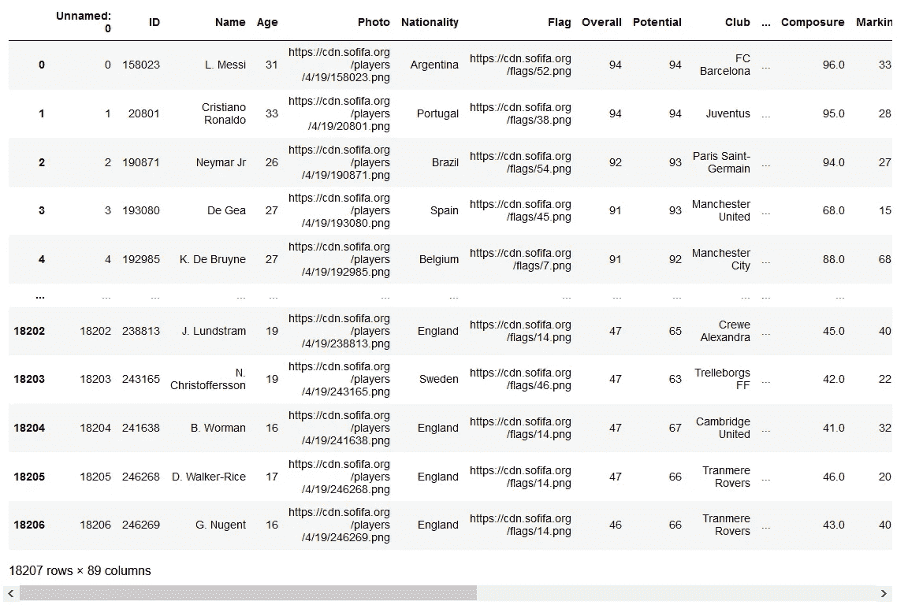

左下角显示数据集的大小，18207 行× 89 列。由于这个数据集非常大，所以没有显示所有的列和行，但是熟悉这些数据就足够了。要查看所有列名或某些特定行，可以使用包含在 *pandas* 库中的函数。

## 表明立场

在研究了这个数据集之后，可以对足球运动员的理想年龄采取一种立场。采取的立场如下:

> 31 岁是足球运动员的理想年龄

为了支持这一立场，从这个数据组中，已经创建了几个可视化，其中多个特征对年龄进行了阐述。在根据年龄设定特征之前，首先将数据集按年龄分组，以便于操作:

## 交互式线图

针对年龄的第一个特征是*总体评分*。既然数据框是按年龄分组的，那么所有的信息都可以按年龄拆分。通过这种方式，可以检索每个年龄的*总体评分*:

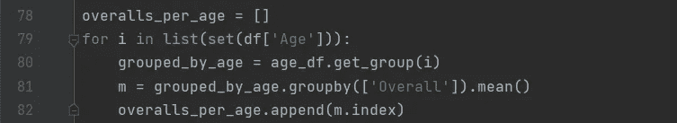

From the small dataframes per age, only the overall ratings are extracted

使用每个年龄的*总体评分*列表，可以检索每个年龄的平均、最大和最小*总体评分*:

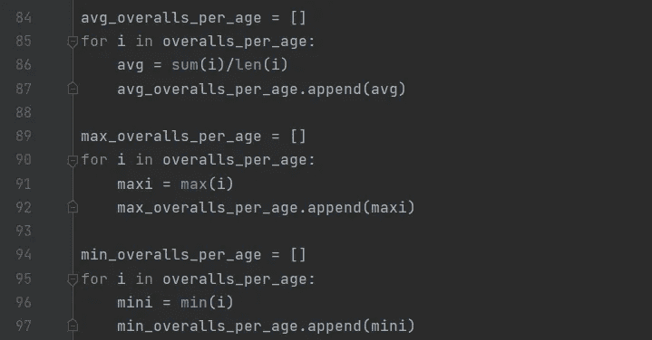

现在，这些可以在一个交互式图表中可视化，以对理想年龄做出一些陈述:

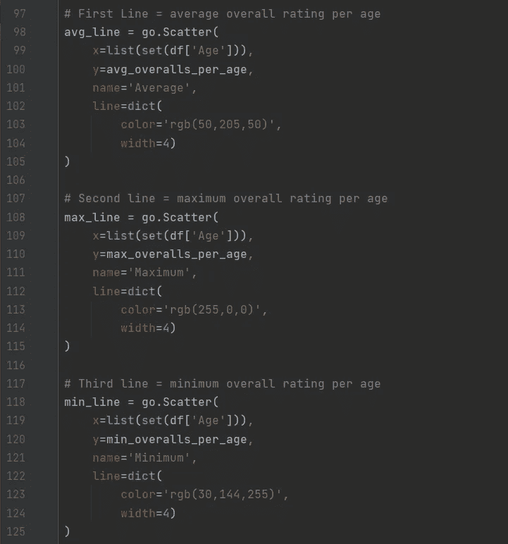

Define the lines for the linegraph

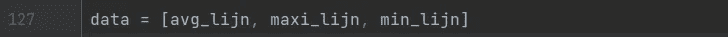

Defining the data as the three defined lines

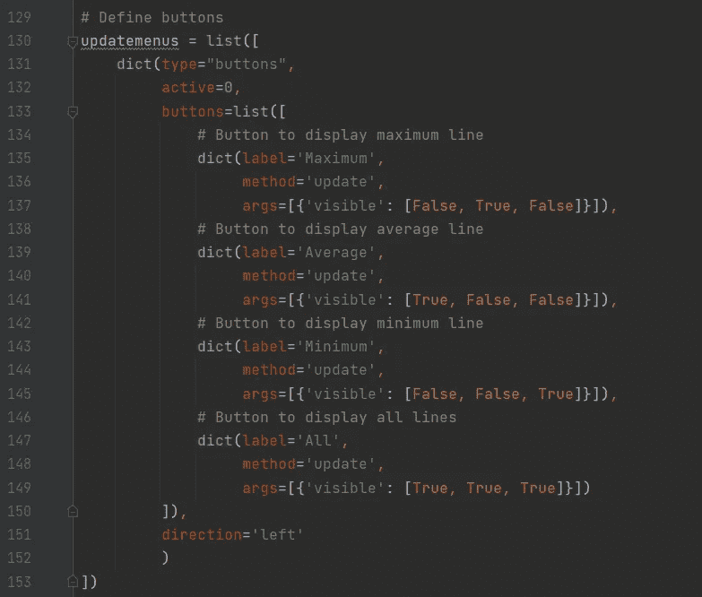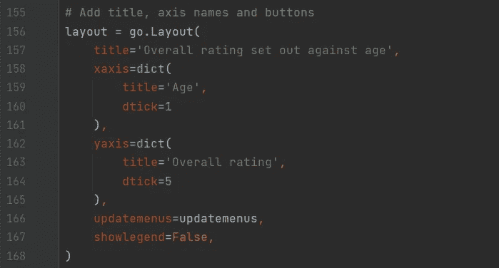

从这个图中可以清楚地看出，*的总体评分*在年轻时相对较低，但随着年龄的增长而增加。最终在 31 岁时达到顶峰，过了这个年龄，*的总体评分*下降。相当引人注目的是 40 岁和更高年龄的突然高峰，但这可以解释为一些拥有高*总评分*的特殊球员，如 ***O .佩雷斯*** *，*在 45 岁时造成了高峰。

## **交互式雷达图**

接下来，7 个特征的平均评级显示在雷达图中。这种可视化的特征是以这样一种方式确定的，它们既适用于后卫，也适用于前锋。这样做是为了避免检测到大的异常值，因为这些异常值在不同的特征中表现出色，从而造成事实的扭曲。

首先，创建一个包含 31 岁足球运动员所有信息的数据框架:

接下来，应该定义将用于绘图的数据，以及按钮和布局，就像在交互式线图中一样:

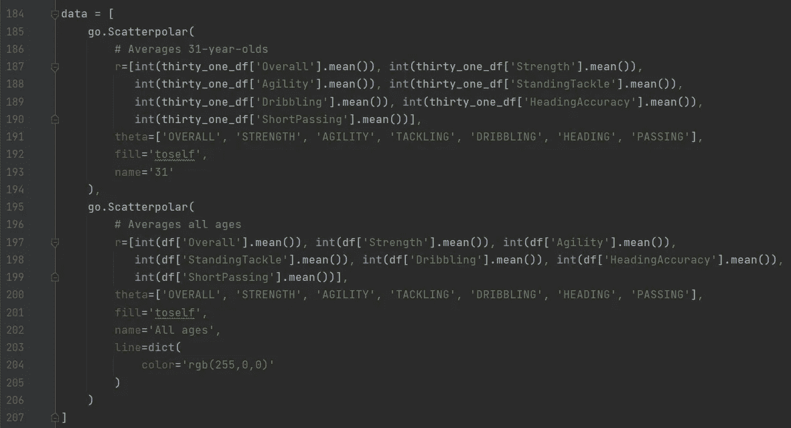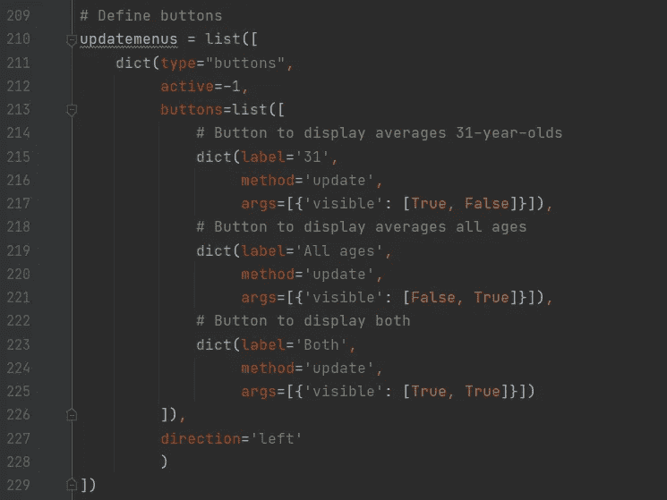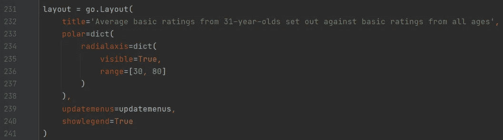

雷达图证明，足球运动员在 31 岁时状态最佳，因为他们在 7 项评分中有 6 项得分较高。敏捷度在 31 岁时似乎保持不变，并没有显著提高。

## 线条图

在可视化多年来*潜在评级*和*总体评级*的平均过程中，可以找到所采取立场的一些额外证据。这是以与上面显示的图非常相似的方式完成的。

对于该图，还使用了数据帧的另一部分，其必须被提取。在该可视化中，仅使用来自年龄小于 40 岁的所有足球运动员的信息:

现在再次定义数据和布局，然后绘制线图:

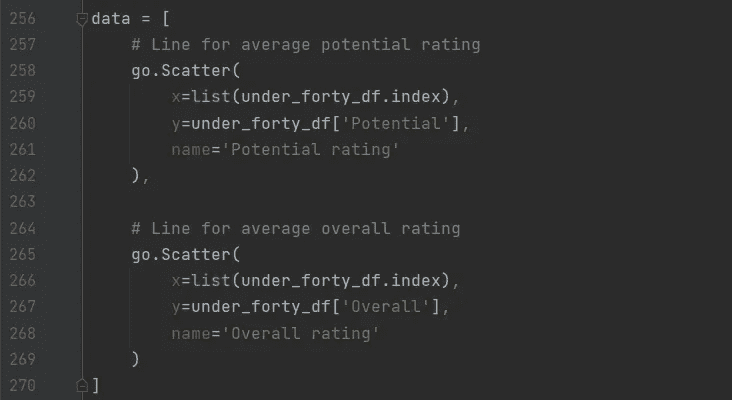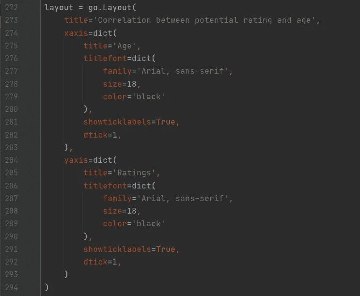

在该图中，可以看到*潜在评级*和年龄之间的负相关性。足球运动员越年轻，*潜力等级*越高。而*总体评分*与年龄呈正相关。这两个等级在 31 岁时重合，这意味着潜力在该年龄达到顶峰。

## 圆形分格统计图表

数据集的另一个有价值的栏目可以用来支持这一立场，那就是国际声誉。*国际声誉*用从 1 到 5 的数字来定义。在这种情况下，只有国际声誉高于 3 的玩家才会被使用。然后*技能移动*按年龄相加，也用值 1 到 5 表示:

然后，再次定义数据和布局，并绘制饼图:

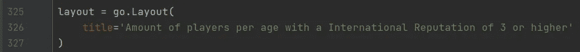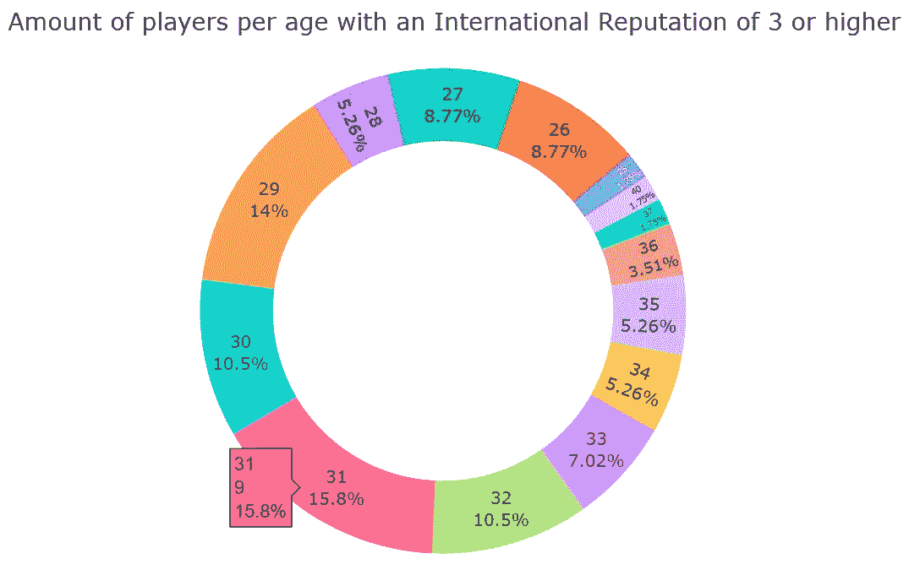

在这个饼状图中显示，拥有高*国际声誉*的球员中，31 岁的最多，有 9 名球员，占 15.8%。所以再次证明了 31 岁是足球运动员的理想年龄。将鼠标悬停在饼图上，可以看到上图中 31 岁年龄段的相同规格。

## 条形图

最终的可视化显示了所有拥有至少 4 个*技能动作*的足球运动员的平均年龄收入。在收入可以被使用之前，数据必须被清理。数据集包含表示金额的欧元符号和 K，因此必须转换整列并添加到 dataframe 中以供使用:

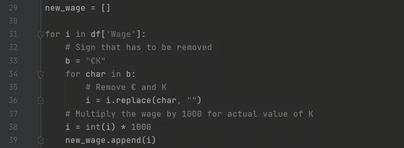

既然可以使用收入，首先可以获得每个年龄的平均收入:

与之前一样，必须定义数据和布局，以便可以绘制图形:

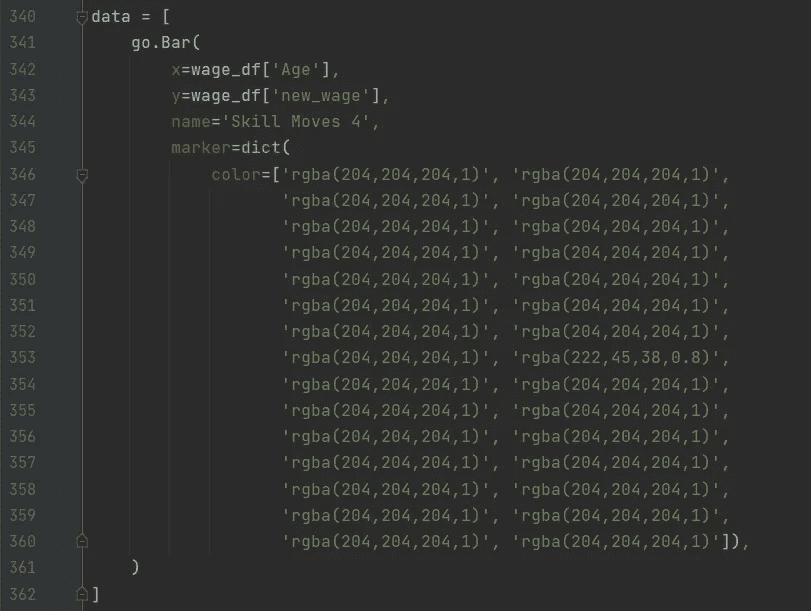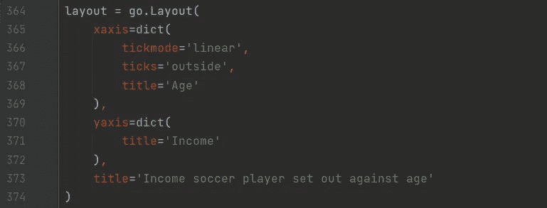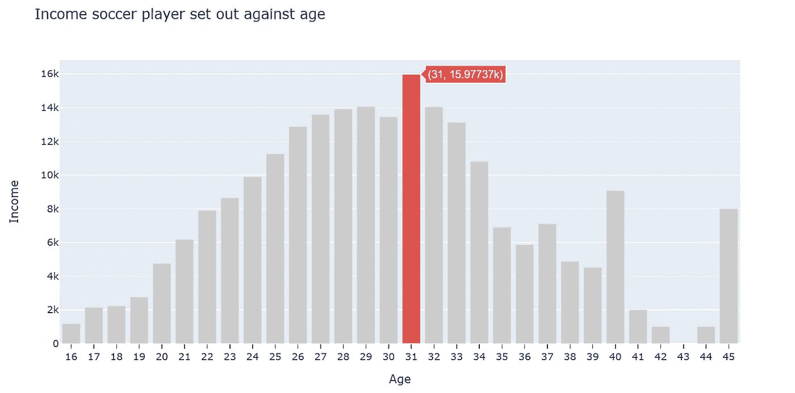

这里显示的是 31 岁时平均收入的峰值。这再次支持了 31 岁足球运动员处于最佳状态的观点。就像在饼图中一样，将鼠标悬停在其他条形上可以看到它们的规格。45 岁的惊人巅峰又一次是因为杰出的足球运动员 ***O. Perez*** 。他是这个数据集中唯一一个 45 岁的人，因此没有平均值。

总而言之，看看这篇文章中展示的 5 种形象化的观点，可以得出结论，采取的立场可以被认为是正确的。从这些图中可以得出结论，31 岁的球员在素质、声望和收入上都超过了年轻和年长的球员。

在第二个数据故事中，从相同的数据集采取了另一种立场并进行讨论。在这个新的数据故事中，使用了新的数据可视化，这让我们深入了解在正确使用的情况下，图表是多么的多样化和丰富多彩。