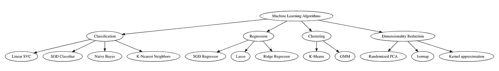
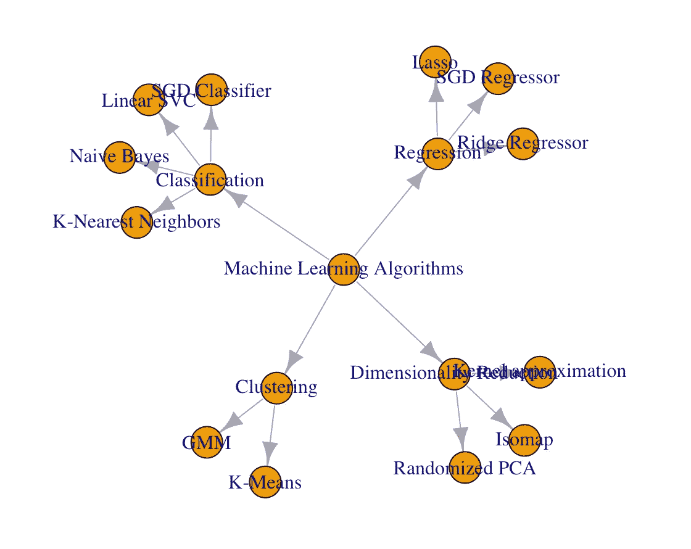

# Data Tress with R

> 原文：<https://medium.datadriveninvestor.com/data-tress-with-r-577497faabb1?source=collection_archive---------6----------------------->

## R for Engineers and Managers

## Creating Data Trees using R packages

Image by [Jason Leem](https://unsplash.com/@jleeems) available at [Unsplash](https://unsplash.com/photos/50bzI1F6urA)

# **Data Trees**

Data tress are visual representations of ***hierarchical*** data. They are widely used in multiple fields such as decision theory, machine learning, finance, organizational management, routing algorithms, computer science and programming. Data trees help organizing data into groups and subgroups based on a hierarchy.

## Data Trees Elements

*   **Root node**: represents the very top node of the tree. All the existing data points, groups and subgroups end up linked to it. It is the node with the highest hierarchy.
*   **Leaves**: represent children of nodes with higher hierarchies (i.e. parent nodes). They can also be parent nodes of multiple branches of leaves with lower hierarchies.
*   **Attributes**: specific information associated to each leave or group of the tree.

R [data.tree](https://cran.r-project.org/web/packages/data.tree/data.tree.pdf) package contains multiple functions for building, formatting and plotting data trees. In addition, it can used along with other plotting packages (e.g. [igraph](https://cran.r-project.org/web/packages/igraph/igraph.pdf)) for styling data trees plots.

For the following example, let’s create and plot a data tree corresponding to multiple machine learning algorithms classified by application groups. Let’s take a look at the R code!

**Machine Learning Algorithms Data Tree:**

**Machine Learning Algorithms Data Plot:**

**Machine Learning Algorithms Data igraph Plot:**

Data trees can be as big or complex as required by the end user. They can contain multiple levels within levels to organize data in the best possible way by categorizing it into groups and subgroups. In addition, they can also include attributes, depending on the data context.

For the following example, I developed a more complex data tree corresponding to the organizational structure of the company I currently work for: [**SimWell**](https://www.simwell.io/en/), an industrial engineering consulting firm specialized in simulation and optimization. The data tree contains the positions for each of the current employees from the Canada and United States teams with their respective first and last names as attributes. Let’s take a look at the R code!

**SimWell’s Data Tree:**

我在这里！你可以在西姆威尔美国团队下的 [**模拟顾问**](https://www.simwell.io/en/about/) 组里面找我！

正如在上面的数据树上观察到的，除了树本身之外，还有两个附加的属性列:first_name 和 last_name。该属性为树的叶子提供了附加信息，并且为了该数据树的目的，有助于识别每个职位的员工姓名。

# 总结想法

数据树是分层数据可视化的非常有用的工具。它们的受欢迎程度已经扩展到学术界和工业界的多个领域，具有广泛的应用。

虽然有其他免费的数据可视化软件来构建图形和绘图，但 data.tree R 包对程序员和专业人员来说是一个有用的选择。虽然本文探索了这种包的一些功能，但是强烈建议程序员使用他们感觉最舒服的软件，同时遵守要构建的数据树的要求。

有兴趣了解更多关于 data.tree R 包的信息吗？点击查看其官方文档[。](https://cran.r-project.org/web/packages/data.tree/data.tree.pdf)

*— —*

*如果你觉得这篇文章有用，欢迎在*[*GitHub*](https://github.com/rsalaza4/R-for-Industrial-Engineering/blob/master/Miscellaneous/IPO%20Diagram.R)*上下载我的个人代码。你也可以直接在 rsalaza4@binghamton.edu 给我发邮件，在*[*LinkedIn*](https://www.linkedin.com/in/roberto-salazar-reyna/)*上找到我。有兴趣了解工程领域的数据分析、数据科学和机器学习应用的更多信息吗？通过访问我的介质* [*简介*](https://robertosalazarr.medium.com/) *来探索我以前的文章。感谢阅读。*

*-罗伯特*