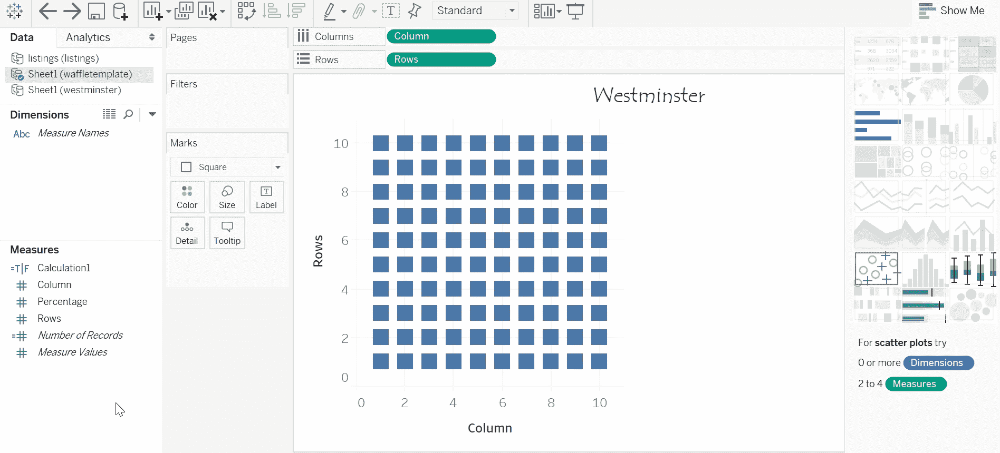

# 使用 Tableau- Waffle 图表以正确的方式实现数据可视化

> 原文：<https://medium.datadriveninvestor.com/data-visualization-done-the-right-way-with-tableau-waffle-chart-fdf2a19be402?source=collection_archive---------0----------------------->

了解如何创造性地构建和放置华夫饼图表！

布伦·布朗博士曾经说过，“故事只是有灵魂的数据”..📔这击中了我们的要害。

所以今天我们要讲一个有数据的故事，非常真实。这个故事是关于本的。本是一个 21 岁的男孩，他一直想去伦敦。和许多同龄人一样，他打算住在 Airbnb 里。空中旅馆物有所值，还能体验当地风味。但是他需要选择一个最适合他需求的 Airbnb。

🧇对他来说很幸运，他只是偶然发现了一个巨大的数据集。他在 https://data.world/kgarrett/inside-airbnb-london 偶然发现了它。他认为，如果有人充分利用这些数据，它会坦白一切。

然而，要理解如此庞大的数据集，他需要一些工具。不用多想，[的画面](https://www.tableau.com/)就在这里。他很清楚，Tableau 可以是一个救生员，这是正确的。它可以将巨大的原始数据转换成易于理解的视觉效果。这是他让数据变漂亮的机会。

他首先想要分析伦敦的哪些区/自治市拥有大多数主机列表。为此，他选择了一个华夫饼图表。不是因为这是他最喜欢的菜。而是因为看格子的彩色小细胞可以给他一种百分比方面的视觉直觉。

他甚至参考了[以前的](https://medium.com/swlh/data-visualization-done-the-right-way-with-tableau-pie-and-donut-chart-7b37b5e4422e)文章来寻求帮助。上一篇文章深入探讨了饼图和甜甜圈图的奇妙之处。虽然他想要类似的东西，但他想避免切片和角度，因为这更难查看，数据比较可能有点困难。

 [## 一瞬间学会数据科学！？数据驱动的投资者

### 在我之前的职业生涯中，我是一名训练有素的古典钢琴家。还记得那些声称你可以…

www.datadriveninvestor.com](https://www.datadriveninvestor.com/2020/07/23/learn-data-science-in-a-flash/) 

因此出现了华夫饼图表。它甚至经常被称为**方形饼图。**它的优点是不必处理角度，并起到显示比例的类似作用。

🧇已经搞定了，表演时间到了。他开始构建华夫饼干的结构。与其他图表不同，这张图表需要一些准备工作。所以他自己创建了一个 excel 表格。它有三列，即行、列和百分比。华夫格图是一个 10 X 10 单元格网格，其中每个单元格代表 1 个百分比，总和为 100%。为此，百分比列需要填充到第 100 个值。

应该注意到，这些值一直填充到 101 行。这是因为单元格标题位于第一行。因此，值的填充基本上从第二行开始，而不是从第一行开始。

每行有十列。这就是为什么值 1 被拖动到行下 10 行，而列值从 1 到 10 编号。对于第二行，列值再次从 1 开始，依此类推。对网格中存在的所有十行重复上述过程。

然后，他在 Tableau 中加载这个数据集。

在拖放列和行之后，他取消了 analysis 菜单中的聚合度量。Tada！他的图表的基础已经准备好了。它将从左下角到右上角进行填充。

airbnb 的数据集包含了许多地区的房源。他过滤了这个数据集，并制作了另一个数据集，该数据集只包含威斯敏斯特的列表。威斯敏斯特是他的首选，因为它靠近大本钟和白金汉宫，这是他的遗愿清单上的景点。然后他把这两个也和 Tableau 联系起来。(Tableau 中可以连接多个信号源)

华夫图可以用条件格式表示，其中单元格突出显示。需要创建公式，以便只有特定单元格的颜色与其他单元格不同。现在，他继续通过创建如上所述的计算字段，将威斯敏斯特的列表表示为总单元格的百分比。

回到 waffle 结构的数据源，他使用前面创建的字段创建了另一个计算字段。

此计算字段被删除为彩色。每个细胞贡献百分之一。(1%).所以他现在知道威斯敏斯特的上市量占总上市量的 8%。聪明的本也知道，他可以隐藏网格线，以进行最终的、更干净的润色。

他可以随心所欲地改变颜色。他的创造力或视觉欲望不必受到限制。他可以随意改变华夫饼干积木的形状。

🧇这是他的华夫饼干图表，看起来像 Airbnb，都准备好招待他了。

🧇，但他也想知道其他地区主机列表的数量。所以他选择了他最喜欢的五个选项并进行分析。他甚至提到了《T2》关于包装泡沫图表的文章。利用这个，他分析了

*   Airbnb 在不同地区的价格
*   这些地区的记录频率。

他认为他也应该和他的妹妹分享他的发现和分析。他计划制作一个非常创新的、开箱即用的视觉化图像来吸引她。他使用像 MS Paint 这样的简单工具🎨来做这个。

考虑到他在上面创建的可视化，他可以根据按地区列出的主机列表的数量、跨地区的成本因素以及实际居住在这些地区的人的频率来评估这些地区。

他现在可以做出视觉上令人震惊、心理上明智的决定。

🧇:既然他的逗留问题已经解决，让我们开始探索他的飞行选择吧。

🧇:如果你没有安排好合适的航空公司来启动这趟旅行，那么制定住宿细节又有什么意义呢？好在他刚刚在[https://data . gov . uk/dataset/cb05f 060-c889-4466-ac82-8 b 99 c 8730 e0b/home-office-flight-data](https://data.gov.uk/dataset/cb05f060-c889-4466-ac82-8b99c8730e0b/home-office-flight-data)找到了一个数据集。他想分析这些数据来检索一家被证明是受欢迎的航空公司。他相信大众的选择是人民的选择，因此享有良好的声誉。

为了做到这一点，他执行了与之前相同的步骤，并绘制了下图。

在这两家航空公司中，英国航空公司是明显的赢家。它贡献了总共 32%的人的首选。然而，要做出一个具体的决定，他将不得不评估更多的航空公司。你也应该自己尝试一下！

讲故事是将想法融入世界的最强有力的方式。所以，继续吧，在一个充满饼图的世界里，大胆地创建一个华夫饼图表，并在你自己的故事中使用它💡 💭

快乐创作！🎉

**访问专家视图—** [**订阅 DDI 英特尔**](https://datadriveninvestor.com/ddi-intel)