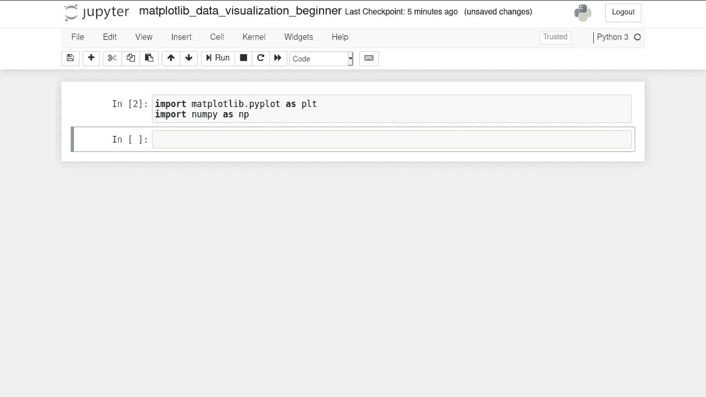
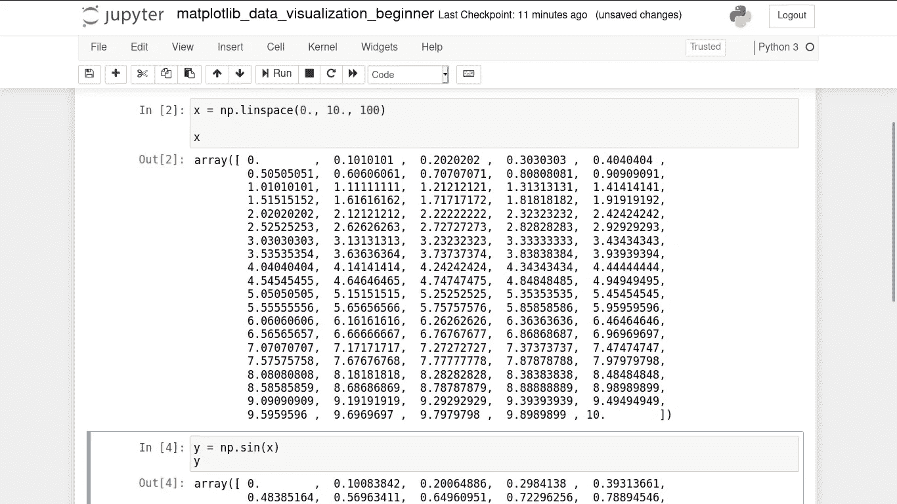
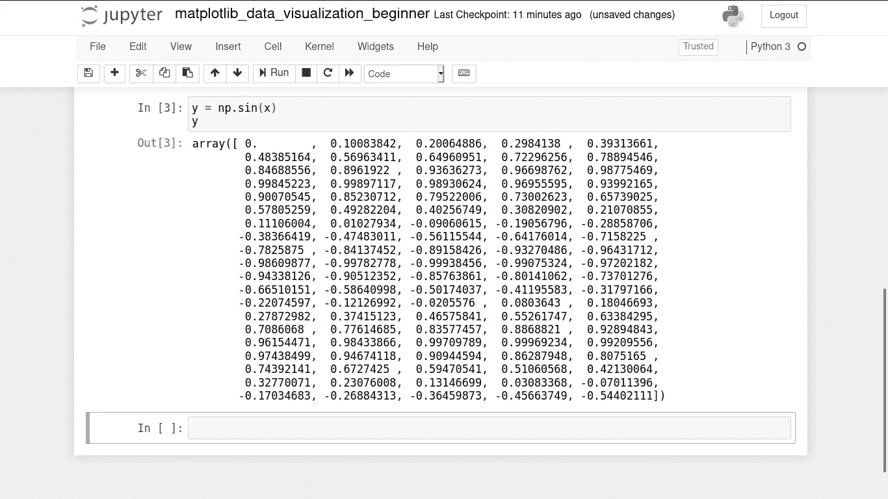
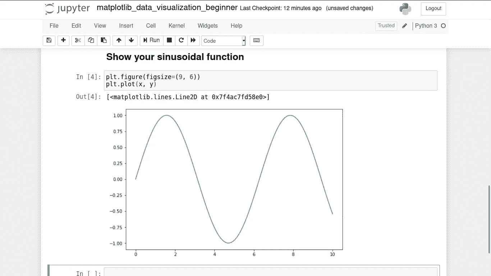
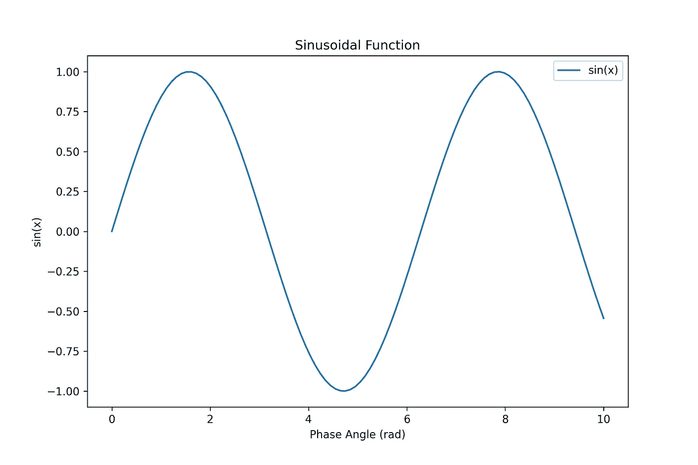

# 用 Matplotlib 实现 Python 数据可视化——完全 Python 初学者第一部分

> 原文：<https://medium.datadriveninvestor.com/data-visualization-with-matplotlib-for-absolute-beginner-part-i-655275855ec8?source=collection_archive---------0----------------------->

## 使用 MATPLOTLIB 设计

## 使用 Matplotlib 的第一步


Photo by [Luke Chesser](https://unsplash.com/@lukechesser?utm_source=medium&utm_medium=referral) on [Unsplash](https://unsplash.com?utm_source=medium&utm_medium=referral)

这是用 Matplotlib 和 Jupyter Notebook(一个强大的 Phyton 模块)可视化我们的数据的教程。

# **步骤 1:将 Matplotlib 导入 Jupyter 笔记本**

这一步可以通过书写来完成

```
import matplotlib.pyplot as plt
```

如图 1 所示。



Figure 1\. Importing Matplotlib and Numpy in Jupyter Notebook.

代码的意思是我们将调用 Matplotlib 模块中的子模块“pyplot”作为 plt，调用 Numpy 模块作为 np。

我们使用 Numpy 进行算术运算，如加、减、乘、除等。

# 步骤 2:创建简单的直线函数

为了创建正弦函数，我们需要在 x 轴和 y 轴上定义两个变量，如图 2 和图 3 所示。



Figure 2\. Defining x-variable.

变量 x 是从 0(作为浮点数)到 10(浮点数)的数组编号，有 100 个数字。成员如图 2 所示，从 0。, 0.1010101, 0.2020202, …, 10.



Figure 3\. Defining y-variable.

y 变量是每个 x 的正弦函数，比如 x 的第一个成员的正弦为 0，因为 sin 0 = 0。y 函数中每个 x 的值以弧度为单位，而不是以度为单位。如果您更喜欢使用学位，可以用下面的代码进行更改。

```
y = np.sin(np.deg2rad(x))
```

# 第三步:想象你的功能

为了可视化您的函数，您需要使用

```
plt.figure(figsize = (9, 6)) #picture container of 9 x 6 
plt.plot(x, y) #show line plot of x and y
```

与 *figsize* 是你图片的大小。接下来，您可以用图 4 所示的代码在您定义的图片中显示您的函数。



Figure 4\. Visualize your functions.

代码 *plt.plot* 用于显示情节线。如图 4 所示，它将 x 变量作为 x 轴，y 变量作为 y 轴。

用 Jupyter 笔记本显示功能不需要使用

```
plt.show()
```

因为它会自动显示在 Jupyter 笔记本的单元格中。

# 步骤 4:使用标题、标签和图例

我们已经创建了线图，但还没有自定义标签、x 轴和 y 轴标签。我们可以在我们的图的标题上加上

```
plt.title('Sinusoidal Function')
```

我们可以使用添加标签

```
plt.xlabel('Phase Angle (rad)') #take x-axis label
plt.ylabel('sin(x)') #take y-axis label
```

要添加图例，首先，我们必须在线图代码中制作一个标签，如下所示

```
plt.plot(x, y, label = 'sin(x)') #take a label of sin(x)
plt.legend(loc = 'best') #show legend in best location
```

结果如图 5 所示。



Figure 5\. Sin Function Visualization with Matplotlib Python.

# 步骤 4:保存您的地块

如何在 Matplotlib 中保存你的图片？您可以使用以下 python 代码

```
plt.savefig('sin_function.png', dpi = 300) #save in png of 300dpi
```

您可以保存为其他格式，如。jpg，但是我推荐你进去。png 格式，标准分辨率为 300dpi。

# 结论

以下是本教程的完整代码，“用 Matplotlib 实现 Python 数据可视化——完全 Python 初学者第一部分”。

```
#Importing modules
import matplotlib.pyplot as plt
import numpy as np#Create data and its function
x = np.linspace(0., 10., 100)
y = np.sin(x) #in radian#Show and save your line plot
plt.figure(figsize=(9, 6))
plt.plot(x, y, label = 'sin(x)')
plt.title('Sinusoidal Function')
plt.legend(loc = 'best')
plt.xlabel('Phase Angle (rad)')
plt.ylabel('sin(x)')
plt.savefig('sin_function.png', dpi = 300)
```

用 Matplotlib 和 Jupyter Notebook 做数据可视化还需要更多教程吗？可以在下面留言评论。

请等待我们更新到下一部分，第二部分和第三部分，在 Matplotlib 和 Jupyter 笔记本中进行更高级和更复杂的绘图，如调整线条颜色和线条样式，调整轴限制，为您的绘图使用 LATEX 字体，自定义字体大小，自动为一些图片制作绘图网格。

[更新]您可以访问此链接阅读第二部分。

[](https://medium.com/@bahrulsg/python-data-visualization-with-matplotlib-for-absolute-beginner-python-part-ii-65818b4d96ce) [## 用 Matplotlib 实现 Python 数据可视化——完全 Python 初学者第二部分

### 在这一部分中，我们将学习使用 Jupyter Notebook 在 matplotlib 中调整颜色、轴限制和制作网格…

medium.com](https://medium.com/@bahrulsg/python-data-visualization-with-matplotlib-for-absolute-beginner-python-part-ii-65818b4d96ce) 

谢了。