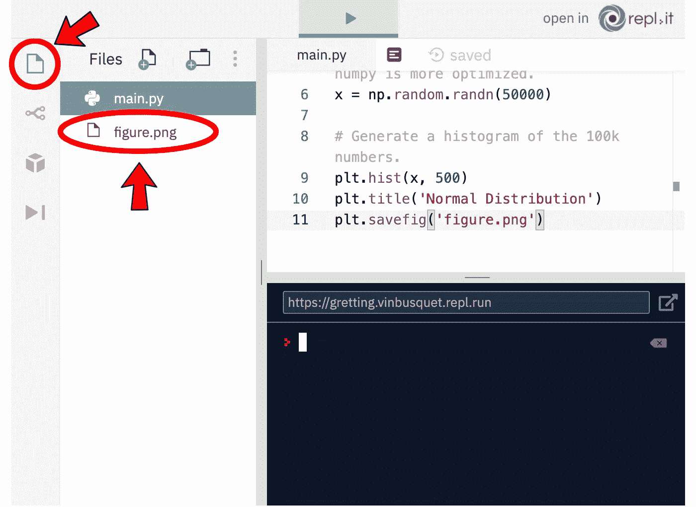
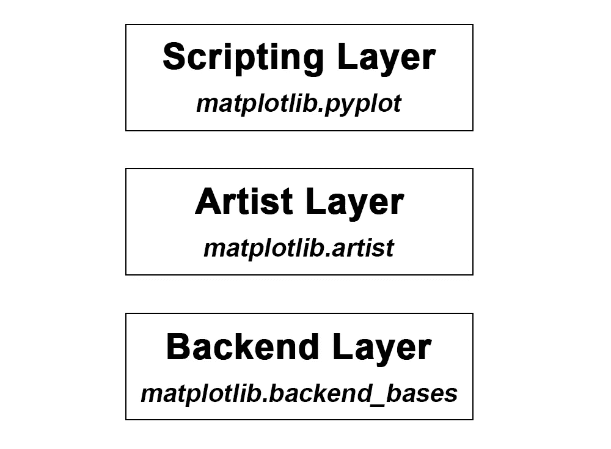
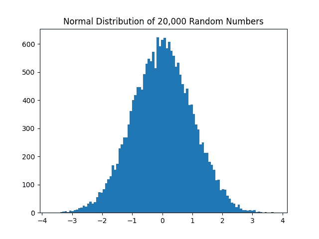

# 基于 Python — Matplotlib 架构的数据可视化

> 原文：<https://medium.datadriveninvestor.com/data-visualization-with-python-matplotlib-architecture-6b05af533569?source=collection_archive---------2----------------------->

最流行的 Python 绘图库的架构概述。

Source: [Freepik](https://www.freepik.com/free-vector/isometric-data-visualization-concept-background_4274183.htm#position=30)

数据可视化在数据科学中起着至关重要的作用，它允许通过可视化表示来洞察数据。

这是一个强大的分析工具，被政府、公司、大学、研究中心所使用，并且在一些情况下被证明是至关重要的，包括最近的新冠肺炎疫情。

# 什么是数据可视化？

Data visualization concept isometric background Source: [freepik.com](https://www.freepik.com/free-vector/data-visualization-concept-isometric-background_3958754.htm)

[**数据可视化**](https://en.wikipedia.org/wiki/Data_visualization) 是数据的图形表示。

这是一种以图形化和易于理解的方式显示复杂数据的方式，这在试图解释从越来越大的数据集的分析中获得的洞察力时非常有用。

正如流行的说法所说

> [《一图胜千言》](https://en.wikipedia.org/wiki/A_picture_is_worth_a_thousand_words)

绘图和图表可以非常有效地传达数据的清晰描述，尤其是在向观众披露调查结果或与其他同行数据科学家共享数据时。

此外，在支持决策制定方面，它们也非常有价值。

数据可视化涉及特定的术语，其中一些源自统计学。例如，作者[Stephen first](http://www.perceptualedge.com/about.php)定义了两种类型的数据，它们结合使用来支持有意义的分析或可视化:

*   分类:描述数据性质的文本标签，如“姓名”或“年龄”。这个术语也包括定性(非数字)数据。
*   定量:数字度量，如“25”代表年龄(年)。

信息显示的两种主要类型是表格和图形。

*   一个*表*包含用分类标签组织成行和列的定量数据。它主要用于查找特定的值。在上面的例子中，表格可能有代表姓名(一个*定性变量*和年龄(一个*定量变量*)的分类列标签，每行数据代表一个人(抽样的*实验单元*或*类别细分*)。
*   *图形*主要用于显示数据之间的关系，并描绘编码为*视觉对象*的值(如线条、条或点)。数值显示在由一个或多个*轴*描绘的区域内。这些轴提供了*标度*(定量和分类),用于对视觉对象进行标记和赋值。许多图表也被称为*图表*。

# Matplot 是什么？

Matplotlib Logo. Source: [matplotlib.org](https://matplotlib.org/)

[Matplotlib](https://matplotlib.org/) 是最古老的 Python 绘图库，并且仍然是最流行的。

它创建于 2003 年，是 [SciPy Stack](https://www.scipy.org/about.html) 的一部分，这是一个类似于 [Matlab](https://www.mathworks.com/products/matlab.html) 的开源科学计算库。

Matplotlib 的设计理念是，只需几个命令就可以创建简单的绘图。

 [## 数据驱动的投资者|微软比 Chrome 有“优势”

### 简史我从来不是浏览器的粉丝，确切地说，我只是一个浏览器的粉丝，Chrome。这是我的…

www.datadriveninvestor.com](https://www.datadriveninvestor.com/2020/03/29/microsoft-having-an-edge-over-chrome/) 

尽管 Matplotlib 主要是用纯 Python 编写的，但它大量使用了 [NumPy](http://www.numpy.org/) 和其他扩展代码来提供良好的性能，即使对于大型数组也是如此。

Source: [clipart.email](https://www.clipart.email/download/2887236.html)

**重要提示**:在本文中，我将使用 [Repl](https://repl.it) 的嵌入式 Python 解释器直接在浏览器中审查和测试代码。主要的区别是显示图形的方法不工作，因为它在运行 Python 的本地机器上会工作，所以我用方法`[matplotlib.pyplot.savefig()](https://matplotlib.org/api/_as_gen/matplotlib.pyplot.savefig.html)` 替换了它的用法，将图形保存为图像文件。要查看生成的图像文件，在执行脚本后，需要通过单击左侧菜单中突出显示的图标打开文件菜单，如下图所示，并单击文件 figure.png。

# Matplotlib 架构

Three main layers in M`atplotlib` architecture. Source: [Jun Ye’s Blog](https://junye0798.com/post/plt-xxx-or-ax-xxx-that-is-the-question-in-matplotlib/)

Matplotlib 架构由三个主要层组成:

*   **后端层** —通过与机器中的绘图工具包通信来处理所有繁重的工作。这是最复杂的一层。
*   **艺术家层** —允许完全控制和微调 Matplotlib `figure` —所有情节元素的顶级容器。
*   **脚本层** —三层中最轻的脚本接口，旨在使 Matplotlib 像 MATLAB 脚本一样工作。

让我们详细介绍其中的每一项:

## 后端层

后端层通过与你机器中的工具箱如 [wxPython](https://wxpython.org/) 或绘图语言如 [PostScript](https://en.wikipedia.org/wiki/PostScript) 通信来处理所有繁重的工作。这是 Matplotlib 库中最复杂的一层。

它有三个主要的内置抽象接口类:

*   **图形画布—** `[matplotlib.backend_bases.FigureCanvasBase](https://matplotlib.org/api/backend_bases_api.html#matplotlib.backend_bases.FigureCanvasBase)` 图形渲染到的画布。
*   **渲染器—** `[matplotlib.backend_bases.RendererBase](https://matplotlib.org/api/backend_bases_api.html#matplotlib.backend_bases.RendererBase)` 处理绘制/渲染操作的抽象基类。负责绘制图形。
*   **事件—** `[matplotlib.backend_bases.Event](https://matplotlib.org/api/backend_bases_api.html#matplotlib.backend_bases.RendererBase)` 处理用户输入，如键盘和鼠标点击。

一个普通用户几乎不用处理这一层，这也是我们不去赘述的原因。

## 艺术家层

它允许控制和微调`figure`中尽可能多的元素，就像艺术家在画布上绘画一样。

该层由一个主对象 [Artist](https://matplotlib.org/api/artist_api.html#matplotlib.artist.Artist) 组成，它使用渲染器在画布上进行绘制。与**脚本层**相比，它允许你做更多的定制，并且对于高级剧情来说更方便。

特别是当处理多个图形/轴时，你不会混淆哪个是当前活动的，因为每个子情节都被分配给一个[艺术家](https://matplotlib.org/api/artist_api.html#matplotlib.artist.Artist)对象。

这就是为什么艺术家层有时被称为**基于对象的绘图**。

在编写 web 应用程序、UI 应用程序或者与其他开发人员共享的脚本时，经常会用到它。

Matplotlib 图形上可见的一切都是艺术家实例:标题、线条、刻度标签、图像等等，都对应于一个艺术家。

有两种类型的艺术家对象。第一种是**原语类型**，比如一个 [Line2D](https://matplotlib.org/api/_as_gen/matplotlib.lines.Line2D.html) 、[矩形](https://matplotlib.org/api/_as_gen/matplotlib.patches.Rectangle.html)、[圆形](https://matplotlib.org/api/_as_gen/matplotlib.patches.Circle.html)、[文本](https://matplotlib.org/api/text_api.html)。而第二种是**复合型**，如[轴](https://matplotlib.org/api/axis_api.html?highlight=axis#module-matplotlib.axis)、[勾](https://matplotlib.org/api/axis_api.html#tick-objects)、[轴](https://matplotlib.org/api/axes_api.html#the-axes-class)和[图](https://matplotlib.org/api/_as_gen/matplotlib.figure.Figure.html#matplotlib.figure.Figure)。

值得注意的是，每个合成艺术家可能包含其他合成艺术家以及原始艺术家。例如，图形艺术家可以包含轴艺术家以及矩形或文本艺术家。

让我们看一个使用艺术家层的代码示例:

以下程序使用 Artist 图层生成 20，000 个随机数的直方图。只需点击播放按钮，等待执行完成，然后在文件菜单中打开 figure.png。

您将看到一个类似于下图的图，由于输入源是通过随机数生成器获得的，所以有一些不同。

figure.png from the previous example

如果你深入研究代码，你会看到每一行代码的简要描述。我只是使用 NumPy 来生成随机条目，因为它比 Python 列表更快。

通过检查代码，您可以看到每行代码所做工作的简要描述。我使用 NumPy 来生成随机数，因为它比使用其他方法更快，比如 Python 的列表。

要了解更多关于艺术家层的信息，请查看官方文档。

## 脚本层

它是顶层，旨在使 Matplotlib 像 MATLAB 脚本一样工作。它是命令风格函数的集合，因此被认为是最容易使用的层。

艺术层在语法上很重要，因为它是为开发人员设计的，而不是为那些目标是对一些数据进行快速探索性分析的个人设计的。

这也是为什么很多 Matplotlib 教程更喜欢从这一层介绍。这是最容易开始和使用的部分，你在图形的顶部添加对象，例如线条、文本、矩形。

脚本层绘图有时也被称为**程序绘图**。

Matplotlib 的脚本层本质上是`matplotlib.pyplot`接口，它自动化了定义画布和定义 figure artist 实例并连接它们的过程。

让我们来看看我们之前使用 artist 层生成 20，000 个随机数的直方图的代码现在看起来是什么样子。

通过检查代码，你可以看到它比使用艺术家层的代码简单。

**注**:使用`plt`作为`matplotlib.pyplot`的别名是很常见的。

首先，我们导入 pyplot 接口，您可以看到所有与创建直方图和其他艺术家对象以及操纵它们相关的方法(无论是 hist 方法还是显示图形)都是 pyplot 接口的一部分。

如果您有兴趣了解更多关于 Matplotlib 及其架构的历史，请查看这篇由 Matplotlib 的创建者自己撰写的文章。

# 参考

*   [Matplotlib:用 Python 可视化](https://matplotlib.org/)
*   [matplotlib](https://www.aosabook.org/en/matplotlib.html) 作者[约翰·亨特](https://www.aosabook.org/en/intro2.html#hunter-john)和[迈克尔·德罗特博姆](https://www.aosabook.org/en/index.html#droettboom-michael)