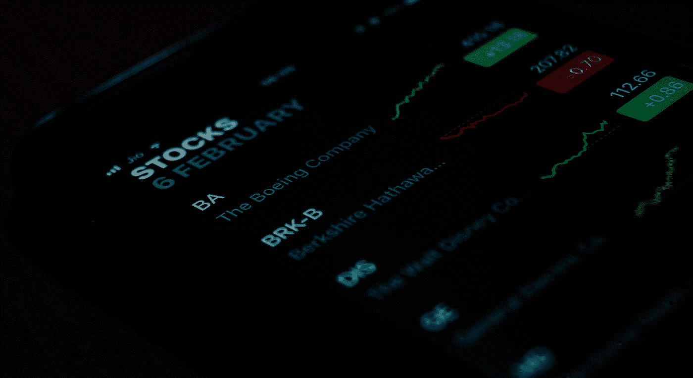

# 数据主义的信仰——一瞥

> 原文：<https://medium.datadriveninvestor.com/dataism-at-a-glance-cfdc2e0ccf4?source=collection_archive---------15----------------------->

Photo by [Ishant Mishra](https://unsplash.com/@ishant_mishra54?utm_source=medium&utm_medium=referral) on [Unsplash](https://unsplash.com?utm_source=medium&utm_medium=referral)

# 关于新大陆宗教的一些有趣的观点。

假设让我们假设所有的有机体都是预先编写的程序或算法，蜜蜂和树只是处理数据的不同方法()和函数()的集合。

这种想法打破了动物和机器之间的障碍，也导致思考电子算法最终破译并超越生化算法的可能性。

简而言之，数据主义认为并宣称整个宇宙是大量复杂数据流的集合，任何实体的用途和价值都取决于其对数据处理的贡献。

为了说明这一点，让我们看看数据主义对两种流行意识形态的观点，即自由市场资本主义和国家控制的共产主义。

在彼此的极端，资本主义使用分布式数据处理，而共产主义依赖于集中处理。资本主义通过将所有生产者和消费者直接联系起来来处理数据，并允许自由交换信息，而在共产主义中，政府可以对所有重要事务发号施令。这也许可以解释为什么资本家喜欢低税率，这样所有可用的资本就不会聚集在国库里。

 [## 如何让人们真正倾听你|数据驱动的投资者

### 没有神奇的五步公式。这可能不是你现在想听到的，但相信我，从长远来看，这是…

www.datadriveninvestor.com](https://www.datadriveninvestor.com/2020/03/22/how-to-get-people-to-really-listen-to-you/) 

此外，我必须提到，如果一个强大的单个处理器做出错误的决定，结果可能是灾难性的，而在自由市场中，如果一个处理器犯了错误，其他人会试图利用它，从而减少它的机会。

你可以在民主和独裁之间做类似的比较。独裁国家使用集中式数据处理，而民主国家更喜欢分布式处理。

随着数据量和速度的增加，选举和政党等民主机构可能会过时，因为它们无法有效地处理数据。在一个政治比技术发展更快的时代，这些都演变成了制度。今天不是这样，今后几十年肯定也不是这样。

从这个角度看进化有不同的意义。人类相对于其他生命的关键优势是能够在一个共同的网络下连接大量的人。著名的例子包括分别拥有数百万公民和信徒的国家和宗教。虽然对一群狼有严格的限制，但对人类的数量没有限制。

至此，如果我们确信人类确实是一个单一的数据处理系统，那么它的输出是什么？

> ***“死亡是什么，如果不是信息不流动的状况？”***

从哲学上讲，数据主义者认为人类只是创建物联网(跨设备的数据管道)的工具，物联网最终将在全球范围内传播，有一天可能会到达整个银河系。

> 上帝时刻关注着你，关心着你所有的感受，数据处理系统也是如此。

全宇宙数据处理系统将像上帝一样，可能控制一切，我们注定要融入其中。这与当前对上帝的看法没有太大区别。

数据主义者认为，除非分享，否则经验是没有价值的。在这种情况下，世界上所有的人都是不同程度的数据主义者。就像其他革命一样，数据主义革命可能需要几十年的时间才能发生。但当从以人类为中心到以数据为中心的世界观发生巨大转变时，这不仅是哲学上的，也是实践上的变化。

请让我知道你的想法作为评论。