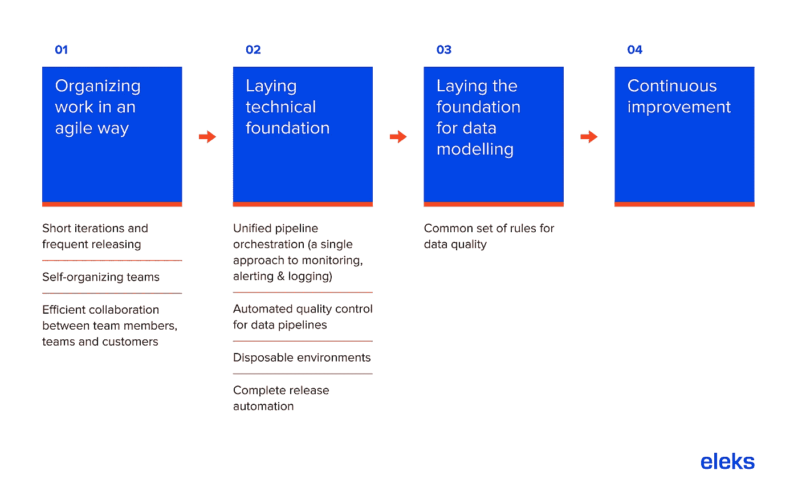

# 数据运营:为您的企业构建高效的数据生态系统

> 原文：<https://medium.datadriveninvestor.com/dataops-building-an-efficient-data-ecosystem-for-your-enterprise-c79c7f99c2f3?source=collection_archive---------24----------------------->

数据比以往任何时候都更真实、更强大。可以利用它来定制产品、服务和体验。它包含了对各种事物的洞察；从购物和旅行习惯，到音乐偏好，再到临床药物试验效率。而且，对企业来说至关重要的是，它可以提高运营效率、客户转化率和品牌忠诚度。DataOps 可以帮助开发人员简化数据管理，为企业和客户增加真正的价值。

但是，因为它可以以多种不同的形式出现，而且数量如此之多，所以数据是一个很难处理的群体。[现代数据分析](https://eleks.com/services/data-science-services/?utm_source=medium&utm_medium=refferal&utm_campaign=Republ-DataOPs-Blog)要求高度自动化，以便测试有效性、监控数据管道的性能和行为、跟踪数据传承、检测可能表明质量问题的异常等等。

DataOps 是一种方法，旨在解决重复、普通数据处理任务的问题，从而使分析更简单、更快速，同时实现数据管道内的透明度和质量检测。Medium [将 DataOps 的目标](https://medium.com/data-ops/dataops-is-not-just-devops-for-data-6e03083157b7)描述为:“减少数据分析的端到端周期时间，从想法的起源到创造价值的图表、图形和模型的文字创作”。

那么，哪些数据运营原则可以提升您的业务价值呢？

# 什么是数据行动宣言？

DataOps 所依赖的不仅仅是数据生命周期的自动化和建立质量程序。它本身就是一种工具，同样也是关于使用它的创新的人们。这就是[数据运营宣言](https://www.dataopsmanifesto.org/)的用武之地。它旨在帮助企业促进和改善他们的数据分析过程。该宣言列出了 18 个核心组成部分，可概括如下:

*   支持端到端流程编排和监控
*   关注质量
*   引入敏捷的工作方式
*   构建持久的数据生态系统，以可持续的速度持续交付和改进(基于客户反馈和团队投入)
*   在不同的团队和他们的客户之间建立有效的沟通
*   将分析交付视为“精益制造”,力求改进并促进组件和方法的重用
*   选择简单而非复杂

DataOps 使企业能够转变其数据管理和数据分析流程。通过实施智能数据运营战略，有可能部署大规模的一次性数据环境，否则这是不可能的。此外，在法规遵从性方面，遵循这种方法可以为公司带来巨大的好处。例如，DataOps 与向混合云的[迁移](https://eleks.com/services/cloud-migration-services/)相结合，使公司能够保护受保护和敏感数据的合规性，同时利用非敏感数据的云成本节约。

# 数据操作和数据管道

人们通常把数据管道想象成传送带式的制造过程，原始数据进入管道的一端，在到达另一端时被处理成可用的形式。与传统生产线非常相似，在整个过程中都有严格的质量和效率管理流程。事实上，因为这个类比非常贴切，所以数据管道通常被称为“数据工厂”。

这个提炼过程以模型和报告的形式交付了高质量的数据，数据分析师可以出于前面提到的无数原因使用这些数据，而且远远不止这些。没有数据管道，原始信息仍然难以辨认。

# 数据运营的主要优势

数据运营的好处有很多。首先，它创建了一个更快的端到端分析流程。在敏捷开发方法的帮助下，发布周期可以在几秒钟内完成，而不是几天或几周。当在数据运营环境中使用时，敏捷方法允许企业灵活应对不断变化的客户需求(这在当今尤为重要),并更快地交付更多价值。

其他几个重要的好处是:

*   **让企业专注于重要问题**。随着数据准确性的提高和花费在日常任务上的时间减少，分析团队可以专注于更具战略性的问题。
*   **启用即时错误检测**。可以执行测试来捕捉未被正确处理的数据，然后再传递到下游。
*   **保证高质量的数据**。创建自动化的、可重复的流程，并进行自动检查和受控的推广，可以减少人为错误被传播的可能性。
*   **创建透明数据模型**。跟踪数据谱系、建立数据所有权和共享用于处理不同数据源的相同规则集创建了一个所有用户都易于理解的语义数据模型，因此，[数据可以得到最大限度的利用](https://labs.eleks.com/2021/02/data-science-project-life-cycle.html)。

那么，数据运营是如何在组织内实施的呢？DataOps 路线图中有四个关键阶段，下面以简单的形式进行了说明。

典型的数据运营路线图

# 摘要

公司现在可以访问的海量数据中蕴藏的潜力是无限的。但是，如果没有一个合适的框架来处理所有这些信息，它的潜力就无法得到充分开发。我们现在拥有工具和人类智慧，能够以更智能的方式收集数据。DataOps 是这个难题的一个关键部分，通过将这种方法与敏捷实践相结合，它成为了解我们的客户、我们自身的低效和机会，并最终建立更好的业务的关键。

想要释放您数据的潜力吗？[立即联系我们](https://eleks.com/contact-us/?utm_source=medium&utm_medium=refferal&utm_campaign=Republ-DataOPs-Blog)看看我们的专家如何帮助您优化业务。

*原载于 2021 年 2 月 3 日*[*【https://eleks.com】*](https://eleks.com/blog/dataops-efficient-data-ecosystem/?utm_source=medium&utm_medium=refferal&utm_campaign=Republ-DataOPs-Blog)*。*