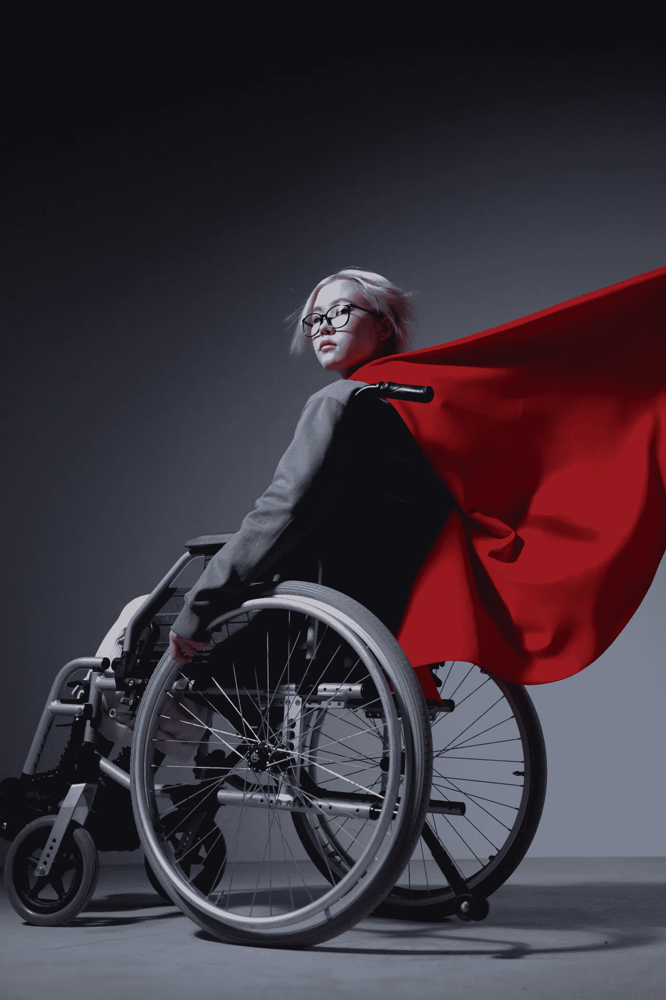
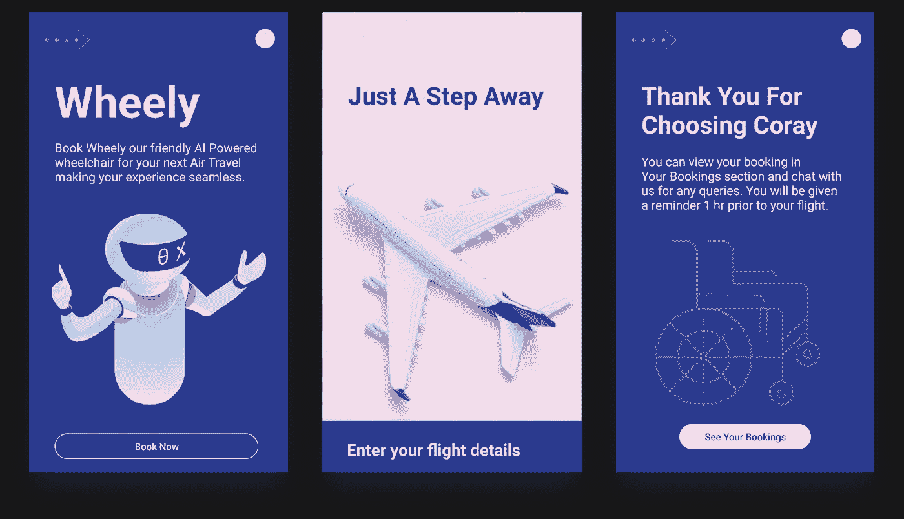
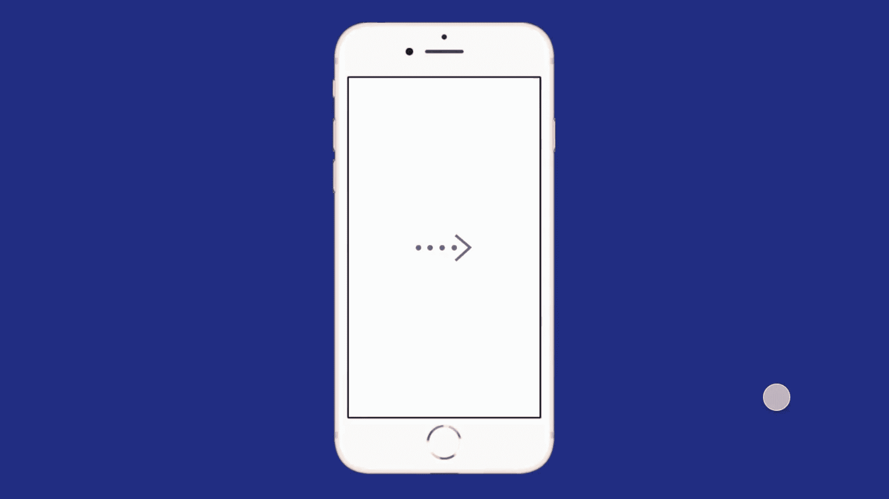
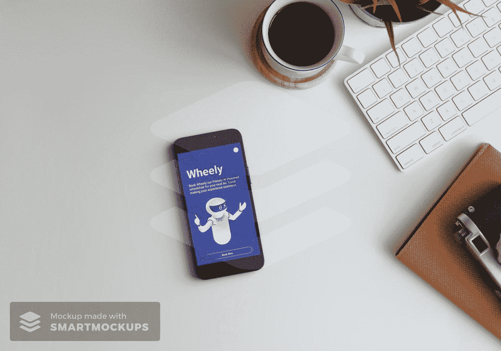

# 宝瓶座时代的黎明

> 原文：<https://medium.datadriveninvestor.com/dawn-of-the-aquarius-age-6791ca8df192?source=collection_archive---------27----------------------->

由于我们的世界已经发生了永久性的变化，我们可以看到，对于那些最需要它的人来说，它正在转变成一个更容易接近、更有同情心的世界。



Picture Credit: pexels-cottonbro-6195464

随着人工智能的诞生，许多新的方式进入世界。法律法规和过时的航空运输设计凸显了创新差距。

*对于有特殊需求的人或受伤的人来说，乘飞机旅行似乎是一个令人生畏的挑战。在这种时候，行动不便的人在机场没有轮椅的帮助是无法登机的。由于对残疾人特殊需求的认识有所提高，机场提供了轮椅设施。这使得需要轮椅辅助的人的生活更加轻松，并让他们有一个满意的旅行体验。*

> 乘坐飞机出行困难是许多残疾人的主要抱怨，趋势显示这些人对机场和飞机的不满明显增加。轮椅使用者的不良手动操作已经导致身体疼痛或伤害。

轮椅使用者描述转移设备不舒服，并且提供不良的躯干支撑。直接结果是轮椅使用者经历羞辱、尴尬、痛苦和过度焦虑。

*通讯设计师***Sailee Sanaye&Yashi Mehra***-*[*ISDI 帕森斯*](https://www.isdi.in/communication-design/)****(AIML |一个全新的世界)*** 推测出一种轮椅，它减少了对人类的完全依赖，让轮椅体验成为用户的无缝体验。*

**

***Sailee Sanaye & Yashi Mehra***

# *它是如何工作的？*

> ***打开“CORAY”应用程序，在抵达机场前一周至一小时选择“WHEELY”。“WHEELY”将在机场入口处提供。***
> 
> *将您的机票放在屏幕上，该屏幕会扫描您的所有详细信息，从而提供无缝的进一步帮助。然后你将通过所有的安全检查。“WHEELY”会在停靠点停下来，引导您通过电梯到达等候区。然后它会带你通过机场巴士或喷气桥到航班。输入你到达飞机的所有中途站，即使你想在洗手间得到帮助。飞机到达时，它会把你系在座位上。*

**

***Sailee Sanaye & Yashi Mehra — Speculate ‘CORAY’ — (AIML |A Whole New World)***

*随着我们理解人工智能 **的量子** [**潜能，我们可以在这个星球上创造一个新世界，一个新篇章，在那里身体残疾者可以体验到同情和无条件的接受。**](https://teague.com/insights/innovation/the-future-of-artificial-intelligence-in-airports)*

**

***Sailee Sanaye & Yashi Mehra — Speculate ‘CORAY’ — AI-enabled Wheelchair & APP Service***

*[航空旅行给残疾人带来了相当大的压力，导致每年超过 30，000 起与残疾有关的投诉，仅在 2018 年 12 月就有超过 700 起损坏的滑板车、轮椅或其他移动设备。](https://docs.lib.purdue.edu/cgi/viewcontent.cgi?article=1001&context=ugcw)*

*[无障碍设计功能、便利设施、员工培训水平和客户满意度点击保存是一些建议的衡量标准，用于评估与当前法规的符合性，并显示残疾人航空旅行条件的改善。](https://docs.lib.purdue.edu/cgi/viewcontent.cgi?article=1001&context=ugcw)*

**通讯设计师***Sailee Sanaye&Yashi Mehra***-*[*ISDI 帕森斯*](https://www.isdi.in/communication-design/)****(AIML |一个全新的世界)，推测地球的时间线将会看到疗愈和意义重大的新体验，并带着支持被挑战者的愿望。*****

**社区需要支持个人，地球上的人们将克服依赖他人的限制，这可能是相互依赖的来源。随着 21 世纪的到来，新的经历让我们获得自由，并再生出新的生存方式。是时候掌握自己的权力，支持自己的自由了！**

**[](https://www.datadriveninvestor.com/2020/11/19/how-machine-learning-and-artificial-intelligence-changing-the-face-of-ecommerce/) [## 机器学习和人工智能如何改变电子商务的面貌？|数据驱动…

### 电子商务开发公司，现在，整合先进的客户体验到一个新的水平…

www.datadriveninvestor.com](https://www.datadriveninvestor.com/2020/11/19/how-machine-learning-and-artificial-intelligence-changing-the-face-of-ecommerce/) 

## **轮椅的显著创新:**

[苏格兰设计师 Phoenix Instinct 开发了一种轻型轮椅，它的轴位置可以移动，可以自动调整椅子的重心，以防止失去平衡。](https://www.dezeen.com/2020/12/03/phoenix-instinct-smart-wheelchair/)

[*rise 是一款手动轮椅，具有内置功能，允许用户独立上升到站立位置。传统轮椅的大多数使用者对他们的下肢肌肉组织缺乏控制，并且需要相当大的努力、帮助和/或辅助才能达到站立位置。获得和保持站立姿势的能力对轮椅使用者的健康、自尊和幸福感非常有益。*](https://www.phoenixmedicalsystems.com/assistive-technology/standing-wheel-chair/)

[巴西初创公司 Hoobox Robotics 与英特尔合作生产了一种适配器套件，可以通过用户的面部表情控制几乎任何电动轮椅。](https://www.dezeen.com/2019/01/15/hoobox-wheelie-7-wheelchair-facial-expressions-design/)***Wheelie 7 套件为轮椅配备了人工智能，可以检测用户的表情并实时处理数据，以指导椅子的移动。***** 

> ***基于人工智能的解决方案渗透到我们生活和做生意的方式中，关于道德、隐私和安全的问题也将出现。学生们进行了各种猜测和预测。* ***免责声明:*** *所有创意均为假设课堂项目。* ***版权所有— I S D I 2 0 20*****

***创作导师:* [***乌卡沙·马尔卡尔教授***](https://www.linkedin.com/in/utkarsha20/)**

*****ISDI 校区*** *印度设计学院&创新
ISDI 大厦，One Indiabulls Centre，
Senapati Bapat Marg，Lower Parel，
孟买 400013。一般查询:* [*查询@isdi.in*](mailto:enquiries@isdi.in) *布点&行业连接:* [*布点@isdi.in*](mailto:placements@isdi.in)**

```
****UTKARSHA M. |** Author | Design Thinker | Creator  - A desire to understand the world and to improve it always remains at the core. Design is a managed process and my quest for knowledge is subject to an inquiry of the apparent, the imagined and the recalled. As I speculate and design, my liberty of self-expression is in direct correlation to my existence and knowledge. [**https://www.utkarshaofficial.com/**](https://www.utkarshaofficial.com/)**
```

## **访问专家视图— [订阅 DDI 英特尔](https://datadriveninvestor.com/ddi-intel)**